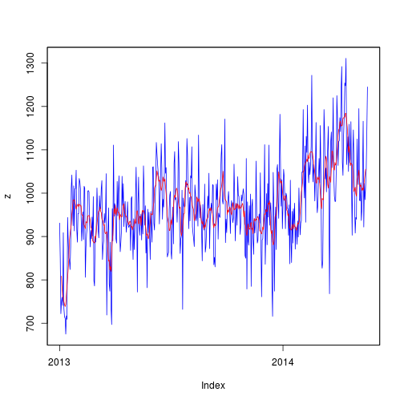
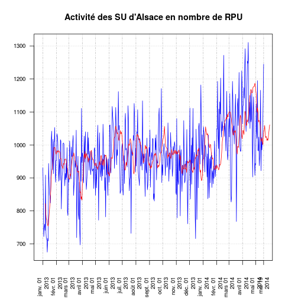

Activité 2013-2014
==================

On crée le fichier __d2__ concaténation de 2013 (d1) et 2014 (dx):

```{}
load("../RPU_2013/rpu2013d0112.Rda")
load("rpu2014d0105_provisoire.Rda")
d2 <- rbind(d1,dx)
save(d2, file="rpu2013-2014.Rda")
```
ou on charge directement __d2__

```r
load("rpu2013-2014.Rda")
```
Librairies et routines nécessaires
----------------------------------

La librairie __xtsExtra__ be fait pas partie des librairiees standards, il faut la charger sur _source-forge_:
install.packages("xtsExtra", repos="http://R-Forge.R-project.org")


```r
library("xtsExtra", lib.loc="/home/jcb/R/x86_64-pc-linux-gnu-library/3.1")
```

```
## Loading required package: zoo
## 
## Attaching package: 'zoo'
## 
## Les objets suivants sont masqués from 'package:base':
## 
##     as.Date, as.Date.numeric
## 
## Loading required package: xts
## 
## Attaching package: 'xtsExtra'
## 
## L'objet suivant est masqué from 'package:xts':
## 
##     plot.xts
```

```r
library("xts", lib.loc="/home/jcb/R/x86_64-pc-linux-gnu-library/3.1")
```


tableau des hôpitaux
---------------------

```r
t <- table(as.Date(d2$ENTREE), d2$FINESS)
s <- rowSums(t)
b <- rownames(t)
a <- as.data.frame(cbind(b,s))
colnames(a) <- c("Date","RPU")
a$Date <- as.Date(a$Date)
a$RPU <- as.numeric(as.character(a$RPU))

plot(a$Date, a$RPU, type="l", ylab="nombre de RPU", xlab="Année 2013-2014", main="Activité des SU d'Alsace en nombre de RPU")
```

 

```r
x <- as.xts(a$RPU, a$Date)
z <- as.zoo(x)
plot(z, col="blue")
lines(rollmean(z, 7), col="red")
```

 

```r
plot.xts(x, ylab="nombre de RPU", xlab="Année 2014", main="Activité des SU d'Alsace en nombre de RPU", col="blue", las=2, minor.ticks=FALSE, cex.axis=c(0.8))
lines(rollmean(z, 7), col="red")
```

 
