# Activité 2013-2014
JcB  
10/07/2014  

Activité 2013-2014
==================

On crée le fichier __d2__ concaténation de 2013 (d1) et 2014 (dx):

```{}
load("../RPU_2013/rpu2013d0112.Rda") # d1
load("rpu2014d0112_c.Rda")
d2 <- rbind(d1,d14)
save(d2, file="rpu2013-2014.Rda")
```
ou on charge directement __d2__

```r
load("rpu2013-2014.Rda")
```
Librairies et routines nécessaires
----------------------------------

La librairie __xtsExtra__ be fait pas partie des librairiees standards, il faut la charger sur _source-forge_:
install.packages("xtsExtra", repos="http://R-Forge.R-project.org")


```r
library("xtsExtra")
```

```
## Loading required package: zoo
## 
## Attaching package: 'zoo'
## 
## The following objects are masked from 'package:base':
## 
##     as.Date, as.Date.numeric
## 
## Loading required package: xts
## 
## Attaching package: 'xtsExtra'
## 
## The following object is masked from 'package:xts':
## 
##     plot.xts
```

```r
library("xts")
library("lubridate")

source("Preparation/RPU Quotidiens/quot_utils.R")
```

Chiffres clés
------------
d2 rpu 2013 + rpu 2014

```r
anc <- "2014"
a <- table(year(as.Date(d2$ENTREE)))
n_2013 <- a[1] # rpu 2013
n_2014 <- a[2] # rpu 2014
delta <- as.numeric(100 * (n_2014/n_2013 - 1)) # variation 2013/2014
```
$416733$ RPU créés en 2014  
$21.1$ % par rapport à 2013.


tableau des hôpitaux
---------------------

```r
t <- table(as.Date(d2$ENTREE), d2$FINESS)
s <- rowSums(t)
b <- rownames(t)
a <- as.data.frame(cbind(b,s))
colnames(a) <- c("Date","RPU")
a$Date <- as.Date(a$Date)
a$RPU <- as.numeric(as.character(a$RPU))

plot(a$Date, a$RPU, type="l", ylab="nombre de RPU", xlab="Année 2013-2014", main="Activité des SU d'Alsace en nombre de RPU")
```

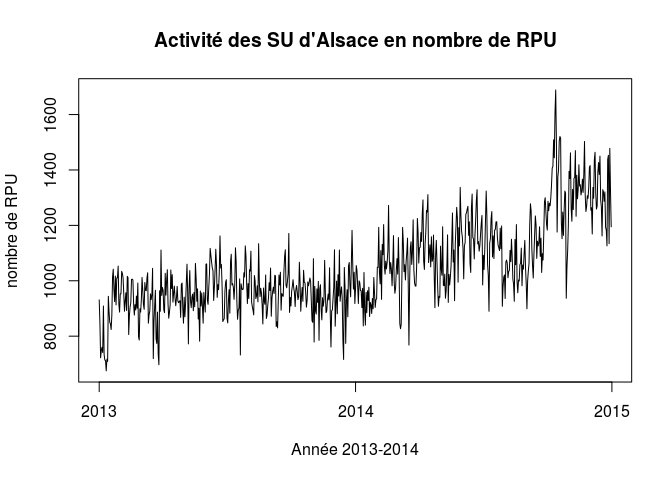 

```r
x <- as.xts(a$RPU, a$Date)
z <- as.zoo(x)
plot(z, col="blue")
lines(rollmean(z, 7), col="red")
```

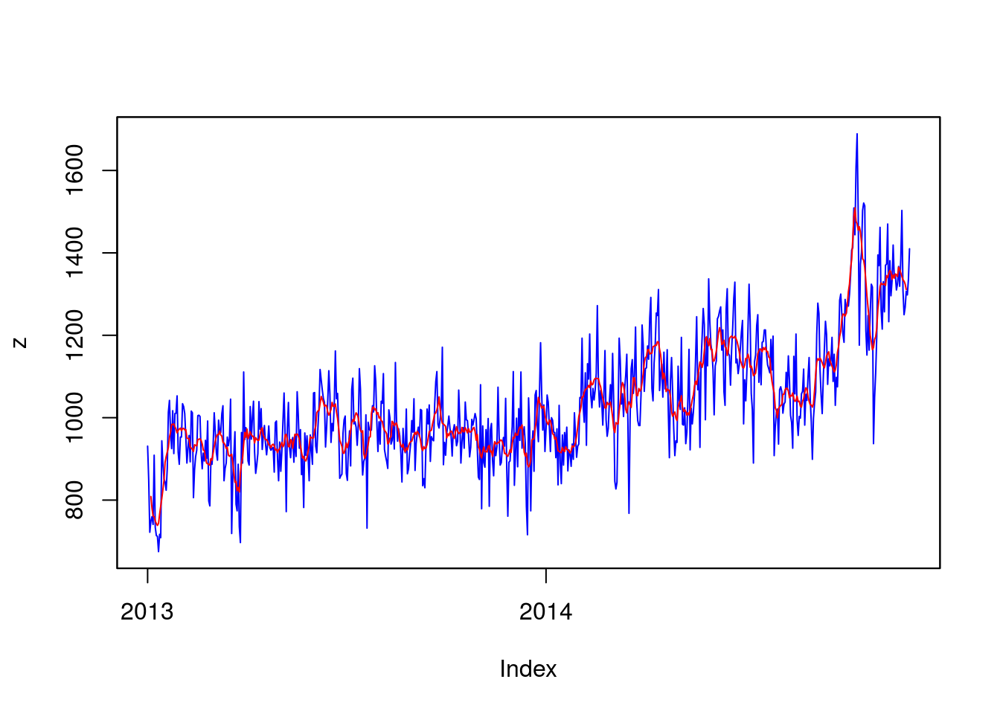 

```r
plot.xts(x, ylab="nombre de RPU", xlab="Année 2014", main="Activité des SU d'Alsace en nombre de RPU", col="blue", las=2, minor.ticks=FALSE, cex.axis=c(0.8))
lines(rollmean(z, 7), col="red")
```

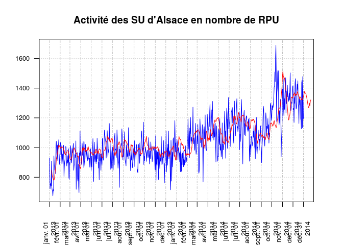 

Comparaison de l'activité globale 2013-2014
============================================

On veut comparer le nombre  de RPU quotidiens créés en 2013 et 2014. Pour cela on veut tracer deux courbes sur le même graphique avec:

- en abcisse les mois de l'année de janvier à janvier
- en ordonnée le nombre de RPU
Je n'ai pas trouvé dans R en général et dans les séries temporelles de fonction pour tracer ce genre de graphe. J'y sui arrivé en appliquant la méthodologie suivante:

1. récupérer les données. La colonne ENTREE contient une ligne par RPU avec la date et l'heure de création de l'enregistrement. Avec tapply on répère le nombre de RPU créés par jour (t).
2. on crée un dataframe à partir de t où:
  - la colonne 1 = nom des lignes = date du jour (V1)
  - la colonne 2 = nb de RPU du jour (V2)
  - la colonne 3 = n° du jour de l'année (1er janvier = 1)
  - la colonne 4 = moyenne lissée sur 7 jours
3. On obtient les 2 dataframes __t2013__ et __t2014__ que l'on peut plotter sur le même graphe.
4. Il faut redessiner complètement le graphe


```r
# comparaison RPU 2013-2014

#nb de rpu/jour 2014

# séquence remplacée par la fonction rpu.par.jour
# t <- tapply(as.Date(d14$ENTREE), as.Date(d14$ENTREE), length)
# t2014 <- as.data.frame(cbind(names(t), as.numeric(t)), stringsAsFactors = FALSE)
# t2014$V1 <- as.Date(t2014$V1) # col. date
# t2014$V2 <- as.numeric(t2014$V2) # nb de RPU
# t2014$V3 <- yday(t2014$V1) # date du jour en n° du jour dans l'année
# t2014$V4 <- rollmean(t2014$V2, 7, fill = NA) # moyenne mobile sur 7 jours. rollmean crée un vecteur plus petit. Pour obtenir un vecteur de la même longueur, on remplace les valeurs manquantes par NA
p2014 <- rpu.par.jour(d14$ENTREE)
plot(p2014$V2, type="l")
lines(p2014$V3, p2014$V4) # moyenne mobile
```

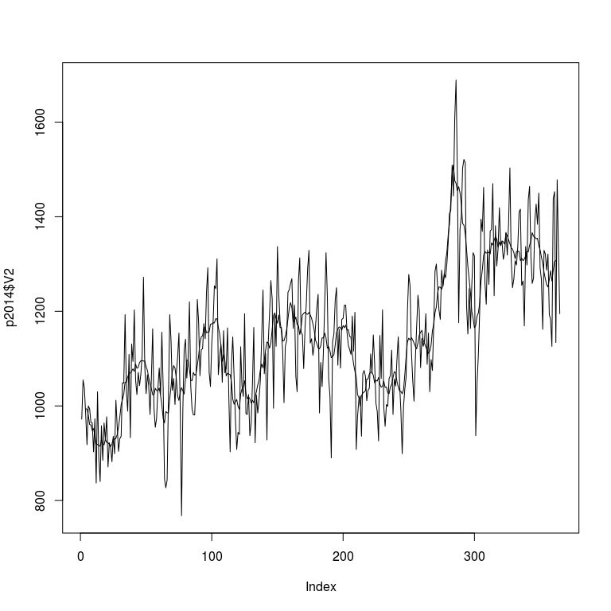 

```r
# nb rpu/jpour en 2013
# t2013 <- tapply(as.Date(d1$ENTREE), as.Date(d1$ENTREE), length)
# t2013 <- as.data.frame(cbind(names(t2013), as.numeric(t2013)), stringsAsFactors = FALSE)
# t2013$V1 <- as.Date(t2013$V1)
# t2013$V2 <- as.numeric(t2013$V2)
# t2013$V3 <- yday(t2013$V1)
# t2013$V4 <- rollmean(t2013$V2, 7, fill = NA)

p2013 <- rpu.par.jour(d1$ENTREE)
plot(p2013$V2, type="l")
lines(p2013$V3, p2013$V4)
```

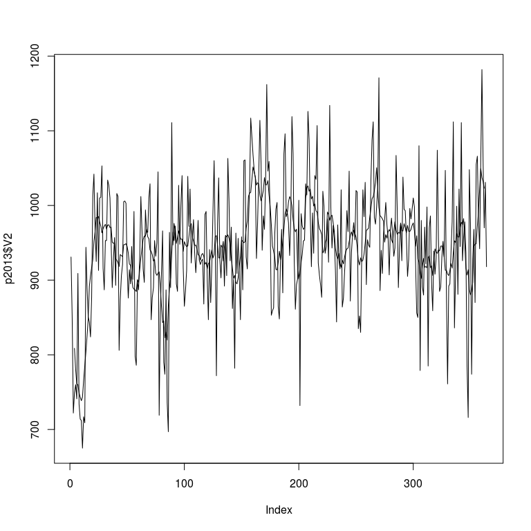 

```r
# nb rpu/jpour en 2015
load("d01_provisoire.Rda")
p2015 <- rpu.par.jour(d01.p$ENTREE)
plot(p2015$V2, type="l")
lines(p2015$V3, p2015$V4)
```

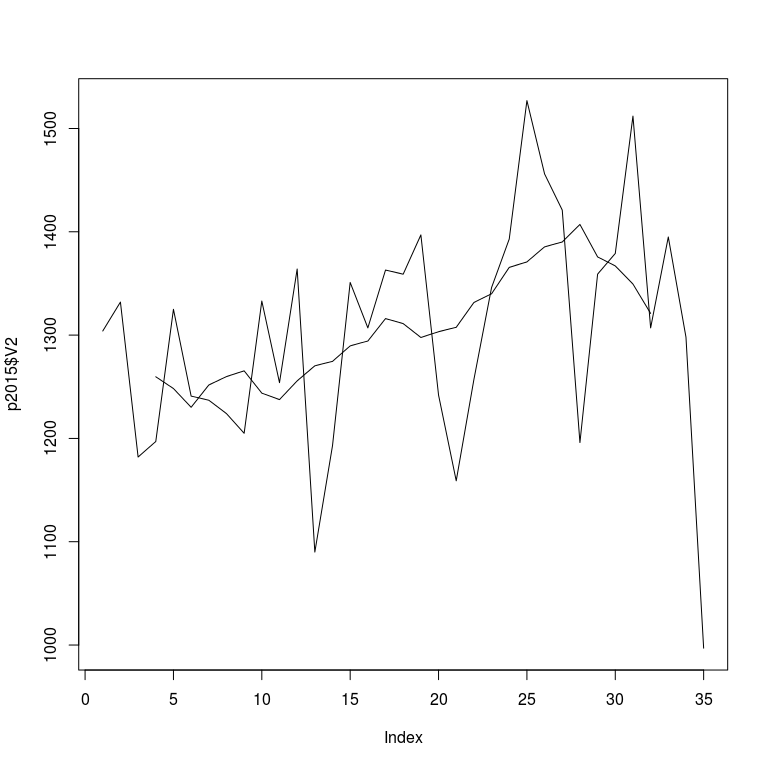 

```r
# synthèse
# png("fig1.png", width = 400, height = 300)
source("constantes.R") # récupère le nom des mois
plot(p2014$V4, type="l", xlim = c(0,365), ylim = c(650, 1500), axes = FALSE, xlab="", ylab="")
axis(side = 1, at= seq(1,365,30), labels=NA)
axis(side = 1, at = seq(1,365,30), labels = c(mois_c, "Jan"))
axis(side=2, las = 1)
lines(p2013$V3, p2013$V4, col="blue")
lines(p2015$V3, p2015$V4, col="red")
legend("topleft", legend=c("2013","2014", "2015"), col=c("blue","black", "red"), lty=1, bty="n")
title(main="Comparaison 2013-2014-2015", ylab="nombre de RPU", xlab="mois")
```

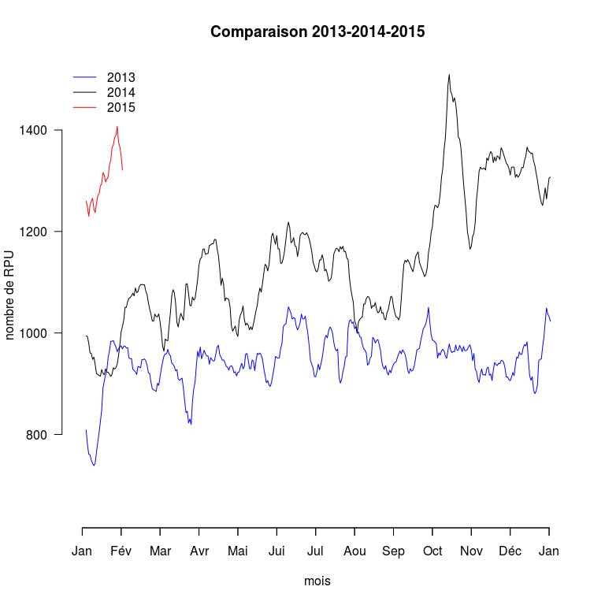 

```r
# abline(lm(t2014$V2 ~ t2014$V3), col = "red", lwd = 2)
# abline(lm(t2013$V2 ~ t2013$V3), col = "blue", lwd = 2)

#dev.off()


# bonne syntaxe pour créer des xts à partir d'un dataframe
t1 <- xts(p2013[,-1], order.by=p2013[,1])
t2 <- xts(p2014[,-1], order.by=p2014[,1])

plot(yday(p2013$V1), p2013$V2, type="l", col="red", axes=FALSE)
lines(yday(p2014$V1), p2014$V2, col="blue")
axis(side=1, at=axTicksByTime(t1, "months"), labels=1:13)
```

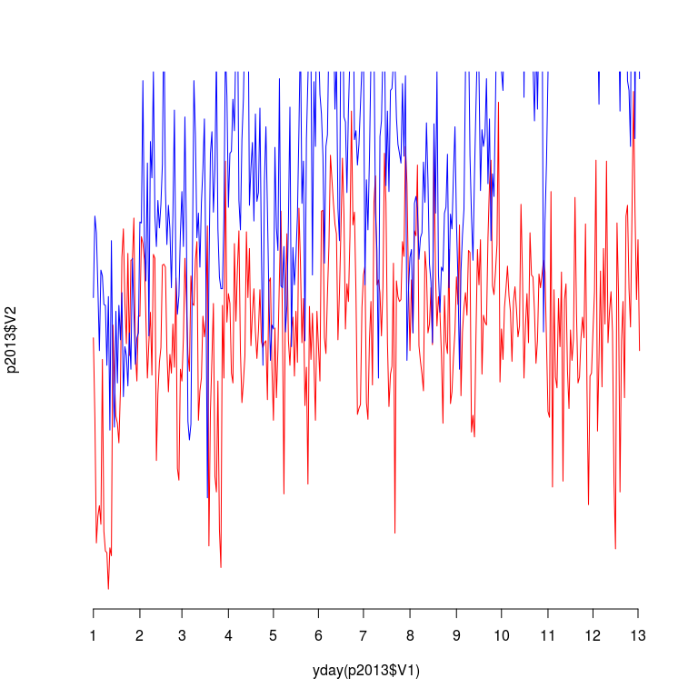 

Nombre de RPU par semaine
=========================

On compte le nombre deRPU par semaine en distinguant 2013 et 2014. Pour cela on utilise __tapply__ en créant une Liste de deux conditions, l'année et le mois. On obtient une __matrice__ de deux lignes (2013 et 2014) et 53 colonnes, que l'on peut injecter dans un barplot par exemple.

load("~/Documents/Resural/Stat Resural/RPU_2014/rpu2013-2014.Rda")


```r
dx <- d2
library(lubridate)

rpu.semaine <- tapply(as.Date(dx$ENTREE), list(year(as.Date(dx$ENTREE)), week(as.Date(dx$ENTREE))), length)

head(rpu.semaine)
```

```
##         1    2    3    4    5    6    7    8    9   10   11   12   13   14
## 2013 4752 5170 6242 6885 6823 6645 6530 6451 6305 6712 6478 6060 6232 6698
## 2014 5965 6666 6443 6435 7018 7489 7640 7418 7222 6899 7410 7405 7453 8154
##        15   16   17   18   19   20   21   22   23   24   25   26   27   28
## 2013 6632 6667 6538 6462 6628 6720 6314 5615 7116 7213 7193 6569 6566 7083
## 2014 8233 7658 7356 7175 7106 7387 7928 8224 8132 8316 8387 8122 8005 7731
##        29   30   31   32   33   34   35   36   37   38   39   40    41
## 2013 6391 7069 6995 6726 6861 6502 6568 6768 6474 6891 7152 6727  6760
## 2014 8122 8015 6999 7474 7421 7195 7363 7729 7882 7925 8208 8777 10415
##        42   43   44   45   46   47   48   49   50   51   52   53
## 2013 6763 6757 6500 6427 6489 6620 6390 6705 6411 6619 7260 1949
## 2014 9983 8673 8521 9275 9350 9518 9285 9223 9498 8979 9005 2521
```

```r
barplot(rpu.semaine, main = "RPU hebdomadaires 2013-2014", xlab="semaines", ylab="nombre de RPU")
```

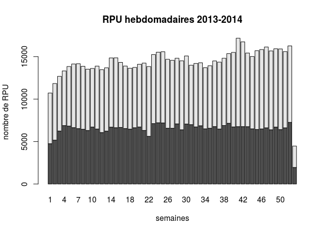 

```r
barplot(rpu.semaine, main = "RPU hebdomadaires 2013-2014", beside = TRUE, xlab="semaines", ylab="nombre de RPU")
```

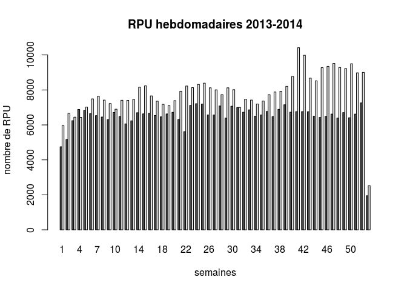 

```r
class(rpu.semaine)
```

```
## [1] "matrix"
```

```r
plot(rpu.semaine[2,], type = "l", ylim = c(4000,11000), col="red", xlab="semaines", ylab="nombre de RPU", main = "RPU hebdomadaires 2013-2014")
lines(rpu.semaine[1,], col = "blue")
legend("topleft", legend=c("2013", "2014"), col=c("blue","red"), bty="n", lty=1)
```

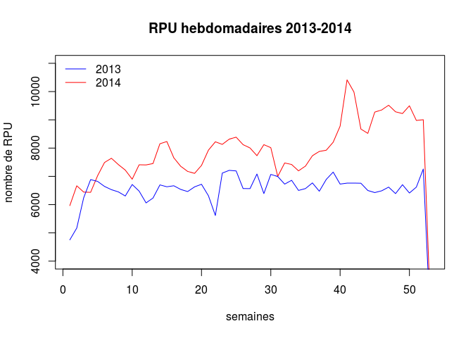 

Nombre d'hospitalisations par semaine
======================================

Voir le paragraphe précéent pour le principe de la méthodologie


```r
hosp <- dx[dx$MODE_SORTIE == "Mutation" | dx$MODE_SORTIE == "Transfert", 'ENTREE']
hosp.semaine <- tapply(as.Date(hosp), list(year(as.Date(hosp)), week(as.Date(hosp))), length)
head(hosp.semaine)
```

```
##         1    2    3    4    5    6    7    8    9   10   11   12   13   14
## 2013 1114 1217 1436 1489 1347 1437 1361 1453 1431 1346 1349 1286 1391 1515
## 2014 1386 1482 1582 1502 1547 1629 1758 1775 1633 1560 1588 1596 1640 1663
##        15   16   17   18   19   20   21   22   23   24   25   26   27   28
## 2013 1539 1541 1419 1351 1269 1330 1320 1182 1428 1406 1451 1318 1312 1346
## 2014 1664 1570 1618 1541 1526 1543 1673 1573 1575 1612 1647 1689 1520 1511
##        29   30   31   32   33   34   35   36   37   38   39   40   41   42
## 2013 1388 1344 1369 1333 1354 1427 1472 1519 1344 1447 1448 1407 1403 1470
## 2014 1526 1682 1518 1577 1533 1487 1515 1602 1581 1624 1672 1647 2093 1618
##        43   44   45   46   47   48   49   50   51   52  53
## 2013 1545 1349 1427 1462 1462 1407 1522 1365 1498 1527 476
## 2014 1457 1463 1578 1593 1491 1523 1478 1560 1506 1614 483
```

```r
barplot(hosp.semaine, main = "Hospitalisations hebdomadaires 2013-2014", xlab="semaines", ylab="nombre de RPU")
```

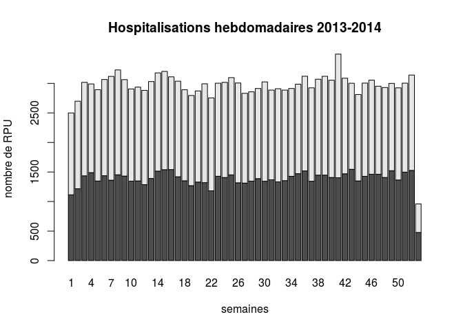 

```r
barplot(hosp.semaine, main = "Hospitalisations hebdomadaires 2013-2014", beside = TRUE, xlab="semaines", ylab="nombre de RPU")
```

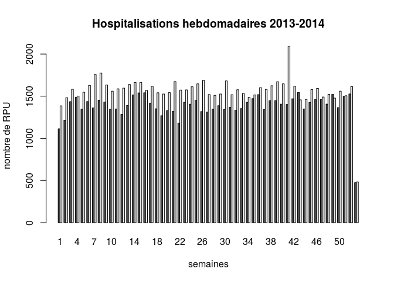 

```r
class(hosp.semaine)
```

```
## [1] "matrix"
```

```r
plot(hosp.semaine[2,], type = "l", ylim = c(1000,2500), col="red", xlab="semaines", ylab="nombre de RPU", main = "Hospitalisations hebdomadaires 2013-2014")
lines(hosp.semaine[1,], col = "blue")
legend("topleft", legend=c("2013", "2014"), col=c("blue","red"), bty="n", lty=1)
```

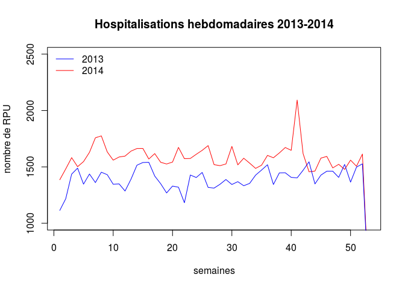 

Taux d'hospitalisation
----------------------


```r
tx_hosp <- round(100 * hosp.semaine / rpu.semaine, 2)
head(tx_hosp)
```

```
##          1     2     3     4     5     6     7     8     9    10    11
## 2013 23.44 23.54 23.01 21.63 19.74 21.63 20.84 22.52 22.70 20.05 20.82
## 2014 23.24 22.23 24.55 23.34 22.04 21.75 23.01 23.93 22.61 22.61 21.43
##         12    13    14    15    16   17    18    19    20    21    22
## 2013 21.22 22.32 22.62 23.21 23.11 21.7 20.91 19.15 19.79 20.91 21.05
## 2014 21.55 22.00 20.39 20.21 20.50 22.0 21.48 21.47 20.89 21.10 19.13
##         23    24    25    26    27    28    29    30    31    32    33
## 2013 20.07 19.49 20.17 20.06 19.98 19.00 21.72 19.01 19.57 19.82 19.73
## 2014 19.37 19.38 19.64 20.80 18.99 19.54 18.79 20.99 21.69 21.10 20.66
##         34    35    36    37    38    39    40    41    42    43    44
## 2013 21.95 22.41 22.44 20.76 21.00 20.25 20.92 20.75 21.74 22.87 20.75
## 2014 20.67 20.58 20.73 20.06 20.49 20.37 18.76 20.10 16.21 16.80 17.17
##         45    46    47    48    49    50    51    52    53
## 2013 22.20 22.53 22.08 22.02 22.70 21.29 22.63 21.03 24.42
## 2014 17.01 17.04 15.67 16.40 16.03 16.42 16.77 17.92 19.16
```

```r
summary(tx_hosp[1,]) # taux hospitalisation 2013
```

```
##    Min. 1st Qu.  Median    Mean 3rd Qu.    Max. 
##   19.00   20.17   21.22   21.34   22.44   24.42
```

```r
summary(tx_hosp[2,]) # taux hospitalisation 2014
```

```
##    Min. 1st Qu.  Median    Mean 3rd Qu.    Max. 
##   15.67   18.99   20.50   20.13   21.55   24.55
```

```r
plot(tx_hosp[2,], type = "l", ylim = c(0,25), col="red", xlab="semaines", ylab="Taux hospitalisation (%)", main = "Taux d'Hospitalisations hebdomadaires 2013-2014", lwd=3)
lines(tx_hosp[1,], col = "blue", lwd=3)
legend("bottomleft", legend=c("2013", "2014"), col=c("blue","red"), bty="n", lty=1)
```

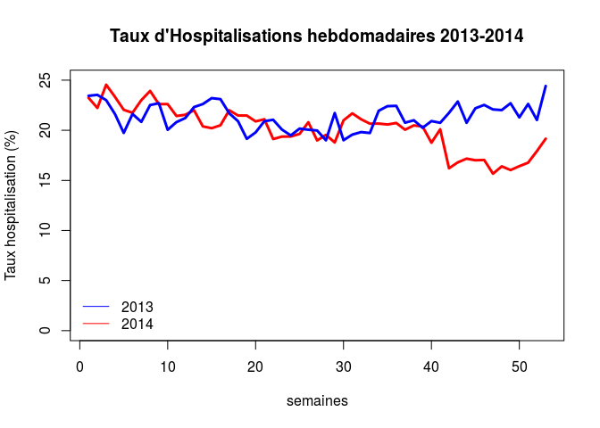 
Depuis quand les établissements produisent des RPU
--------------------------------------------------

On applique tapply qui retourne une liste de dates en secondes, qu'il faut convertir en date ISO (t2). cbind permet de présenter le résultat en colonne:


```r
t <- tapply(as.Date(d2$ENTREE), factor(d2$FINESS), min)
t2 <- as.Date(t, origin = "1970-01-01")
cbind(as.character(t2))
```

```
##           [,1]        
## 3Fr       "2013-01-01"
## Alk       "2013-01-01"
## Col       "2013-01-01"
## Dia       "2013-01-01"
## Geb       "2013-01-01"
## Hag       "2013-01-01"
## Hus       "2013-01-01"
## Mul       "2013-01-07"
## Odi       "2013-01-01"
## Sel       "2013-01-01"
## Wis       "2013-01-01"
## Sav       "2013-07-23"
## Dts       "2014-02-01"
## Ros       "2014-02-05"
## Ane       "2014-05-12"
## 670780204 "2014-12-12"
```

