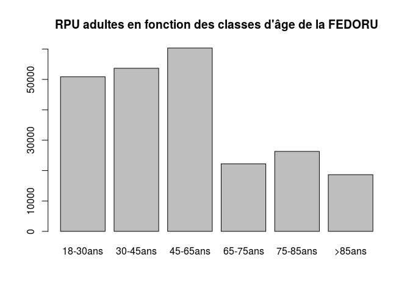
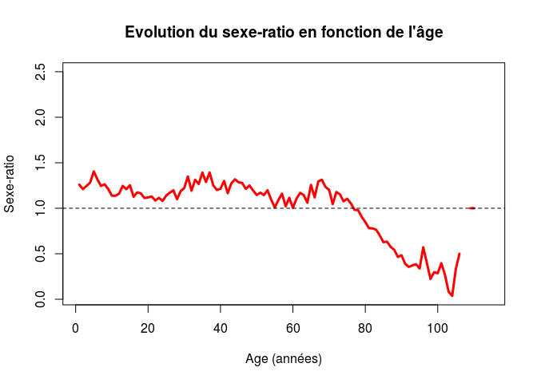
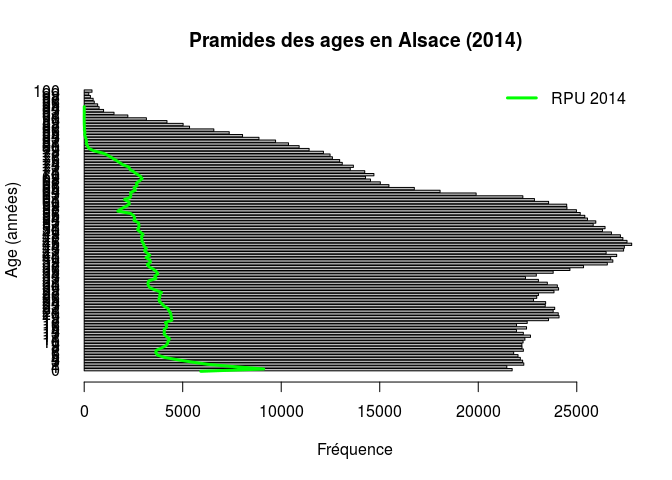
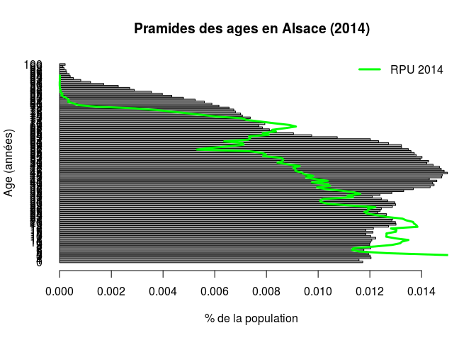
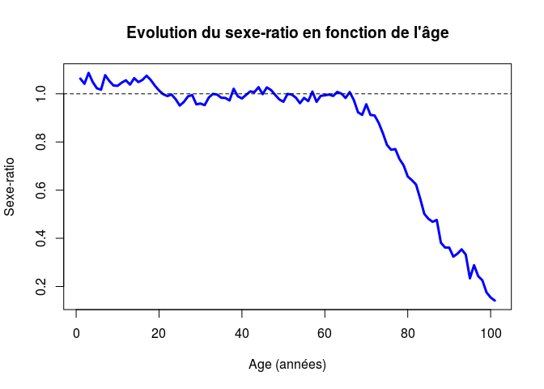
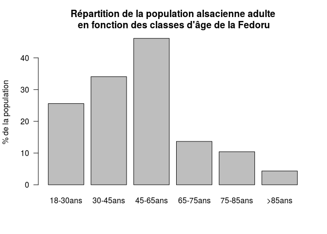
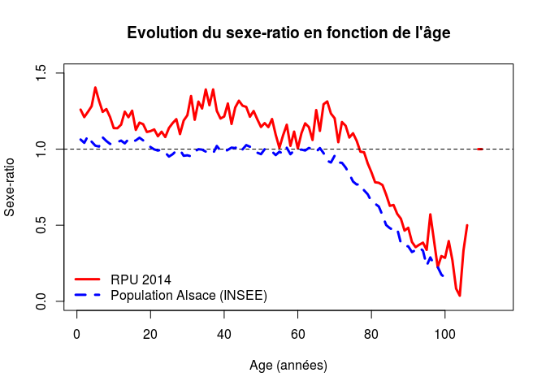
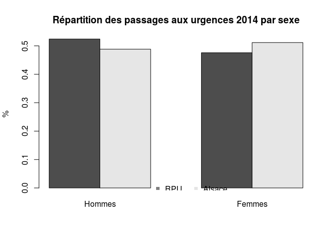
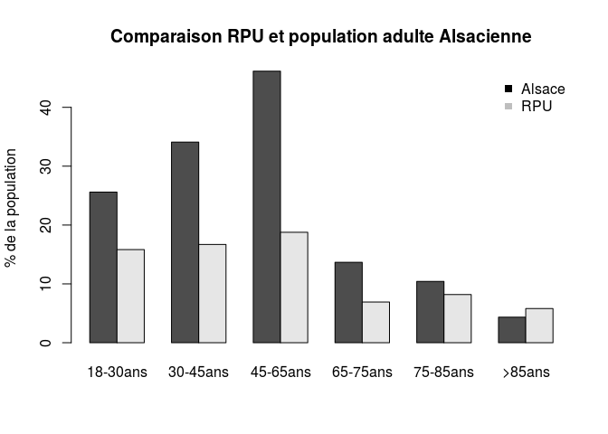

# AGES
JcB  
31/10/2014  

Introduction
============


Recommandations FEDORU 2014
---------------------------

- Age = date d'entrée - date de naissance

- Critères d'exclusion: age négatif et age > 120 ans (43800 jours)

- nourissons < 28 jours

- Tranches d'age pour les moins de 18 ans
  - < 28 jours
  - [28 jours à 1 an[
  - [1 an à 5 ans[
  - [5 ans à 10 ans[
  - [10 à 15 ans[
  - [15 ans à 18 ans[
  
- Tranches d'age pour les adultes:
  - [18-30ans[
  - [30-45ans[
  - [45-65ans[
  - [65-75ans[
  - [75-85ans[
  - >85ans
  
ref: [Introduction à R] pp 68 pour définir les intervalles


```r
ped_jours <- c(1, 28, c(1, 5, 10, 15, 18) * 365) # bornes pour la pédiatrie en jour
ped_jours
```

```
## [1]    1   28  365 1825 3650 5475 6570
```

```r
adultes_jours <- c(18, 30, 45, 65, 75, 85, 120) * 365
adultes_jours
```

```
## [1]  6570 10950 16425 23725 27375 31025 43800
```

```r
adultes_ans <- c(18, 30, 45, 65, 75, 85, 120)
```


```r
library(lubridate)
load("~/Documents/Resural/Stat Resural/RPU_2014/rpu2014d0110_provisoire.Rda")
N <- nrow(dx)
```


Tranches d'age pédiatriques:
----------------------------


```r
# age est un objet de type difftime exprimé en jours
age <- as.Date(dx$ENTREE) - as.Date(dx$NAISSANCE)
age <- as.numeric(age)

# on retire les valeurs aberrantes: mois de 1 jour et plus de 120 ans
age <- age[age > 1 & age <= 365*120]
age_an <- round(age/365, 0)

# nombre de valeurs aberrantes
N - length(age)
```

```
## [1] 28
```

```r
# histogramme de age
hist(age, main="Histogramme des ages en jours", xlab = "Age (en jours)", ylab = "Fréquence")
```

 

```r
# les moins de 1 an = age1
age1 <- age[age < 366]
n_age1 <- length(age1) # nombre de moins d'un an
p_age1 <- round(length(age1)*100/N, 2) # proportion de moins de 1 an
hist(age1, main = "Histogramme des moins de 1 an", xlab = "Age en jours", ylab = "Fréquence")
abline(v=28, lty=2, col="red") # limite nourissons
```

 

```r
# nourissons age < 28 jours
nour <- age[age < 28]
n_nour <- length(nour)

# classes FEDORU pour la pédiatrie. La borne inférieure est incluse (include.lowest) et la borne sup est exclue (right = FALSE)
lab <- c("<28j", "28j-1an[", "1-5ans[", "5-10ans[", "10-15ans[", "15-18ans[")
ped <- cut(age, ped_jours, include.lowest = TRUE, right = FALSE, labels = lab)

table(ped)
```

```
## ped
##      <28j  28j-1an[   1-5ans[  5-10ans[ 10-15ans[ 15-18ans[ 
##      1270      9314     26353     19246     21030     12100
```

```r
barplot(table(ped), main = "Pédiatrie")
```

 

Tranches d'age adultes
-----------------------


```r
lab_adultes <- c("18-30ans", "30-45ans", "45-65ans", "65-75ans", "75-85ans", ">85ans")
adultes <- cut(age, adultes_jours, include.lowest = TRUE, right = FALSE, labels = lab_adultes)
adultes_rpu <- table(adultes)

barplot(adultes_rpu, main="RPU adultes en fonction des classes d'âge de la FEDORU")
```

 

```r
# idel en %
barplot(adultes_rpu*100/N, main="RPU adultes en fonction des classes d'âge de la FEDORU")
```

 

Sexe (RPU)
==========


```r
sexe <- table(dx$SEXE)
h_rpu <- sexe[2]
f_rpu <- sexe[1]
sex_ratio <- round(h_rpu/f_rpu, 2)
r_masculinite <- round(h_rpu/(h_rpu + f_rpu), 2)
pie(sexe, col=c("red", "yellow"), labels=c("Femmes","Hommes"))
```

 

```r
# calcul du vecteur sex-ratio: pour chaque tranche d'age de 1 an, on calcule de sr. On ne retient que les lignes 1 (femmes) et 2 (hommes). Le résultat (a) est une matrice à 2 lignes et une centaine de colonnes:
a <- tapply(as.Date(dx$ENTREE), list(dx$SEXE, dx$AGE), length)
a <- a[1:2,]
sr_age_rpu <- a[2,]/a[1,]
plot(sr_age_rpu, type="l", main="Evolution du sexe-ratio en fonction de l'âge", ylab="Sexe-ratio", xlab="Age (années)", lwd=3, col="red")
abline(h=1, lty=2)
```

 

- nombre d'hommes 168 435
- nombre de femmes 152 934
- sex-ratio 1.1
- rapport de masculinité 0.52

Résumé RPU
=======

Variables  |  intitulé en clair   |  valeur   
-----------|----------------------|---------   
N  | nombre total de RPU  |  321 371
age  |   ages des consultants en jours de 1 jour à 120 ans  |  vecteur
age_an  |   age des consultants en années  |  vecteur
sex_ratio  |  sexe-ratio  |  1.1
r_masculinite  |  taux de masculinité = nb hommes / (hommes + femmes)  |  0.52
sr_age_rpu  |   vecteur des sex-ratio  |  vecteur
h_rpu  |   nombre d'hommes  |  168 435
f_rpu  |  nombre de femmes  |  152 934
n_age1  |   nombre de moins d'un an  |  10 612
p_age1  |   proportion de moins d'un an  |  3.3
n_nour  |   nombre de nourrisons (< 28 jours)  |  1 270
adultes  |  vecteur ages > 18 ans selon FEDORU  |  vecteur

Population d'Alsace
===================

La comparaison de la pyramide des ages de la;patientèle des urgences à celle de la population de la même,zone géographique est également informative. Ele nécessite pour cela de connaître la structure de la population en Alsace. Pour cela on utilise des données de l'INSEE.

source: http://www.insee.fr/fr/ppp/bases-de-donnees/donnees-detaillees/rp2011/tab-detailles/td-population-11/BTT_TD_POP1B_2011.zip

Ce fichier recense pour chaque commune de France la population par __sexe__ et __tranches d'ages de 1 an__ de 0 à 100 ans. La version _POP1B_2011_ est le fichier légal pour 2014.

Le fichier dézippé fait 220 Mo. Il est stocké à l'adresse suivante:

Après plusieurs essais, la meilleure méthode pour lire ce fichier est d'utiliser __read.csv2__, le séparateur étant le __point-virgule__. L'utilisation de _encoding_ est à procrire car cela crée des ficheiers corrompus. L'inconvénient de la méthode est de produire un codage anormal des caractères accentués qu'il faut corriger:

expression  | symbole   
------------|--------   
`\xe8 `      |  è   
`\xe9 `    |  é  


```{}
file <- "/home/jcb/Documents/Resural/Stat Resural/population_alsace/BTT_TD_POP1B_2011.txt"
pop <- read.csv2(file)

# remplacer les caractères anormaux
pop$LIBGEO <- as.character(pop$LIBGEO)      # transforme le fateur en caractères
pop$LIBGEO <- gsub("\xe8","è", pop$LIBGEO)  # remplacement des caractères anormaux
pop$LIBGEO <- gsub("\xe9","é", pop$LIBGEO)

save(pop, file = "pop_france_2014.Rda")     # toute la France

names(pop)

# on extrait les populations d'Alsace

# population du 67. On supprime les levels exédentaires
pop67_2014 <- pop[substr(pop$CODGEO, 1, 2) == 67,]
pop67_2014$LIBGEO <- factor(pop67_2014$LIBGEO)
pop67_2014$CODGEO <- factor(pop67_2014$CODGEO)

# population du 68. On supprime les levels exédentaires
pop68_2014 <- pop[substr(pop$CODGEO, 1, 2) == 68,]
pop68_2014$LIBGEO <- factor(pop68_2014$LIBGEO)
pop68_2014$CODGEO <- factor(pop68_2014$CODGEO)

# population de la région Alsace
pop_als_2014 <- pop[substr(pop$CODGEO, 1, 2) == 67 | substr(pop$CODGEO, 1, 2) == 68,]
pop_als_2014$LIBGEO <- factor(pop_als_2014$LIBGEO)
pop_als_2014$CODGEO <- factor(pop_als_2014$CODGEO)

# Sauvegarde des données
save(pop_als_2014, file="pop_als_2014.Rda")
save(pop67_2014, file="pop67_2014.Rda")
save(pop68_2014, file="pop68_2014.Rda")

# Chargement des données
load("pop68_2014.Rda")
load("pop67_2014.Rda")
load("pop_als_2014.Rda")

```

Population alsacienne:
-----------------------


```r
path <- "../"
load(paste0(path, "pop68_2014.Rda"))
load(paste0(path, "pop67_2014.Rda"))
load(paste0(path, "pop_als_2014.Rda"))

n67_2014 <- sum(pop67_2014$NB)
n68_2014 <- sum(pop68_2014$NB)
nAls_2014 <- sum(pop_als_2014$NB)

# pyramide des ages en Alsace en 2014: vecteur de 101 lignes. Chaque ligne correspond au total de la population pour la tranche d'age (tous sexes confondus.)
p_ages_als_2014 <- tapply(pop_als_2014$NB, pop_als_2014$AGED100, sum)

# représentation graphique de la pyramide des ages avec en surimpression la pyramide des ages des RPU (ligne verte), tracée à partir du vecteur des ages en année (age_an). Le vecteur est transformé en table à partir de laquelle on détermine les valeurs de x et y pour dessinner la courbe.
barplot(p_ages_als_2014, horiz=TRUE, las = 1, main="Pramides des ages en Alsace (2014)", ylab="Age (années)", xlab="Fréquence")
a <- table(as.factor(age_an))
x <- as.numeric(a)
y <- as.numeric(names(a))
lines(x,y, col = "green", lwd = 3)
legend("topright", legend = "RPU 2014", col = "green", lwd = 3, bty = "n")
```

 

```r
# Même représentation mais cette fois on utilise des pourcentages. Pour la pop alsacienne, l'effectif de chaque tranche est divisé par le nombre total d'habitants. Pour les RPU, l'effectif est divisé par le nombre total de RPU.
barplot(p_ages_als_2014/nAls_2014, horiz=TRUE, las = 1, main="Pramides des ages en Alsace (2014)", ylab="Age (années)", xlab="% de la population")
a <- table(as.factor(age_an))
a <- a/N
x <- as.numeric(a)
y <- as.numeric(names(a))
lines(x,y, col = "green", lwd = 3)
legend("topright", legend = "RPU 2014", col = "green", lwd = 3, bty = "n")
```

 

```r
# calcul sur les sexes
sx <- tapply(pop_als_2014$NB, pop_als_2014$SEXE, sum)
nh_als <- as.numeric(sx[1])
nf_als <- as.numeric(sx[2])
sexR_als <- nh_als/nf_als
masc_als <- nh_als/(nh_als+nf_als)

# sex ratio par tranche d'age. On utilise tappy en lui passant une liste de deux séparateur, le sexe et la tranche d'age. On récupère une matrice de 2 lignes (hommes, femmes) et 101 colonnes (les tranches d'age). La division des deux lignes renvoie le sex-ratio par tranche d'age de 1 an.
a <- tapply(pop_als_2014$NB, list(pop_als_2014$SEXE, pop_als_2014$AGED100), sum)
sr_age <- a[1,]/a[2,]
plot(sr_age, type="l", main="Evolution du sexe-ratio en fonction de l'âge", ylab="Sexe-ratio", xlab="Age (années)", lwd=3, col="blue")
abline(h=1, lty=2)
```

 

```r
# Répartition de la population alsacienne en fonction des classes d'age de la Fedoru:
adultes_als <- array()
adultes_als[1] <- sum(p_ages_als_2014[18:29])
adultes_als[2] <- sum(p_ages_als_2014[30:44])
adultes_als[3] <- sum(p_ages_als_2014[45:64])
adultes_als[4] <- sum(p_ages_als_2014[65:74])
adultes_als[5] <- sum(p_ages_als_2014[75:84])
adultes_als[6] <- sum(p_ages_als_2014[85:101])
names(adultes_als) <- lab_adultes
adultes_als
```

```
## 18-30ans 30-45ans 45-65ans 65-75ans 75-85ans   >85ans 
##   281385   374784   507286   150229   114559    47760
```

```r
barplot(adultes_als, main="Répartition de la population alsacienne adulte\n en fonction des classes d'âge de la Fedoru")
```

 

```r
# en % de la population
barplot(adultes_als*100/n67_2014, main="Répartition de la population alsacienne adulte\n en fonction des classes d'âge de la Fedoru", las=1, ylab="% de la population")
```

 

Variables crées:   

- n67_2014: population totale du Bas-Rhin en 2014
- n68_2014: population totale du Haut-Rhin en 2014
- nAls_2014: population totale d'Alsace en 2014
- p_ages_als_2014: pyramide des ages
- nh_als: nombre d'hommes
- nf_als: nombre de femmes en Alsace
- sexR_als : sex ratio en Alsace
- masc_als: rapport de masculinité en Alsace
- adultes_als: pop.adulte d'Alsace en fonction des classes de la Fedoru


Territoire  |  population
------------|------------
Bas-Rhin    |  1 099 269   
Haut-Rhin   |  753 056   
Alsace      |  1 852 325  

Tranches d'age
--------------

Répartition des adultes dans la population alsacienne (INSEE). On utilise le découpage de la FEDORU (adultes_ans).

```r
adultes_als_insee <- cut(dx$AGE, adultes_ans, include.lowest = TRUE, right = FALSE, labels = lab_adultes)
table(adultes_als_insee)
```

```
## adultes_als_insee
## 18-30ans 30-45ans 45-65ans 65-75ans 75-85ans   >85ans 
##    50861    53670    60320    22231    26308    18656
```

```r
sum(table(adultes_als_insee))
```

```
## [1] 232046
```

```r
barplot(table(adultes_als_insee))
```

 


Comparaison des sex-ratio (RPU - pop.Alsacienne)
------------------------------------------------


```r
plot(sr_age_rpu, type="l", main="Evolution du sexe-ratio en fonction de l'âge", ylab="Sexe-ratio", xlab="Age (années)", lwd=3, col="red", ylim = c(0, 1.5))
abline(h=1, lty=2)
lines(sr_age, col="blue", lty = 2, lwd = 3) # ajout de la région
legend("bottomleft", legend=c("RPU 2014", "Population Alsace (INSEE)"), col=c("red","blue"), lty=c(1,2), lwd=3, bty="n")
```

 

suite


```r
a <- matrix(c(h_rpu/N, nh_als/nAls_2014, f_rpu/N, nf_als/nAls_2014), nrow=2)
barplot(a, beside=TRUE, main="Répartition des passages aux urgences 2014 par sexe", ylab="%", names.arg=c("Hommes", "Femmes"))
legend(3,0.03, legend=c("RPU","Alsace"), col=c("gray50", "gray90"), pch=15, horiz=TRUE, bty="n")
```

 

#### Comparaison Passages - Population

On combine dans une matrice les effectifs en pourcentages par classes d'âge (FEDORU) des passages ayant donné lieu à un RPU et ceux de la population totale d'Alsace. Le rapport s'inverse pour la classe 85 ans et plus.


```r
a <- rbind(adultes_als * 100 / n67_2014, adultes_rpu * 100 / N)
rownames(a) <- c("Alsace","RPU")
a
```

```
##        18-30ans 30-45ans 45-65ans 65-75ans 75-85ans >85ans
## Alsace       26       34       46     13.7     10.4    4.3
## RPU          16       17       19      6.9      8.2    5.8
```

```r
barplot(a, beside=TRUE, main="Comparaison RPU et population adulte Alsacienne", ylab="% de la population")
legend("topright", legend=c("Alsace","RPU"), pch=15, bty="n", col=c("black","gray"))
```

 

Taux de passage
===============

Le taux de passage: nombre de RPU / population estimée.

Pour l'ensemble de l'Alsace:


```r
tx_passage <- N / nAls_2014
tx_passage
```

```
## [1] 0.17
```

Taux de passage par tranches d'age:


```r
tx_passage_age <- as.numeric(adultes_rpu) / adultes_als
tx_passage_age
```

```
## 18-30ans 30-45ans 45-65ans 65-75ans 75-85ans   >85ans 
##     0.18     0.14     0.12     0.15     0.23     0.39
```
A calculer également par SU.
