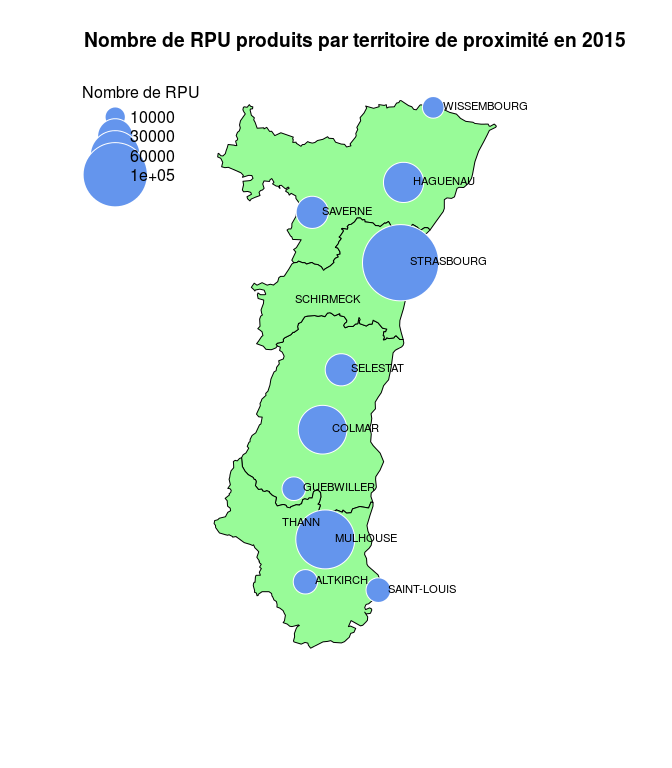

# Carte des RPU produits par territoire de santé
JcB  
08/01/2016  
Objectif: dessiner une carte de l'Alsace avec une représentation du nombre de RPU produits par chacun des douze territoires de proximié. Les RPU sont représentés par des cercles dont la superficie est proportionnelle au nombre de RPU.

Source: R et espace pp 189

Emplacement: <u>RPU_2014/Analyse/Carte_RPU_TP</u>

Réalisation: il faut disposer:

- d'un fond cartographique de l'Alsace: ctss
- de la position des 12 villes correspondant au 12 territoires de proximité: ts
- d'une liste du nombre de RPU par territoire de proximité

La surface des cercles est proportionnelle au nombre de RPU. Il manque des informations sur deux territoires: Schirmeck et Thann. En 2014, le nombre de RPU de la zone Strasbourg est fortement sous estimé.

Table: RPU produits en 2015 par zone de proximité

        Zone de proximité    Nombre de RPU
------  ------------------  --------------
27886   ALTKIRCH                    16 831
27940   COLMAR                      68 231
28053   GUEBWILLER                  15 939
27520   HAGUENAU                    46 286
27970   MULHOUSE                   100 316
27807   SAINT-LOUIS                 17 277
27574   SAVERNE                     29 730
27638   SCHIRMECK                       NA
27481   SELESTAT                    29 854
27661   STRASBOURG                 167 141
27868   THANN                           NA
27201   WISSEMBOURG                 13 217
13      TOTAL                      504 822

