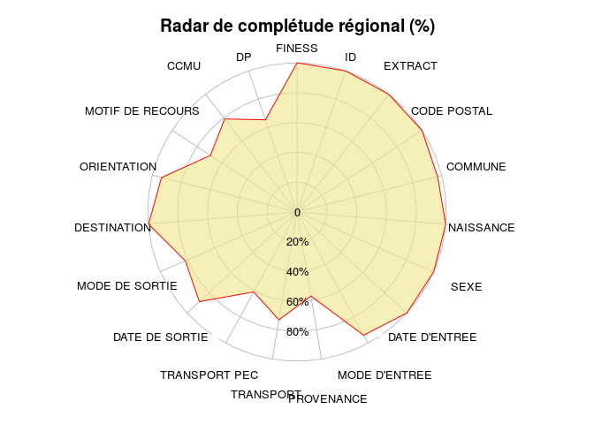
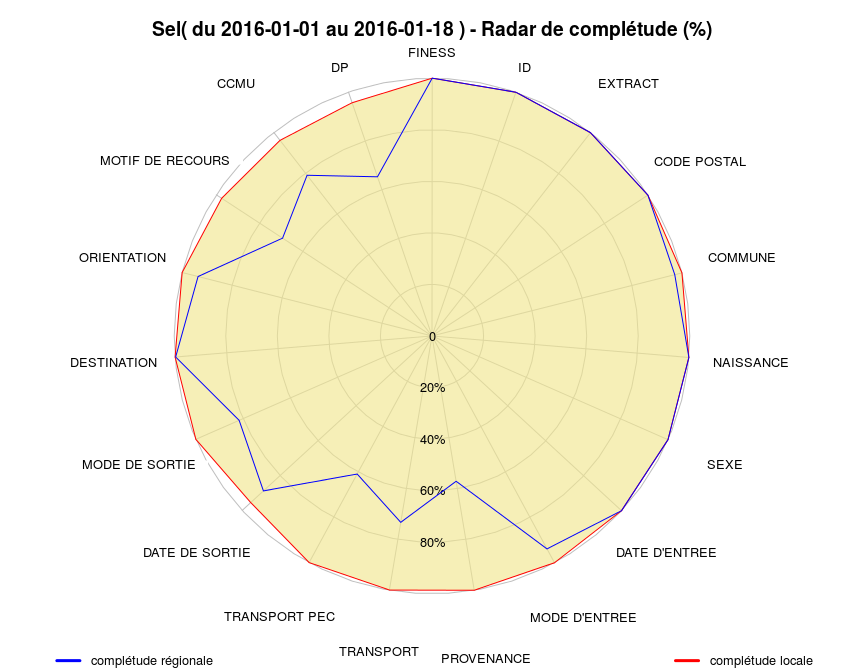
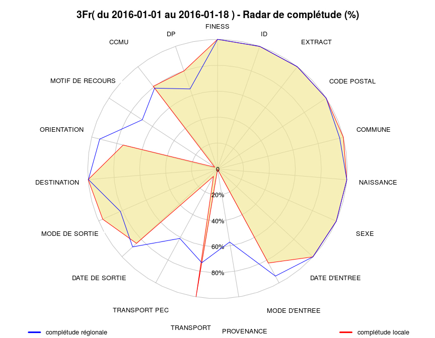
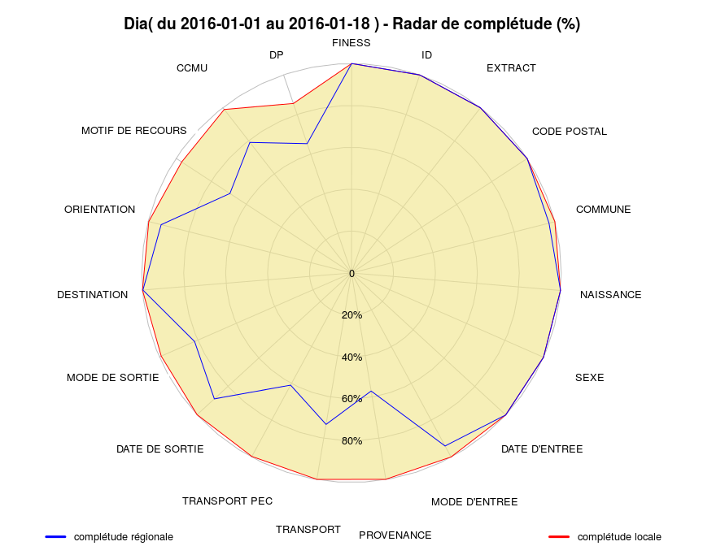
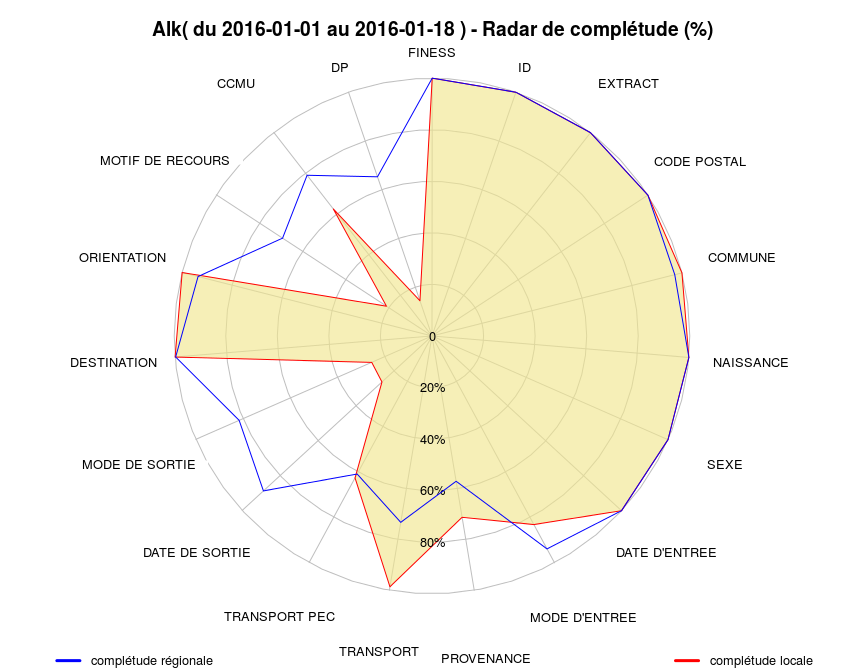

# Completude
jcb  
30 mars 2015  
Complétude des données
======================

Score de completude = somme des complétudes de chaque item.

Ce chapitre utilise le fichier source("../../Resural/FEDORU/Trame_commune/rapport_2014.R") qui possède deux fonctions pour calculer la complétude et dessiner le diagramme en radar correspondant.

MAJ
---

- 12/4/2014: enrgistrement des graphiques, impression du tableau de completude
- 15/4/2015: Ajout légende, amélioration du titre, élargissement du graphique
- 2015-08-12: dernière mise à jour.

TODO
----

Données
-------


Système utilisé: XPS


Motif de passage
----------------
Les motifs de passage ou de recours doivent être codés en CIM10. Certains établissements ne le font pas (Colmar), ce qui entraîne une fausse complétude car le champ n'est pas vide mais inexploitable. La fonction détecte les codes non CIM10 sur la base suivante: a minima un code CIM10 commence par une lettre majuscule suivie de deux chiffres ("^[A-Z][0-9][0-9]").


```
##    Hop Motifs CIM10 Completude
## 1  Sav  17684  9983      56.45
## 2  Sel  16794 16544      98.51
## 3  Mul  35450 28417      80.16
## 4  Dts   7320  6979      95.34
## 5  Dia  17144 16788      97.92
## 6  Hag  27550  5691      20.66
## 7  3Fr  10339   141       1.36
## 8  Alk  10082  1967      19.51
## 9  Hus  46492 25280      54.37
## 10 Wis   8044  7997      99.42
## 11 Ros   4782  4288      89.67
## 12 Geb   9518  9502      99.83
## 13 Col  40131     0          0
## 14 Odi  15295 13584      88.81
## 15 Ane   7920    10       0.13
## 16 NHC   5634  4586       81.4
## 17 HTP  13565  5893      43.44
```

Complétude régionale
--------------------
C'est la complétude calculée pour tous les RPU quelque soit l'établissement producteur.

 

```
          FINESS               ID          EXTRACT      CODE POSTAL 
          100.00           100.00           100.00           100.00 
         COMMUNE        NAISSANCE             SEXE    DATE D'ENTREE 
           98.57           100.00           100.00           100.00 
   MODE D'ENTREE       PROVENANCE        TRANSPORT    TRANSPORT PEC 
           93.81            48.37            70.55            57.02 
  DATE DE SORTIE   MODE DE SORTIE      DESTINATION      ORIENTATION 
           89.34            69.97            99.52            92.42 
MOTIF DE RECOURS             CCMU               DP 
           68.64            78.29            62.42 
```

Score de complétude régional: 85.73 sur 100.

Completude par établissement
----------------------------

#### Score de completude 
score = somme des completude de chaque item divisé par le nombre d'items. Varie de 0 à 100. 

TOdo: 

- calculer un sous score par chapitre selon découpage Fedoru
- comparer le score en foction du logiciel utilisé et sa version.


 

```
          FINESS               ID          EXTRACT      CODE POSTAL 
          100.00           100.00           100.00           100.00 
         COMMUNE        NAISSANCE             SEXE    DATE D'ENTREE 
          100.00           100.00           100.00           100.00 
   MODE D'ENTREE       PROVENANCE        TRANSPORT    TRANSPORT PEC 
          100.00             3.74             0.00             0.23 
  DATE DE SORTIE   MODE DE SORTIE      DESTINATION      ORIENTATION 
           88.30            88.05           100.00            93.54 
MOTIF DE RECOURS             CCMU               DP 
           56.45            54.81            17.05 
Score local: 73.8  sur 100[1] ""
[1] "====================================================================="
[1] "Sav"
[1] "====================================================================="
                   2015 - 1 2015 - 2 2015 - 3 2015 - 4 2015 - 5 2015 - 6
1.FINESS             100.00   100.00   100.00   100.00   100.00   100.00
1.ID                 100.00   100.00   100.00   100.00   100.00   100.00
1.EXTRACT            100.00   100.00   100.00   100.00   100.00   100.00
1.CODE POSTAL        100.00   100.00   100.00   100.00   100.00   100.00
1.COMMUNE            100.00   100.00   100.00   100.00   100.00   100.00
1.NAISSANCE          100.00   100.00   100.00   100.00   100.00   100.00
1.SEXE               100.00   100.00   100.00   100.00   100.00   100.00
1.DATE D'ENTREE      100.00   100.00   100.00   100.00   100.00   100.00
1.MODE D'ENTREE      100.00   100.00   100.00   100.00   100.00   100.00
1.PROVENANCE           2.93     4.16     3.39     3.99     3.50     3.91
1.TRANSPORT            0.00     0.00     0.00     0.00     0.00     0.00
1.TRANSPORT PEC        0.00     0.00     0.00     0.00     0.00     1.60
1.DATE DE SORTIE      90.51    87.47    89.70    88.08    86.59    87.84
1.MODE DE SORTIE      89.36    87.14    89.34    88.16    86.59    87.88
1.DESTINATION        100.00   100.00   100.00   100.00   100.00   100.00
1.ORIENTATION         93.90    93.98    94.03    92.43    91.99    93.10
1.MOTIF DE RECOURS    48.08    48.87    48.72    54.40    55.24    59.50
1.CCMU                52.08    51.92    54.23    56.97    55.98    56.88
1.DP                  10.26     8.25     8.71    10.20    12.61    30.19
                   2015 - 7
1.FINESS             100.00
1.ID                 100.00
1.EXTRACT            100.00
1.CODE POSTAL        100.00
1.COMMUNE            100.00
1.NAISSANCE          100.00
1.SEXE               100.00
1.DATE D'ENTREE      100.00
1.MODE D'ENTREE      100.00
1.PROVENANCE           4.26
1.TRANSPORT            0.00
1.TRANSPORT PEC        0.00
1.DATE DE SORTIE      87.88
1.MODE DE SORTIE      87.80
1.DESTINATION        100.00
1.ORIENTATION         95.19
1.MOTIF DE RECOURS    78.64
1.CCMU                55.44
1.DP                  37.30
```

 

```
          FINESS               ID          EXTRACT      CODE POSTAL 
          100.00           100.00           100.00           100.00 
         COMMUNE        NAISSANCE             SEXE    DATE D'ENTREE 
          100.00           100.00           100.00           100.00 
   MODE D'ENTREE       PROVENANCE        TRANSPORT    TRANSPORT PEC 
          100.00           100.00            99.77           100.00 
  DATE DE SORTIE   MODE DE SORTIE      DESTINATION      ORIENTATION 
           94.44            99.99           100.00           100.00 
MOTIF DE RECOURS             CCMU               DP 
           98.51            95.08            93.64 
Score local: 99.02  sur 100[1] ""
[1] "====================================================================="
[1] "Sel"
[1] "====================================================================="
                   2015 - 1 2015 - 2 2015 - 3 2015 - 4 2015 - 5 2015 - 6
1.FINESS             100.00   100.00   100.00   100.00   100.00   100.00
1.ID                 100.00   100.00   100.00   100.00   100.00   100.00
1.EXTRACT            100.00   100.00   100.00   100.00   100.00   100.00
1.CODE POSTAL        100.00   100.00   100.00   100.00   100.00   100.00
1.COMMUNE            100.00   100.00   100.00   100.00   100.00   100.00
1.NAISSANCE          100.00   100.00   100.00   100.00   100.00   100.00
1.SEXE               100.00   100.00   100.00   100.00   100.00   100.00
1.DATE D'ENTREE      100.00   100.00   100.00   100.00   100.00   100.00
1.MODE D'ENTREE      100.00   100.00   100.00   100.00   100.00   100.00
1.PROVENANCE         100.00   100.00   100.00   100.00   100.00   100.00
1.TRANSPORT           99.62    99.73    99.59    99.83    99.86    99.85
1.TRANSPORT PEC      100.00   100.00   100.00   100.00   100.00   100.00
1.DATE DE SORTIE      96.28    96.82    96.38    92.70    91.97    93.92
1.MODE DE SORTIE     100.00   100.00   100.00   100.00    99.93   100.00
1.DESTINATION        100.00   100.00   100.00   100.00   100.00   100.00
1.ORIENTATION        100.00   100.00   100.00   100.00   100.00   100.00
1.MOTIF DE RECOURS    98.12    98.43    98.76    97.92    98.63    98.71
1.CCMU                96.93    97.40    97.16    93.38    92.51    94.62
1.DP                  95.81    96.63    96.06    92.20    90.88    92.82
                   2015 - 7
1.FINESS             100.00
1.ID                 100.00
1.EXTRACT            100.00
1.CODE POSTAL        100.00
1.COMMUNE            100.00
1.NAISSANCE          100.00
1.SEXE               100.00
1.DATE D'ENTREE      100.00
1.MODE D'ENTREE      100.00
1.PROVENANCE         100.00
1.TRANSPORT           99.88
1.TRANSPORT PEC      100.00
1.DATE DE SORTIE      93.22
1.MODE DE SORTIE     100.00
1.DESTINATION        100.00
1.ORIENTATION        100.00
1.MOTIF DE RECOURS    98.88
1.CCMU                93.82
1.DP                  91.62
```

 

```
          FINESS               ID          EXTRACT      CODE POSTAL 
          100.00           100.00           100.00           100.00 
         COMMUNE        NAISSANCE             SEXE    DATE D'ENTREE 
           99.99           100.00           100.00           100.00 
   MODE D'ENTREE       PROVENANCE        TRANSPORT    TRANSPORT PEC 
           74.48            74.48            91.68            91.86 
  DATE DE SORTIE   MODE DE SORTIE      DESTINATION      ORIENTATION 
           81.31            74.26            99.63            80.13 
MOTIF DE RECOURS             CCMU               DP 
           80.16            74.98            77.60 
Score local: 89.5  sur 100[1] ""
[1] "====================================================================="
[1] "Mul"
[1] "====================================================================="
                   2015 - 1 2015 - 2 2015 - 3 2015 - 4 2015 - 5 2015 - 6
1.FINESS             100.00   100.00   100.00   100.00   100.00   100.00
1.ID                 100.00   100.00   100.00   100.00   100.00   100.00
1.EXTRACT            100.00   100.00   100.00   100.00   100.00   100.00
1.CODE POSTAL        100.00   100.00   100.00   100.00   100.00   100.00
1.COMMUNE             99.96   100.00   100.00    99.98    99.98    99.98
1.NAISSANCE          100.00   100.00   100.00   100.00   100.00   100.00
1.SEXE               100.00   100.00   100.00   100.00   100.00   100.00
1.DATE D'ENTREE      100.00   100.00   100.00   100.00   100.00   100.00
1.MODE D'ENTREE       71.16    68.75    77.02    74.23    78.85    76.45
1.PROVENANCE          71.16    68.75    77.02    74.23    78.85    76.45
1.TRANSPORT           90.41    90.11    92.71    91.69    92.65    91.96
1.TRANSPORT PEC       90.59    90.24    92.88    91.91    92.79    92.25
1.DATE DE SORTIE      81.75    79.88    83.28    81.05    80.29    80.58
1.MODE DE SORTIE      75.36    73.41    76.08    74.88    73.10    73.76
1.DESTINATION         99.44    99.36    99.60    99.72   100.00    99.73
1.ORIENTATION         84.49    81.54    83.69    78.77    79.22    75.37
1.MOTIF DE RECOURS    80.87    79.29    81.08    80.66    80.64    80.65
1.CCMU                75.40    73.79    75.81    75.29    74.19    75.00
1.DP                  77.91    75.94    78.50    78.29    77.05    77.15
                   2015 - 7
1.FINESS             100.00
1.ID                 100.00
1.EXTRACT            100.00
1.CODE POSTAL        100.00
1.COMMUNE            100.00
1.NAISSANCE          100.00
1.SEXE               100.00
1.DATE D'ENTREE      100.00
1.MODE D'ENTREE       74.79
1.PROVENANCE          74.79
1.TRANSPORT           92.16
1.TRANSPORT PEC       92.36
1.DATE DE SORTIE      82.13
1.MODE DE SORTIE      73.05
1.DESTINATION         99.54
1.ORIENTATION         77.81
1.MOTIF DE RECOURS    80.85
1.CCMU                75.28
1.DP                  78.26
```

 

```
          FINESS               ID          EXTRACT      CODE POSTAL 
          100.00           100.00           100.00           100.00 
         COMMUNE        NAISSANCE             SEXE    DATE D'ENTREE 
           99.96           100.00           100.00           100.00 
   MODE D'ENTREE       PROVENANCE        TRANSPORT    TRANSPORT PEC 
          100.00             4.13            89.51            97.72 
  DATE DE SORTIE   MODE DE SORTIE      DESTINATION      ORIENTATION 
           83.02            82.55           100.00            99.65 
MOTIF DE RECOURS             CCMU               DP 
           95.34            80.66            80.27 
Score local: 90.15  sur 100[1] ""
[1] "====================================================================="
[1] "Dts"
[1] "====================================================================="
                   2015 - 1 2015 - 2 2015 - 3 2015 - 4 2015 - 5 2015 - 6
1.FINESS             100.00   100.00   100.00   100.00   100.00   100.00
1.ID                 100.00   100.00   100.00   100.00   100.00   100.00
1.EXTRACT            100.00   100.00   100.00   100.00   100.00   100.00
1.CODE POSTAL        100.00   100.00   100.00   100.00   100.00   100.00
1.COMMUNE            100.00   100.00   100.00   100.00    99.73   100.00
1.NAISSANCE          100.00   100.00   100.00   100.00   100.00   100.00
1.SEXE               100.00   100.00   100.00   100.00   100.00   100.00
1.DATE D'ENTREE      100.00   100.00   100.00   100.00   100.00   100.00
1.MODE D'ENTREE      100.00   100.00   100.00   100.00   100.00   100.00
1.PROVENANCE           0.11     1.72     0.36     0.00     0.00     0.00
1.TRANSPORT           98.82    98.17    97.05    98.22    96.25    97.90
1.TRANSPORT PEC       98.82    98.17    97.05    98.22    96.25    97.90
1.DATE DE SORTIE      87.61    84.90    81.05    82.90    76.51    85.32
1.MODE DE SORTIE      87.50    84.78    80.43    82.15    75.50    84.98
1.DESTINATION        100.00   100.00   100.00   100.00   100.00   100.00
1.ORIENTATION         99.32    99.38   100.00   100.00   100.00    91.67
1.MOTIF DE RECOURS    97.76    96.68    95.71    95.23    93.51    94.97
1.CCMU                92.63    93.48    86.77    84.21    71.85    76.76
1.DP                  92.31    93.48    86.68    84.02    71.21    75.76
                   2015 - 7
1.FINESS             100.00
1.ID                 100.00
1.EXTRACT            100.00
1.CODE POSTAL        100.00
1.COMMUNE            100.00
1.NAISSANCE          100.00
1.SEXE               100.00
1.DATE D'ENTREE      100.00
1.MODE D'ENTREE      100.00
1.PROVENANCE          27.25
1.TRANSPORT           39.81
1.TRANSPORT PEC       97.87
1.DATE DE SORTIE      83.77
1.MODE DE SORTIE      83.57
1.DESTINATION        100.00
1.ORIENTATION        100.00
1.MOTIF DE RECOURS    94.11
1.CCMU                62.51
1.DP                  62.22
```

 

```
          FINESS               ID          EXTRACT      CODE POSTAL 
          100.00           100.00           100.00           100.00 
         COMMUNE        NAISSANCE             SEXE    DATE D'ENTREE 
          100.00           100.00           100.00           100.00 
   MODE D'ENTREE       PROVENANCE        TRANSPORT    TRANSPORT PEC 
           99.83            99.83           100.00            99.91 
  DATE DE SORTIE   MODE DE SORTIE      DESTINATION      ORIENTATION 
          100.00            99.01           100.00            99.09 
MOTIF DE RECOURS             CCMU               DP 
           97.92            99.17            42.21 
Score local: 96.68  sur 100[1] ""
[1] "====================================================================="
[1] "Dia"
[1] "====================================================================="
                   2015 - 1 2015 - 2 2015 - 3 2015 - 4 2015 - 5 2015 - 6
1.FINESS             100.00   100.00   100.00   100.00   100.00   100.00
1.ID                 100.00   100.00   100.00   100.00   100.00   100.00
1.EXTRACT            100.00   100.00   100.00   100.00   100.00   100.00
1.CODE POSTAL        100.00   100.00   100.00   100.00   100.00   100.00
1.COMMUNE            100.00   100.00   100.00   100.00   100.00   100.00
1.NAISSANCE          100.00   100.00   100.00   100.00   100.00   100.00
1.SEXE               100.00   100.00   100.00   100.00   100.00   100.00
1.DATE D'ENTREE      100.00   100.00   100.00   100.00   100.00   100.00
1.MODE D'ENTREE       99.79    99.86    99.69    99.88    99.88    99.79
1.PROVENANCE          99.79    99.86    99.69    99.88    99.88    99.75
1.TRANSPORT          100.00   100.00   100.00   100.00   100.00   100.00
1.TRANSPORT PEC       99.92   100.00    99.88    99.92    99.77    99.92
1.DATE DE SORTIE     100.00   100.00   100.00   100.00   100.00   100.00
1.MODE DE SORTIE      98.83    99.21    99.38    98.98    98.56    99.54
1.DESTINATION        100.00   100.00   100.00   100.00   100.00   100.00
1.ORIENTATION         96.83    98.27    98.96    99.83    99.82   100.00
1.MOTIF DE RECOURS    98.33    97.09    97.66    97.38    98.56    98.30
1.CCMU                98.88    98.66    99.26    99.02    99.30    99.71
1.DP                  32.78    44.55    46.85    42.48    42.66    44.08
                   2015 - 7
1.FINESS             100.00
1.ID                 100.00
1.EXTRACT            100.00
1.CODE POSTAL        100.00
1.COMMUNE            100.00
1.NAISSANCE          100.00
1.SEXE               100.00
1.DATE D'ENTREE      100.00
1.MODE D'ENTREE       99.92
1.PROVENANCE          99.92
1.TRANSPORT          100.00
1.TRANSPORT PEC       99.96
1.DATE DE SORTIE     100.00
1.MODE DE SORTIE      98.61
1.DESTINATION        100.00
1.ORIENTATION         99.83
1.MOTIF DE RECOURS    98.03
1.CCMU                99.26
1.DP                  41.91
```

 

```
          FINESS               ID          EXTRACT      CODE POSTAL 
          100.00           100.00           100.00           100.00 
         COMMUNE        NAISSANCE             SEXE    DATE D'ENTREE 
           84.81           100.00           100.00           100.00 
   MODE D'ENTREE       PROVENANCE        TRANSPORT    TRANSPORT PEC 
           82.97            50.23            69.26            86.57 
  DATE DE SORTIE   MODE DE SORTIE      DESTINATION      ORIENTATION 
           88.09            90.08            98.39            87.25 
MOTIF DE RECOURS             CCMU               DP 
           20.66            73.66            77.94 
Score local: 84.73  sur 100[1] ""
[1] "====================================================================="
[1] "Hag"
[1] "====================================================================="
                   2015 - 1 2015 - 2 2015 - 3 2015 - 4 2015 - 5 2015 - 6
1.FINESS             100.00   100.00   100.00   100.00   100.00   100.00
1.ID                 100.00   100.00   100.00   100.00   100.00   100.00
1.EXTRACT            100.00   100.00   100.00   100.00   100.00   100.00
1.CODE POSTAL        100.00   100.00   100.00   100.00   100.00   100.00
1.COMMUNE             99.53    99.97    99.92    90.48    70.10    70.01
1.NAISSANCE          100.00   100.00   100.00   100.00   100.00   100.00
1.SEXE               100.00   100.00   100.00   100.00   100.00   100.00
1.DATE D'ENTREE      100.00   100.00   100.00   100.00   100.00   100.00
1.MODE D'ENTREE       73.98    73.95    78.40    78.25    79.37    96.45
1.PROVENANCE          52.32    56.89    53.14    57.48    54.89    40.50
1.TRANSPORT           69.70    65.91    68.79    69.40    71.06    71.12
1.TRANSPORT PEC       84.51    87.18    88.45    87.46    87.19    86.61
1.DATE DE SORTIE      82.94    89.26    91.89    92.30    91.06    84.91
1.MODE DE SORTIE      85.53    91.46    93.68    93.95    92.86    86.90
1.DESTINATION         98.29    97.74    98.17    98.53    98.31    98.65
1.ORIENTATION         88.67    88.28    88.07    86.73    87.66    84.80
1.MOTIF DE RECOURS    24.74    27.68    24.48    26.41    23.75    22.01
1.CCMU                71.45    74.09    75.88    78.33    72.78    70.88
1.DP                  74.18    77.33    78.67    81.23    78.99    78.23
                   2015 - 7
1.FINESS             100.00
1.ID                 100.00
1.EXTRACT            100.00
1.CODE POSTAL        100.00
1.COMMUNE             67.92
1.NAISSANCE          100.00
1.SEXE               100.00
1.DATE D'ENTREE      100.00
1.MODE D'ENTREE       97.31
1.PROVENANCE          38.67
1.TRANSPORT           68.52
1.TRANSPORT PEC       84.81
1.DATE DE SORTIE      84.74
1.MODE DE SORTIE      86.72
1.DESTINATION         98.92
1.ORIENTATION         86.84
1.MOTIF DE RECOURS    24.19
1.CCMU                72.45
1.DP                  76.89
```

 

```
          FINESS               ID          EXTRACT      CODE POSTAL 
          100.00           100.00           100.00           100.00 
         COMMUNE        NAISSANCE             SEXE    DATE D'ENTREE 
          100.00           100.00           100.00           100.00 
   MODE D'ENTREE       PROVENANCE        TRANSPORT    TRANSPORT PEC 
           80.57             0.19            99.80            10.48 
  DATE DE SORTIE   MODE DE SORTIE      DESTINATION      ORIENTATION 
           65.53            81.51           100.00            65.01 
MOTIF DE RECOURS             CCMU               DP 
            1.36            61.69            60.28 
Score local: 75.07  sur 100[1] ""
[1] "====================================================================="
[1] "3Fr"
[1] "====================================================================="
                   2015 - 1 2015 - 2 2015 - 3 2015 - 4 2015 - 5 2015 - 6
1.FINESS             100.00   100.00   100.00   100.00   100.00   100.00
1.ID                 100.00   100.00   100.00   100.00   100.00   100.00
1.EXTRACT            100.00   100.00   100.00   100.00   100.00   100.00
1.CODE POSTAL        100.00   100.00   100.00   100.00   100.00   100.00
1.COMMUNE            100.00   100.00   100.00   100.00   100.00   100.00
1.NAISSANCE          100.00   100.00   100.00   100.00   100.00   100.00
1.SEXE               100.00   100.00   100.00   100.00   100.00   100.00
1.DATE D'ENTREE      100.00   100.00   100.00   100.00   100.00   100.00
1.MODE D'ENTREE       88.41    89.55    78.57    80.68    81.08    75.85
1.PROVENANCE           0.30     0.15     0.27     0.36     0.19     0.00
1.TRANSPORT           99.70    99.93    99.86    99.64    99.74    99.81
1.TRANSPORT PEC       14.64    13.82     9.62     9.45    11.48     7.56
1.DATE DE SORTIE      66.86    58.26    60.58    62.86    67.29    67.20
1.MODE DE SORTIE      77.04    76.75    82.83    79.76    80.56    83.79
1.DESTINATION        100.00   100.00   100.00   100.00   100.00   100.00
1.ORIENTATION          0.00     0.00    57.47    67.39    73.29    66.04
1.MOTIF DE RECOURS     1.86     1.17     1.58     0.99     1.28     1.73
1.CCMU                63.74    56.07    57.69    58.66    62.86    62.97
1.DP                  59.73    53.43    55.45    58.80    62.11    61.91
                   2015 - 7
1.FINESS             100.00
1.ID                 100.00
1.EXTRACT            100.00
1.CODE POSTAL        100.00
1.COMMUNE            100.00
1.NAISSANCE          100.00
1.SEXE               100.00
1.DATE D'ENTREE      100.00
1.MODE D'ENTREE       72.33
1.PROVENANCE           0.12
1.TRANSPORT           99.88
1.TRANSPORT PEC        7.80
1.DATE DE SORTIE      73.92
1.MODE DE SORTIE      88.18
1.DESTINATION        100.00
1.ORIENTATION         67.25
1.MOTIF DE RECOURS     0.98
1.CCMU                68.49
1.DP                  69.03
```

 

```
          FINESS               ID          EXTRACT      CODE POSTAL 
          100.00           100.00           100.00           100.00 
         COMMUNE        NAISSANCE             SEXE    DATE D'ENTREE 
          100.00           100.00           100.00           100.00 
   MODE D'ENTREE       PROVENANCE        TRANSPORT    TRANSPORT PEC 
           83.10            28.34            98.61            29.53 
  DATE DE SORTIE   MODE DE SORTIE      DESTINATION      ORIENTATION 
           28.77            29.45           100.00            96.81 
MOTIF DE RECOURS             CCMU               DP 
           19.51            68.31            18.62 
Score local: 73.74  sur 100[1] ""
[1] "====================================================================="
[1] "Alk"
[1] "====================================================================="
                   2015 - 1 2015 - 2 2015 - 3 2015 - 4 2015 - 5 2015 - 6
1.FINESS             100.00   100.00   100.00   100.00   100.00   100.00
1.ID                 100.00   100.00   100.00   100.00   100.00   100.00
1.EXTRACT            100.00   100.00   100.00   100.00   100.00   100.00
1.CODE POSTAL        100.00   100.00   100.00   100.00   100.00   100.00
1.COMMUNE            100.00   100.00   100.00   100.00   100.00   100.00
1.NAISSANCE          100.00   100.00   100.00   100.00   100.00   100.00
1.SEXE               100.00   100.00   100.00   100.00   100.00   100.00
1.DATE D'ENTREE      100.00   100.00   100.00   100.00   100.00   100.00
1.MODE D'ENTREE       80.85    84.65    82.21    77.93    77.07    92.45
1.PROVENANCE           0.08     0.32     0.56     0.07    26.63    83.40
1.TRANSPORT           98.49    98.50    98.18    98.44    99.00    98.62
1.TRANSPORT PEC        7.95     8.39     6.93     7.21    25.00    72.18
1.DATE DE SORTIE      29.14    29.51    25.91    25.11    20.30    31.89
1.MODE DE SORTIE      32.78    31.33    26.33    24.68    21.68    31.63
1.DESTINATION        100.00   100.00   100.00   100.00   100.00   100.00
1.ORIENTATION         94.94    96.72    91.67    96.97    97.56    98.25
1.MOTIF DE RECOURS    20.67    19.94    16.11    14.29    13.60    23.03
1.CCMU                74.94    71.04    66.53    67.75    59.90    69.16
1.DP                  20.50    19.23    14.97    13.14    13.06    21.94
                   2015 - 7
1.FINESS             100.00
1.ID                 100.00
1.EXTRACT            100.00
1.CODE POSTAL        100.00
1.COMMUNE            100.00
1.NAISSANCE          100.00
1.SEXE               100.00
1.DATE D'ENTREE      100.00
1.MODE D'ENTREE       86.32
1.PROVENANCE          74.72
1.TRANSPORT           98.96
1.TRANSPORT PEC       69.45
1.DATE DE SORTIE      39.61
1.MODE DE SORTIE      38.24
1.DESTINATION        100.00
1.ORIENTATION        100.00
1.MOTIF DE RECOURS    28.79
1.CCMU                70.42
1.DP                  27.39
```

 

```
          FINESS               ID          EXTRACT      CODE POSTAL 
          100.00           100.00           100.00           100.00 
         COMMUNE        NAISSANCE             SEXE    DATE D'ENTREE 
          100.00           100.00           100.00           100.00 
   MODE D'ENTREE       PROVENANCE        TRANSPORT    TRANSPORT PEC 
          100.00             0.27            27.15             1.16 
  DATE DE SORTIE   MODE DE SORTIE      DESTINATION      ORIENTATION 
           95.68            21.72           100.00            97.45 
MOTIF DE RECOURS             CCMU               DP 
           54.37            64.96            53.31 
Score local: 74.53  sur 100[1] ""
[1] "====================================================================="
[1] "Hus"
[1] "====================================================================="
                   2015 - 1 2015 - 2 2015 - 3 2015 - 4 2015 - 5
1.FINESS             100.00   100.00   100.00   100.00   100.00
1.ID                 100.00   100.00   100.00   100.00   100.00
1.EXTRACT            100.00   100.00   100.00   100.00   100.00
1.CODE POSTAL        100.00   100.00   100.00   100.00   100.00
1.COMMUNE            100.00   100.00   100.00   100.00   100.00
1.NAISSANCE          100.00   100.00   100.00   100.00   100.00
1.SEXE               100.00   100.00   100.00   100.00   100.00
1.DATE D'ENTREE      100.00   100.00   100.00   100.00   100.00
1.MODE D'ENTREE      100.00   100.00   100.00   100.00   100.00
1.PROVENANCE           0.28     0.27     0.29     0.24     0.26
1.TRANSPORT           30.42    29.49    25.55    25.90    24.74
1.TRANSPORT PEC        1.34     1.07     1.23     1.15     1.01
1.DATE DE SORTIE      96.00    94.16    95.31    96.55    96.26
1.MODE DE SORTIE      21.93    20.56    20.64    23.85    21.57
1.DESTINATION        100.00   100.00   100.00   100.00   100.00
1.ORIENTATION         96.99    97.36    97.37    97.75    97.75
1.MOTIF DE RECOURS    55.04    54.52    53.98    50.36    57.92
1.CCMU                64.70    61.54    63.85    69.44    65.00
1.DP                  54.94    51.43    50.39    54.00    55.69
```

 

```
          FINESS               ID          EXTRACT      CODE POSTAL 
          100.00           100.00           100.00           100.00 
         COMMUNE        NAISSANCE             SEXE    DATE D'ENTREE 
          100.00           100.00           100.00           100.00 
   MODE D'ENTREE       PROVENANCE        TRANSPORT    TRANSPORT PEC 
           99.58            99.02            98.79            99.70 
  DATE DE SORTIE   MODE DE SORTIE      DESTINATION      ORIENTATION 
           95.49            96.27           100.00            98.58 
MOTIF DE RECOURS             CCMU               DP 
           99.42            96.77            87.50 
Score local: 98.48  sur 100[1] ""
[1] "====================================================================="
[1] "Wis"
[1] "====================================================================="
                   2015 - 1 2015 - 2 2015 - 3 2015 - 4 2015 - 5 2015 - 6
1.FINESS             100.00   100.00   100.00   100.00   100.00   100.00
1.ID                 100.00   100.00   100.00   100.00   100.00   100.00
1.EXTRACT            100.00   100.00   100.00   100.00   100.00   100.00
1.CODE POSTAL        100.00   100.00   100.00   100.00   100.00   100.00
1.COMMUNE            100.00   100.00   100.00   100.00   100.00   100.00
1.NAISSANCE          100.00   100.00   100.00   100.00   100.00   100.00
1.SEXE               100.00   100.00   100.00   100.00   100.00   100.00
1.DATE D'ENTREE      100.00   100.00   100.00   100.00   100.00   100.00
1.MODE D'ENTREE       99.42    99.80    99.49    99.65    99.56    99.42
1.PROVENANCE          98.54    99.11    98.89    99.29    99.30    98.83
1.TRANSPORT           98.83    98.61    99.06    98.85    97.99    98.58
1.TRANSPORT PEC       99.71    99.80    99.49    99.82    99.22    99.92
1.DATE DE SORTIE      94.75    93.54    94.61    96.47    96.60    94.99
1.MODE DE SORTIE      95.72    95.23    95.89    96.82    97.04    95.91
1.DESTINATION        100.00   100.00   100.00   100.00   100.00   100.00
1.ORIENTATION         99.13    97.83    97.07    98.30    99.17    99.23
1.MOTIF DE RECOURS    99.03    99.50    99.40    99.73    99.56    98.83
1.CCMU                95.92    95.73    96.49    97.44    98.17    96.24
1.DP                  88.78    86.14    90.43    87.76    89.60    86.62
                   2015 - 7
1.FINESS             100.00
1.ID                 100.00
1.EXTRACT            100.00
1.CODE POSTAL        100.00
1.COMMUNE            100.00
1.NAISSANCE          100.00
1.SEXE               100.00
1.DATE D'ENTREE      100.00
1.MODE D'ENTREE       99.71
1.PROVENANCE          99.12
1.TRANSPORT           99.49
1.TRANSPORT PEC       99.93
1.DATE DE SORTIE      96.92
1.MODE DE SORTIE      96.99
1.DESTINATION        100.00
1.ORIENTATION         99.22
1.MOTIF DE RECOURS    99.78
1.CCMU                97.14
1.DP                  83.80
```

 

```
          FINESS               ID          EXTRACT      CODE POSTAL 
          100.00           100.00           100.00           100.00 
         COMMUNE        NAISSANCE             SEXE    DATE D'ENTREE 
          100.00           100.00           100.00           100.00 
   MODE D'ENTREE       PROVENANCE        TRANSPORT    TRANSPORT PEC 
           98.49            99.37            99.48            99.23 
  DATE DE SORTIE   MODE DE SORTIE      DESTINATION      ORIENTATION 
          100.00            86.39           100.00            34.93 
MOTIF DE RECOURS             CCMU               DP 
           89.67            99.46             6.77 
Score local: 90.2  sur 100[1] ""
[1] "====================================================================="
[1] "Ros"
[1] "====================================================================="
                   2015 - 1 2015 - 2 2015 - 3 2015 - 4 2015 - 5 2015 - 6
1.FINESS             100.00   100.00   100.00   100.00   100.00   100.00
1.ID                 100.00   100.00   100.00   100.00   100.00   100.00
1.EXTRACT            100.00   100.00   100.00   100.00   100.00   100.00
1.CODE POSTAL        100.00   100.00   100.00   100.00   100.00   100.00
1.COMMUNE            100.00   100.00   100.00   100.00   100.00   100.00
1.NAISSANCE          100.00   100.00   100.00   100.00   100.00   100.00
1.SEXE               100.00   100.00   100.00   100.00   100.00   100.00
1.DATE D'ENTREE      100.00   100.00   100.00   100.00   100.00   100.00
1.MODE D'ENTREE       96.90    98.64    98.68    98.62    97.85    98.81
1.PROVENANCE          98.28    99.66    99.71    99.59    99.19    99.34
1.TRANSPORT           99.31    99.32    99.27    99.72    99.60    99.34
1.TRANSPORT PEC       98.80    99.49    99.56    99.04    99.33    99.47
1.DATE DE SORTIE     100.00   100.00   100.00   100.00   100.00   100.00
1.MODE DE SORTIE      83.99    71.82    86.22    93.25    89.38    86.11
1.DESTINATION        100.00   100.00   100.00   100.00   100.00   100.00
1.ORIENTATION         41.58    20.59    38.10    32.43    47.46    34.82
1.MOTIF DE RECOURS    91.05    85.40    89.15    90.63    90.32    91.80
1.CCMU                99.83    98.47    99.71    99.86    99.73    98.81
1.DP                   7.77     7.64     6.77     6.94     5.26     6.53
                   2015 - 7
1.FINESS             100.00
1.ID                 100.00
1.EXTRACT            100.00
1.CODE POSTAL        100.00
1.COMMUNE            100.00
1.NAISSANCE          100.00
1.SEXE               100.00
1.DATE D'ENTREE      100.00
1.MODE D'ENTREE       99.72
1.PROVENANCE          99.72
1.TRANSPORT           99.72
1.TRANSPORT PEC       98.86
1.DATE DE SORTIE     100.00
1.MODE DE SORTIE      90.77
1.DESTINATION        100.00
1.ORIENTATION         22.92
1.MOTIF DE RECOURS    88.64
1.CCMU                99.72
1.DP                   6.87
```

 

```
          FINESS               ID          EXTRACT      CODE POSTAL 
          100.00           100.00           100.00           100.00 
         COMMUNE        NAISSANCE             SEXE    DATE D'ENTREE 
          100.00           100.00           100.00           100.00 
   MODE D'ENTREE       PROVENANCE        TRANSPORT    TRANSPORT PEC 
           93.64            32.52            98.50            91.78 
  DATE DE SORTIE   MODE DE SORTIE      DESTINATION      ORIENTATION 
           98.82            93.71           100.00            68.48 
MOTIF DE RECOURS             CCMU               DP 
           99.83            98.70            98.93 
Score local: 93.42  sur 100[1] ""
[1] "====================================================================="
[1] "Geb"
[1] "====================================================================="
                   2015 - 1 2015 - 2 2015 - 3 2015 - 4 2015 - 5 2015 - 6
1.FINESS             100.00   100.00   100.00   100.00   100.00   100.00
1.ID                 100.00   100.00   100.00   100.00   100.00   100.00
1.EXTRACT            100.00   100.00   100.00   100.00   100.00   100.00
1.CODE POSTAL        100.00   100.00   100.00   100.00   100.00   100.00
1.COMMUNE            100.00   100.00   100.00   100.00   100.00   100.00
1.NAISSANCE          100.00   100.00   100.00   100.00   100.00   100.00
1.SEXE               100.00   100.00   100.00   100.00   100.00   100.00
1.DATE D'ENTREE      100.00   100.00   100.00   100.00   100.00   100.00
1.MODE D'ENTREE       94.65    93.41    94.77    92.41    91.69    91.96
1.PROVENANCE           0.65     0.51     0.55     0.37    15.44    91.96
1.TRANSPORT           97.40    98.48    98.52    98.89    98.20    98.65
1.TRANSPORT PEC       92.30    90.37    92.04    92.11    89.27    90.01
1.DATE DE SORTIE      98.38    99.41    98.67    98.97    98.34    98.85
1.MODE DE SORTIE      92.46    94.17    93.14    92.85    91.41    93.72
1.DESTINATION        100.00   100.00   100.00   100.00   100.00   100.00
1.ORIENTATION         68.25    59.48    60.19    72.29    52.07    72.13
1.MOTIF DE RECOURS    99.43    99.75    99.84    99.93    99.86   100.00
1.CCMU                98.13    99.07    98.67    98.82    97.92    98.99
1.DP                  98.52    99.49    98.90    99.11    98.25    99.04
                   2015 - 7
1.FINESS             100.00
1.ID                 100.00
1.EXTRACT            100.00
1.CODE POSTAL        100.00
1.COMMUNE            100.00
1.NAISSANCE          100.00
1.SEXE               100.00
1.DATE D'ENTREE      100.00
1.MODE D'ENTREE       96.62
1.PROVENANCE          96.55
1.TRANSPORT           99.15
1.TRANSPORT PEC       96.03
1.DATE DE SORTIE      99.15
1.MODE DE SORTIE      97.72
1.DESTINATION        100.00
1.ORIENTATION         89.47
1.MOTIF DE RECOURS    99.93
1.CCMU                99.22
1.DP                  99.21
```

 

```
          FINESS               ID          EXTRACT      CODE POSTAL 
          100.00           100.00           100.00           100.00 
         COMMUNE        NAISSANCE             SEXE    DATE D'ENTREE 
          100.00           100.00           100.00           100.00 
   MODE D'ENTREE       PROVENANCE        TRANSPORT    TRANSPORT PEC 
          100.00           100.00            99.13            99.13 
  DATE DE SORTIE   MODE DE SORTIE      DESTINATION      ORIENTATION 
           98.81            96.72            98.70            97.04 
MOTIF DE RECOURS             CCMU               DP 
            0.00            99.02            88.00 
Score local: 93.5  sur 100[1] ""
[1] "====================================================================="
[1] "Col"
[1] "====================================================================="
                   2015 - 1 2015 - 2 2015 - 3 2015 - 4 2015 - 5 2015 - 6
1.FINESS             100.00   100.00   100.00   100.00   100.00   100.00
1.ID                 100.00   100.00   100.00   100.00   100.00   100.00
1.EXTRACT            100.00   100.00   100.00   100.00   100.00   100.00
1.CODE POSTAL        100.00   100.00   100.00   100.00   100.00   100.00
1.COMMUNE            100.00   100.00   100.00   100.00   100.00   100.00
1.NAISSANCE          100.00   100.00   100.00   100.00   100.00   100.00
1.SEXE               100.00   100.00   100.00   100.00   100.00   100.00
1.DATE D'ENTREE      100.00   100.00   100.00   100.00   100.00   100.00
1.MODE D'ENTREE      100.00   100.00   100.00   100.00   100.00   100.00
1.PROVENANCE         100.00   100.00   100.00   100.00   100.00   100.00
1.TRANSPORT           99.61    99.12    98.96    99.00    98.86    99.11
1.TRANSPORT PEC       99.61    99.12    98.96    99.00    98.86    99.11
1.DATE DE SORTIE      99.05    99.08    99.43    99.66    99.18    99.25
1.MODE DE SORTIE      97.45    97.30    97.47    97.48    96.74    96.88
1.DESTINATION         98.84    98.89    98.68    98.72    98.63    98.93
1.ORIENTATION         97.28    97.48    96.44    97.29    97.18    96.99
1.MOTIF DE RECOURS   100.00   100.00   100.00   100.00   100.00   100.00
1.CCMU                99.19    99.29    99.57    99.70    99.47    99.40
1.DP                  86.33    85.10    87.92    88.02    90.70    90.50
                   2015 - 7
1.FINESS             100.00
1.ID                 100.00
1.EXTRACT            100.00
1.CODE POSTAL        100.00
1.COMMUNE            100.00
1.NAISSANCE          100.00
1.SEXE               100.00
1.DATE D'ENTREE      100.00
1.MODE D'ENTREE      100.00
1.PROVENANCE         100.00
1.TRANSPORT           99.22
1.TRANSPORT PEC       99.22
1.DATE DE SORTIE      96.27
1.MODE DE SORTIE      94.07
1.DESTINATION         98.19
1.ORIENTATION         96.67
1.MOTIF DE RECOURS   100.00
1.CCMU                96.79
1.DP                  87.23
```

 

```
          FINESS               ID          EXTRACT      CODE POSTAL 
          100.00           100.00           100.00           100.00 
         COMMUNE        NAISSANCE             SEXE    DATE D'ENTREE 
           99.99           100.00           100.00           100.00 
   MODE D'ENTREE       PROVENANCE        TRANSPORT    TRANSPORT PEC 
          100.00             0.43            82.06            25.35 
  DATE DE SORTIE   MODE DE SORTIE      DESTINATION      ORIENTATION 
           85.63            85.35           100.00            87.63 
MOTIF DE RECOURS             CCMU               DP 
           88.81            84.90            45.15 
Score local: 83.44  sur 100[1] ""
[1] "====================================================================="
[1] "Odi"
[1] "====================================================================="
                   2015 - 1 2015 - 2 2015 - 3 2015 - 4 2015 - 5 2015 - 6
1.FINESS             100.00   100.00   100.00   100.00   100.00   100.00
1.ID                 100.00   100.00   100.00   100.00   100.00   100.00
1.EXTRACT            100.00   100.00   100.00   100.00   100.00   100.00
1.CODE POSTAL        100.00   100.00   100.00   100.00   100.00   100.00
1.COMMUNE             99.95   100.00   100.00   100.00   100.00   100.00
1.NAISSANCE          100.00   100.00   100.00   100.00   100.00   100.00
1.SEXE               100.00   100.00   100.00   100.00   100.00   100.00
1.DATE D'ENTREE      100.00   100.00   100.00   100.00   100.00   100.00
1.MODE D'ENTREE      100.00   100.00   100.00   100.00   100.00   100.00
1.PROVENANCE           0.00     0.00     0.00     0.17     0.13     0.04
1.TRANSPORT           93.75    95.62    92.59    90.84    93.31    89.96
1.TRANSPORT PEC        0.27     0.00     0.14     0.00     0.08    79.84
1.DATE DE SORTIE      82.98    85.71    84.89    87.85    84.81    86.59
1.MODE DE SORTIE      82.88    85.67    84.75    87.76    84.51    85.85
1.DESTINATION        100.00   100.00   100.00   100.00   100.00   100.00
1.ORIENTATION         90.40    89.57    90.91    90.00    88.24    74.76
1.MOTIF DE RECOURS    86.91    88.08    89.53    89.54    90.53    87.75
1.CCMU                87.51    86.60    85.63    84.46    83.71    82.30
1.DP                  50.03    44.93    43.10    40.10    41.37    50.24
                   2015 - 7
1.FINESS             100.00
1.ID                 100.00
1.EXTRACT            100.00
1.CODE POSTAL        100.00
1.COMMUNE             99.96
1.NAISSANCE          100.00
1.SEXE               100.00
1.DATE D'ENTREE      100.00
1.MODE D'ENTREE      100.00
1.PROVENANCE           2.57
1.TRANSPORT           21.34
1.TRANSPORT PEC       89.55
1.DATE DE SORTIE      86.06
1.MODE DE SORTIE      85.57
1.DESTINATION        100.00
1.ORIENTATION         80.99
1.MOTIF DE RECOURS    88.89
1.CCMU                84.90
1.DP                  47.23
```

 

```
          FINESS               ID          EXTRACT      CODE POSTAL 
          100.00           100.00           100.00           100.00 
         COMMUNE        NAISSANCE             SEXE    DATE D'ENTREE 
          100.00           100.00           100.00           100.00 
   MODE D'ENTREE       PROVENANCE        TRANSPORT    TRANSPORT PEC 
          100.00           100.00            31.59             0.00 
  DATE DE SORTIE   MODE DE SORTIE      DESTINATION      ORIENTATION 
           93.28             8.79           100.00             0.00 
MOTIF DE RECOURS             CCMU               DP 
            0.13            33.11             0.00 
Score local: 66.68  sur 100[1] ""
[1] "====================================================================="
[1] "Ane"
[1] "====================================================================="
                   2015 - 1 2015 - 2 2015 - 3 2015 - 4 2015 - 5 2015 - 6
1.FINESS             100.00   100.00   100.00   100.00   100.00   100.00
1.ID                 100.00   100.00   100.00   100.00   100.00   100.00
1.EXTRACT            100.00   100.00   100.00   100.00   100.00   100.00
1.CODE POSTAL        100.00   100.00   100.00   100.00   100.00   100.00
1.COMMUNE            100.00   100.00   100.00   100.00   100.00   100.00
1.NAISSANCE          100.00   100.00   100.00   100.00   100.00   100.00
1.SEXE               100.00   100.00   100.00   100.00   100.00   100.00
1.DATE D'ENTREE      100.00   100.00   100.00   100.00   100.00   100.00
1.MODE D'ENTREE      100.00   100.00   100.00   100.00   100.00   100.00
1.PROVENANCE         100.00   100.00   100.00   100.00   100.00   100.00
1.TRANSPORT            0.00     0.00     0.00    19.74    69.56    63.67
1.TRANSPORT PEC        0.00     0.00     0.00     0.00     0.00     0.00
1.DATE DE SORTIE     100.00    99.85    99.56    92.99    90.36    88.66
1.MODE DE SORTIE      15.91    16.81    13.93     8.67     3.61     4.14
1.DESTINATION        100.00   100.00   100.00      NaN      NaN      NaN
1.ORIENTATION          0.00     0.00     0.00      NaN      NaN      NaN
1.MOTIF DE RECOURS     0.00     0.00     0.00    19.56    68.27    63.54
1.CCMU                 0.00     0.00     0.00    19.74    69.40    63.67
1.DP                   0.00     0.00     0.00     0.00     0.00     0.00
                   2015 - 7
1.FINESS             100.00
1.ID                 100.00
1.EXTRACT            100.00
1.CODE POSTAL        100.00
1.COMMUNE            100.00
1.NAISSANCE          100.00
1.SEXE               100.00
1.DATE D'ENTREE      100.00
1.MODE D'ENTREE      100.00
1.PROVENANCE         100.00
1.TRANSPORT           42.43
1.TRANSPORT PEC        0.00
1.DATE DE SORTIE      84.75
1.MODE DE SORTIE       1.71
1.DESTINATION           NaN
1.ORIENTATION           NaN
1.MOTIF DE RECOURS    54.56
1.CCMU                54.66
1.DP                   0.00
```

 

```
          FINESS               ID          EXTRACT      CODE POSTAL 
          100.00           100.00           100.00           100.00 
         COMMUNE        NAISSANCE             SEXE    DATE D'ENTREE 
          100.00           100.00           100.00           100.00 
   MODE D'ENTREE       PROVENANCE        TRANSPORT    TRANSPORT PEC 
          100.00             0.25            46.65             1.97 
  DATE DE SORTIE   MODE DE SORTIE      DESTINATION      ORIENTATION 
           91.69            30.69           100.00            97.05 
MOTIF DE RECOURS             CCMU               DP 
           81.40            57.97            44.62 
Score local: 76.44  sur 100[1] ""
[1] "====================================================================="
[1] "NHC"
[1] "====================================================================="
                   2015 - 6 2015 - 7
6.FINESS             100.00   100.00
6.ID                 100.00   100.00
6.EXTRACT            100.00   100.00
6.CODE POSTAL        100.00   100.00
6.COMMUNE            100.00   100.00
6.NAISSANCE          100.00   100.00
6.SEXE               100.00   100.00
6.DATE D'ENTREE      100.00   100.00
6.MODE D'ENTREE      100.00   100.00
6.PROVENANCE           0.41     0.10
6.TRANSPORT           44.11    48.98
6.TRANSPORT PEC        2.22     1.74
6.DATE DE SORTIE      90.78    92.54
6.MODE DE SORTIE      28.81    32.41
6.DESTINATION        100.00   100.00
6.ORIENTATION         96.61    97.43
6.MOTIF DE RECOURS    81.52    81.29
6.CCMU                55.19    60.53
6.DP                  42.30    46.76
```

 

```
          FINESS               ID          EXTRACT      CODE POSTAL 
          100.00           100.00           100.00           100.00 
         COMMUNE        NAISSANCE             SEXE    DATE D'ENTREE 
          100.00           100.00           100.00           100.00 
   MODE D'ENTREE       PROVENANCE        TRANSPORT    TRANSPORT PEC 
          100.00             0.14            20.63             0.63 
  DATE DE SORTIE   MODE DE SORTIE      DESTINATION      ORIENTATION 
           98.19            17.99           100.00            98.58 
MOTIF DE RECOURS             CCMU               DP 
           43.44            77.64            62.18 
Score local: 74.71  sur 100[1] ""
[1] "====================================================================="
[1] "HTP"
[1] "====================================================================="
                   2015 - 6 2015 - 7
6.FINESS             100.00   100.00
6.ID                 100.00   100.00
6.EXTRACT            100.00   100.00
6.CODE POSTAL        100.00   100.00
6.COMMUNE            100.00   100.00
6.NAISSANCE          100.00   100.00
6.SEXE               100.00   100.00
6.DATE D'ENTREE      100.00   100.00
6.MODE D'ENTREE      100.00   100.00
6.PROVENANCE           0.14     0.14
6.TRANSPORT           18.50    22.85
6.TRANSPORT PEC        0.61     0.65
6.DATE DE SORTIE      98.11    98.28
6.MODE DE SORTIE      16.98    19.04
6.DESTINATION        100.00   100.00
6.ORIENTATION         98.58    98.57
6.MOTIF DE RECOURS    45.38    41.42
6.CCMU                77.12    78.19
6.DP                  63.96    60.33
```
Suivi des Complétude par établissement et par mois
=====================================================

Crée un tableau de complétude par mois:


```
[1] ""
[1] "====================================================================="
[1] "Sav"
[1] "====================================================================="
                   2015 - 1 2015 - 2 2015 - 3 2015 - 4 2015 - 5 2015 - 6
1.FINESS             100.00   100.00   100.00   100.00   100.00   100.00
1.ID                 100.00   100.00   100.00   100.00   100.00   100.00
1.EXTRACT            100.00   100.00   100.00   100.00   100.00   100.00
1.CODE POSTAL        100.00   100.00   100.00   100.00   100.00   100.00
1.COMMUNE            100.00   100.00   100.00   100.00   100.00   100.00
1.NAISSANCE          100.00   100.00   100.00   100.00   100.00   100.00
1.SEXE               100.00   100.00   100.00   100.00   100.00   100.00
1.DATE D'ENTREE      100.00   100.00   100.00   100.00   100.00   100.00
1.MODE D'ENTREE      100.00   100.00   100.00   100.00   100.00   100.00
1.PROVENANCE           2.93     4.16     3.39     3.99     3.50     3.91
1.TRANSPORT            0.00     0.00     0.00     0.00     0.00     0.00
1.TRANSPORT PEC        0.00     0.00     0.00     0.00     0.00     1.60
1.DATE DE SORTIE      90.51    87.47    89.70    88.08    86.59    87.84
1.MODE DE SORTIE      89.36    87.14    89.34    88.16    86.59    87.88
1.DESTINATION        100.00   100.00   100.00   100.00   100.00   100.00
1.ORIENTATION         93.90    93.98    94.03    92.43    91.99    93.10
1.MOTIF DE RECOURS    48.08    48.87    48.72    54.40    55.24    59.50
1.CCMU                52.08    51.92    54.23    56.97    55.98    56.88
1.DP                  10.26     8.25     8.71    10.20    12.61    30.19
                   2015 - 7
1.FINESS             100.00
1.ID                 100.00
1.EXTRACT            100.00
1.CODE POSTAL        100.00
1.COMMUNE            100.00
1.NAISSANCE          100.00
1.SEXE               100.00
1.DATE D'ENTREE      100.00
1.MODE D'ENTREE      100.00
1.PROVENANCE           4.26
1.TRANSPORT            0.00
1.TRANSPORT PEC        0.00
1.DATE DE SORTIE      87.88
1.MODE DE SORTIE      87.80
1.DESTINATION        100.00
1.ORIENTATION         95.19
1.MOTIF DE RECOURS    78.64
1.CCMU                55.44
1.DP                  37.30
[1] ""
[1] "====================================================================="
[1] "Sel"
[1] "====================================================================="
                   2015 - 1 2015 - 2 2015 - 3 2015 - 4 2015 - 5 2015 - 6
1.FINESS             100.00   100.00   100.00   100.00   100.00   100.00
1.ID                 100.00   100.00   100.00   100.00   100.00   100.00
1.EXTRACT            100.00   100.00   100.00   100.00   100.00   100.00
1.CODE POSTAL        100.00   100.00   100.00   100.00   100.00   100.00
1.COMMUNE            100.00   100.00   100.00   100.00   100.00   100.00
1.NAISSANCE          100.00   100.00   100.00   100.00   100.00   100.00
1.SEXE               100.00   100.00   100.00   100.00   100.00   100.00
1.DATE D'ENTREE      100.00   100.00   100.00   100.00   100.00   100.00
1.MODE D'ENTREE      100.00   100.00   100.00   100.00   100.00   100.00
1.PROVENANCE         100.00   100.00   100.00   100.00   100.00   100.00
1.TRANSPORT           99.62    99.73    99.59    99.83    99.86    99.85
1.TRANSPORT PEC      100.00   100.00   100.00   100.00   100.00   100.00
1.DATE DE SORTIE      96.28    96.82    96.38    92.70    91.97    93.92
1.MODE DE SORTIE     100.00   100.00   100.00   100.00    99.93   100.00
1.DESTINATION        100.00   100.00   100.00   100.00   100.00   100.00
1.ORIENTATION        100.00   100.00   100.00   100.00   100.00   100.00
1.MOTIF DE RECOURS    98.12    98.43    98.76    97.92    98.63    98.71
1.CCMU                96.93    97.40    97.16    93.38    92.51    94.62
1.DP                  95.81    96.63    96.06    92.20    90.88    92.82
                   2015 - 7
1.FINESS             100.00
1.ID                 100.00
1.EXTRACT            100.00
1.CODE POSTAL        100.00
1.COMMUNE            100.00
1.NAISSANCE          100.00
1.SEXE               100.00
1.DATE D'ENTREE      100.00
1.MODE D'ENTREE      100.00
1.PROVENANCE         100.00
1.TRANSPORT           99.88
1.TRANSPORT PEC      100.00
1.DATE DE SORTIE      93.22
1.MODE DE SORTIE     100.00
1.DESTINATION        100.00
1.ORIENTATION        100.00
1.MOTIF DE RECOURS    98.88
1.CCMU                93.82
1.DP                  91.62
[1] ""
[1] "====================================================================="
[1] "Mul"
[1] "====================================================================="
                   2015 - 1 2015 - 2 2015 - 3 2015 - 4 2015 - 5 2015 - 6
1.FINESS             100.00   100.00   100.00   100.00   100.00   100.00
1.ID                 100.00   100.00   100.00   100.00   100.00   100.00
1.EXTRACT            100.00   100.00   100.00   100.00   100.00   100.00
1.CODE POSTAL        100.00   100.00   100.00   100.00   100.00   100.00
1.COMMUNE             99.96   100.00   100.00    99.98    99.98    99.98
1.NAISSANCE          100.00   100.00   100.00   100.00   100.00   100.00
1.SEXE               100.00   100.00   100.00   100.00   100.00   100.00
1.DATE D'ENTREE      100.00   100.00   100.00   100.00   100.00   100.00
1.MODE D'ENTREE       71.16    68.75    77.02    74.23    78.85    76.45
1.PROVENANCE          71.16    68.75    77.02    74.23    78.85    76.45
1.TRANSPORT           90.41    90.11    92.71    91.69    92.65    91.96
1.TRANSPORT PEC       90.59    90.24    92.88    91.91    92.79    92.25
1.DATE DE SORTIE      81.75    79.88    83.28    81.05    80.29    80.58
1.MODE DE SORTIE      75.36    73.41    76.08    74.88    73.10    73.76
1.DESTINATION         99.44    99.36    99.60    99.72   100.00    99.73
1.ORIENTATION         84.49    81.54    83.69    78.77    79.22    75.37
1.MOTIF DE RECOURS    80.87    79.29    81.08    80.66    80.64    80.65
1.CCMU                75.40    73.79    75.81    75.29    74.19    75.00
1.DP                  77.91    75.94    78.50    78.29    77.05    77.15
                   2015 - 7
1.FINESS             100.00
1.ID                 100.00
1.EXTRACT            100.00
1.CODE POSTAL        100.00
1.COMMUNE            100.00
1.NAISSANCE          100.00
1.SEXE               100.00
1.DATE D'ENTREE      100.00
1.MODE D'ENTREE       74.79
1.PROVENANCE          74.79
1.TRANSPORT           92.16
1.TRANSPORT PEC       92.36
1.DATE DE SORTIE      82.13
1.MODE DE SORTIE      73.05
1.DESTINATION         99.54
1.ORIENTATION         77.81
1.MOTIF DE RECOURS    80.85
1.CCMU                75.28
1.DP                  78.26
[1] ""
[1] "====================================================================="
[1] "Dts"
[1] "====================================================================="
                   2015 - 1 2015 - 2 2015 - 3 2015 - 4 2015 - 5 2015 - 6
1.FINESS             100.00   100.00   100.00   100.00   100.00   100.00
1.ID                 100.00   100.00   100.00   100.00   100.00   100.00
1.EXTRACT            100.00   100.00   100.00   100.00   100.00   100.00
1.CODE POSTAL        100.00   100.00   100.00   100.00   100.00   100.00
1.COMMUNE            100.00   100.00   100.00   100.00    99.73   100.00
1.NAISSANCE          100.00   100.00   100.00   100.00   100.00   100.00
1.SEXE               100.00   100.00   100.00   100.00   100.00   100.00
1.DATE D'ENTREE      100.00   100.00   100.00   100.00   100.00   100.00
1.MODE D'ENTREE      100.00   100.00   100.00   100.00   100.00   100.00
1.PROVENANCE           0.11     1.72     0.36     0.00     0.00     0.00
1.TRANSPORT           98.82    98.17    97.05    98.22    96.25    97.90
1.TRANSPORT PEC       98.82    98.17    97.05    98.22    96.25    97.90
1.DATE DE SORTIE      87.61    84.90    81.05    82.90    76.51    85.32
1.MODE DE SORTIE      87.50    84.78    80.43    82.15    75.50    84.98
1.DESTINATION        100.00   100.00   100.00   100.00   100.00   100.00
1.ORIENTATION         99.32    99.38   100.00   100.00   100.00    91.67
1.MOTIF DE RECOURS    97.76    96.68    95.71    95.23    93.51    94.97
1.CCMU                92.63    93.48    86.77    84.21    71.85    76.76
1.DP                  92.31    93.48    86.68    84.02    71.21    75.76
                   2015 - 7
1.FINESS             100.00
1.ID                 100.00
1.EXTRACT            100.00
1.CODE POSTAL        100.00
1.COMMUNE            100.00
1.NAISSANCE          100.00
1.SEXE               100.00
1.DATE D'ENTREE      100.00
1.MODE D'ENTREE      100.00
1.PROVENANCE          27.25
1.TRANSPORT           39.81
1.TRANSPORT PEC       97.87
1.DATE DE SORTIE      83.77
1.MODE DE SORTIE      83.57
1.DESTINATION        100.00
1.ORIENTATION        100.00
1.MOTIF DE RECOURS    94.11
1.CCMU                62.51
1.DP                  62.22
[1] ""
[1] "====================================================================="
[1] "Dia"
[1] "====================================================================="
                   2015 - 1 2015 - 2 2015 - 3 2015 - 4 2015 - 5 2015 - 6
1.FINESS             100.00   100.00   100.00   100.00   100.00   100.00
1.ID                 100.00   100.00   100.00   100.00   100.00   100.00
1.EXTRACT            100.00   100.00   100.00   100.00   100.00   100.00
1.CODE POSTAL        100.00   100.00   100.00   100.00   100.00   100.00
1.COMMUNE            100.00   100.00   100.00   100.00   100.00   100.00
1.NAISSANCE          100.00   100.00   100.00   100.00   100.00   100.00
1.SEXE               100.00   100.00   100.00   100.00   100.00   100.00
1.DATE D'ENTREE      100.00   100.00   100.00   100.00   100.00   100.00
1.MODE D'ENTREE       99.79    99.86    99.69    99.88    99.88    99.79
1.PROVENANCE          99.79    99.86    99.69    99.88    99.88    99.75
1.TRANSPORT          100.00   100.00   100.00   100.00   100.00   100.00
1.TRANSPORT PEC       99.92   100.00    99.88    99.92    99.77    99.92
1.DATE DE SORTIE     100.00   100.00   100.00   100.00   100.00   100.00
1.MODE DE SORTIE      98.83    99.21    99.38    98.98    98.56    99.54
1.DESTINATION        100.00   100.00   100.00   100.00   100.00   100.00
1.ORIENTATION         96.83    98.27    98.96    99.83    99.82   100.00
1.MOTIF DE RECOURS    98.33    97.09    97.66    97.38    98.56    98.30
1.CCMU                98.88    98.66    99.26    99.02    99.30    99.71
1.DP                  32.78    44.55    46.85    42.48    42.66    44.08
                   2015 - 7
1.FINESS             100.00
1.ID                 100.00
1.EXTRACT            100.00
1.CODE POSTAL        100.00
1.COMMUNE            100.00
1.NAISSANCE          100.00
1.SEXE               100.00
1.DATE D'ENTREE      100.00
1.MODE D'ENTREE       99.92
1.PROVENANCE          99.92
1.TRANSPORT          100.00
1.TRANSPORT PEC       99.96
1.DATE DE SORTIE     100.00
1.MODE DE SORTIE      98.61
1.DESTINATION        100.00
1.ORIENTATION         99.83
1.MOTIF DE RECOURS    98.03
1.CCMU                99.26
1.DP                  41.91
[1] ""
[1] "====================================================================="
[1] "Hag"
[1] "====================================================================="
                   2015 - 1 2015 - 2 2015 - 3 2015 - 4 2015 - 5 2015 - 6
1.FINESS             100.00   100.00   100.00   100.00   100.00   100.00
1.ID                 100.00   100.00   100.00   100.00   100.00   100.00
1.EXTRACT            100.00   100.00   100.00   100.00   100.00   100.00
1.CODE POSTAL        100.00   100.00   100.00   100.00   100.00   100.00
1.COMMUNE             99.53    99.97    99.92    90.48    70.10    70.01
1.NAISSANCE          100.00   100.00   100.00   100.00   100.00   100.00
1.SEXE               100.00   100.00   100.00   100.00   100.00   100.00
1.DATE D'ENTREE      100.00   100.00   100.00   100.00   100.00   100.00
1.MODE D'ENTREE       73.98    73.95    78.40    78.25    79.37    96.45
1.PROVENANCE          52.32    56.89    53.14    57.48    54.89    40.50
1.TRANSPORT           69.70    65.91    68.79    69.40    71.06    71.12
1.TRANSPORT PEC       84.51    87.18    88.45    87.46    87.19    86.61
1.DATE DE SORTIE      82.94    89.26    91.89    92.30    91.06    84.91
1.MODE DE SORTIE      85.53    91.46    93.68    93.95    92.86    86.90
1.DESTINATION         98.29    97.74    98.17    98.53    98.31    98.65
1.ORIENTATION         88.67    88.28    88.07    86.73    87.66    84.80
1.MOTIF DE RECOURS    24.74    27.68    24.48    26.41    23.75    22.01
1.CCMU                71.45    74.09    75.88    78.33    72.78    70.88
1.DP                  74.18    77.33    78.67    81.23    78.99    78.23
                   2015 - 7
1.FINESS             100.00
1.ID                 100.00
1.EXTRACT            100.00
1.CODE POSTAL        100.00
1.COMMUNE             67.92
1.NAISSANCE          100.00
1.SEXE               100.00
1.DATE D'ENTREE      100.00
1.MODE D'ENTREE       97.31
1.PROVENANCE          38.67
1.TRANSPORT           68.52
1.TRANSPORT PEC       84.81
1.DATE DE SORTIE      84.74
1.MODE DE SORTIE      86.72
1.DESTINATION         98.92
1.ORIENTATION         86.84
1.MOTIF DE RECOURS    24.19
1.CCMU                72.45
1.DP                  76.89
[1] ""
[1] "====================================================================="
[1] "3Fr"
[1] "====================================================================="
                   2015 - 1 2015 - 2 2015 - 3 2015 - 4 2015 - 5 2015 - 6
1.FINESS             100.00   100.00   100.00   100.00   100.00   100.00
1.ID                 100.00   100.00   100.00   100.00   100.00   100.00
1.EXTRACT            100.00   100.00   100.00   100.00   100.00   100.00
1.CODE POSTAL        100.00   100.00   100.00   100.00   100.00   100.00
1.COMMUNE            100.00   100.00   100.00   100.00   100.00   100.00
1.NAISSANCE          100.00   100.00   100.00   100.00   100.00   100.00
1.SEXE               100.00   100.00   100.00   100.00   100.00   100.00
1.DATE D'ENTREE      100.00   100.00   100.00   100.00   100.00   100.00
1.MODE D'ENTREE       88.41    89.55    78.57    80.68    81.08    75.85
1.PROVENANCE           0.30     0.15     0.27     0.36     0.19     0.00
1.TRANSPORT           99.70    99.93    99.86    99.64    99.74    99.81
1.TRANSPORT PEC       14.64    13.82     9.62     9.45    11.48     7.56
1.DATE DE SORTIE      66.86    58.26    60.58    62.86    67.29    67.20
1.MODE DE SORTIE      77.04    76.75    82.83    79.76    80.56    83.79
1.DESTINATION        100.00   100.00   100.00   100.00   100.00   100.00
1.ORIENTATION          0.00     0.00    57.47    67.39    73.29    66.04
1.MOTIF DE RECOURS     1.86     1.17     1.58     0.99     1.28     1.73
1.CCMU                63.74    56.07    57.69    58.66    62.86    62.97
1.DP                  59.73    53.43    55.45    58.80    62.11    61.91
                   2015 - 7
1.FINESS             100.00
1.ID                 100.00
1.EXTRACT            100.00
1.CODE POSTAL        100.00
1.COMMUNE            100.00
1.NAISSANCE          100.00
1.SEXE               100.00
1.DATE D'ENTREE      100.00
1.MODE D'ENTREE       72.33
1.PROVENANCE           0.12
1.TRANSPORT           99.88
1.TRANSPORT PEC        7.80
1.DATE DE SORTIE      73.92
1.MODE DE SORTIE      88.18
1.DESTINATION        100.00
1.ORIENTATION         67.25
1.MOTIF DE RECOURS     0.98
1.CCMU                68.49
1.DP                  69.03
[1] ""
[1] "====================================================================="
[1] "Alk"
[1] "====================================================================="
                   2015 - 1 2015 - 2 2015 - 3 2015 - 4 2015 - 5 2015 - 6
1.FINESS             100.00   100.00   100.00   100.00   100.00   100.00
1.ID                 100.00   100.00   100.00   100.00   100.00   100.00
1.EXTRACT            100.00   100.00   100.00   100.00   100.00   100.00
1.CODE POSTAL        100.00   100.00   100.00   100.00   100.00   100.00
1.COMMUNE            100.00   100.00   100.00   100.00   100.00   100.00
1.NAISSANCE          100.00   100.00   100.00   100.00   100.00   100.00
1.SEXE               100.00   100.00   100.00   100.00   100.00   100.00
1.DATE D'ENTREE      100.00   100.00   100.00   100.00   100.00   100.00
1.MODE D'ENTREE       80.85    84.65    82.21    77.93    77.07    92.45
1.PROVENANCE           0.08     0.32     0.56     0.07    26.63    83.40
1.TRANSPORT           98.49    98.50    98.18    98.44    99.00    98.62
1.TRANSPORT PEC        7.95     8.39     6.93     7.21    25.00    72.18
1.DATE DE SORTIE      29.14    29.51    25.91    25.11    20.30    31.89
1.MODE DE SORTIE      32.78    31.33    26.33    24.68    21.68    31.63
1.DESTINATION        100.00   100.00   100.00   100.00   100.00   100.00
1.ORIENTATION         94.94    96.72    91.67    96.97    97.56    98.25
1.MOTIF DE RECOURS    20.67    19.94    16.11    14.29    13.60    23.03
1.CCMU                74.94    71.04    66.53    67.75    59.90    69.16
1.DP                  20.50    19.23    14.97    13.14    13.06    21.94
                   2015 - 7
1.FINESS             100.00
1.ID                 100.00
1.EXTRACT            100.00
1.CODE POSTAL        100.00
1.COMMUNE            100.00
1.NAISSANCE          100.00
1.SEXE               100.00
1.DATE D'ENTREE      100.00
1.MODE D'ENTREE       86.32
1.PROVENANCE          74.72
1.TRANSPORT           98.96
1.TRANSPORT PEC       69.45
1.DATE DE SORTIE      39.61
1.MODE DE SORTIE      38.24
1.DESTINATION        100.00
1.ORIENTATION        100.00
1.MOTIF DE RECOURS    28.79
1.CCMU                70.42
1.DP                  27.39
[1] ""
[1] "====================================================================="
[1] "Hus"
[1] "====================================================================="
                   2015 - 1 2015 - 2 2015 - 3 2015 - 4 2015 - 5
1.FINESS             100.00   100.00   100.00   100.00   100.00
1.ID                 100.00   100.00   100.00   100.00   100.00
1.EXTRACT            100.00   100.00   100.00   100.00   100.00
1.CODE POSTAL        100.00   100.00   100.00   100.00   100.00
1.COMMUNE            100.00   100.00   100.00   100.00   100.00
1.NAISSANCE          100.00   100.00   100.00   100.00   100.00
1.SEXE               100.00   100.00   100.00   100.00   100.00
1.DATE D'ENTREE      100.00   100.00   100.00   100.00   100.00
1.MODE D'ENTREE      100.00   100.00   100.00   100.00   100.00
1.PROVENANCE           0.28     0.27     0.29     0.24     0.26
1.TRANSPORT           30.42    29.49    25.55    25.90    24.74
1.TRANSPORT PEC        1.34     1.07     1.23     1.15     1.01
1.DATE DE SORTIE      96.00    94.16    95.31    96.55    96.26
1.MODE DE SORTIE      21.93    20.56    20.64    23.85    21.57
1.DESTINATION        100.00   100.00   100.00   100.00   100.00
1.ORIENTATION         96.99    97.36    97.37    97.75    97.75
1.MOTIF DE RECOURS    55.04    54.52    53.98    50.36    57.92
1.CCMU                64.70    61.54    63.85    69.44    65.00
1.DP                  54.94    51.43    50.39    54.00    55.69
[1] ""
[1] "====================================================================="
[1] "Wis"
[1] "====================================================================="
                   2015 - 1 2015 - 2 2015 - 3 2015 - 4 2015 - 5 2015 - 6
1.FINESS             100.00   100.00   100.00   100.00   100.00   100.00
1.ID                 100.00   100.00   100.00   100.00   100.00   100.00
1.EXTRACT            100.00   100.00   100.00   100.00   100.00   100.00
1.CODE POSTAL        100.00   100.00   100.00   100.00   100.00   100.00
1.COMMUNE            100.00   100.00   100.00   100.00   100.00   100.00
1.NAISSANCE          100.00   100.00   100.00   100.00   100.00   100.00
1.SEXE               100.00   100.00   100.00   100.00   100.00   100.00
1.DATE D'ENTREE      100.00   100.00   100.00   100.00   100.00   100.00
1.MODE D'ENTREE       99.42    99.80    99.49    99.65    99.56    99.42
1.PROVENANCE          98.54    99.11    98.89    99.29    99.30    98.83
1.TRANSPORT           98.83    98.61    99.06    98.85    97.99    98.58
1.TRANSPORT PEC       99.71    99.80    99.49    99.82    99.22    99.92
1.DATE DE SORTIE      94.75    93.54    94.61    96.47    96.60    94.99
1.MODE DE SORTIE      95.72    95.23    95.89    96.82    97.04    95.91
1.DESTINATION        100.00   100.00   100.00   100.00   100.00   100.00
1.ORIENTATION         99.13    97.83    97.07    98.30    99.17    99.23
1.MOTIF DE RECOURS    99.03    99.50    99.40    99.73    99.56    98.83
1.CCMU                95.92    95.73    96.49    97.44    98.17    96.24
1.DP                  88.78    86.14    90.43    87.76    89.60    86.62
                   2015 - 7
1.FINESS             100.00
1.ID                 100.00
1.EXTRACT            100.00
1.CODE POSTAL        100.00
1.COMMUNE            100.00
1.NAISSANCE          100.00
1.SEXE               100.00
1.DATE D'ENTREE      100.00
1.MODE D'ENTREE       99.71
1.PROVENANCE          99.12
1.TRANSPORT           99.49
1.TRANSPORT PEC       99.93
1.DATE DE SORTIE      96.92
1.MODE DE SORTIE      96.99
1.DESTINATION        100.00
1.ORIENTATION         99.22
1.MOTIF DE RECOURS    99.78
1.CCMU                97.14
1.DP                  83.80
[1] ""
[1] "====================================================================="
[1] "Ros"
[1] "====================================================================="
                   2015 - 1 2015 - 2 2015 - 3 2015 - 4 2015 - 5 2015 - 6
1.FINESS             100.00   100.00   100.00   100.00   100.00   100.00
1.ID                 100.00   100.00   100.00   100.00   100.00   100.00
1.EXTRACT            100.00   100.00   100.00   100.00   100.00   100.00
1.CODE POSTAL        100.00   100.00   100.00   100.00   100.00   100.00
1.COMMUNE            100.00   100.00   100.00   100.00   100.00   100.00
1.NAISSANCE          100.00   100.00   100.00   100.00   100.00   100.00
1.SEXE               100.00   100.00   100.00   100.00   100.00   100.00
1.DATE D'ENTREE      100.00   100.00   100.00   100.00   100.00   100.00
1.MODE D'ENTREE       96.90    98.64    98.68    98.62    97.85    98.81
1.PROVENANCE          98.28    99.66    99.71    99.59    99.19    99.34
1.TRANSPORT           99.31    99.32    99.27    99.72    99.60    99.34
1.TRANSPORT PEC       98.80    99.49    99.56    99.04    99.33    99.47
1.DATE DE SORTIE     100.00   100.00   100.00   100.00   100.00   100.00
1.MODE DE SORTIE      83.99    71.82    86.22    93.25    89.38    86.11
1.DESTINATION        100.00   100.00   100.00   100.00   100.00   100.00
1.ORIENTATION         41.58    20.59    38.10    32.43    47.46    34.82
1.MOTIF DE RECOURS    91.05    85.40    89.15    90.63    90.32    91.80
1.CCMU                99.83    98.47    99.71    99.86    99.73    98.81
1.DP                   7.77     7.64     6.77     6.94     5.26     6.53
                   2015 - 7
1.FINESS             100.00
1.ID                 100.00
1.EXTRACT            100.00
1.CODE POSTAL        100.00
1.COMMUNE            100.00
1.NAISSANCE          100.00
1.SEXE               100.00
1.DATE D'ENTREE      100.00
1.MODE D'ENTREE       99.72
1.PROVENANCE          99.72
1.TRANSPORT           99.72
1.TRANSPORT PEC       98.86
1.DATE DE SORTIE     100.00
1.MODE DE SORTIE      90.77
1.DESTINATION        100.00
1.ORIENTATION         22.92
1.MOTIF DE RECOURS    88.64
1.CCMU                99.72
1.DP                   6.87
[1] ""
[1] "====================================================================="
[1] "Geb"
[1] "====================================================================="
                   2015 - 1 2015 - 2 2015 - 3 2015 - 4 2015 - 5 2015 - 6
1.FINESS             100.00   100.00   100.00   100.00   100.00   100.00
1.ID                 100.00   100.00   100.00   100.00   100.00   100.00
1.EXTRACT            100.00   100.00   100.00   100.00   100.00   100.00
1.CODE POSTAL        100.00   100.00   100.00   100.00   100.00   100.00
1.COMMUNE            100.00   100.00   100.00   100.00   100.00   100.00
1.NAISSANCE          100.00   100.00   100.00   100.00   100.00   100.00
1.SEXE               100.00   100.00   100.00   100.00   100.00   100.00
1.DATE D'ENTREE      100.00   100.00   100.00   100.00   100.00   100.00
1.MODE D'ENTREE       94.65    93.41    94.77    92.41    91.69    91.96
1.PROVENANCE           0.65     0.51     0.55     0.37    15.44    91.96
1.TRANSPORT           97.40    98.48    98.52    98.89    98.20    98.65
1.TRANSPORT PEC       92.30    90.37    92.04    92.11    89.27    90.01
1.DATE DE SORTIE      98.38    99.41    98.67    98.97    98.34    98.85
1.MODE DE SORTIE      92.46    94.17    93.14    92.85    91.41    93.72
1.DESTINATION        100.00   100.00   100.00   100.00   100.00   100.00
1.ORIENTATION         68.25    59.48    60.19    72.29    52.07    72.13
1.MOTIF DE RECOURS    99.43    99.75    99.84    99.93    99.86   100.00
1.CCMU                98.13    99.07    98.67    98.82    97.92    98.99
1.DP                  98.52    99.49    98.90    99.11    98.25    99.04
                   2015 - 7
1.FINESS             100.00
1.ID                 100.00
1.EXTRACT            100.00
1.CODE POSTAL        100.00
1.COMMUNE            100.00
1.NAISSANCE          100.00
1.SEXE               100.00
1.DATE D'ENTREE      100.00
1.MODE D'ENTREE       96.62
1.PROVENANCE          96.55
1.TRANSPORT           99.15
1.TRANSPORT PEC       96.03
1.DATE DE SORTIE      99.15
1.MODE DE SORTIE      97.72
1.DESTINATION        100.00
1.ORIENTATION         89.47
1.MOTIF DE RECOURS    99.93
1.CCMU                99.22
1.DP                  99.21
[1] ""
[1] "====================================================================="
[1] "Col"
[1] "====================================================================="
                   2015 - 1 2015 - 2 2015 - 3 2015 - 4 2015 - 5 2015 - 6
1.FINESS             100.00   100.00   100.00   100.00   100.00   100.00
1.ID                 100.00   100.00   100.00   100.00   100.00   100.00
1.EXTRACT            100.00   100.00   100.00   100.00   100.00   100.00
1.CODE POSTAL        100.00   100.00   100.00   100.00   100.00   100.00
1.COMMUNE            100.00   100.00   100.00   100.00   100.00   100.00
1.NAISSANCE          100.00   100.00   100.00   100.00   100.00   100.00
1.SEXE               100.00   100.00   100.00   100.00   100.00   100.00
1.DATE D'ENTREE      100.00   100.00   100.00   100.00   100.00   100.00
1.MODE D'ENTREE      100.00   100.00   100.00   100.00   100.00   100.00
1.PROVENANCE         100.00   100.00   100.00   100.00   100.00   100.00
1.TRANSPORT           99.61    99.12    98.96    99.00    98.86    99.11
1.TRANSPORT PEC       99.61    99.12    98.96    99.00    98.86    99.11
1.DATE DE SORTIE      99.05    99.08    99.43    99.66    99.18    99.25
1.MODE DE SORTIE      97.45    97.30    97.47    97.48    96.74    96.88
1.DESTINATION         98.84    98.89    98.68    98.72    98.63    98.93
1.ORIENTATION         97.28    97.48    96.44    97.29    97.18    96.99
1.MOTIF DE RECOURS   100.00   100.00   100.00   100.00   100.00   100.00
1.CCMU                99.19    99.29    99.57    99.70    99.47    99.40
1.DP                  86.33    85.10    87.92    88.02    90.70    90.50
                   2015 - 7
1.FINESS             100.00
1.ID                 100.00
1.EXTRACT            100.00
1.CODE POSTAL        100.00
1.COMMUNE            100.00
1.NAISSANCE          100.00
1.SEXE               100.00
1.DATE D'ENTREE      100.00
1.MODE D'ENTREE      100.00
1.PROVENANCE         100.00
1.TRANSPORT           99.22
1.TRANSPORT PEC       99.22
1.DATE DE SORTIE      96.27
1.MODE DE SORTIE      94.07
1.DESTINATION         98.19
1.ORIENTATION         96.67
1.MOTIF DE RECOURS   100.00
1.CCMU                96.79
1.DP                  87.23
[1] ""
[1] "====================================================================="
[1] "Odi"
[1] "====================================================================="
                   2015 - 1 2015 - 2 2015 - 3 2015 - 4 2015 - 5 2015 - 6
1.FINESS             100.00   100.00   100.00   100.00   100.00   100.00
1.ID                 100.00   100.00   100.00   100.00   100.00   100.00
1.EXTRACT            100.00   100.00   100.00   100.00   100.00   100.00
1.CODE POSTAL        100.00   100.00   100.00   100.00   100.00   100.00
1.COMMUNE             99.95   100.00   100.00   100.00   100.00   100.00
1.NAISSANCE          100.00   100.00   100.00   100.00   100.00   100.00
1.SEXE               100.00   100.00   100.00   100.00   100.00   100.00
1.DATE D'ENTREE      100.00   100.00   100.00   100.00   100.00   100.00
1.MODE D'ENTREE      100.00   100.00   100.00   100.00   100.00   100.00
1.PROVENANCE           0.00     0.00     0.00     0.17     0.13     0.04
1.TRANSPORT           93.75    95.62    92.59    90.84    93.31    89.96
1.TRANSPORT PEC        0.27     0.00     0.14     0.00     0.08    79.84
1.DATE DE SORTIE      82.98    85.71    84.89    87.85    84.81    86.59
1.MODE DE SORTIE      82.88    85.67    84.75    87.76    84.51    85.85
1.DESTINATION        100.00   100.00   100.00   100.00   100.00   100.00
1.ORIENTATION         90.40    89.57    90.91    90.00    88.24    74.76
1.MOTIF DE RECOURS    86.91    88.08    89.53    89.54    90.53    87.75
1.CCMU                87.51    86.60    85.63    84.46    83.71    82.30
1.DP                  50.03    44.93    43.10    40.10    41.37    50.24
                   2015 - 7
1.FINESS             100.00
1.ID                 100.00
1.EXTRACT            100.00
1.CODE POSTAL        100.00
1.COMMUNE             99.96
1.NAISSANCE          100.00
1.SEXE               100.00
1.DATE D'ENTREE      100.00
1.MODE D'ENTREE      100.00
1.PROVENANCE           2.57
1.TRANSPORT           21.34
1.TRANSPORT PEC       89.55
1.DATE DE SORTIE      86.06
1.MODE DE SORTIE      85.57
1.DESTINATION        100.00
1.ORIENTATION         80.99
1.MOTIF DE RECOURS    88.89
1.CCMU                84.90
1.DP                  47.23
[1] ""
[1] "====================================================================="
[1] "Ane"
[1] "====================================================================="
                   2015 - 1 2015 - 2 2015 - 3 2015 - 4 2015 - 5 2015 - 6
1.FINESS             100.00   100.00   100.00   100.00   100.00   100.00
1.ID                 100.00   100.00   100.00   100.00   100.00   100.00
1.EXTRACT            100.00   100.00   100.00   100.00   100.00   100.00
1.CODE POSTAL        100.00   100.00   100.00   100.00   100.00   100.00
1.COMMUNE            100.00   100.00   100.00   100.00   100.00   100.00
1.NAISSANCE          100.00   100.00   100.00   100.00   100.00   100.00
1.SEXE               100.00   100.00   100.00   100.00   100.00   100.00
1.DATE D'ENTREE      100.00   100.00   100.00   100.00   100.00   100.00
1.MODE D'ENTREE      100.00   100.00   100.00   100.00   100.00   100.00
1.PROVENANCE         100.00   100.00   100.00   100.00   100.00   100.00
1.TRANSPORT            0.00     0.00     0.00    19.74    69.56    63.67
1.TRANSPORT PEC        0.00     0.00     0.00     0.00     0.00     0.00
1.DATE DE SORTIE     100.00    99.85    99.56    92.99    90.36    88.66
1.MODE DE SORTIE      15.91    16.81    13.93     8.67     3.61     4.14
1.DESTINATION        100.00   100.00   100.00      NaN      NaN      NaN
1.ORIENTATION          0.00     0.00     0.00      NaN      NaN      NaN
1.MOTIF DE RECOURS     0.00     0.00     0.00    19.56    68.27    63.54
1.CCMU                 0.00     0.00     0.00    19.74    69.40    63.67
1.DP                   0.00     0.00     0.00     0.00     0.00     0.00
                   2015 - 7
1.FINESS             100.00
1.ID                 100.00
1.EXTRACT            100.00
1.CODE POSTAL        100.00
1.COMMUNE            100.00
1.NAISSANCE          100.00
1.SEXE               100.00
1.DATE D'ENTREE      100.00
1.MODE D'ENTREE      100.00
1.PROVENANCE         100.00
1.TRANSPORT           42.43
1.TRANSPORT PEC        0.00
1.DATE DE SORTIE      84.75
1.MODE DE SORTIE       1.71
1.DESTINATION           NaN
1.ORIENTATION           NaN
1.MOTIF DE RECOURS    54.56
1.CCMU                54.66
1.DP                   0.00
[1] ""
[1] "====================================================================="
[1] "NHC"
[1] "====================================================================="
                   2015 - 6 2015 - 7
6.FINESS             100.00   100.00
6.ID                 100.00   100.00
6.EXTRACT            100.00   100.00
6.CODE POSTAL        100.00   100.00
6.COMMUNE            100.00   100.00
6.NAISSANCE          100.00   100.00
6.SEXE               100.00   100.00
6.DATE D'ENTREE      100.00   100.00
6.MODE D'ENTREE      100.00   100.00
6.PROVENANCE           0.41     0.10
6.TRANSPORT           44.11    48.98
6.TRANSPORT PEC        2.22     1.74
6.DATE DE SORTIE      90.78    92.54
6.MODE DE SORTIE      28.81    32.41
6.DESTINATION        100.00   100.00
6.ORIENTATION         96.61    97.43
6.MOTIF DE RECOURS    81.52    81.29
6.CCMU                55.19    60.53
6.DP                  42.30    46.76
[1] ""
[1] "====================================================================="
[1] "HTP"
[1] "====================================================================="
                   2015 - 6 2015 - 7
6.FINESS             100.00   100.00
6.ID                 100.00   100.00
6.EXTRACT            100.00   100.00
6.CODE POSTAL        100.00   100.00
6.COMMUNE            100.00   100.00
6.NAISSANCE          100.00   100.00
6.SEXE               100.00   100.00
6.DATE D'ENTREE      100.00   100.00
6.MODE D'ENTREE      100.00   100.00
6.PROVENANCE           0.14     0.14
6.TRANSPORT           18.50    22.85
6.TRANSPORT PEC        0.61     0.65
6.DATE DE SORTIE      98.11    98.28
6.MODE DE SORTIE      16.98    19.04
6.DESTINATION        100.00   100.00
6.ORIENTATION         98.58    98.57
6.MOTIF DE RECOURS    45.38    41.42
6.CCMU                77.12    78.19
6.DP                  63.96    60.33
```

