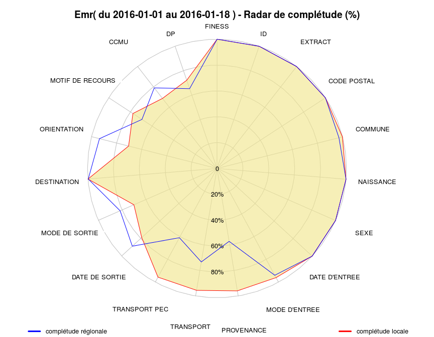
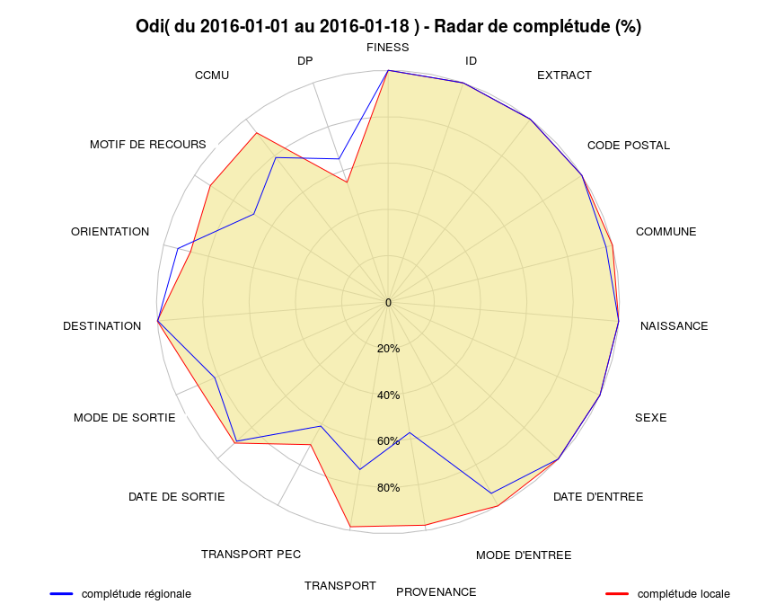
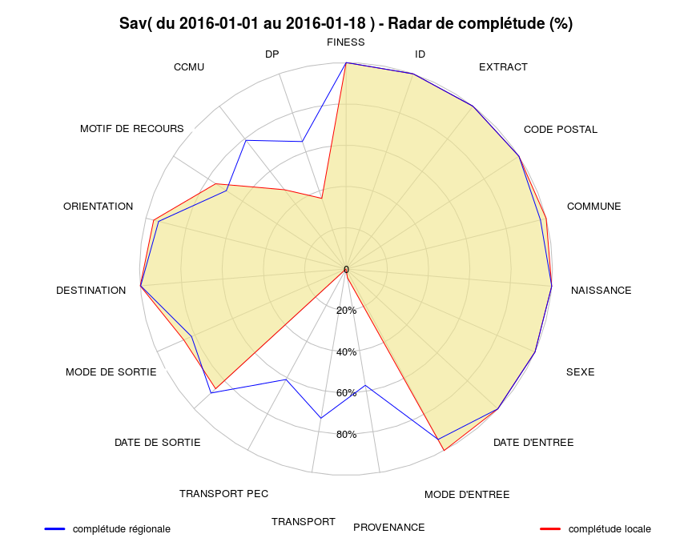
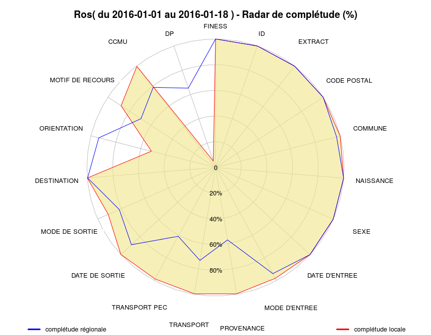
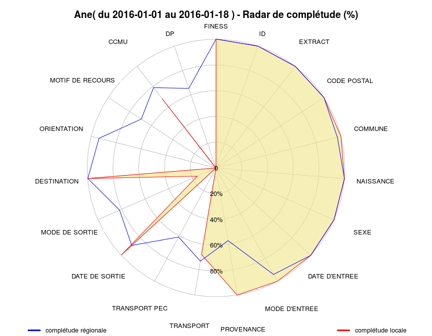

# Completude
**JcB**  
RESURAL  
`r format(Sys.Date(), '%B %d, %Y')`  
Complétude des données
======================

Score de completude = somme des complétudes de chaque item.

Ce chapitre utilise le fichier source("../../Resural/FEDORU/Trame_commune/rapport_2014.R") qui possède deux fonctions pour calculer la complétude et dessiner le diagramme en radar correspondant.

MAJ
---

- 12/4/2014: enregistrement des graphiques, impression du tableau de completude
- 15/4/2015: Ajout légende, amélioration du titre, élargissement du graphique
- 2016-01-27: dernière mise à jour.

TODO
----

Données
-------


Système utilisé: XPS


Motif de passage
----------------
Les motifs de passage ou de recours doivent être codés en CIM10. Certains établissements ne le font pas (Colmar), ce qui entraîne une fausse complétude car le champ n'est pas vide mais inexploitable. La fonction détecte les codes non CIM10 sur la base suivante: a minima un code CIM10 commence par une lettre majuscule suivie de deux chiffres ("^[A-Z][0-9][0-9]").


Hop   Motifs   CIM10   Completude 
----  -------  ------  -----------
Sel   1537     1499    97.53      
Hag   2323     465     20.02      
HTP   3888     1242    31.94      
Emr   2378     1846    77.63      
NHC   1708     1379    80.74      
Geb   703      702     99.86      
3Fr   815      21      2.58       
Odi   1583     1452    91.72      
Wis   612      610     99.67      
Dts   586      563     96.08      
Sav   1462     1103    75.44      
Ros   302      265     87.75      
Dia   1424     1378    96.77      
Hsr   860      689     80.12      
Alk   819      173     21.12      
Col   3350     0       0          
Ane   776      3       0.39       

Complétude régionale
--------------------
C'est la complétude calculée pour tous les RPU quelque soit l'établissement producteur.


-----------------  -------
FINESS              100.00
ID                  100.00
EXTRACT             100.00
CODE POSTAL         100.00
COMMUNE              97.13
NAISSANCE           100.00
SEXE                100.00
DATE D'ENTREE       100.00
MODE D'ENTREE        93.89
PROVENANCE           57.15
TRANSPORT            73.30
TRANSPORT PEC        60.92
DATE DE SORTIE       88.82
MODE DE SORTIE       81.66
DESTINATION          99.78
ORIENTATION          93.64
MOTIF DE RECOURS     69.28
CCMU                 78.97
DP                   65.28
-----------------  -------

Score de complétude régional: 87.36 sur 100.

Completude par établissement
----------------------------

#### Score de completude 
score = somme des completude de chaque item divisé par le nombre d'items. Varie de 0 à 100. 

Todo: 

- calculer un sous score par chapitre selon découpage Fedoru
- comparer le score en foction du logiciel utilisé et sa version.


```
[1] "---------------------------------------------------------------------"
[1] "---------------------------------------------------------------------"
Score local: 99.2  sur 100[1] ""
[1] "====================================================================="
[1] "Sel"
[1] "====================================================================="
                 2016 - 1
FINESS             100.00
ID                 100.00
EXTRACT            100.00
CODE POSTAL        100.00
COMMUNE            100.00
NAISSANCE          100.00
SEXE               100.00
DATE D'ENTREE      100.00
MODE D'ENTREE      100.00
PROVENANCE         100.00
TRANSPORT           99.93
TRANSPORT PEC      100.00
DATE DE SORTIE      95.51
MODE DE SORTIE     100.00
DESTINATION        100.00
ORIENTATION        100.00
MOTIF DE RECOURS    97.59
CCMU                96.10
DP                  95.64
```


```
[1] "---------------------------------------------------------------------"
[1] "---------------------------------------------------------------------"
Score local: 83.46  sur 100[1] ""
[1] "====================================================================="
[1] "Hag"
[1] "====================================================================="
                 2016 - 1
FINESS             100.00
ID                 100.00
EXTRACT            100.00
CODE POSTAL        100.00
COMMUNE             69.01
NAISSANCE          100.00
SEXE               100.00
DATE D'ENTREE      100.00
MODE D'ENTREE       88.03
PROVENANCE          29.27
TRANSPORT           69.87
TRANSPORT PEC       89.07
DATE DE SORTIE      87.00
MODE DE SORTIE      89.02
DESTINATION        100.00
ORIENTATION         89.64
MOTIF DE RECOURS    25.66
CCMU                76.75
DP                  78.08
```


```
[1] "---------------------------------------------------------------------"
[1] "---------------------------------------------------------------------"
Score local: 77.19  sur 100[1] ""
[1] "====================================================================="
[1] "HTP"
[1] "====================================================================="
                 2016 - 1
FINESS             100.00
ID                 100.00
EXTRACT            100.00
CODE POSTAL        100.00
COMMUNE            100.00
NAISSANCE          100.00
SEXE               100.00
DATE D'ENTREE      100.00
MODE D'ENTREE      100.00
PROVENANCE           0.26
TRANSPORT           23.07
TRANSPORT PEC        0.39
DATE DE SORTIE      97.15
MODE DE SORTIE      81.25
DESTINATION        100.00
ORIENTATION         98.46
MOTIF DE RECOURS    31.94
CCMU                74.54
DP                  59.62
```



```
[1] "---------------------------------------------------------------------"
[1] "---------------------------------------------------------------------"
Score local: 90.58  sur 100[1] ""
[1] "====================================================================="
[1] "Emr"
[1] "====================================================================="
                 2016 - 1
FINESS             100.00
ID                 100.00
EXTRACT            100.00
CODE POSTAL        100.00
COMMUNE             99.92
NAISSANCE          100.00
SEXE               100.00
DATE D'ENTREE      100.00
MODE D'ENTREE       95.96
PROVENANCE          95.96
TRANSPORT           95.58
TRANSPORT PEC       95.63
DATE DE SORTIE      78.97
MODE DE SORTIE      70.06
DESTINATION        100.00
ORIENTATION         70.44
MOTIF DE RECOURS    78.13
CCMU                68.63
DP                  72.16
```


```
[1] "---------------------------------------------------------------------"
[1] "---------------------------------------------------------------------"
Score local: 77.88  sur 100[1] ""
[1] "====================================================================="
[1] "NHC"
[1] "====================================================================="
                 2016 - 1
FINESS             100.00
ID                 100.00
EXTRACT            100.00
CODE POSTAL        100.00
COMMUNE            100.00
NAISSANCE          100.00
SEXE               100.00
DATE D'ENTREE      100.00
MODE D'ENTREE      100.00
PROVENANCE           0.23
TRANSPORT           41.22
TRANSPORT PEC        3.45
DATE DE SORTIE      88.35
MODE DE SORTIE      67.56
DESTINATION        100.00
ORIENTATION         95.52
MOTIF DE RECOURS    80.74
CCMU                56.03
DP                  46.66
```


```
[1] "---------------------------------------------------------------------"
[1] "---------------------------------------------------------------------"
Score local: 98.69  sur 100[1] ""
[1] "====================================================================="
[1] "Geb"
[1] "====================================================================="
                 2016 - 1
FINESS             100.00
ID                 100.00
EXTRACT            100.00
CODE POSTAL        100.00
COMMUNE            100.00
NAISSANCE          100.00
SEXE               100.00
DATE D'ENTREE      100.00
MODE D'ENTREE       97.72
PROVENANCE          97.58
TRANSPORT           98.86
TRANSPORT PEC       98.01
DATE DE SORTIE      98.29
MODE DE SORTIE      96.73
DESTINATION        100.00
ORIENTATION         91.00
MOTIF DE RECOURS    99.86
CCMU                98.72
DP                  98.41
```


```
[1] "---------------------------------------------------------------------"
[1] "---------------------------------------------------------------------"
Score local: 79.4  sur 100[1] ""
[1] "====================================================================="
[1] "3Fr"
[1] "====================================================================="
                 2016 - 1
FINESS             100.00
ID                 100.00
EXTRACT            100.00
CODE POSTAL        100.00
COMMUNE            100.00
NAISSANCE          100.00
SEXE               100.00
DATE D'ENTREE      100.00
MODE D'ENTREE       82.45
PROVENANCE           0.25
TRANSPORT           99.88
TRANSPORT PEC        6.50
DATE DE SORTIE      84.79
MODE DE SORTIE      96.56
DESTINATION        100.00
ORIENTATION         75.00
MOTIF DE RECOURS     2.58
CCMU                80.74
DP                  79.92
```



```
[1] "---------------------------------------------------------------------"
[1] "---------------------------------------------------------------------"
Score local: 93.29  sur 100[1] ""
[1] "====================================================================="
[1] "Odi"
[1] "====================================================================="
                 2016 - 1
FINESS             100.00
ID                 100.00
EXTRACT            100.00
CODE POSTAL        100.00
COMMUNE            100.00
NAISSANCE          100.00
SEXE               100.00
DATE D'ENTREE      100.00
MODE D'ENTREE      100.00
PROVENANCE          97.66
TRANSPORT           98.36
TRANSPORT PEC       70.06
DATE DE SORTIE      89.96
MODE DE SORTIE      89.64
DESTINATION        100.00
ORIENTATION         88.00
MOTIF DE RECOURS    91.72
CCMU                92.48
DP                  54.58
```


```
[1] "---------------------------------------------------------------------"
[1] "---------------------------------------------------------------------"
Score local: 98.63  sur 100[1] ""
[1] "====================================================================="
[1] "Wis"
[1] "====================================================================="
                 2016 - 1
FINESS             100.00
ID                 100.00
EXTRACT            100.00
CODE POSTAL        100.00
COMMUNE            100.00
NAISSANCE          100.00
SEXE               100.00
DATE D'ENTREE      100.00
MODE D'ENTREE       99.84
PROVENANCE          98.37
TRANSPORT           97.06
TRANSPORT PEC       99.84
DATE DE SORTIE      94.93
MODE DE SORTIE      96.90
DESTINATION        100.00
ORIENTATION         97.86
MOTIF DE RECOURS    99.67
CCMU                97.06
DP                  92.43
```


```
[1] "---------------------------------------------------------------------"
[1] "---------------------------------------------------------------------"
Score local: 92.75  sur 100[1] ""
[1] "====================================================================="
[1] "Dts"
[1] "====================================================================="
                 2016 - 1
FINESS             100.00
ID                 100.00
EXTRACT            100.00
CODE POSTAL        100.00
COMMUNE            100.00
NAISSANCE          100.00
SEXE               100.00
DATE D'ENTREE      100.00
MODE D'ENTREE      100.00
PROVENANCE          87.03
TRANSPORT           99.83
TRANSPORT PEC       99.15
DATE DE SORTIE      86.86
MODE DE SORTIE      86.86
DESTINATION        100.00
ORIENTATION        100.00
MOTIF DE RECOURS    96.08
CCMU                69.80
DP                  36.69
```



```
[1] "---------------------------------------------------------------------"
[1] "---------------------------------------------------------------------"
Score local: 75.38  sur 100[1] ""
[1] "====================================================================="
[1] "Sav"
[1] "====================================================================="
                 2016 - 1
FINESS             100.00
ID                 100.00
EXTRACT            100.00
CODE POSTAL        100.00
COMMUNE            100.00
NAISSANCE          100.00
SEXE               100.00
DATE D'ENTREE      100.00
MODE D'ENTREE      100.00
PROVENANCE           4.31
TRANSPORT            0.00
TRANSPORT PEC        0.00
DATE DE SORTIE      85.77
MODE DE SORTIE      85.77
DESTINATION        100.00
ORIENTATION         96.12
MOTIF DE RECOURS    75.44
CCMU                48.63
DP                  36.16
```



```
[1] "---------------------------------------------------------------------"
[1] "---------------------------------------------------------------------"
Score local: 91.12  sur 100[1] ""
[1] "====================================================================="
[1] "Ros"
[1] "====================================================================="
                 2016 - 1
FINESS             100.00
ID                 100.00
EXTRACT            100.00
CODE POSTAL        100.00
COMMUNE            100.00
NAISSANCE          100.00
SEXE               100.00
DATE D'ENTREE      100.00
MODE D'ENTREE       98.01
PROVENANCE          99.67
TRANSPORT           99.67
TRANSPORT PEC       98.68
DATE DE SORTIE     100.00
MODE DE SORTIE      91.06
DESTINATION        100.00
ORIENTATION         51.43
MOTIF DE RECOURS    87.75
CCMU                99.67
DP                   5.30
```


```
[1] "---------------------------------------------------------------------"
[1] "---------------------------------------------------------------------"
Score local: 98.91  sur 100[1] ""
[1] "====================================================================="
[1] "Dia"
[1] "====================================================================="
                 2016 - 1
FINESS             100.00
ID                 100.00
EXTRACT            100.00
CODE POSTAL        100.00
COMMUNE            100.00
NAISSANCE          100.00
SEXE               100.00
DATE D'ENTREE      100.00
MODE D'ENTREE       99.86
PROVENANCE          99.86
TRANSPORT           99.93
TRANSPORT PEC       99.65
DATE DE SORTIE     100.00
MODE DE SORTIE      99.02
DESTINATION        100.00
ORIENTATION         99.73
MOTIF DE RECOURS    96.77
CCMU                98.88
DP                  85.53
```


```
[1] "---------------------------------------------------------------------"
[1] "---------------------------------------------------------------------"
Score local: 84.52  sur 100[1] ""
[1] "====================================================================="
[1] "Hsr"
[1] "====================================================================="
                 2016 - 1
FINESS             100.00
ID                 100.00
EXTRACT            100.00
CODE POSTAL        100.00
COMMUNE            100.00
NAISSANCE          100.00
SEXE               100.00
DATE D'ENTREE      100.00
MODE D'ENTREE        0.47
PROVENANCE           0.47
TRANSPORT           88.72
TRANSPORT PEC       88.72
DATE DE SORTIE      87.56
MODE DE SORTIE      84.77
DESTINATION        100.00
ORIENTATION        100.00
MOTIF DE RECOURS    80.12
CCMU                87.09
DP                  87.91
```


```
[1] "---------------------------------------------------------------------"
[1] "---------------------------------------------------------------------"
Score local: 77.14  sur 100[1] ""
[1] "====================================================================="
[1] "Alk"
[1] "====================================================================="
                 2016 - 1
FINESS             100.00
ID                 100.00
EXTRACT            100.00
CODE POSTAL        100.00
COMMUNE            100.00
NAISSANCE          100.00
SEXE               100.00
DATE D'ENTREE      100.00
MODE D'ENTREE       83.15
PROVENANCE          71.31
TRANSPORT           98.66
TRANSPORT PEC       62.64
DATE DE SORTIE      26.37
MODE DE SORTIE      25.52
DESTINATION        100.00
ORIENTATION        100.00
MOTIF DE RECOURS    21.12
CCMU                62.39
DP                  14.44
```


```
[1] "---------------------------------------------------------------------"
[1] "---------------------------------------------------------------------"
Score local: 91.85  sur 100[1] ""
[1] "====================================================================="
[1] "Col"
[1] "====================================================================="
                 2016 - 1
FINESS             100.00
ID                 100.00
EXTRACT            100.00
CODE POSTAL        100.00
COMMUNE            100.00
NAISSANCE          100.00
SEXE               100.00
DATE D'ENTREE      100.00
MODE D'ENTREE      100.00
PROVENANCE         100.00
TRANSPORT           99.01
TRANSPORT PEC       99.01
DATE DE SORTIE      90.90
MODE DE SORTIE      87.94
DESTINATION         98.76
ORIENTATION         97.10
MOTIF DE RECOURS   100.00
CCMU                91.61
DP                  80.76
```



```
[1] "---------------------------------------------------------------------"
[1] "---------------------------------------------------------------------"
Score local: 71.15  sur 100[1] ""
[1] "====================================================================="
[1] "Ane"
[1] "====================================================================="
                 2016 - 1
FINESS             100.00
ID                 100.00
EXTRACT            100.00
CODE POSTAL        100.00
COMMUNE            100.00
NAISSANCE          100.00
SEXE               100.00
DATE D'ENTREE      100.00
MODE D'ENTREE      100.00
PROVENANCE         100.00
TRANSPORT           68.04
TRANSPORT PEC        0.00
DATE DE SORTIE      99.61
MODE DE SORTIE      15.85
DESTINATION        100.00
ORIENTATION          0.00
MOTIF DE RECOURS    67.91
CCMU                67.91
DP                   0.00
```
Suivi des Complétude par établissement et par mois
=====================================================

Crée un tableau de complétude par mois:


```
[1] ""
[1] "====================================================================="
[1] "Sel - 2016"
[1] "====================================================================="
          FINESS               ID          EXTRACT      CODE.POSTAL 
          100.00           100.00           100.00           100.00 
         COMMUNE        NAISSANCE             SEXE    DATE.D.ENTREE 
          100.00           100.00           100.00           100.00 
   MODE.D.ENTREE       PROVENANCE        TRANSPORT    TRANSPORT.PEC 
          100.00           100.00            99.93           100.00 
  DATE.DE.SORTIE   MODE.DE.SORTIE      DESTINATION      ORIENTATION 
           95.51           100.00           100.00           100.00 
MOTIF.DE.RECOURS             CCMU               DP 
           97.59            96.10            95.64 
[1] "====================================================================="
[1] ""
[1] "====================================================================="
[1] "Hag - 2016"
[1] "====================================================================="
          FINESS               ID          EXTRACT      CODE.POSTAL 
          100.00           100.00           100.00           100.00 
         COMMUNE        NAISSANCE             SEXE    DATE.D.ENTREE 
           69.01           100.00           100.00           100.00 
   MODE.D.ENTREE       PROVENANCE        TRANSPORT    TRANSPORT.PEC 
           88.03            29.27            69.87            89.07 
  DATE.DE.SORTIE   MODE.DE.SORTIE      DESTINATION      ORIENTATION 
           87.00            89.02           100.00            89.64 
MOTIF.DE.RECOURS             CCMU               DP 
           25.66            76.75            78.08 
[1] "====================================================================="
[1] ""
[1] "====================================================================="
[1] "HTP - 2016"
[1] "====================================================================="
          FINESS               ID          EXTRACT      CODE.POSTAL 
          100.00           100.00           100.00           100.00 
         COMMUNE        NAISSANCE             SEXE    DATE.D.ENTREE 
          100.00           100.00           100.00           100.00 
   MODE.D.ENTREE       PROVENANCE        TRANSPORT    TRANSPORT.PEC 
          100.00             0.26            23.07             0.39 
  DATE.DE.SORTIE   MODE.DE.SORTIE      DESTINATION      ORIENTATION 
           97.15            81.25           100.00            98.46 
MOTIF.DE.RECOURS             CCMU               DP 
           31.94            74.54            59.62 
[1] "====================================================================="
[1] ""
[1] "====================================================================="
[1] "Emr - 2016"
[1] "====================================================================="
          FINESS               ID          EXTRACT      CODE.POSTAL 
          100.00           100.00           100.00           100.00 
         COMMUNE        NAISSANCE             SEXE    DATE.D.ENTREE 
           99.92           100.00           100.00           100.00 
   MODE.D.ENTREE       PROVENANCE        TRANSPORT    TRANSPORT.PEC 
           95.96            95.96            95.58            95.63 
  DATE.DE.SORTIE   MODE.DE.SORTIE      DESTINATION      ORIENTATION 
           78.97            70.06           100.00            70.44 
MOTIF.DE.RECOURS             CCMU               DP 
           78.13            68.63            72.16 
[1] "====================================================================="
[1] ""
[1] "====================================================================="
[1] "NHC - 2016"
[1] "====================================================================="
          FINESS               ID          EXTRACT      CODE.POSTAL 
          100.00           100.00           100.00           100.00 
         COMMUNE        NAISSANCE             SEXE    DATE.D.ENTREE 
          100.00           100.00           100.00           100.00 
   MODE.D.ENTREE       PROVENANCE        TRANSPORT    TRANSPORT.PEC 
          100.00             0.23            41.22             3.45 
  DATE.DE.SORTIE   MODE.DE.SORTIE      DESTINATION      ORIENTATION 
           88.35            67.56           100.00            95.52 
MOTIF.DE.RECOURS             CCMU               DP 
           80.74            56.03            46.66 
[1] "====================================================================="
[1] ""
[1] "====================================================================="
[1] "Geb - 2016"
[1] "====================================================================="
          FINESS               ID          EXTRACT      CODE.POSTAL 
          100.00           100.00           100.00           100.00 
         COMMUNE        NAISSANCE             SEXE    DATE.D.ENTREE 
          100.00           100.00           100.00           100.00 
   MODE.D.ENTREE       PROVENANCE        TRANSPORT    TRANSPORT.PEC 
           97.72            97.58            98.86            98.01 
  DATE.DE.SORTIE   MODE.DE.SORTIE      DESTINATION      ORIENTATION 
           98.29            96.73           100.00            91.00 
MOTIF.DE.RECOURS             CCMU               DP 
           99.86            98.72            98.41 
[1] "====================================================================="
[1] ""
[1] "====================================================================="
[1] "3Fr - 2016"
[1] "====================================================================="
          FINESS               ID          EXTRACT      CODE.POSTAL 
          100.00           100.00           100.00           100.00 
         COMMUNE        NAISSANCE             SEXE    DATE.D.ENTREE 
          100.00           100.00           100.00           100.00 
   MODE.D.ENTREE       PROVENANCE        TRANSPORT    TRANSPORT.PEC 
           82.45             0.25            99.88             6.50 
  DATE.DE.SORTIE   MODE.DE.SORTIE      DESTINATION      ORIENTATION 
           84.79            96.56           100.00            75.00 
MOTIF.DE.RECOURS             CCMU               DP 
            2.58            80.74            79.92 
[1] "====================================================================="
[1] ""
[1] "====================================================================="
[1] "Odi - 2016"
[1] "====================================================================="
          FINESS               ID          EXTRACT      CODE.POSTAL 
          100.00           100.00           100.00           100.00 
         COMMUNE        NAISSANCE             SEXE    DATE.D.ENTREE 
          100.00           100.00           100.00           100.00 
   MODE.D.ENTREE       PROVENANCE        TRANSPORT    TRANSPORT.PEC 
          100.00            97.66            98.36            70.06 
  DATE.DE.SORTIE   MODE.DE.SORTIE      DESTINATION      ORIENTATION 
           89.96            89.64           100.00            88.00 
MOTIF.DE.RECOURS             CCMU               DP 
           91.72            92.48            54.58 
[1] "====================================================================="
[1] ""
[1] "====================================================================="
[1] "Wis - 2016"
[1] "====================================================================="
          FINESS               ID          EXTRACT      CODE.POSTAL 
          100.00           100.00           100.00           100.00 
         COMMUNE        NAISSANCE             SEXE    DATE.D.ENTREE 
          100.00           100.00           100.00           100.00 
   MODE.D.ENTREE       PROVENANCE        TRANSPORT    TRANSPORT.PEC 
           99.84            98.37            97.06            99.84 
  DATE.DE.SORTIE   MODE.DE.SORTIE      DESTINATION      ORIENTATION 
           94.93            96.90           100.00            97.86 
MOTIF.DE.RECOURS             CCMU               DP 
           99.67            97.06            92.43 
[1] "====================================================================="
[1] ""
[1] "====================================================================="
[1] "Dts - 2016"
[1] "====================================================================="
          FINESS               ID          EXTRACT      CODE.POSTAL 
          100.00           100.00           100.00           100.00 
         COMMUNE        NAISSANCE             SEXE    DATE.D.ENTREE 
          100.00           100.00           100.00           100.00 
   MODE.D.ENTREE       PROVENANCE        TRANSPORT    TRANSPORT.PEC 
          100.00            87.03            99.83            99.15 
  DATE.DE.SORTIE   MODE.DE.SORTIE      DESTINATION      ORIENTATION 
           86.86            86.86           100.00           100.00 
MOTIF.DE.RECOURS             CCMU               DP 
           96.08            69.80            36.69 
[1] "====================================================================="
[1] ""
[1] "====================================================================="
[1] "Sav - 2016"
[1] "====================================================================="
          FINESS               ID          EXTRACT      CODE.POSTAL 
          100.00           100.00           100.00           100.00 
         COMMUNE        NAISSANCE             SEXE    DATE.D.ENTREE 
          100.00           100.00           100.00           100.00 
   MODE.D.ENTREE       PROVENANCE        TRANSPORT    TRANSPORT.PEC 
          100.00             4.31             0.00             0.00 
  DATE.DE.SORTIE   MODE.DE.SORTIE      DESTINATION      ORIENTATION 
           85.77            85.77           100.00            96.12 
MOTIF.DE.RECOURS             CCMU               DP 
           75.44            48.63            36.16 
[1] "====================================================================="
[1] ""
[1] "====================================================================="
[1] "Ros - 2016"
[1] "====================================================================="
          FINESS               ID          EXTRACT      CODE.POSTAL 
          100.00           100.00           100.00           100.00 
         COMMUNE        NAISSANCE             SEXE    DATE.D.ENTREE 
          100.00           100.00           100.00           100.00 
   MODE.D.ENTREE       PROVENANCE        TRANSPORT    TRANSPORT.PEC 
           98.01            99.67            99.67            98.68 
  DATE.DE.SORTIE   MODE.DE.SORTIE      DESTINATION      ORIENTATION 
          100.00            91.06           100.00            51.43 
MOTIF.DE.RECOURS             CCMU               DP 
           87.75            99.67             5.30 
[1] "====================================================================="
[1] ""
[1] "====================================================================="
[1] "Dia - 2016"
[1] "====================================================================="
          FINESS               ID          EXTRACT      CODE.POSTAL 
          100.00           100.00           100.00           100.00 
         COMMUNE        NAISSANCE             SEXE    DATE.D.ENTREE 
          100.00           100.00           100.00           100.00 
   MODE.D.ENTREE       PROVENANCE        TRANSPORT    TRANSPORT.PEC 
           99.86            99.86            99.93            99.65 
  DATE.DE.SORTIE   MODE.DE.SORTIE      DESTINATION      ORIENTATION 
          100.00            99.02           100.00            99.73 
MOTIF.DE.RECOURS             CCMU               DP 
           96.77            98.88            85.53 
[1] "====================================================================="
[1] ""
[1] "====================================================================="
[1] "Hsr - 2016"
[1] "====================================================================="
          FINESS               ID          EXTRACT      CODE.POSTAL 
          100.00           100.00           100.00           100.00 
         COMMUNE        NAISSANCE             SEXE    DATE.D.ENTREE 
          100.00           100.00           100.00           100.00 
   MODE.D.ENTREE       PROVENANCE        TRANSPORT    TRANSPORT.PEC 
            0.47             0.47            88.72            88.72 
  DATE.DE.SORTIE   MODE.DE.SORTIE      DESTINATION      ORIENTATION 
           87.56            84.77           100.00           100.00 
MOTIF.DE.RECOURS             CCMU               DP 
           80.12            87.09            87.91 
[1] "====================================================================="
[1] ""
[1] "====================================================================="
[1] "Alk - 2016"
[1] "====================================================================="
          FINESS               ID          EXTRACT      CODE.POSTAL 
          100.00           100.00           100.00           100.00 
         COMMUNE        NAISSANCE             SEXE    DATE.D.ENTREE 
          100.00           100.00           100.00           100.00 
   MODE.D.ENTREE       PROVENANCE        TRANSPORT    TRANSPORT.PEC 
           83.15            71.31            98.66            62.64 
  DATE.DE.SORTIE   MODE.DE.SORTIE      DESTINATION      ORIENTATION 
           26.37            25.52           100.00           100.00 
MOTIF.DE.RECOURS             CCMU               DP 
           21.12            62.39            14.44 
[1] "====================================================================="
[1] ""
[1] "====================================================================="
[1] "Col - 2016"
[1] "====================================================================="
          FINESS               ID          EXTRACT      CODE.POSTAL 
          100.00           100.00           100.00           100.00 
         COMMUNE        NAISSANCE             SEXE    DATE.D.ENTREE 
          100.00           100.00           100.00           100.00 
   MODE.D.ENTREE       PROVENANCE        TRANSPORT    TRANSPORT.PEC 
          100.00           100.00            99.01            99.01 
  DATE.DE.SORTIE   MODE.DE.SORTIE      DESTINATION      ORIENTATION 
           90.90            87.94            98.76            97.10 
MOTIF.DE.RECOURS             CCMU               DP 
          100.00            91.61            80.76 
[1] "====================================================================="
[1] ""
[1] "====================================================================="
[1] "Ane - 2016"
[1] "====================================================================="
          FINESS               ID          EXTRACT      CODE.POSTAL 
          100.00           100.00           100.00           100.00 
         COMMUNE        NAISSANCE             SEXE    DATE.D.ENTREE 
          100.00           100.00           100.00           100.00 
   MODE.D.ENTREE       PROVENANCE        TRANSPORT    TRANSPORT.PEC 
          100.00           100.00            68.04             0.00 
  DATE.DE.SORTIE   MODE.DE.SORTIE      DESTINATION      ORIENTATION 
           99.61            15.85           100.00             0.00 
MOTIF.DE.RECOURS             CCMU               DP 
           67.91            67.91             0.00 
[1] "====================================================================="
```

