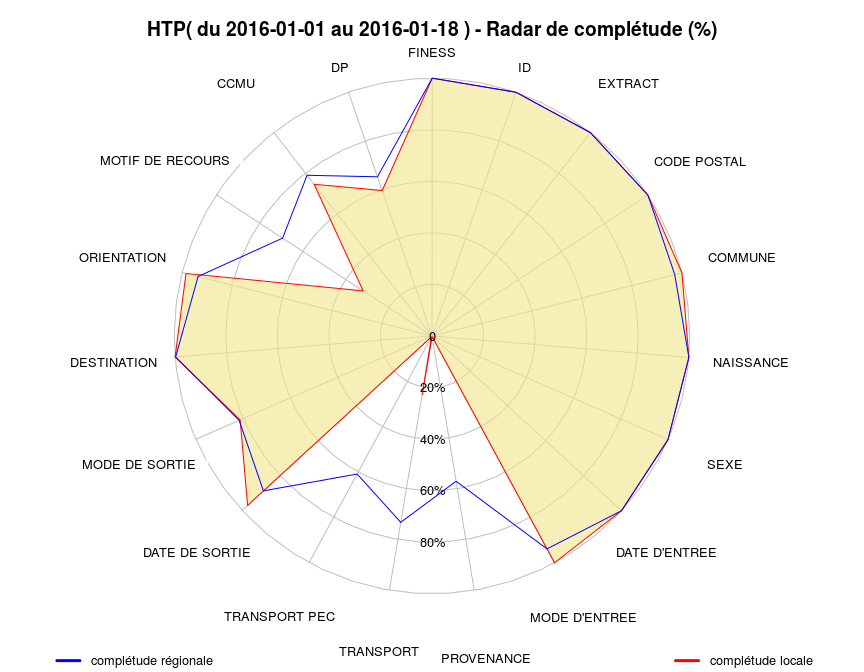
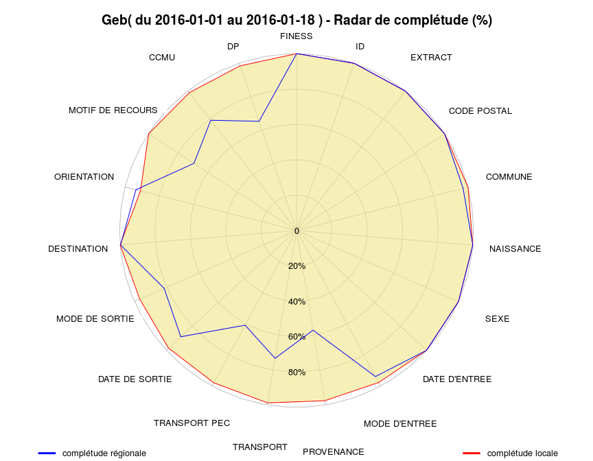
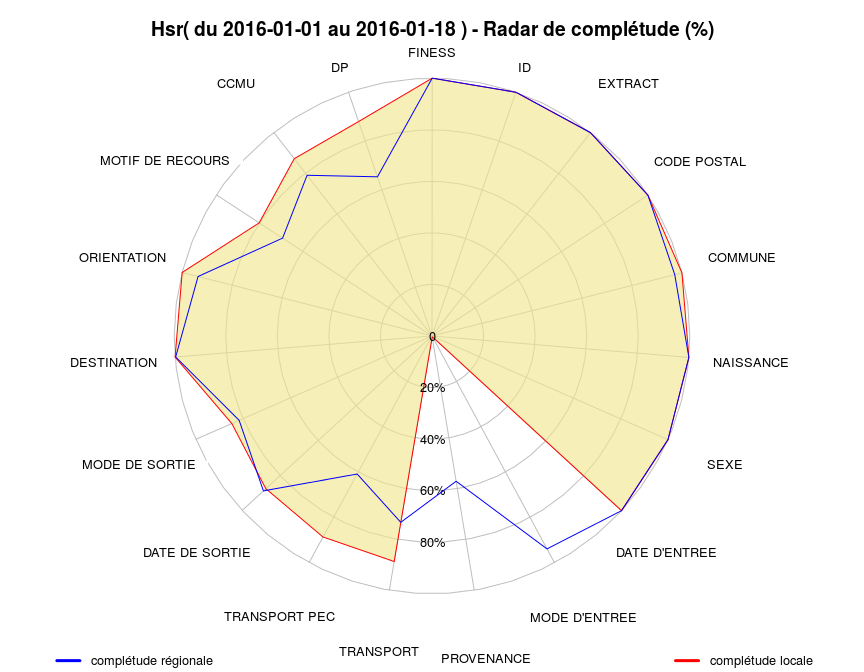
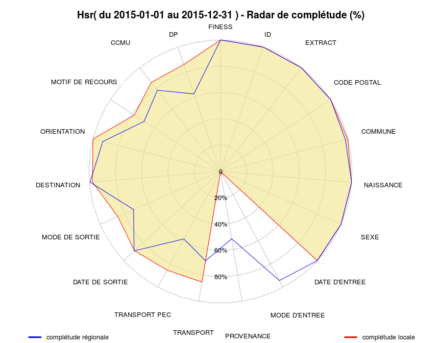
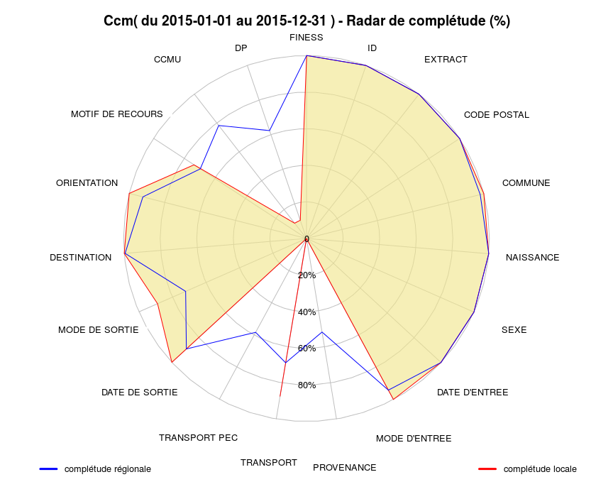

# Completude
jcb  
30 mars 2015  
Complétude des données
======================

Score de completude = somme des complétudes de chaque item.

Ce chapitre utilise le fichier source("../../Resural/FEDORU/Trame_commune/rapport_2014.R") qui possède deux fonctions pour calculer la complétude et dessiner le diagramme en radar correspondant.

MAJ
---

- 12/4/2014: enrgistrement des graphiques, impression du tableau de completude
- 15/4/2015: Ajout légende, amélioration du titre, élargissement du graphique
- 2015-12-17: dernière mise à jour.

TODO
----

Données
-------


Système utilisé: XPS


Motif de passage
----------------
Les motifs de passage ou de recours doivent être codés en CIM10. Certains établissements ne le font pas (Colmar), ce qui entraîne une fausse complétude car le champ n'est pas vide mais inexploitable. La fonction détecte les codes non CIM10 sur la base suivante: a minima un code CIM10 commence par une lettre majuscule suivie de deux chiffres ("^[A-Z][0-9][0-9]").


```
##    Hop Motifs CIM10 Completude
## 1  Sav  27903 17832      63.91
## 2  Sel  27963 27532      98.46
## 3  Mul  38094 30551       80.2
## 4  Dts  11836 11261      95.14
## 5  Dia  27415 26891      98.09
## 6  Hag  43484  8689      19.98
## 7  3Fr  16345   263       1.61
## 8  Alk  15927  3261      20.47
## 9  Wis  12469 12404      99.48
## 10 Ros   7723  6739      87.26
## 11 Geb  15085 15068      99.89
## 12 Col  63907     0          0
## 13 Odi  24103 21730      90.15
## 14 Ane  15989    29       0.18
## 15 HTP  74360 30564       41.1
## 16 NHC  30544 24959      81.71
## 17 Emr  16530 13569      82.09
## 18 Hsr   4039  3208      79.43
## 19 Ccm   1841  1349      73.28
```

Complétude régionale
--------------------
C'est la complétude calculée pour tous les RPU quelque soit l'établissement producteur.

 

```
          FINESS               ID          EXTRACT      CODE POSTAL 
          100.00           100.00           100.00           100.00 
         COMMUNE        NAISSANCE             SEXE    DATE D'ENTREE 
           98.05           100.00           100.00           100.00 
   MODE D'ENTREE       PROVENANCE        TRANSPORT    TRANSPORT PEC 
           94.25            51.68            68.73            58.27 
  DATE DE SORTIE   MODE DE SORTIE      DESTINATION      ORIENTATION 
           89.22            71.53            99.53            92.23 
MOTIF DE RECOURS             CCMU               DP 
           69.33            78.24            62.26 
```

Score de complétude régional: 85.96 sur 100.

Completude par établissement
----------------------------

#### Score de completude 
score = somme des completude de chaque item divisé par le nombre d'items. Varie de 0 à 100. 

Todo: 

- calculer un sous score par chapitre selon découpage Fedoru
- comparer le score en foction du logiciel utilisé et sa version.


```

Please cite as: 

 Hlavac, Marek (2015). stargazer: Well-Formatted Regression and Summary Statistics Tables.
 R package version 5.2. http://CRAN.R-project.org/package=stargazer 
```

           FINESS               ID          EXTRACT      CODE POSTAL 
          100.00           100.00           100.00           100.00 
         COMMUNE        NAISSANCE             SEXE    DATE D'ENTREE 
          100.00           100.00           100.00           100.00 
   MODE D'ENTREE       PROVENANCE        TRANSPORT    TRANSPORT PEC 
          100.00             4.09             0.00             0.22 
  DATE DE SORTIE   MODE DE SORTIE      DESTINATION      ORIENTATION 
           87.72            87.57           100.00            93.83 
MOTIF DE RECOURS             CCMU               DP 
           63.91            54.86            24.27 
Score local: 74.55  sur 100
% Table created by stargazer v.5.2 by Marek Hlavac, Harvard University. E-mail: hlavac at fas.harvard.edu
% Date and time: jeu., déc. 17, 2015 - 19:13:06
\begin{table}[!htbp] \centering 
  \caption{} 
  \label{} 
\begin{tabular}{@{\extracolsep{5pt}} ccccccccccccc} 
\\[-1.8ex]\hline 
\hline \\[-1.8ex] 
 & 2015 - 1 & 2015 - 2 & 2015 - 3 & 2015 - 4 & 2015 - 5 & 2015 - 6 & 2015 - 7 & 2015 - 8 & 2015 - 9 & 2015 - 10 & 2015 - 11 & 2015 - 12 \\ 
\hline \\[-1.8ex] 
1.FINESS & $100$ & $100$ & $100$ & $100$ & $100$ & $100$ & $100$ & $100$ & $100$ & $100$ & $100$ & $100$ \\ 
1.ID & $100$ & $100$ & $100$ & $100$ & $100$ & $100$ & $100$ & $100$ & $100$ & $100$ & $100$ & $100$ \\ 
1.EXTRACT & $100$ & $100$ & $100$ & $100$ & $100$ & $100$ & $100$ & $100$ & $100$ & $100$ & $100$ & $100$ \\ 
1.CODE POSTAL & $100$ & $100$ & $100$ & $100$ & $100$ & $100$ & $100$ & $100$ & $100$ & $100$ & $100$ & $100$ \\ 
1.COMMUNE & $100$ & $100$ & $100$ & $100$ & $100$ & $100$ & $100$ & $100$ & $100$ & $100$ & $100$ & $100$ \\ 
1.NAISSANCE & $100$ & $100$ & $100$ & $100$ & $100$ & $100$ & $100$ & $100$ & $100$ & $100$ & $100$ & $100$ \\ 
1.SEXE & $100$ & $100$ & $100$ & $100$ & $100$ & $100$ & $100$ & $100$ & $100$ & $100$ & $100$ & $100$ \\ 
1.DATE D'ENTREE & $100$ & $100$ & $100$ & $100$ & $100$ & $100$ & $100$ & $100$ & $100$ & $100$ & $100$ & $100$ \\ 
1.MODE D'ENTREE & $100$ & $100$ & $100$ & $100$ & $100$ & $100$ & $100$ & $100$ & $100$ & $100$ & $100$ & $100$ \\ 
1.PROVENANCE & $2.930$ & $4.160$ & $3.390$ & $3.990$ & $3.500$ & $3.910$ & $4.260$ & $4.510$ & $4.890$ & $4.610$ & $5$ & $3.900$ \\ 
1.TRANSPORT & $0$ & $0$ & $0$ & $0$ & $0$ & $0$ & $0$ & $0$ & $0$ & $0$ & $0$ & $0$ \\ 
1.TRANSPORT PEC & $0$ & $0$ & $0$ & $0$ & $0$ & $1.600$ & $0$ & $0$ & $0.170$ & $0.370$ & $0.250$ & $0$ \\ 
1.DATE DE SORTIE & $90.510$ & $87.470$ & $89.700$ & $88.080$ & $86.590$ & $87.840$ & $87.880$ & $87$ & $87.600$ & $87.340$ & $85.260$ & $85.890$ \\ 
1.MODE DE SORTIE & $89.360$ & $87.140$ & $89.340$ & $88.160$ & $86.590$ & $87.880$ & $87.800$ & $87$ & $87.600$ & $87.340$ & $85.340$ & $86.020$ \\ 
1.DESTINATION & $100$ & $100$ & $100$ & $100$ & $100$ & $100$ & $100$ & $100$ & $100$ & $100$ & $100$ & $100$ \\ 
1.ORIENTATION & $93.900$ & $93.980$ & $94.030$ & $92.430$ & $91.990$ & $93.100$ & $95.190$ & $93.830$ & $92.520$ & $96.360$ & $94.800$ & $93.880$ \\ 
1.MOTIF DE RECOURS & $48.080$ & $48.870$ & $48.720$ & $54.400$ & $55.240$ & $59.500$ & $78.640$ & $72.230$ & $79.050$ & $78.080$ & $77.950$ & $76.340$ \\ 
1.CCMU & $52.080$ & $51.920$ & $54.230$ & $56.970$ & $55.980$ & $56.880$ & $55.440$ & $58.580$ & $57.140$ & $53.540$ & $52.150$ & $50.540$ \\ 
1.DP & $10.260$ & $8.250$ & $8.710$ & $10.200$ & $12.610$ & $30.190$ & $37.300$ & $35.610$ & $40.940$ & $33.280$ & $36.810$ & $38.380$ \\ 
\hline \\[-1.8ex] 
\end{tabular} 
\end{table} 
[1] ""
[1] "====================================================================="
[1] "Sav"
[1] "====================================================================="
                   2015 - 1 2015 - 2 2015 - 3 2015 - 4 2015 - 5 2015 - 6
1.FINESS             100.00   100.00   100.00   100.00   100.00   100.00
1.ID                 100.00   100.00   100.00   100.00   100.00   100.00
1.EXTRACT            100.00   100.00   100.00   100.00   100.00   100.00
1.CODE POSTAL        100.00   100.00   100.00   100.00   100.00   100.00
1.COMMUNE            100.00   100.00   100.00   100.00   100.00   100.00
1.NAISSANCE          100.00   100.00   100.00   100.00   100.00   100.00
1.SEXE               100.00   100.00   100.00   100.00   100.00   100.00
1.DATE D'ENTREE      100.00   100.00   100.00   100.00   100.00   100.00
1.MODE D'ENTREE      100.00   100.00   100.00   100.00   100.00   100.00
1.PROVENANCE           2.93     4.16     3.39     3.99     3.50     3.91
1.TRANSPORT            0.00     0.00     0.00     0.00     0.00     0.00
1.TRANSPORT PEC        0.00     0.00     0.00     0.00     0.00     1.60
1.DATE DE SORTIE      90.51    87.47    89.70    88.08    86.59    87.84
1.MODE DE SORTIE      89.36    87.14    89.34    88.16    86.59    87.88
1.DESTINATION        100.00   100.00   100.00   100.00   100.00   100.00
1.ORIENTATION         93.90    93.98    94.03    92.43    91.99    93.10
1.MOTIF DE RECOURS    48.08    48.87    48.72    54.40    55.24    59.50
1.CCMU                52.08    51.92    54.23    56.97    55.98    56.88
1.DP                  10.26     8.25     8.71    10.20    12.61    30.19
                   2015 - 7 2015 - 8 2015 - 9 2015 - 10 2015 - 11
1.FINESS             100.00   100.00   100.00    100.00    100.00
1.ID                 100.00   100.00   100.00    100.00    100.00
1.EXTRACT            100.00   100.00   100.00    100.00    100.00
1.CODE POSTAL        100.00   100.00   100.00    100.00    100.00
1.COMMUNE            100.00   100.00   100.00    100.00    100.00
1.NAISSANCE          100.00   100.00   100.00    100.00    100.00
1.SEXE               100.00   100.00   100.00    100.00    100.00
1.DATE D'ENTREE      100.00   100.00   100.00    100.00    100.00
1.MODE D'ENTREE      100.00   100.00   100.00    100.00    100.00
1.PROVENANCE           4.26     4.51     4.89      4.61      5.00
1.TRANSPORT            0.00     0.00     0.00      0.00      0.00
1.TRANSPORT PEC        0.00     0.00     0.17      0.37      0.25
1.DATE DE SORTIE      87.88    87.00    87.60     87.34     85.26
1.MODE DE SORTIE      87.80    87.00    87.60     87.34     85.34
1.DESTINATION        100.00   100.00   100.00    100.00    100.00
1.ORIENTATION         95.19    93.83    92.52     96.36     94.80
1.MOTIF DE RECOURS    78.64    72.23    79.05     78.08     77.95
1.CCMU                55.44    58.58    57.14     53.54     52.15
1.DP                  37.30    35.61    40.94     33.28     36.81
                   2015 - 12
1.FINESS              100.00
1.ID                  100.00
1.EXTRACT             100.00
1.CODE POSTAL         100.00
1.COMMUNE             100.00
1.NAISSANCE           100.00
1.SEXE                100.00
1.DATE D'ENTREE       100.00
1.MODE D'ENTREE       100.00
1.PROVENANCE            3.90
1.TRANSPORT             0.00
1.TRANSPORT PEC         0.00
1.DATE DE SORTIE       85.89
1.MODE DE SORTIE       86.02
1.DESTINATION         100.00
1.ORIENTATION          93.88
1.MOTIF DE RECOURS     76.34
1.CCMU                 50.54
1.DP                   38.38
           FINESS               ID          EXTRACT      CODE POSTAL 
          100.00           100.00           100.00           100.00 
         COMMUNE        NAISSANCE             SEXE    DATE D'ENTREE 
          100.00           100.00           100.00           100.00 
   MODE D'ENTREE       PROVENANCE        TRANSPORT    TRANSPORT PEC 
          100.00           100.00            99.77           100.00 
  DATE DE SORTIE   MODE DE SORTIE      DESTINATION      ORIENTATION 
           94.64            99.98           100.00           100.00 
MOTIF DE RECOURS             CCMU               DP 
           98.46            95.20            93.96 
Score local: 99.05  sur 100
% Table created by stargazer v.5.2 by Marek Hlavac, Harvard University. E-mail: hlavac at fas.harvard.edu
% Date and time: jeu., déc. 17, 2015 - 19:13:06
\begin{table}[!htbp] \centering 
  \caption{} 
  \label{} 
\begin{tabular}{@{\extracolsep{5pt}} ccccccccccccc} 
\\[-1.8ex]\hline 
\hline \\[-1.8ex] 
 & 2015 - 1 & 2015 - 2 & 2015 - 3 & 2015 - 4 & 2015 - 5 & 2015 - 6 & 2015 - 7 & 2015 - 8 & 2015 - 9 & 2015 - 10 & 2015 - 11 & 2015 - 12 \\ 
\hline \\[-1.8ex] 
1.FINESS & $100$ & $100$ & $100$ & $100$ & $100$ & $100$ & $100$ & $100$ & $100$ & $100$ & $100$ & $100$ \\ 
1.ID & $100$ & $100$ & $100$ & $100$ & $100$ & $100$ & $100$ & $100$ & $100$ & $100$ & $100$ & $100$ \\ 
1.EXTRACT & $100$ & $100$ & $100$ & $100$ & $100$ & $100$ & $100$ & $100$ & $100$ & $100$ & $100$ & $100$ \\ 
1.CODE POSTAL & $100$ & $100$ & $100$ & $100$ & $100$ & $100$ & $100$ & $100$ & $100$ & $100$ & $100$ & $100$ \\ 
1.COMMUNE & $100$ & $100$ & $100$ & $100$ & $100$ & $100$ & $100$ & $100$ & $100$ & $100$ & $100$ & $100$ \\ 
1.NAISSANCE & $100$ & $100$ & $100$ & $100$ & $100$ & $100$ & $100$ & $100$ & $100$ & $100$ & $100$ & $100$ \\ 
1.SEXE & $100$ & $100$ & $100$ & $100$ & $100$ & $100$ & $100$ & $100$ & $100$ & $100$ & $100$ & $100$ \\ 
1.DATE D'ENTREE & $100$ & $100$ & $100$ & $100$ & $100$ & $100$ & $100$ & $100$ & $100$ & $100$ & $100$ & $100$ \\ 
1.MODE D'ENTREE & $100$ & $100$ & $100$ & $100$ & $100$ & $100$ & $100$ & $100$ & $100$ & $100$ & $100$ & $100$ \\ 
1.PROVENANCE & $100$ & $100$ & $100$ & $100$ & $100$ & $100$ & $100$ & $100$ & $100$ & $100$ & $100$ & $100$ \\ 
1.TRANSPORT & $99.620$ & $99.730$ & $99.590$ & $99.830$ & $99.860$ & $99.850$ & $99.880$ & $99.810$ & $99.570$ & $99.890$ & $99.800$ & $99.870$ \\ 
1.TRANSPORT PEC & $100$ & $100$ & $100$ & $100$ & $100$ & $100$ & $100$ & $100$ & $100$ & $100$ & $100$ & $100$ \\ 
1.DATE DE SORTIE & $96.280$ & $96.820$ & $96.380$ & $92.700$ & $91.970$ & $93.920$ & $93.220$ & $93$ & $95.400$ & $96.140$ & $95.230$ & $95.230$ \\ 
1.MODE DE SORTIE & $100$ & $100$ & $100$ & $100$ & $99.930$ & $100$ & $100$ & $100$ & $99.960$ & $99.920$ & $100$ & $100$ \\ 
1.DESTINATION & $100$ & $100$ & $100$ & $100$ & $100$ & $100$ & $100$ & $100$ & $100$ & $100$ & $100$ & $100$ \\ 
1.ORIENTATION & $100$ & $100$ & $100$ & $100$ & $100$ & $100$ & $100$ & $100$ & $100$ & $100$ & $100$ & $100$ \\ 
1.MOTIF DE RECOURS & $98.120$ & $98.430$ & $98.760$ & $97.920$ & $98.630$ & $98.710$ & $98.880$ & $98.290$ & $98.750$ & $98.150$ & $98.320$ & $98.450$ \\ 
1.CCMU & $96.930$ & $97.400$ & $97.160$ & $93.380$ & $92.510$ & $94.620$ & $93.820$ & $93.560$ & $95.950$ & $96.600$ & $95.510$ & $95.360$ \\ 
1.DP & $95.810$ & $96.630$ & $96.060$ & $92.200$ & $90.880$ & $92.820$ & $91.620$ & $92.060$ & $94.780$ & $95.990$ & $94.830$ & $94.850$ \\ 
\hline \\[-1.8ex] 
\end{tabular} 
\end{table} 
[1] ""
[1] "====================================================================="
[1] "Sel"
[1] "====================================================================="
                   2015 - 1 2015 - 2 2015 - 3 2015 - 4 2015 - 5 2015 - 6
1.FINESS             100.00   100.00   100.00   100.00   100.00   100.00
1.ID                 100.00   100.00   100.00   100.00   100.00   100.00
1.EXTRACT            100.00   100.00   100.00   100.00   100.00   100.00
1.CODE POSTAL        100.00   100.00   100.00   100.00   100.00   100.00
1.COMMUNE            100.00   100.00   100.00   100.00   100.00   100.00
1.NAISSANCE          100.00   100.00   100.00   100.00   100.00   100.00
1.SEXE               100.00   100.00   100.00   100.00   100.00   100.00
1.DATE D'ENTREE      100.00   100.00   100.00   100.00   100.00   100.00
1.MODE D'ENTREE      100.00   100.00   100.00   100.00   100.00   100.00
1.PROVENANCE         100.00   100.00   100.00   100.00   100.00   100.00
1.TRANSPORT           99.62    99.73    99.59    99.83    99.86    99.85
1.TRANSPORT PEC      100.00   100.00   100.00   100.00   100.00   100.00
1.DATE DE SORTIE      96.28    96.82    96.38    92.70    91.97    93.92
1.MODE DE SORTIE     100.00   100.00   100.00   100.00    99.93   100.00
1.DESTINATION        100.00   100.00   100.00   100.00   100.00   100.00
1.ORIENTATION        100.00   100.00   100.00   100.00   100.00   100.00
1.MOTIF DE RECOURS    98.12    98.43    98.76    97.92    98.63    98.71
1.CCMU                96.93    97.40    97.16    93.38    92.51    94.62
1.DP                  95.81    96.63    96.06    92.20    90.88    92.82
                   2015 - 7 2015 - 8 2015 - 9 2015 - 10 2015 - 11
1.FINESS             100.00   100.00   100.00    100.00    100.00
1.ID                 100.00   100.00   100.00    100.00    100.00
1.EXTRACT            100.00   100.00   100.00    100.00    100.00
1.CODE POSTAL        100.00   100.00   100.00    100.00    100.00
1.COMMUNE            100.00   100.00   100.00    100.00    100.00
1.NAISSANCE          100.00   100.00   100.00    100.00    100.00
1.SEXE               100.00   100.00   100.00    100.00    100.00
1.DATE D'ENTREE      100.00   100.00   100.00    100.00    100.00
1.MODE D'ENTREE      100.00   100.00   100.00    100.00    100.00
1.PROVENANCE         100.00   100.00   100.00    100.00    100.00
1.TRANSPORT           99.88    99.81    99.57     99.89     99.80
1.TRANSPORT PEC      100.00   100.00   100.00    100.00    100.00
1.DATE DE SORTIE      93.22    93.00    95.40     96.14     95.23
1.MODE DE SORTIE     100.00   100.00    99.96     99.92    100.00
1.DESTINATION        100.00   100.00   100.00    100.00    100.00
1.ORIENTATION        100.00   100.00   100.00    100.00    100.00
1.MOTIF DE RECOURS    98.88    98.29    98.75     98.15     98.32
1.CCMU                93.82    93.56    95.95     96.60     95.51
1.DP                  91.62    92.06    94.78     95.99     94.83
                   2015 - 12
1.FINESS              100.00
1.ID                  100.00
1.EXTRACT             100.00
1.CODE POSTAL         100.00
1.COMMUNE             100.00
1.NAISSANCE           100.00
1.SEXE                100.00
1.DATE D'ENTREE       100.00
1.MODE D'ENTREE       100.00
1.PROVENANCE          100.00
1.TRANSPORT            99.87
1.TRANSPORT PEC       100.00
1.DATE DE SORTIE       95.23
1.MODE DE SORTIE      100.00
1.DESTINATION         100.00
1.ORIENTATION         100.00
1.MOTIF DE RECOURS     98.45
1.CCMU                 95.36
1.DP                   94.85
           FINESS               ID          EXTRACT      CODE POSTAL 
          100.00           100.00           100.00           100.00 
         COMMUNE        NAISSANCE             SEXE    DATE D'ENTREE 
           99.97           100.00           100.00           100.00 
   MODE D'ENTREE       PROVENANCE        TRANSPORT    TRANSPORT PEC 
           73.57            73.57            91.80            91.98 
  DATE DE SORTIE   MODE DE SORTIE      DESTINATION      ORIENTATION 
           80.67            74.28            99.64            80.16 
MOTIF DE RECOURS             CCMU               DP 
           80.20            75.30            77.88 
Score local: 89.42  sur 100
% Table created by stargazer v.5.2 by Marek Hlavac, Harvard University. E-mail: hlavac at fas.harvard.edu
% Date and time: jeu., déc. 17, 2015 - 19:13:07
\begin{table}[!htbp] \centering 
  \caption{} 
  \label{} 
\begin{tabular}{@{\extracolsep{5pt}} ccccccccc} 
\\[-1.8ex]\hline 
\hline \\[-1.8ex] 
 & 2015 - 1 & 2015 - 2 & 2015 - 3 & 2015 - 4 & 2015 - 5 & 2015 - 6 & 2015 - 7 & 2015 - 8 \\ 
\hline \\[-1.8ex] 
1.FINESS & $100$ & $100$ & $100$ & $100$ & $100$ & $100$ & $100$ & $100$ \\ 
1.ID & $100$ & $100$ & $100$ & $100$ & $100$ & $100$ & $100$ & $100$ \\ 
1.EXTRACT & $100$ & $100$ & $100$ & $100$ & $100$ & $100$ & $100$ & $100$ \\ 
1.CODE POSTAL & $100$ & $100$ & $100$ & $100$ & $100$ & $100$ & $100$ & $100$ \\ 
1.COMMUNE & $99.960$ & $100$ & $100$ & $99.980$ & $99.980$ & $99.980$ & $100$ & $99.810$ \\ 
1.NAISSANCE & $100$ & $100$ & $100$ & $100$ & $100$ & $100$ & $100$ & $100$ \\ 
1.SEXE & $100$ & $100$ & $100$ & $100$ & $100$ & $100$ & $100$ & $100$ \\ 
1.DATE D'ENTREE & $100$ & $100$ & $100$ & $100$ & $100$ & $100$ & $100$ & $100$ \\ 
1.MODE D'ENTREE & $71.160$ & $68.750$ & $77.020$ & $74.230$ & $78.850$ & $76.450$ & $74.790$ & $61.350$ \\ 
1.PROVENANCE & $71.160$ & $68.750$ & $77.020$ & $74.230$ & $78.850$ & $76.450$ & $74.790$ & $61.350$ \\ 
1.TRANSPORT & $90.410$ & $90.110$ & $92.710$ & $91.690$ & $92.650$ & $91.960$ & $92.160$ & $93.420$ \\ 
1.TRANSPORT PEC & $90.590$ & $90.240$ & $92.880$ & $91.910$ & $92.790$ & $92.250$ & $92.360$ & $93.460$ \\ 
1.DATE DE SORTIE & $81.750$ & $79.880$ & $83.280$ & $81.050$ & $80.290$ & $80.580$ & $82.130$ & $72.200$ \\ 
1.MODE DE SORTIE & $75.360$ & $73.410$ & $76.080$ & $74.880$ & $73.100$ & $73.760$ & $73.050$ & $74.550$ \\ 
1.DESTINATION & $99.440$ & $99.360$ & $99.600$ & $99.720$ & $100$ & $99.730$ & $99.540$ & $99.680$ \\ 
1.ORIENTATION & $84.490$ & $81.540$ & $83.690$ & $78.770$ & $79.220$ & $75.370$ & $77.810$ & $80.770$ \\ 
1.MOTIF DE RECOURS & $80.870$ & $79.290$ & $81.080$ & $80.660$ & $80.640$ & $80.650$ & $80.850$ & $80.860$ \\ 
1.CCMU & $75.400$ & $73.790$ & $75.810$ & $75.290$ & $74.190$ & $75$ & $75.280$ & $79.610$ \\ 
1.DP & $77.910$ & $75.940$ & $78.500$ & $78.290$ & $77.050$ & $77.150$ & $78.260$ & $81.620$ \\ 
\hline \\[-1.8ex] 
\end{tabular} 
\end{table} 
[1] ""
[1] "====================================================================="
[1] "Mul"
[1] "====================================================================="
                   2015 - 1 2015 - 2 2015 - 3 2015 - 4 2015 - 5 2015 - 6
1.FINESS             100.00   100.00   100.00   100.00   100.00   100.00
1.ID                 100.00   100.00   100.00   100.00   100.00   100.00
1.EXTRACT            100.00   100.00   100.00   100.00   100.00   100.00
1.CODE POSTAL        100.00   100.00   100.00   100.00   100.00   100.00
1.COMMUNE             99.96   100.00   100.00    99.98    99.98    99.98
1.NAISSANCE          100.00   100.00   100.00   100.00   100.00   100.00
1.SEXE               100.00   100.00   100.00   100.00   100.00   100.00
1.DATE D'ENTREE      100.00   100.00   100.00   100.00   100.00   100.00
1.MODE D'ENTREE       71.16    68.75    77.02    74.23    78.85    76.45
1.PROVENANCE          71.16    68.75    77.02    74.23    78.85    76.45
1.TRANSPORT           90.41    90.11    92.71    91.69    92.65    91.96
1.TRANSPORT PEC       90.59    90.24    92.88    91.91    92.79    92.25
1.DATE DE SORTIE      81.75    79.88    83.28    81.05    80.29    80.58
1.MODE DE SORTIE      75.36    73.41    76.08    74.88    73.10    73.76
1.DESTINATION         99.44    99.36    99.60    99.72   100.00    99.73
1.ORIENTATION         84.49    81.54    83.69    78.77    79.22    75.37
1.MOTIF DE RECOURS    80.87    79.29    81.08    80.66    80.64    80.65
1.CCMU                75.40    73.79    75.81    75.29    74.19    75.00
1.DP                  77.91    75.94    78.50    78.29    77.05    77.15
                   2015 - 7 2015 - 8
1.FINESS             100.00   100.00
1.ID                 100.00   100.00
1.EXTRACT            100.00   100.00
1.CODE POSTAL        100.00   100.00
1.COMMUNE            100.00    99.81
1.NAISSANCE          100.00   100.00
1.SEXE               100.00   100.00
1.DATE D'ENTREE      100.00   100.00
1.MODE D'ENTREE       74.79    61.35
1.PROVENANCE          74.79    61.35
1.TRANSPORT           92.16    93.42
1.TRANSPORT PEC       92.36    93.46
1.DATE DE SORTIE      82.13    72.20
1.MODE DE SORTIE      73.05    74.55
1.DESTINATION         99.54    99.68
1.ORIENTATION         77.81    80.77
1.MOTIF DE RECOURS    80.85    80.86
1.CCMU                75.28    79.61
1.DP                  78.26    81.62
           FINESS               ID          EXTRACT      CODE POSTAL 
          100.00           100.00           100.00           100.00 
         COMMUNE        NAISSANCE             SEXE    DATE D'ENTREE 
           99.97           100.00           100.00           100.00 
   MODE D'ENTREE       PROVENANCE        TRANSPORT    TRANSPORT PEC 
          100.00            33.96            62.11            97.92 
  DATE DE SORTIE   MODE DE SORTIE      DESTINATION      ORIENTATION 
           82.88            82.42           100.00            99.67 
MOTIF DE RECOURS             CCMU               DP 
           95.14            73.21            67.38 
Score local: 89.19  sur 100
% Table created by stargazer v.5.2 by Marek Hlavac, Harvard University. E-mail: hlavac at fas.harvard.edu
% Date and time: jeu., déc. 17, 2015 - 19:13:07
\begin{table}[!htbp] \centering 
  \caption{} 
  \label{} 
\begin{tabular}{@{\extracolsep{5pt}} ccccccccccccc} 
\\[-1.8ex]\hline 
\hline \\[-1.8ex] 
 & 2015 - 1 & 2015 - 2 & 2015 - 3 & 2015 - 4 & 2015 - 5 & 2015 - 6 & 2015 - 7 & 2015 - 8 & 2015 - 9 & 2015 - 10 & 2015 - 11 & 2015 - 12 \\ 
\hline \\[-1.8ex] 
1.FINESS & $100$ & $100$ & $100$ & $100$ & $100$ & $100$ & $100$ & $100$ & $100$ & $100$ & $100$ & $100$ \\ 
1.ID & $100$ & $100$ & $100$ & $100$ & $100$ & $100$ & $100$ & $100$ & $100$ & $100$ & $100$ & $100$ \\ 
1.EXTRACT & $100$ & $100$ & $100$ & $100$ & $100$ & $100$ & $100$ & $100$ & $100$ & $100$ & $100$ & $100$ \\ 
1.CODE POSTAL & $100$ & $100$ & $100$ & $100$ & $100$ & $100$ & $100$ & $100$ & $100$ & $100$ & $100$ & $100$ \\ 
1.COMMUNE & $100$ & $100$ & $100$ & $100$ & $99.730$ & $100$ & $100$ & $100$ & $100$ & $100$ & $100$ & $99.710$ \\ 
1.NAISSANCE & $100$ & $100$ & $100$ & $100$ & $100$ & $100$ & $100$ & $100$ & $100$ & $100$ & $100$ & $100$ \\ 
1.SEXE & $100$ & $100$ & $100$ & $100$ & $100$ & $100$ & $100$ & $100$ & $100$ & $100$ & $100$ & $100$ \\ 
1.DATE D'ENTREE & $100$ & $100$ & $100$ & $100$ & $100$ & $100$ & $100$ & $100$ & $100$ & $100$ & $100$ & $100$ \\ 
1.MODE D'ENTREE & $100$ & $100$ & $100$ & $100$ & $100$ & $100$ & $100$ & $100$ & $100$ & $100$ & $100$ & $100$ \\ 
1.PROVENANCE & $0.110$ & $1.720$ & $0.360$ & $0$ & $0$ & $0$ & $27.250$ & $78.150$ & $79.230$ & $83.970$ & $86.180$ & $86.530$ \\ 
1.TRANSPORT & $98.820$ & $98.170$ & $97.050$ & $98.220$ & $96.250$ & $97.900$ & $39.810$ & $26.150$ & $19.170$ & $14.640$ & $13.250$ & $12.320$ \\ 
1.TRANSPORT PEC & $98.820$ & $98.170$ & $97.050$ & $98.220$ & $96.250$ & $97.900$ & $97.870$ & $97.640$ & $98.210$ & $98.330$ & $99.050$ & $97.420$ \\ 
1.DATE DE SORTIE & $87.610$ & $84.900$ & $81.050$ & $82.900$ & $76.510$ & $85.320$ & $83.770$ & $78.670$ & $79.700$ & $84.890$ & $85.800$ & $86.530$ \\ 
1.MODE DE SORTIE & $87.500$ & $84.780$ & $80.430$ & $82.150$ & $75.500$ & $84.980$ & $83.570$ & $78.050$ & $79.510$ & $84.240$ & $85.320$ & $86.250$ \\ 
1.DESTINATION & $100$ & $100$ & $100$ & $100$ & $100$ & $100$ & $100$ & $100$ & $100$ & $100$ & $100$ & $100$ \\ 
1.ORIENTATION & $99.320$ & $99.380$ & $100$ & $100$ & $100$ & $91.670$ & $100$ & $100$ & $100$ & $100$ & $100$ & $100$ \\ 
1.MOTIF DE RECOURS & $97.760$ & $96.680$ & $95.710$ & $95.230$ & $93.510$ & $94.970$ & $94.110$ & $93.950$ & $94.450$ & $95.740$ & $95.330$ & $93.980$ \\ 
1.CCMU & $92.630$ & $93.480$ & $86.770$ & $84.210$ & $71.850$ & $76.760$ & $62.510$ & $67.490$ & $65.230$ & $69.600$ & $46.810$ & $47.850$ \\ 
1.DP & $92.310$ & $93.480$ & $86.680$ & $84.020$ & $71.210$ & $75.760$ & $62.220$ & $67.380$ & $55.260$ & $50.140$ & $18.880$ & $32.950$ \\ 
\hline \\[-1.8ex] 
\end{tabular} 
\end{table} 
[1] ""
[1] "====================================================================="
[1] "Dts"
[1] "====================================================================="
                   2015 - 1 2015 - 2 2015 - 3 2015 - 4 2015 - 5 2015 - 6
1.FINESS             100.00   100.00   100.00   100.00   100.00   100.00
1.ID                 100.00   100.00   100.00   100.00   100.00   100.00
1.EXTRACT            100.00   100.00   100.00   100.00   100.00   100.00
1.CODE POSTAL        100.00   100.00   100.00   100.00   100.00   100.00
1.COMMUNE            100.00   100.00   100.00   100.00    99.73   100.00
1.NAISSANCE          100.00   100.00   100.00   100.00   100.00   100.00
1.SEXE               100.00   100.00   100.00   100.00   100.00   100.00
1.DATE D'ENTREE      100.00   100.00   100.00   100.00   100.00   100.00
1.MODE D'ENTREE      100.00   100.00   100.00   100.00   100.00   100.00
1.PROVENANCE           0.11     1.72     0.36     0.00     0.00     0.00
1.TRANSPORT           98.82    98.17    97.05    98.22    96.25    97.90
1.TRANSPORT PEC       98.82    98.17    97.05    98.22    96.25    97.90
1.DATE DE SORTIE      87.61    84.90    81.05    82.90    76.51    85.32
1.MODE DE SORTIE      87.50    84.78    80.43    82.15    75.50    84.98
1.DESTINATION        100.00   100.00   100.00   100.00   100.00   100.00
1.ORIENTATION         99.32    99.38   100.00   100.00   100.00    91.67
1.MOTIF DE RECOURS    97.76    96.68    95.71    95.23    93.51    94.97
1.CCMU                92.63    93.48    86.77    84.21    71.85    76.76
1.DP                  92.31    93.48    86.68    84.02    71.21    75.76
                   2015 - 7 2015 - 8 2015 - 9 2015 - 10 2015 - 11
1.FINESS             100.00   100.00   100.00    100.00    100.00
1.ID                 100.00   100.00   100.00    100.00    100.00
1.EXTRACT            100.00   100.00   100.00    100.00    100.00
1.CODE POSTAL        100.00   100.00   100.00    100.00    100.00
1.COMMUNE            100.00   100.00   100.00    100.00    100.00
1.NAISSANCE          100.00   100.00   100.00    100.00    100.00
1.SEXE               100.00   100.00   100.00    100.00    100.00
1.DATE D'ENTREE      100.00   100.00   100.00    100.00    100.00
1.MODE D'ENTREE      100.00   100.00   100.00    100.00    100.00
1.PROVENANCE          27.25    78.15    79.23     83.97     86.18
1.TRANSPORT           39.81    26.15    19.17     14.64     13.25
1.TRANSPORT PEC       97.87    97.64    98.21     98.33     99.05
1.DATE DE SORTIE      83.77    78.67    79.70     84.89     85.80
1.MODE DE SORTIE      83.57    78.05    79.51     84.24     85.32
1.DESTINATION        100.00   100.00   100.00    100.00    100.00
1.ORIENTATION        100.00   100.00   100.00    100.00    100.00
1.MOTIF DE RECOURS    94.11    93.95    94.45     95.74     95.33
1.CCMU                62.51    67.49    65.23     69.60     46.81
1.DP                  62.22    67.38    55.26     50.14     18.88
                   2015 - 12
1.FINESS              100.00
1.ID                  100.00
1.EXTRACT             100.00
1.CODE POSTAL         100.00
1.COMMUNE              99.71
1.NAISSANCE           100.00
1.SEXE                100.00
1.DATE D'ENTREE       100.00
1.MODE D'ENTREE       100.00
1.PROVENANCE           86.53
1.TRANSPORT            12.32
1.TRANSPORT PEC        97.42
1.DATE DE SORTIE       86.53
1.MODE DE SORTIE       86.25
1.DESTINATION         100.00
1.ORIENTATION         100.00
1.MOTIF DE RECOURS     93.98
1.CCMU                 47.85
1.DP                   32.95
           FINESS               ID          EXTRACT      CODE POSTAL 
          100.00           100.00           100.00           100.00 
         COMMUNE        NAISSANCE             SEXE    DATE D'ENTREE 
          100.00           100.00           100.00           100.00 
   MODE D'ENTREE       PROVENANCE        TRANSPORT    TRANSPORT PEC 
           99.87            99.86            99.99            99.88 
  DATE DE SORTIE   MODE DE SORTIE      DESTINATION      ORIENTATION 
          100.00            99.08           100.00            99.29 
MOTIF DE RECOURS             CCMU               DP 
           98.09            99.16            45.29 
Score local: 96.87  sur 100
% Table created by stargazer v.5.2 by Marek Hlavac, Harvard University. E-mail: hlavac at fas.harvard.edu
% Date and time: jeu., déc. 17, 2015 - 19:13:07
\begin{table}[!htbp] \centering 
  \caption{} 
  \label{} 
\begin{tabular}{@{\extracolsep{5pt}} ccccccccccccc} 
\\[-1.8ex]\hline 
\hline \\[-1.8ex] 
 & 2015 - 1 & 2015 - 2 & 2015 - 3 & 2015 - 4 & 2015 - 5 & 2015 - 6 & 2015 - 7 & 2015 - 8 & 2015 - 9 & 2015 - 10 & 2015 - 11 & 2015 - 12 \\ 
\hline \\[-1.8ex] 
1.FINESS & $100$ & $100$ & $100$ & $100$ & $100$ & $100$ & $100$ & $100$ & $100$ & $100$ & $100$ & $100$ \\ 
1.ID & $100$ & $100$ & $100$ & $100$ & $100$ & $100$ & $100$ & $100$ & $100$ & $100$ & $100$ & $100$ \\ 
1.EXTRACT & $100$ & $100$ & $100$ & $100$ & $100$ & $100$ & $100$ & $100$ & $100$ & $100$ & $100$ & $100$ \\ 
1.CODE POSTAL & $100$ & $100$ & $100$ & $100$ & $100$ & $100$ & $100$ & $100$ & $100$ & $100$ & $100$ & $100$ \\ 
1.COMMUNE & $100$ & $100$ & $100$ & $100$ & $100$ & $100$ & $100$ & $100$ & $100$ & $100$ & $100$ & $100$ \\ 
1.NAISSANCE & $100$ & $100$ & $100$ & $100$ & $100$ & $100$ & $100$ & $100$ & $100$ & $100$ & $100$ & $100$ \\ 
1.SEXE & $100$ & $100$ & $100$ & $100$ & $100$ & $100$ & $100$ & $100$ & $100$ & $100$ & $100$ & $100$ \\ 
1.DATE D'ENTREE & $100$ & $100$ & $100$ & $100$ & $100$ & $100$ & $100$ & $100$ & $100$ & $100$ & $100$ & $100$ \\ 
1.MODE D'ENTREE & $99.790$ & $99.860$ & $99.690$ & $99.880$ & $99.880$ & $99.790$ & $99.920$ & $99.960$ & $99.870$ & $99.920$ & $100$ & $99.860$ \\ 
1.PROVENANCE & $99.790$ & $99.860$ & $99.690$ & $99.880$ & $99.880$ & $99.750$ & $99.920$ & $99.960$ & $99.870$ & $99.870$ & $100$ & $99.860$ \\ 
1.TRANSPORT & $100$ & $100$ & $100$ & $100$ & $100$ & $100$ & $100$ & $100$ & $99.960$ & $99.960$ & $100$ & $100$ \\ 
1.TRANSPORT PEC & $99.920$ & $100$ & $99.880$ & $99.920$ & $99.770$ & $99.920$ & $99.960$ & $99.710$ & $99.960$ & $100$ & $99.790$ & $99.570$ \\ 
1.DATE DE SORTIE & $100$ & $100$ & $100$ & $100$ & $100$ & $100$ & $100$ & $100$ & $100$ & $100$ & $100$ & $100$ \\ 
1.MODE DE SORTIE & $98.830$ & $99.210$ & $99.380$ & $98.980$ & $98.560$ & $99.540$ & $98.610$ & $99.050$ & $99.110$ & $99.160$ & $99.590$ & $98.840$ \\ 
1.DESTINATION & $100$ & $100$ & $100$ & $100$ & $100$ & $100$ & $100$ & $100$ & $100$ & $100$ & $100$ & $100$ \\ 
1.ORIENTATION & $96.830$ & $98.270$ & $98.960$ & $99.830$ & $99.820$ & $100$ & $99.830$ & $99.370$ & $100$ & $99.120$ & $100$ & $99.430$ \\ 
1.MOTIF DE RECOURS & $98.330$ & $97.090$ & $97.660$ & $97.380$ & $98.560$ & $98.300$ & $98.030$ & $98.010$ & $98.520$ & $97.910$ & $98.680$ & $99.570$ \\ 
1.CCMU & $98.880$ & $98.660$ & $99.260$ & $99.020$ & $99.300$ & $99.710$ & $99.260$ & $99.420$ & $99.280$ & $98.870$ & $99.050$ & $99.130$ \\ 
1.DP & $32.780$ & $44.550$ & $46.850$ & $42.480$ & $42.660$ & $44.080$ & $41.910$ & $50.410$ & $45.080$ & $51.940$ & $50.260$ & $63.810$ \\ 
\hline \\[-1.8ex] 
\end{tabular} 
\end{table} 
[1] ""
[1] "====================================================================="
[1] "Dia"
[1] "====================================================================="
                   2015 - 1 2015 - 2 2015 - 3 2015 - 4 2015 - 5 2015 - 6
1.FINESS             100.00   100.00   100.00   100.00   100.00   100.00
1.ID                 100.00   100.00   100.00   100.00   100.00   100.00
1.EXTRACT            100.00   100.00   100.00   100.00   100.00   100.00
1.CODE POSTAL        100.00   100.00   100.00   100.00   100.00   100.00
1.COMMUNE            100.00   100.00   100.00   100.00   100.00   100.00
1.NAISSANCE          100.00   100.00   100.00   100.00   100.00   100.00
1.SEXE               100.00   100.00   100.00   100.00   100.00   100.00
1.DATE D'ENTREE      100.00   100.00   100.00   100.00   100.00   100.00
1.MODE D'ENTREE       99.79    99.86    99.69    99.88    99.88    99.79
1.PROVENANCE          99.79    99.86    99.69    99.88    99.88    99.75
1.TRANSPORT          100.00   100.00   100.00   100.00   100.00   100.00
1.TRANSPORT PEC       99.92   100.00    99.88    99.92    99.77    99.92
1.DATE DE SORTIE     100.00   100.00   100.00   100.00   100.00   100.00
1.MODE DE SORTIE      98.83    99.21    99.38    98.98    98.56    99.54
1.DESTINATION        100.00   100.00   100.00   100.00   100.00   100.00
1.ORIENTATION         96.83    98.27    98.96    99.83    99.82   100.00
1.MOTIF DE RECOURS    98.33    97.09    97.66    97.38    98.56    98.30
1.CCMU                98.88    98.66    99.26    99.02    99.30    99.71
1.DP                  32.78    44.55    46.85    42.48    42.66    44.08
                   2015 - 7 2015 - 8 2015 - 9 2015 - 10 2015 - 11
1.FINESS             100.00   100.00   100.00    100.00    100.00
1.ID                 100.00   100.00   100.00    100.00    100.00
1.EXTRACT            100.00   100.00   100.00    100.00    100.00
1.CODE POSTAL        100.00   100.00   100.00    100.00    100.00
1.COMMUNE            100.00   100.00   100.00    100.00    100.00
1.NAISSANCE          100.00   100.00   100.00    100.00    100.00
1.SEXE               100.00   100.00   100.00    100.00    100.00
1.DATE D'ENTREE      100.00   100.00   100.00    100.00    100.00
1.MODE D'ENTREE       99.92    99.96    99.87     99.92    100.00
1.PROVENANCE          99.92    99.96    99.87     99.87    100.00
1.TRANSPORT          100.00   100.00    99.96     99.96    100.00
1.TRANSPORT PEC       99.96    99.71    99.96    100.00     99.79
1.DATE DE SORTIE     100.00   100.00   100.00    100.00    100.00
1.MODE DE SORTIE      98.61    99.05    99.11     99.16     99.59
1.DESTINATION        100.00   100.00   100.00    100.00    100.00
1.ORIENTATION         99.83    99.37   100.00     99.12    100.00
1.MOTIF DE RECOURS    98.03    98.01    98.52     97.91     98.68
1.CCMU                99.26    99.42    99.28     98.87     99.05
1.DP                  41.91    50.41    45.08     51.94     50.26
                   2015 - 12
1.FINESS              100.00
1.ID                  100.00
1.EXTRACT             100.00
1.CODE POSTAL         100.00
1.COMMUNE             100.00
1.NAISSANCE           100.00
1.SEXE                100.00
1.DATE D'ENTREE       100.00
1.MODE D'ENTREE        99.86
1.PROVENANCE           99.86
1.TRANSPORT           100.00
1.TRANSPORT PEC        99.57
1.DATE DE SORTIE      100.00
1.MODE DE SORTIE       98.84
1.DESTINATION         100.00
1.ORIENTATION          99.43
1.MOTIF DE RECOURS     99.57
1.CCMU                 99.13
1.DP                   63.81
           FINESS               ID          EXTRACT      CODE POSTAL 
          100.00           100.00           100.00           100.00 
         COMMUNE        NAISSANCE             SEXE    DATE D'ENTREE 
           79.15           100.00           100.00           100.00 
   MODE D'ENTREE       PROVENANCE        TRANSPORT    TRANSPORT PEC 
           85.77            42.10            69.65            86.57 
  DATE DE SORTIE   MODE DE SORTIE      DESTINATION      ORIENTATION 
           88.29            90.00            98.50            87.75 
MOTIF DE RECOURS             CCMU               DP 
           19.98            73.04            78.35 
Score local: 84.17  sur 100
% Table created by stargazer v.5.2 by Marek Hlavac, Harvard University. E-mail: hlavac at fas.harvard.edu
% Date and time: jeu., déc. 17, 2015 - 19:13:08
\begin{table}[!htbp] \centering 
  \caption{} 
  \label{} 
\begin{tabular}{@{\extracolsep{5pt}} ccccccccccccc} 
\\[-1.8ex]\hline 
\hline \\[-1.8ex] 
 & 2015 - 1 & 2015 - 2 & 2015 - 3 & 2015 - 4 & 2015 - 5 & 2015 - 6 & 2015 - 7 & 2015 - 8 & 2015 - 9 & 2015 - 10 & 2015 - 11 & 2015 - 12 \\ 
\hline \\[-1.8ex] 
1.FINESS & $100$ & $100$ & $100$ & $100$ & $100$ & $100$ & $100$ & $100$ & $100$ & $100$ & $100$ & $100$ \\ 
1.ID & $100$ & $100$ & $100$ & $100$ & $100$ & $100$ & $100$ & $100$ & $100$ & $100$ & $100$ & $100$ \\ 
1.EXTRACT & $100$ & $100$ & $100$ & $100$ & $100$ & $100$ & $100$ & $100$ & $100$ & $100$ & $100$ & $100$ \\ 
1.CODE POSTAL & $100$ & $100$ & $100$ & $100$ & $100$ & $100$ & $100$ & $100$ & $100$ & $100$ & $100$ & $100$ \\ 
1.COMMUNE & $99.530$ & $99.970$ & $99.920$ & $90.480$ & $70.100$ & $70.010$ & $67.920$ & $70.900$ & $70.140$ & $70.360$ & $67.430$ & $64.670$ \\ 
1.NAISSANCE & $100$ & $100$ & $100$ & $100$ & $100$ & $100$ & $100$ & $100$ & $100$ & $100$ & $100$ & $100$ \\ 
1.SEXE & $100$ & $100$ & $100$ & $100$ & $100$ & $100$ & $100$ & $100$ & $100$ & $100$ & $100$ & $100$ \\ 
1.DATE D'ENTREE & $100$ & $100$ & $100$ & $100$ & $100$ & $100$ & $100$ & $100$ & $100$ & $100$ & $100$ & $100$ \\ 
1.MODE D'ENTREE & $73.980$ & $73.950$ & $78.400$ & $78.250$ & $79.370$ & $96.450$ & $97.310$ & $96.810$ & $90.930$ & $85.820$ & $89.060$ & $89.850$ \\ 
1.PROVENANCE & $52.320$ & $56.890$ & $53.140$ & $57.480$ & $54.890$ & $40.500$ & $38.670$ & $33.280$ & $28.540$ & $26.990$ & $24.130$ & $25.460$ \\ 
1.TRANSPORT & $69.700$ & $65.910$ & $68.790$ & $69.400$ & $71.060$ & $71.120$ & $68.520$ & $71.510$ & $71.570$ & $71.440$ & $68.170$ & $65.960$ \\ 
1.TRANSPORT PEC & $84.510$ & $87.180$ & $88.450$ & $87.460$ & $87.190$ & $86.610$ & $84.810$ & $83.440$ & $88.020$ & $88.170$ & $86.910$ & $85.980$ \\ 
1.DATE DE SORTIE & $82.940$ & $89.260$ & $91.890$ & $92.300$ & $91.060$ & $84.910$ & $84.740$ & $86.210$ & $90.770$ & $90.260$ & $88.320$ & $85.610$ \\ 
1.MODE DE SORTIE & $85.530$ & $91.460$ & $93.680$ & $93.950$ & $92.860$ & $86.900$ & $86.720$ & $87.350$ & $91.840$ & $91.590$ & $89.570$ & $87.080$ \\ 
1.DESTINATION & $98.290$ & $97.740$ & $98.170$ & $98.530$ & $98.310$ & $98.650$ & $98.920$ & $98.360$ & $99.470$ & $97.810$ & $99.190$ & $98.700$ \\ 
1.ORIENTATION & $88.670$ & $88.280$ & $88.070$ & $86.730$ & $87.660$ & $84.800$ & $86.840$ & $86.150$ & $88.680$ & $86.630$ & $92.450$ & $90.480$ \\ 
1.MOTIF DE RECOURS & $24.740$ & $27.680$ & $24.480$ & $26.410$ & $23.750$ & $22.010$ & $24.190$ & $21.380$ & $20.110$ & $26.310$ & $25.330$ & $30.720$ \\ 
1.CCMU & $71.450$ & $74.090$ & $75.880$ & $78.330$ & $72.780$ & $70.880$ & $72.450$ & $69.440$ & $72.310$ & $72.850$ & $73.110$ & $72.600$ \\ 
1.DP & $74.180$ & $77.330$ & $78.670$ & $81.230$ & $78.990$ & $78.230$ & $76.890$ & $78.480$ & $82.010$ & $81.390$ & $75.510$ & $75.590$ \\ 
\hline \\[-1.8ex] 
\end{tabular} 
\end{table} 
[1] ""
[1] "====================================================================="
[1] "Hag"
[1] "====================================================================="
                   2015 - 1 2015 - 2 2015 - 3 2015 - 4 2015 - 5 2015 - 6
1.FINESS             100.00   100.00   100.00   100.00   100.00   100.00
1.ID                 100.00   100.00   100.00   100.00   100.00   100.00
1.EXTRACT            100.00   100.00   100.00   100.00   100.00   100.00
1.CODE POSTAL        100.00   100.00   100.00   100.00   100.00   100.00
1.COMMUNE             99.53    99.97    99.92    90.48    70.10    70.01
1.NAISSANCE          100.00   100.00   100.00   100.00   100.00   100.00
1.SEXE               100.00   100.00   100.00   100.00   100.00   100.00
1.DATE D'ENTREE      100.00   100.00   100.00   100.00   100.00   100.00
1.MODE D'ENTREE       73.98    73.95    78.40    78.25    79.37    96.45
1.PROVENANCE          52.32    56.89    53.14    57.48    54.89    40.50
1.TRANSPORT           69.70    65.91    68.79    69.40    71.06    71.12
1.TRANSPORT PEC       84.51    87.18    88.45    87.46    87.19    86.61
1.DATE DE SORTIE      82.94    89.26    91.89    92.30    91.06    84.91
1.MODE DE SORTIE      85.53    91.46    93.68    93.95    92.86    86.90
1.DESTINATION         98.29    97.74    98.17    98.53    98.31    98.65
1.ORIENTATION         88.67    88.28    88.07    86.73    87.66    84.80
1.MOTIF DE RECOURS    24.74    27.68    24.48    26.41    23.75    22.01
1.CCMU                71.45    74.09    75.88    78.33    72.78    70.88
1.DP                  74.18    77.33    78.67    81.23    78.99    78.23
                   2015 - 7 2015 - 8 2015 - 9 2015 - 10 2015 - 11
1.FINESS             100.00   100.00   100.00    100.00    100.00
1.ID                 100.00   100.00   100.00    100.00    100.00
1.EXTRACT            100.00   100.00   100.00    100.00    100.00
1.CODE POSTAL        100.00   100.00   100.00    100.00    100.00
1.COMMUNE             67.92    70.90    70.14     70.36     67.43
1.NAISSANCE          100.00   100.00   100.00    100.00    100.00
1.SEXE               100.00   100.00   100.00    100.00    100.00
1.DATE D'ENTREE      100.00   100.00   100.00    100.00    100.00
1.MODE D'ENTREE       97.31    96.81    90.93     85.82     89.06
1.PROVENANCE          38.67    33.28    28.54     26.99     24.13
1.TRANSPORT           68.52    71.51    71.57     71.44     68.17
1.TRANSPORT PEC       84.81    83.44    88.02     88.17     86.91
1.DATE DE SORTIE      84.74    86.21    90.77     90.26     88.32
1.MODE DE SORTIE      86.72    87.35    91.84     91.59     89.57
1.DESTINATION         98.92    98.36    99.47     97.81     99.19
1.ORIENTATION         86.84    86.15    88.68     86.63     92.45
1.MOTIF DE RECOURS    24.19    21.38    20.11     26.31     25.33
1.CCMU                72.45    69.44    72.31     72.85     73.11
1.DP                  76.89    78.48    82.01     81.39     75.51
                   2015 - 12
1.FINESS              100.00
1.ID                  100.00
1.EXTRACT             100.00
1.CODE POSTAL         100.00
1.COMMUNE              64.67
1.NAISSANCE           100.00
1.SEXE                100.00
1.DATE D'ENTREE       100.00
1.MODE D'ENTREE        89.85
1.PROVENANCE           25.46
1.TRANSPORT            65.96
1.TRANSPORT PEC        85.98
1.DATE DE SORTIE       85.61
1.MODE DE SORTIE       87.08
1.DESTINATION          98.70
1.ORIENTATION          90.48
1.MOTIF DE RECOURS     30.72
1.CCMU                 72.60
1.DP                   75.59
           FINESS               ID          EXTRACT      CODE POSTAL 
          100.00           100.00           100.00           100.00 
         COMMUNE        NAISSANCE             SEXE    DATE D'ENTREE 
          100.00           100.00           100.00           100.00 
   MODE D'ENTREE       PROVENANCE        TRANSPORT    TRANSPORT PEC 
           83.29             0.18            99.85             8.46 
  DATE DE SORTIE   MODE DE SORTIE      DESTINATION      ORIENTATION 
           68.95            85.29           100.00            66.95 
MOTIF DE RECOURS             CCMU               DP 
            1.61            65.07            63.87 
Score local: 75.97  sur 100
% Table created by stargazer v.5.2 by Marek Hlavac, Harvard University. E-mail: hlavac at fas.harvard.edu
% Date and time: jeu., déc. 17, 2015 - 19:13:08
\begin{table}[!htbp] \centering 
  \caption{} 
  \label{} 
\begin{tabular}{@{\extracolsep{5pt}} ccccccccccccc} 
\\[-1.8ex]\hline 
\hline \\[-1.8ex] 
 & 2015 - 1 & 2015 - 2 & 2015 - 3 & 2015 - 4 & 2015 - 5 & 2015 - 6 & 2015 - 7 & 2015 - 8 & 2015 - 9 & 2015 - 10 & 2015 - 11 & 2015 - 12 \\ 
\hline \\[-1.8ex] 
1.FINESS & $100$ & $100$ & $100$ & $100$ & $100$ & $100$ & $100$ & $100$ & $100$ & $100$ & $100$ & $100$ \\ 
1.ID & $100$ & $100$ & $100$ & $100$ & $100$ & $100$ & $100$ & $100$ & $100$ & $100$ & $100$ & $100$ \\ 
1.EXTRACT & $100$ & $100$ & $100$ & $100$ & $100$ & $100$ & $100$ & $100$ & $100$ & $100$ & $100$ & $100$ \\ 
1.CODE POSTAL & $100$ & $100$ & $100$ & $100$ & $100$ & $100$ & $100$ & $100$ & $100$ & $100$ & $100$ & $100$ \\ 
1.COMMUNE & $100$ & $100$ & $100$ & $100$ & $100$ & $100$ & $100$ & $100$ & $100$ & $100$ & $100$ & $100$ \\ 
1.NAISSANCE & $100$ & $100$ & $100$ & $100$ & $100$ & $100$ & $100$ & $100$ & $100$ & $100$ & $100$ & $100$ \\ 
1.SEXE & $100$ & $100$ & $100$ & $100$ & $100$ & $100$ & $100$ & $100$ & $100$ & $100$ & $100$ & $100$ \\ 
1.DATE D'ENTREE & $100$ & $100$ & $100$ & $100$ & $100$ & $100$ & $100$ & $100$ & $100$ & $100$ & $100$ & $100$ \\ 
1.MODE D'ENTREE & $88.410$ & $89.550$ & $78.570$ & $80.680$ & $81.080$ & $75.850$ & $72.330$ & $89.940$ & $83.900$ & $91.010$ & $89.360$ & $79.470$ \\ 
1.PROVENANCE & $0.300$ & $0.150$ & $0.270$ & $0.360$ & $0.190$ & $0$ & $0.120$ & $0.140$ & $0.070$ & $0.150$ & $0.350$ & $0$ \\ 
1.TRANSPORT & $99.700$ & $99.930$ & $99.860$ & $99.640$ & $99.740$ & $99.810$ & $99.880$ & $99.790$ & $100$ & $100$ & $99.930$ & $100$ \\ 
1.TRANSPORT PEC & $14.640$ & $13.820$ & $9.620$ & $9.450$ & $11.480$ & $7.560$ & $7.800$ & $7.930$ & $5.410$ & $3.800$ & $3.500$ & $1.870$ \\ 
1.DATE DE SORTIE & $66.860$ & $58.260$ & $60.580$ & $62.860$ & $67.290$ & $67.200$ & $73.920$ & $67.560$ & $68.500$ & $80.190$ & $81.110$ & $82.930$ \\ 
1.MODE DE SORTIE & $77.040$ & $76.750$ & $82.830$ & $79.760$ & $80.560$ & $83.790$ & $88.180$ & $86.760$ & $86.710$ & $96.270$ & $95.940$ & $97.870$ \\ 
1.DESTINATION & $100$ & $100$ & $100$ & $100$ & $100$ & $100$ & $100$ & $100$ & $100$ & $100$ & $100$ & $100$ \\ 
1.ORIENTATION & $0$ & $0$ & $57.470$ & $67.390$ & $73.290$ & $66.040$ & $67.250$ & $66.410$ & $56$ & $73.750$ & $75.820$ & $76.090$ \\ 
1.MOTIF DE RECOURS & $1.860$ & $1.170$ & $1.580$ & $0.990$ & $1.280$ & $1.730$ & $0.980$ & $2.050$ & $1.410$ & $2.410$ & $2.030$ & $2.930$ \\ 
1.CCMU & $63.740$ & $56.070$ & $57.690$ & $58.660$ & $62.860$ & $62.970$ & $68.490$ & $63.810$ & $65.540$ & $75.950$ & $76.070$ & $79.470$ \\ 
1.DP & $59.730$ & $53.430$ & $55.450$ & $58.800$ & $62.110$ & $61.910$ & $69.030$ & $62.830$ & $65.030$ & $75.400$ & $75.460$ & $77.780$ \\ 
\hline \\[-1.8ex] 
\end{tabular} 
\end{table} 
[1] ""
[1] "====================================================================="
[1] "3Fr"
[1] "====================================================================="
                   2015 - 1 2015 - 2 2015 - 3 2015 - 4 2015 - 5 2015 - 6
1.FINESS             100.00   100.00   100.00   100.00   100.00   100.00
1.ID                 100.00   100.00   100.00   100.00   100.00   100.00
1.EXTRACT            100.00   100.00   100.00   100.00   100.00   100.00
1.CODE POSTAL        100.00   100.00   100.00   100.00   100.00   100.00
1.COMMUNE            100.00   100.00   100.00   100.00   100.00   100.00
1.NAISSANCE          100.00   100.00   100.00   100.00   100.00   100.00
1.SEXE               100.00   100.00   100.00   100.00   100.00   100.00
1.DATE D'ENTREE      100.00   100.00   100.00   100.00   100.00   100.00
1.MODE D'ENTREE       88.41    89.55    78.57    80.68    81.08    75.85
1.PROVENANCE           0.30     0.15     0.27     0.36     0.19     0.00
1.TRANSPORT           99.70    99.93    99.86    99.64    99.74    99.81
1.TRANSPORT PEC       14.64    13.82     9.62     9.45    11.48     7.56
1.DATE DE SORTIE      66.86    58.26    60.58    62.86    67.29    67.20
1.MODE DE SORTIE      77.04    76.75    82.83    79.76    80.56    83.79
1.DESTINATION        100.00   100.00   100.00   100.00   100.00   100.00
1.ORIENTATION          0.00     0.00    57.47    67.39    73.29    66.04
1.MOTIF DE RECOURS     1.86     1.17     1.58     0.99     1.28     1.73
1.CCMU                63.74    56.07    57.69    58.66    62.86    62.97
1.DP                  59.73    53.43    55.45    58.80    62.11    61.91
                   2015 - 7 2015 - 8 2015 - 9 2015 - 10 2015 - 11
1.FINESS             100.00   100.00   100.00    100.00    100.00
1.ID                 100.00   100.00   100.00    100.00    100.00
1.EXTRACT            100.00   100.00   100.00    100.00    100.00
1.CODE POSTAL        100.00   100.00   100.00    100.00    100.00
1.COMMUNE            100.00   100.00   100.00    100.00    100.00
1.NAISSANCE          100.00   100.00   100.00    100.00    100.00
1.SEXE               100.00   100.00   100.00    100.00    100.00
1.DATE D'ENTREE      100.00   100.00   100.00    100.00    100.00
1.MODE D'ENTREE       72.33    89.94    83.90     91.01     89.36
1.PROVENANCE           0.12     0.14     0.07      0.15      0.35
1.TRANSPORT           99.88    99.79   100.00    100.00     99.93
1.TRANSPORT PEC        7.80     7.93     5.41      3.80      3.50
1.DATE DE SORTIE      73.92    67.56    68.50     80.19     81.11
1.MODE DE SORTIE      88.18    86.76    86.71     96.27     95.94
1.DESTINATION        100.00   100.00   100.00    100.00    100.00
1.ORIENTATION         67.25    66.41    56.00     73.75     75.82
1.MOTIF DE RECOURS     0.98     2.05     1.41      2.41      2.03
1.CCMU                68.49    63.81    65.54     75.95     76.07
1.DP                  69.03    62.83    65.03     75.40     75.46
                   2015 - 12
1.FINESS              100.00
1.ID                  100.00
1.EXTRACT             100.00
1.CODE POSTAL         100.00
1.COMMUNE             100.00
1.NAISSANCE           100.00
1.SEXE                100.00
1.DATE D'ENTREE       100.00
1.MODE D'ENTREE        79.47
1.PROVENANCE            0.00
1.TRANSPORT           100.00
1.TRANSPORT PEC         1.87
1.DATE DE SORTIE       82.93
1.MODE DE SORTIE       97.87
1.DESTINATION         100.00
1.ORIENTATION          76.09
1.MOTIF DE RECOURS      2.93
1.CCMU                 79.47
1.DP                   77.78
           FINESS               ID          EXTRACT      CODE POSTAL 
          100.00           100.00           100.00           100.00 
         COMMUNE        NAISSANCE             SEXE    DATE D'ENTREE 
          100.00           100.00           100.00           100.00 
   MODE D'ENTREE       PROVENANCE        TRANSPORT    TRANSPORT PEC 
           84.13            44.76            98.58            44.07 
  DATE DE SORTIE   MODE DE SORTIE      DESTINATION      ORIENTATION 
           29.70            29.45           100.00            97.36 
MOTIF DE RECOURS             CCMU               DP 
           20.47            68.84            18.48 
Score local: 75.57  sur 100
% Table created by stargazer v.5.2 by Marek Hlavac, Harvard University. E-mail: hlavac at fas.harvard.edu
% Date and time: jeu., déc. 17, 2015 - 19:13:09
\begin{table}[!htbp] \centering 
  \caption{} 
  \label{} 
\begin{tabular}{@{\extracolsep{5pt}} ccccccccccccc} 
\\[-1.8ex]\hline 
\hline \\[-1.8ex] 
 & 2015 - 1 & 2015 - 2 & 2015 - 3 & 2015 - 4 & 2015 - 5 & 2015 - 6 & 2015 - 7 & 2015 - 8 & 2015 - 9 & 2015 - 10 & 2015 - 11 & 2015 - 12 \\ 
\hline \\[-1.8ex] 
1.FINESS & $100$ & $100$ & $100$ & $100$ & $100$ & $100$ & $100$ & $100$ & $100$ & $100$ & $100$ & $100$ \\ 
1.ID & $100$ & $100$ & $100$ & $100$ & $100$ & $100$ & $100$ & $100$ & $100$ & $100$ & $100$ & $100$ \\ 
1.EXTRACT & $100$ & $100$ & $100$ & $100$ & $100$ & $100$ & $100$ & $100$ & $100$ & $100$ & $100$ & $100$ \\ 
1.CODE POSTAL & $100$ & $100$ & $100$ & $100$ & $100$ & $100$ & $100$ & $100$ & $100$ & $100$ & $100$ & $100$ \\ 
1.COMMUNE & $100$ & $100$ & $100$ & $100$ & $100$ & $100$ & $100$ & $100$ & $100$ & $100$ & $100$ & $100$ \\ 
1.NAISSANCE & $100$ & $100$ & $100$ & $100$ & $100$ & $100$ & $100$ & $100$ & $100$ & $100$ & $100$ & $100$ \\ 
1.SEXE & $100$ & $100$ & $100$ & $100$ & $100$ & $100$ & $100$ & $100$ & $100$ & $100$ & $100$ & $100$ \\ 
1.DATE D'ENTREE & $100$ & $100$ & $100$ & $100$ & $100$ & $100$ & $100$ & $100$ & $100$ & $100$ & $100$ & $100$ \\ 
1.MODE D'ENTREE & $80.850$ & $84.650$ & $82.210$ & $77.930$ & $77.070$ & $92.450$ & $86.320$ & $82.070$ & $90.060$ & $87.770$ & $83.110$ & $87.280$ \\ 
1.PROVENANCE & $0.080$ & $0.320$ & $0.560$ & $0.070$ & $26.630$ & $83.400$ & $74.720$ & $69.550$ & $76.440$ & $76.460$ & $69.310$ & $73.820$ \\ 
1.TRANSPORT & $98.490$ & $98.500$ & $98.180$ & $98.440$ & $99$ & $98.620$ & $98.960$ & $99.060$ & $98.700$ & $97.800$ & $98.490$ & $98.750$ \\ 
1.TRANSPORT PEC & $7.950$ & $8.390$ & $6.930$ & $7.210$ & $25$ & $72.180$ & $69.450$ & $63.790$ & $72.120$ & $71.620$ & $68.040$ & $72.320$ \\ 
1.DATE DE SORTIE & $29.140$ & $29.510$ & $25.910$ & $25.110$ & $20.300$ & $31.890$ & $39.610$ & $34.990$ & $28.820$ & $30.510$ & $32.360$ & $26.680$ \\ 
1.MODE DE SORTIE & $32.780$ & $31.330$ & $26.330$ & $24.680$ & $21.680$ & $31.630$ & $38.240$ & $31.250$ & $26.150$ & $29.450$ & $31.720$ & $27.430$ \\ 
1.DESTINATION & $100$ & $100$ & $100$ & $100$ & $100$ & $100$ & $100$ & $100$ & $100$ & $100$ & $100$ & $100$ \\ 
1.ORIENTATION & $94.940$ & $96.720$ & $91.670$ & $96.970$ & $97.560$ & $98.250$ & $100$ & $98.530$ & $96.360$ & $97.500$ & $100$ & $100$ \\ 
1.MOTIF DE RECOURS & $20.670$ & $19.940$ & $16.110$ & $14.290$ & $13.600$ & $23.030$ & $28.790$ & $24.260$ & $14.910$ & $23.540$ & $26.410$ & $21.450$ \\ 
1.CCMU & $74.940$ & $71.040$ & $66.530$ & $67.750$ & $59.900$ & $69.160$ & $70.420$ & $64.290$ & $72.480$ & $71.760$ & $69.230$ & $73.820$ \\ 
1.DP & $20.500$ & $19.230$ & $14.970$ & $13.140$ & $13.060$ & $21.940$ & $27.390$ & $23.310$ & $13.600$ & $19.470$ & $18.140$ & $12.750$ \\ 
\hline \\[-1.8ex] 
\end{tabular} 
\end{table} 
[1] ""
[1] "====================================================================="
[1] "Alk"
[1] "====================================================================="
                   2015 - 1 2015 - 2 2015 - 3 2015 - 4 2015 - 5 2015 - 6
1.FINESS             100.00   100.00   100.00   100.00   100.00   100.00
1.ID                 100.00   100.00   100.00   100.00   100.00   100.00
1.EXTRACT            100.00   100.00   100.00   100.00   100.00   100.00
1.CODE POSTAL        100.00   100.00   100.00   100.00   100.00   100.00
1.COMMUNE            100.00   100.00   100.00   100.00   100.00   100.00
1.NAISSANCE          100.00   100.00   100.00   100.00   100.00   100.00
1.SEXE               100.00   100.00   100.00   100.00   100.00   100.00
1.DATE D'ENTREE      100.00   100.00   100.00   100.00   100.00   100.00
1.MODE D'ENTREE       80.85    84.65    82.21    77.93    77.07    92.45
1.PROVENANCE           0.08     0.32     0.56     0.07    26.63    83.40
1.TRANSPORT           98.49    98.50    98.18    98.44    99.00    98.62
1.TRANSPORT PEC        7.95     8.39     6.93     7.21    25.00    72.18
1.DATE DE SORTIE      29.14    29.51    25.91    25.11    20.30    31.89
1.MODE DE SORTIE      32.78    31.33    26.33    24.68    21.68    31.63
1.DESTINATION        100.00   100.00   100.00   100.00   100.00   100.00
1.ORIENTATION         94.94    96.72    91.67    96.97    97.56    98.25
1.MOTIF DE RECOURS    20.67    19.94    16.11    14.29    13.60    23.03
1.CCMU                74.94    71.04    66.53    67.75    59.90    69.16
1.DP                  20.50    19.23    14.97    13.14    13.06    21.94
                   2015 - 7 2015 - 8 2015 - 9 2015 - 10 2015 - 11
1.FINESS             100.00   100.00   100.00    100.00    100.00
1.ID                 100.00   100.00   100.00    100.00    100.00
1.EXTRACT            100.00   100.00   100.00    100.00    100.00
1.CODE POSTAL        100.00   100.00   100.00    100.00    100.00
1.COMMUNE            100.00   100.00   100.00    100.00    100.00
1.NAISSANCE          100.00   100.00   100.00    100.00    100.00
1.SEXE               100.00   100.00   100.00    100.00    100.00
1.DATE D'ENTREE      100.00   100.00   100.00    100.00    100.00
1.MODE D'ENTREE       86.32    82.07    90.06     87.77     83.11
1.PROVENANCE          74.72    69.55    76.44     76.46     69.31
1.TRANSPORT           98.96    99.06    98.70     97.80     98.49
1.TRANSPORT PEC       69.45    63.79    72.12     71.62     68.04
1.DATE DE SORTIE      39.61    34.99    28.82     30.51     32.36
1.MODE DE SORTIE      38.24    31.25    26.15     29.45     31.72
1.DESTINATION        100.00   100.00   100.00    100.00    100.00
1.ORIENTATION        100.00    98.53    96.36     97.50    100.00
1.MOTIF DE RECOURS    28.79    24.26    14.91     23.54     26.41
1.CCMU                70.42    64.29    72.48     71.76     69.23
1.DP                  27.39    23.31    13.60     19.47     18.14
                   2015 - 12
1.FINESS              100.00
1.ID                  100.00
1.EXTRACT             100.00
1.CODE POSTAL         100.00
1.COMMUNE             100.00
1.NAISSANCE           100.00
1.SEXE                100.00
1.DATE D'ENTREE       100.00
1.MODE D'ENTREE        87.28
1.PROVENANCE           73.82
1.TRANSPORT            98.75
1.TRANSPORT PEC        72.32
1.DATE DE SORTIE       26.68
1.MODE DE SORTIE       27.43
1.DESTINATION         100.00
1.ORIENTATION         100.00
1.MOTIF DE RECOURS     21.45
1.CCMU                 73.82
1.DP                   12.75
           FINESS               ID          EXTRACT      CODE POSTAL 
          100.00           100.00           100.00           100.00 
         COMMUNE        NAISSANCE             SEXE    DATE D'ENTREE 
          100.00           100.00           100.00           100.00 
   MODE D'ENTREE       PROVENANCE        TRANSPORT    TRANSPORT PEC 
           99.67            99.16            98.77            99.71 
  DATE DE SORTIE   MODE DE SORTIE      DESTINATION      ORIENTATION 
           95.77            96.43           100.00            98.17 
MOTIF DE RECOURS             CCMU               DP 
           99.48            97.06            88.57 
Score local: 98.57  sur 100
% Table created by stargazer v.5.2 by Marek Hlavac, Harvard University. E-mail: hlavac at fas.harvard.edu
% Date and time: jeu., déc. 17, 2015 - 19:13:09
\begin{table}[!htbp] \centering 
  \caption{} 
  \label{} 
\begin{tabular}{@{\extracolsep{5pt}} ccccccccccccc} 
\\[-1.8ex]\hline 
\hline \\[-1.8ex] 
 & 2015 - 1 & 2015 - 2 & 2015 - 3 & 2015 - 4 & 2015 - 5 & 2015 - 6 & 2015 - 7 & 2015 - 8 & 2015 - 9 & 2015 - 10 & 2015 - 11 & 2015 - 12 \\ 
\hline \\[-1.8ex] 
1.FINESS & $100$ & $100$ & $100$ & $100$ & $100$ & $100$ & $100$ & $100$ & $100$ & $100$ & $100$ & $100$ \\ 
1.ID & $100$ & $100$ & $100$ & $100$ & $100$ & $100$ & $100$ & $100$ & $100$ & $100$ & $100$ & $100$ \\ 
1.EXTRACT & $100$ & $100$ & $100$ & $100$ & $100$ & $100$ & $100$ & $100$ & $100$ & $100$ & $100$ & $100$ \\ 
1.CODE POSTAL & $100$ & $100$ & $100$ & $100$ & $100$ & $100$ & $100$ & $100$ & $100$ & $100$ & $100$ & $100$ \\ 
1.COMMUNE & $100$ & $100$ & $100$ & $100$ & $100$ & $100$ & $100$ & $100$ & $100$ & $100$ & $100$ & $100$ \\ 
1.NAISSANCE & $100$ & $100$ & $100$ & $100$ & $100$ & $100$ & $100$ & $100$ & $100$ & $100$ & $100$ & $100$ \\ 
1.SEXE & $100$ & $100$ & $100$ & $100$ & $100$ & $100$ & $100$ & $100$ & $100$ & $100$ & $100$ & $100$ \\ 
1.DATE D'ENTREE & $100$ & $100$ & $100$ & $100$ & $100$ & $100$ & $100$ & $100$ & $100$ & $100$ & $100$ & $100$ \\ 
1.MODE D'ENTREE & $99.420$ & $99.800$ & $99.490$ & $99.650$ & $99.560$ & $99.420$ & $99.710$ & $99.820$ & $99.900$ & $99.800$ & $99.900$ & $99.660$ \\ 
1.PROVENANCE & $98.540$ & $99.110$ & $98.890$ & $99.290$ & $99.300$ & $98.830$ & $99.120$ & $99.560$ & $99.310$ & $99.410$ & $99.380$ & $99.320$ \\ 
1.TRANSPORT & $98.830$ & $98.610$ & $99.060$ & $98.850$ & $97.990$ & $98.580$ & $99.490$ & $98.850$ & $99.310$ & $98.220$ & $98.870$ & $97.620$ \\ 
1.TRANSPORT PEC & $99.710$ & $99.800$ & $99.490$ & $99.820$ & $99.220$ & $99.920$ & $99.930$ & $99.730$ & $99.710$ & $99.800$ & $99.900$ & $98.980$ \\ 
1.DATE DE SORTIE & $94.750$ & $93.540$ & $94.610$ & $96.470$ & $96.600$ & $94.990$ & $96.920$ & $96.370$ & $95.380$ & $97.040$ & $96.490$ & $95.580$ \\ 
1.MODE DE SORTIE & $95.720$ & $95.230$ & $95.890$ & $96.820$ & $97.040$ & $95.910$ & $96.990$ & $96.720$ & $96.170$ & $97.040$ & $97.220$ & $95.920$ \\ 
1.DESTINATION & $100$ & $100$ & $100$ & $100$ & $100$ & $100$ & $100$ & $100$ & $100$ & $100$ & $100$ & $100$ \\ 
1.ORIENTATION & $99.130$ & $97.830$ & $97.070$ & $98.300$ & $99.170$ & $99.230$ & $99.220$ & $97.810$ & $98.020$ & $96.350$ & $97.300$ & $98.390$ \\ 
1.MOTIF DE RECOURS & $99.030$ & $99.500$ & $99.400$ & $99.730$ & $99.560$ & $98.830$ & $99.780$ & $99.470$ & $99.510$ & $99.900$ & $99.480$ & $99.660$ \\ 
1.CCMU & $95.920$ & $95.730$ & $96.490$ & $97.440$ & $98.170$ & $96.240$ & $97.140$ & $97.430$ & $97.050$ & $98.220$ & $97.840$ & $96.940$ \\ 
1.DP & $88.780$ & $86.140$ & $90.430$ & $87.760$ & $89.600$ & $86.620$ & $83.800$ & $89.480$ & $91.220$ & $91.190$ & $89.410$ & $93.470$ \\ 
\hline \\[-1.8ex] 
\end{tabular} 
\end{table} 
[1] ""
[1] "====================================================================="
[1] "Wis"
[1] "====================================================================="
                   2015 - 1 2015 - 2 2015 - 3 2015 - 4 2015 - 5 2015 - 6
1.FINESS             100.00   100.00   100.00   100.00   100.00   100.00
1.ID                 100.00   100.00   100.00   100.00   100.00   100.00
1.EXTRACT            100.00   100.00   100.00   100.00   100.00   100.00
1.CODE POSTAL        100.00   100.00   100.00   100.00   100.00   100.00
1.COMMUNE            100.00   100.00   100.00   100.00   100.00   100.00
1.NAISSANCE          100.00   100.00   100.00   100.00   100.00   100.00
1.SEXE               100.00   100.00   100.00   100.00   100.00   100.00
1.DATE D'ENTREE      100.00   100.00   100.00   100.00   100.00   100.00
1.MODE D'ENTREE       99.42    99.80    99.49    99.65    99.56    99.42
1.PROVENANCE          98.54    99.11    98.89    99.29    99.30    98.83
1.TRANSPORT           98.83    98.61    99.06    98.85    97.99    98.58
1.TRANSPORT PEC       99.71    99.80    99.49    99.82    99.22    99.92
1.DATE DE SORTIE      94.75    93.54    94.61    96.47    96.60    94.99
1.MODE DE SORTIE      95.72    95.23    95.89    96.82    97.04    95.91
1.DESTINATION        100.00   100.00   100.00   100.00   100.00   100.00
1.ORIENTATION         99.13    97.83    97.07    98.30    99.17    99.23
1.MOTIF DE RECOURS    99.03    99.50    99.40    99.73    99.56    98.83
1.CCMU                95.92    95.73    96.49    97.44    98.17    96.24
1.DP                  88.78    86.14    90.43    87.76    89.60    86.62
                   2015 - 7 2015 - 8 2015 - 9 2015 - 10 2015 - 11
1.FINESS             100.00   100.00   100.00    100.00    100.00
1.ID                 100.00   100.00   100.00    100.00    100.00
1.EXTRACT            100.00   100.00   100.00    100.00    100.00
1.CODE POSTAL        100.00   100.00   100.00    100.00    100.00
1.COMMUNE            100.00   100.00   100.00    100.00    100.00
1.NAISSANCE          100.00   100.00   100.00    100.00    100.00
1.SEXE               100.00   100.00   100.00    100.00    100.00
1.DATE D'ENTREE      100.00   100.00   100.00    100.00    100.00
1.MODE D'ENTREE       99.71    99.82    99.90     99.80     99.90
1.PROVENANCE          99.12    99.56    99.31     99.41     99.38
1.TRANSPORT           99.49    98.85    99.31     98.22     98.87
1.TRANSPORT PEC       99.93    99.73    99.71     99.80     99.90
1.DATE DE SORTIE      96.92    96.37    95.38     97.04     96.49
1.MODE DE SORTIE      96.99    96.72    96.17     97.04     97.22
1.DESTINATION        100.00   100.00   100.00    100.00    100.00
1.ORIENTATION         99.22    97.81    98.02     96.35     97.30
1.MOTIF DE RECOURS    99.78    99.47    99.51     99.90     99.48
1.CCMU                97.14    97.43    97.05     98.22     97.84
1.DP                  83.80    89.48    91.22     91.19     89.41
                   2015 - 12
1.FINESS              100.00
1.ID                  100.00
1.EXTRACT             100.00
1.CODE POSTAL         100.00
1.COMMUNE             100.00
1.NAISSANCE           100.00
1.SEXE                100.00
1.DATE D'ENTREE       100.00
1.MODE D'ENTREE        99.66
1.PROVENANCE           99.32
1.TRANSPORT            97.62
1.TRANSPORT PEC        98.98
1.DATE DE SORTIE       95.58
1.MODE DE SORTIE       95.92
1.DESTINATION         100.00
1.ORIENTATION          98.39
1.MOTIF DE RECOURS     99.66
1.CCMU                 96.94
1.DP                   93.47
           FINESS               ID          EXTRACT      CODE POSTAL 
          100.00           100.00           100.00           100.00 
         COMMUNE        NAISSANCE             SEXE    DATE D'ENTREE 
          100.00           100.00           100.00           100.00 
   MODE D'ENTREE       PROVENANCE        TRANSPORT    TRANSPORT PEC 
           98.65            99.50            99.59            99.17 
  DATE DE SORTIE   MODE DE SORTIE      DESTINATION      ORIENTATION 
          100.00            86.34           100.00            32.50 
MOTIF DE RECOURS             CCMU               DP 
           87.26            99.51             7.04 
Score local: 89.98  sur 100
% Table created by stargazer v.5.2 by Marek Hlavac, Harvard University. E-mail: hlavac at fas.harvard.edu
% Date and time: jeu., déc. 17, 2015 - 19:13:09
\begin{table}[!htbp] \centering 
  \caption{} 
  \label{} 
\begin{tabular}{@{\extracolsep{5pt}} ccccccccccccc} 
\\[-1.8ex]\hline 
\hline \\[-1.8ex] 
 & 2015 - 1 & 2015 - 2 & 2015 - 3 & 2015 - 4 & 2015 - 5 & 2015 - 6 & 2015 - 7 & 2015 - 8 & 2015 - 9 & 2015 - 10 & 2015 - 11 & 2015 - 12 \\ 
\hline \\[-1.8ex] 
1.FINESS & $100$ & $100$ & $100$ & $100$ & $100$ & $100$ & $100$ & $100$ & $100$ & $100$ & $100$ & $100$ \\ 
1.ID & $100$ & $100$ & $100$ & $100$ & $100$ & $100$ & $100$ & $100$ & $100$ & $100$ & $100$ & $100$ \\ 
1.EXTRACT & $100$ & $100$ & $100$ & $100$ & $100$ & $100$ & $100$ & $100$ & $100$ & $100$ & $100$ & $100$ \\ 
1.CODE POSTAL & $100$ & $100$ & $100$ & $100$ & $100$ & $100$ & $100$ & $100$ & $100$ & $100$ & $100$ & $100$ \\ 
1.COMMUNE & $100$ & $100$ & $100$ & $100$ & $100$ & $100$ & $100$ & $100$ & $100$ & $100$ & $100$ & $100$ \\ 
1.NAISSANCE & $100$ & $100$ & $100$ & $100$ & $100$ & $100$ & $100$ & $100$ & $100$ & $100$ & $100$ & $100$ \\ 
1.SEXE & $100$ & $100$ & $100$ & $100$ & $100$ & $100$ & $100$ & $100$ & $100$ & $100$ & $100$ & $100$ \\ 
1.DATE D'ENTREE & $100$ & $100$ & $100$ & $100$ & $100$ & $100$ & $100$ & $100$ & $100$ & $100$ & $100$ & $100$ \\ 
1.MODE D'ENTREE & $96.900$ & $98.640$ & $98.680$ & $98.620$ & $97.850$ & $98.810$ & $99.720$ & $98.910$ & $99.600$ & $98.430$ & $98.450$ & $99.520$ \\ 
1.PROVENANCE & $98.280$ & $99.660$ & $99.710$ & $99.590$ & $99.190$ & $99.340$ & $99.720$ & $99.530$ & $99.870$ & $99.430$ & $99.850$ & $100$ \\ 
1.TRANSPORT & $99.310$ & $99.320$ & $99.270$ & $99.720$ & $99.600$ & $99.340$ & $99.720$ & $99.690$ & $99.730$ & $99.710$ & $100$ & $99.520$ \\ 
1.TRANSPORT PEC & $98.800$ & $99.490$ & $99.560$ & $99.040$ & $99.330$ & $99.470$ & $98.860$ & $99.220$ & $99.460$ & $99$ & $99.230$ & $97.130$ \\ 
1.DATE DE SORTIE & $100$ & $100$ & $100$ & $100$ & $100$ & $100$ & $100$ & $100$ & $100$ & $100$ & $100$ & $100$ \\ 
1.MODE DE SORTIE & $83.990$ & $71.820$ & $86.220$ & $93.250$ & $89.380$ & $86.110$ & $90.770$ & $85.670$ & $86.140$ & $85.450$ & $87$ & $89$ \\ 
1.DESTINATION & $100$ & $100$ & $100$ & $100$ & $100$ & $100$ & $100$ & $100$ & $100$ & $100$ & $100$ & $100$ \\ 
1.ORIENTATION & $41.580$ & $20.590$ & $38.100$ & $32.430$ & $47.460$ & $34.820$ & $22.920$ & $27$ & $46.460$ & $19.190$ & $13.640$ & $35$ \\ 
1.MOTIF DE RECOURS & $91.050$ & $85.400$ & $89.150$ & $90.630$ & $90.320$ & $91.800$ & $88.640$ & $90.970$ & $86.810$ & $79.030$ & $76.320$ & $83.730$ \\ 
1.CCMU & $99.830$ & $98.470$ & $99.710$ & $99.860$ & $99.730$ & $98.810$ & $99.720$ & $99.840$ & $99.460$ & $99.710$ & $99.690$ & $98.560$ \\ 
1.DP & $7.770$ & $7.640$ & $6.770$ & $6.940$ & $5.260$ & $6.530$ & $6.870$ & $9.360$ & $8.860$ & $6.870$ & $5.580$ & $4.850$ \\ 
\hline \\[-1.8ex] 
\end{tabular} 
\end{table} 
[1] ""
[1] "====================================================================="
[1] "Ros"
[1] "====================================================================="
                   2015 - 1 2015 - 2 2015 - 3 2015 - 4 2015 - 5 2015 - 6
1.FINESS             100.00   100.00   100.00   100.00   100.00   100.00
1.ID                 100.00   100.00   100.00   100.00   100.00   100.00
1.EXTRACT            100.00   100.00   100.00   100.00   100.00   100.00
1.CODE POSTAL        100.00   100.00   100.00   100.00   100.00   100.00
1.COMMUNE            100.00   100.00   100.00   100.00   100.00   100.00
1.NAISSANCE          100.00   100.00   100.00   100.00   100.00   100.00
1.SEXE               100.00   100.00   100.00   100.00   100.00   100.00
1.DATE D'ENTREE      100.00   100.00   100.00   100.00   100.00   100.00
1.MODE D'ENTREE       96.90    98.64    98.68    98.62    97.85    98.81
1.PROVENANCE          98.28    99.66    99.71    99.59    99.19    99.34
1.TRANSPORT           99.31    99.32    99.27    99.72    99.60    99.34
1.TRANSPORT PEC       98.80    99.49    99.56    99.04    99.33    99.47
1.DATE DE SORTIE     100.00   100.00   100.00   100.00   100.00   100.00
1.MODE DE SORTIE      83.99    71.82    86.22    93.25    89.38    86.11
1.DESTINATION        100.00   100.00   100.00   100.00   100.00   100.00
1.ORIENTATION         41.58    20.59    38.10    32.43    47.46    34.82
1.MOTIF DE RECOURS    91.05    85.40    89.15    90.63    90.32    91.80
1.CCMU                99.83    98.47    99.71    99.86    99.73    98.81
1.DP                   7.77     7.64     6.77     6.94     5.26     6.53
                   2015 - 7 2015 - 8 2015 - 9 2015 - 10 2015 - 11
1.FINESS             100.00   100.00   100.00    100.00    100.00
1.ID                 100.00   100.00   100.00    100.00    100.00
1.EXTRACT            100.00   100.00   100.00    100.00    100.00
1.CODE POSTAL        100.00   100.00   100.00    100.00    100.00
1.COMMUNE            100.00   100.00   100.00    100.00    100.00
1.NAISSANCE          100.00   100.00   100.00    100.00    100.00
1.SEXE               100.00   100.00   100.00    100.00    100.00
1.DATE D'ENTREE      100.00   100.00   100.00    100.00    100.00
1.MODE D'ENTREE       99.72    98.91    99.60     98.43     98.45
1.PROVENANCE          99.72    99.53    99.87     99.43     99.85
1.TRANSPORT           99.72    99.69    99.73     99.71    100.00
1.TRANSPORT PEC       98.86    99.22    99.46     99.00     99.23
1.DATE DE SORTIE     100.00   100.00   100.00    100.00    100.00
1.MODE DE SORTIE      90.77    85.67    86.14     85.45     87.00
1.DESTINATION        100.00   100.00   100.00    100.00    100.00
1.ORIENTATION         22.92    27.00    46.46     19.19     13.64
1.MOTIF DE RECOURS    88.64    90.97    86.81     79.03     76.32
1.CCMU                99.72    99.84    99.46     99.71     99.69
1.DP                   6.87     9.36     8.86      6.87      5.58
                   2015 - 12
1.FINESS              100.00
1.ID                  100.00
1.EXTRACT             100.00
1.CODE POSTAL         100.00
1.COMMUNE             100.00
1.NAISSANCE           100.00
1.SEXE                100.00
1.DATE D'ENTREE       100.00
1.MODE D'ENTREE        99.52
1.PROVENANCE          100.00
1.TRANSPORT            99.52
1.TRANSPORT PEC        97.13
1.DATE DE SORTIE      100.00
1.MODE DE SORTIE       89.00
1.DESTINATION         100.00
1.ORIENTATION          35.00
1.MOTIF DE RECOURS     83.73
1.CCMU                 98.56
1.DP                    4.85
           FINESS               ID          EXTRACT      CODE POSTAL 
          100.00           100.00           100.00           100.00 
         COMMUNE        NAISSANCE             SEXE    DATE D'ENTREE 
          100.00           100.00           100.00           100.00 
   MODE D'ENTREE       PROVENANCE        TRANSPORT    TRANSPORT PEC 
           93.57            54.96            98.55            91.71 
  DATE DE SORTIE   MODE DE SORTIE      DESTINATION      ORIENTATION 
           98.84            92.81           100.00            66.53 
MOTIF DE RECOURS             CCMU               DP 
           99.89            98.79            99.01 
Score local: 94.46  sur 100
% Table created by stargazer v.5.2 by Marek Hlavac, Harvard University. E-mail: hlavac at fas.harvard.edu
% Date and time: jeu., déc. 17, 2015 - 19:13:09
\begin{table}[!htbp] \centering 
  \caption{} 
  \label{} 
\begin{tabular}{@{\extracolsep{5pt}} ccccccccccccc} 
\\[-1.8ex]\hline 
\hline \\[-1.8ex] 
 & 2015 - 1 & 2015 - 2 & 2015 - 3 & 2015 - 4 & 2015 - 5 & 2015 - 6 & 2015 - 7 & 2015 - 8 & 2015 - 9 & 2015 - 10 & 2015 - 11 & 2015 - 12 \\ 
\hline \\[-1.8ex] 
1.FINESS & $100$ & $100$ & $100$ & $100$ & $100$ & $100$ & $100$ & $100$ & $100$ & $100$ & $100$ & $100$ \\ 
1.ID & $100$ & $100$ & $100$ & $100$ & $100$ & $100$ & $100$ & $100$ & $100$ & $100$ & $100$ & $100$ \\ 
1.EXTRACT & $100$ & $100$ & $100$ & $100$ & $100$ & $100$ & $100$ & $100$ & $100$ & $100$ & $100$ & $100$ \\ 
1.CODE POSTAL & $100$ & $100$ & $100$ & $100$ & $100$ & $100$ & $100$ & $100$ & $100$ & $100$ & $100$ & $100$ \\ 
1.COMMUNE & $100$ & $100$ & $100$ & $100$ & $100$ & $100$ & $100$ & $100$ & $100$ & $100$ & $100$ & $100$ \\ 
1.NAISSANCE & $100$ & $100$ & $100$ & $100$ & $100$ & $100$ & $100$ & $100$ & $100$ & $100$ & $100$ & $100$ \\ 
1.SEXE & $100$ & $100$ & $100$ & $100$ & $100$ & $100$ & $100$ & $100$ & $100$ & $100$ & $100$ & $100$ \\ 
1.DATE D'ENTREE & $100$ & $100$ & $100$ & $100$ & $100$ & $100$ & $100$ & $100$ & $100$ & $100$ & $100$ & $100$ \\ 
1.MODE D'ENTREE & $94.650$ & $93.410$ & $94.770$ & $92.410$ & $91.690$ & $91.960$ & $96.620$ & $93.020$ & $94.190$ & $94.670$ & $92.840$ & $90.360$ \\ 
1.PROVENANCE & $0.650$ & $0.510$ & $0.550$ & $0.370$ & $15.440$ & $91.960$ & $96.550$ & $92.940$ & $94.190$ & $94.510$ & $92.600$ & $90.360$ \\ 
1.TRANSPORT & $97.400$ & $98.480$ & $98.520$ & $98.890$ & $98.200$ & $98.650$ & $99.150$ & $99.110$ & $98.760$ & $98.670$ & $98.270$ & $97.660$ \\ 
1.TRANSPORT PEC & $92.300$ & $90.370$ & $92.040$ & $92.110$ & $89.270$ & $90.010$ & $96.030$ & $90.040$ & $92.490$ & $93.330$ & $91.350$ & $89.060$ \\ 
1.DATE DE SORTIE & $98.380$ & $99.410$ & $98.670$ & $98.970$ & $98.340$ & $98.850$ & $99.150$ & $98.890$ & $99.230$ & $98.590$ & $98.820$ & $98.700$ \\ 
1.MODE DE SORTIE & $92.460$ & $94.170$ & $93.140$ & $92.850$ & $91.410$ & $93.720$ & $97.720$ & $91.750$ & $92.330$ & $90.200$ & $90.240$ & $92.970$ \\ 
1.DESTINATION & $100$ & $100$ & $100$ & $100$ & $100$ & $100$ & $100$ & $100$ & $100$ & $100$ & $100$ & $100$ \\ 
1.ORIENTATION & $68.250$ & $59.480$ & $60.190$ & $72.290$ & $52.070$ & $72.130$ & $89.470$ & $63$ & $62.640$ & $68.810$ & $59.340$ & $52.780$ \\ 
1.MOTIF DE RECOURS & $99.430$ & $99.750$ & $99.840$ & $99.930$ & $99.860$ & $100$ & $99.930$ & $100$ & $100$ & $100$ & $99.920$ & $100$ \\ 
1.CCMU & $98.130$ & $99.070$ & $98.670$ & $98.820$ & $97.920$ & $98.990$ & $99.220$ & $99.030$ & $98.990$ & $98.980$ & $98.820$ & $98.960$ \\ 
1.DP & $98.520$ & $99.490$ & $98.900$ & $99.110$ & $98.250$ & $99.040$ & $99.210$ & $99.170$ & $99.220$ & $99.210$ & $98.970$ & $99.200$ \\ 
\hline \\[-1.8ex] 
\end{tabular} 
\end{table} 
[1] ""
[1] "====================================================================="
[1] "Geb"
[1] "====================================================================="
                   2015 - 1 2015 - 2 2015 - 3 2015 - 4 2015 - 5 2015 - 6
1.FINESS             100.00   100.00   100.00   100.00   100.00   100.00
1.ID                 100.00   100.00   100.00   100.00   100.00   100.00
1.EXTRACT            100.00   100.00   100.00   100.00   100.00   100.00
1.CODE POSTAL        100.00   100.00   100.00   100.00   100.00   100.00
1.COMMUNE            100.00   100.00   100.00   100.00   100.00   100.00
1.NAISSANCE          100.00   100.00   100.00   100.00   100.00   100.00
1.SEXE               100.00   100.00   100.00   100.00   100.00   100.00
1.DATE D'ENTREE      100.00   100.00   100.00   100.00   100.00   100.00
1.MODE D'ENTREE       94.65    93.41    94.77    92.41    91.69    91.96
1.PROVENANCE           0.65     0.51     0.55     0.37    15.44    91.96
1.TRANSPORT           97.40    98.48    98.52    98.89    98.20    98.65
1.TRANSPORT PEC       92.30    90.37    92.04    92.11    89.27    90.01
1.DATE DE SORTIE      98.38    99.41    98.67    98.97    98.34    98.85
1.MODE DE SORTIE      92.46    94.17    93.14    92.85    91.41    93.72
1.DESTINATION        100.00   100.00   100.00   100.00   100.00   100.00
1.ORIENTATION         68.25    59.48    60.19    72.29    52.07    72.13
1.MOTIF DE RECOURS    99.43    99.75    99.84    99.93    99.86   100.00
1.CCMU                98.13    99.07    98.67    98.82    97.92    98.99
1.DP                  98.52    99.49    98.90    99.11    98.25    99.04
                   2015 - 7 2015 - 8 2015 - 9 2015 - 10 2015 - 11
1.FINESS             100.00   100.00   100.00    100.00    100.00
1.ID                 100.00   100.00   100.00    100.00    100.00
1.EXTRACT            100.00   100.00   100.00    100.00    100.00
1.CODE POSTAL        100.00   100.00   100.00    100.00    100.00
1.COMMUNE            100.00   100.00   100.00    100.00    100.00
1.NAISSANCE          100.00   100.00   100.00    100.00    100.00
1.SEXE               100.00   100.00   100.00    100.00    100.00
1.DATE D'ENTREE      100.00   100.00   100.00    100.00    100.00
1.MODE D'ENTREE       96.62    93.02    94.19     94.67     92.84
1.PROVENANCE          96.55    92.94    94.19     94.51     92.60
1.TRANSPORT           99.15    99.11    98.76     98.67     98.27
1.TRANSPORT PEC       96.03    90.04    92.49     93.33     91.35
1.DATE DE SORTIE      99.15    98.89    99.23     98.59     98.82
1.MODE DE SORTIE      97.72    91.75    92.33     90.20     90.24
1.DESTINATION        100.00   100.00   100.00    100.00    100.00
1.ORIENTATION         89.47    63.00    62.64     68.81     59.34
1.MOTIF DE RECOURS    99.93   100.00   100.00    100.00     99.92
1.CCMU                99.22    99.03    98.99     98.98     98.82
1.DP                  99.21    99.17    99.22     99.21     98.97
                   2015 - 12
1.FINESS              100.00
1.ID                  100.00
1.EXTRACT             100.00
1.CODE POSTAL         100.00
1.COMMUNE             100.00
1.NAISSANCE           100.00
1.SEXE                100.00
1.DATE D'ENTREE       100.00
1.MODE D'ENTREE        90.36
1.PROVENANCE           90.36
1.TRANSPORT            97.66
1.TRANSPORT PEC        89.06
1.DATE DE SORTIE       98.70
1.MODE DE SORTIE       92.97
1.DESTINATION         100.00
1.ORIENTATION          52.78
1.MOTIF DE RECOURS    100.00
1.CCMU                 98.96
1.DP                   99.20
           FINESS               ID          EXTRACT      CODE POSTAL 
          100.00           100.00           100.00           100.00 
         COMMUNE        NAISSANCE             SEXE    DATE D'ENTREE 
          100.00           100.00           100.00           100.00 
   MODE D'ENTREE       PROVENANCE        TRANSPORT    TRANSPORT PEC 
          100.00           100.00            99.11            99.11 
  DATE DE SORTIE   MODE DE SORTIE      DESTINATION      ORIENTATION 
           96.11            93.65            98.66            96.91 
MOTIF DE RECOURS             CCMU               DP 
            0.00            96.54            85.84 
Score local: 92.94  sur 100
% Table created by stargazer v.5.2 by Marek Hlavac, Harvard University. E-mail: hlavac at fas.harvard.edu
% Date and time: jeu., déc. 17, 2015 - 19:13:10
\begin{table}[!htbp] \centering 
  \caption{} 
  \label{} 
\begin{tabular}{@{\extracolsep{5pt}} ccccccccccccc} 
\\[-1.8ex]\hline 
\hline \\[-1.8ex] 
 & 2015 - 1 & 2015 - 2 & 2015 - 3 & 2015 - 4 & 2015 - 5 & 2015 - 6 & 2015 - 7 & 2015 - 8 & 2015 - 9 & 2015 - 10 & 2015 - 11 & 2015 - 12 \\ 
\hline \\[-1.8ex] 
1.FINESS & $100$ & $100$ & $100$ & $100$ & $100$ & $100$ & $100$ & $100$ & $100$ & $100$ & $100$ & $100$ \\ 
1.ID & $100$ & $100$ & $100$ & $100$ & $100$ & $100$ & $100$ & $100$ & $100$ & $100$ & $100$ & $100$ \\ 
1.EXTRACT & $100$ & $100$ & $100$ & $100$ & $100$ & $100$ & $100$ & $100$ & $100$ & $100$ & $100$ & $100$ \\ 
1.CODE POSTAL & $100$ & $100$ & $100$ & $100$ & $100$ & $100$ & $100$ & $100$ & $100$ & $100$ & $100$ & $100$ \\ 
1.COMMUNE & $100$ & $100$ & $100$ & $100$ & $100$ & $100$ & $100$ & $100$ & $100$ & $100$ & $100$ & $100$ \\ 
1.NAISSANCE & $100$ & $100$ & $100$ & $100$ & $100$ & $100$ & $100$ & $100$ & $100$ & $100$ & $100$ & $100$ \\ 
1.SEXE & $100$ & $100$ & $100$ & $100$ & $100$ & $100$ & $100$ & $100$ & $100$ & $100$ & $100$ & $100$ \\ 
1.DATE D'ENTREE & $100$ & $100$ & $100$ & $100$ & $100$ & $100$ & $100$ & $100$ & $100$ & $100$ & $100$ & $100$ \\ 
1.MODE D'ENTREE & $100$ & $100$ & $100$ & $100$ & $100$ & $100$ & $100$ & $100$ & $100$ & $100$ & $100$ & $100$ \\ 
1.PROVENANCE & $100$ & $100$ & $100$ & $100$ & $100$ & $100$ & $100$ & $100$ & $100$ & $100$ & $100$ & $100$ \\ 
1.TRANSPORT & $99.610$ & $99.120$ & $98.960$ & $99$ & $98.860$ & $99.110$ & $99.220$ & $99.090$ & $99.130$ & $99.170$ & $98.860$ & $99.310$ \\ 
1.TRANSPORT PEC & $99.610$ & $99.120$ & $98.960$ & $99$ & $98.860$ & $99.110$ & $99.220$ & $99.090$ & $99.130$ & $99.170$ & $98.860$ & $99.310$ \\ 
1.DATE DE SORTIE & $99.050$ & $99.080$ & $99.430$ & $99.660$ & $99.180$ & $99.250$ & $96.270$ & $90.810$ & $92.690$ & $92.750$ & $90.530$ & $89.760$ \\ 
1.MODE DE SORTIE & $97.450$ & $97.300$ & $97.470$ & $97.480$ & $96.740$ & $96.880$ & $94.070$ & $87.940$ & $89.810$ & $89.760$ & $87.170$ & $86.020$ \\ 
1.DESTINATION & $98.840$ & $98.890$ & $98.680$ & $98.720$ & $98.630$ & $98.930$ & $98.190$ & $98.550$ & $98.920$ & $98.660$ & $98.330$ & $98.330$ \\ 
1.ORIENTATION & $97.280$ & $97.480$ & $96.440$ & $97.290$ & $97.180$ & $96.990$ & $96.670$ & $96.370$ & $97.040$ & $96.650$ & $96.760$ & $95.830$ \\ 
1.MOTIF DE RECOURS & $100$ & $100$ & $100$ & $100$ & $100$ & $100$ & $100$ & $100$ & $100$ & $100$ & $100$ & $100$ \\ 
1.CCMU & $99.190$ & $99.290$ & $99.570$ & $99.700$ & $99.470$ & $99.400$ & $96.790$ & $91.700$ & $93.410$ & $93.390$ & $91.420$ & $90.510$ \\ 
1.DP & $86.330$ & $85.100$ & $87.920$ & $88.020$ & $90.700$ & $90.500$ & $87.230$ & $82.820$ & $84.190$ & $82.300$ & $81.070$ & $77.470$ \\ 
\hline \\[-1.8ex] 
\end{tabular} 
\end{table} 
[1] ""
[1] "====================================================================="
[1] "Col"
[1] "====================================================================="
                   2015 - 1 2015 - 2 2015 - 3 2015 - 4 2015 - 5 2015 - 6
1.FINESS             100.00   100.00   100.00   100.00   100.00   100.00
1.ID                 100.00   100.00   100.00   100.00   100.00   100.00
1.EXTRACT            100.00   100.00   100.00   100.00   100.00   100.00
1.CODE POSTAL        100.00   100.00   100.00   100.00   100.00   100.00
1.COMMUNE            100.00   100.00   100.00   100.00   100.00   100.00
1.NAISSANCE          100.00   100.00   100.00   100.00   100.00   100.00
1.SEXE               100.00   100.00   100.00   100.00   100.00   100.00
1.DATE D'ENTREE      100.00   100.00   100.00   100.00   100.00   100.00
1.MODE D'ENTREE      100.00   100.00   100.00   100.00   100.00   100.00
1.PROVENANCE         100.00   100.00   100.00   100.00   100.00   100.00
1.TRANSPORT           99.61    99.12    98.96    99.00    98.86    99.11
1.TRANSPORT PEC       99.61    99.12    98.96    99.00    98.86    99.11
1.DATE DE SORTIE      99.05    99.08    99.43    99.66    99.18    99.25
1.MODE DE SORTIE      97.45    97.30    97.47    97.48    96.74    96.88
1.DESTINATION         98.84    98.89    98.68    98.72    98.63    98.93
1.ORIENTATION         97.28    97.48    96.44    97.29    97.18    96.99
1.MOTIF DE RECOURS   100.00   100.00   100.00   100.00   100.00   100.00
1.CCMU                99.19    99.29    99.57    99.70    99.47    99.40
1.DP                  86.33    85.10    87.92    88.02    90.70    90.50
                   2015 - 7 2015 - 8 2015 - 9 2015 - 10 2015 - 11
1.FINESS             100.00   100.00   100.00    100.00    100.00
1.ID                 100.00   100.00   100.00    100.00    100.00
1.EXTRACT            100.00   100.00   100.00    100.00    100.00
1.CODE POSTAL        100.00   100.00   100.00    100.00    100.00
1.COMMUNE            100.00   100.00   100.00    100.00    100.00
1.NAISSANCE          100.00   100.00   100.00    100.00    100.00
1.SEXE               100.00   100.00   100.00    100.00    100.00
1.DATE D'ENTREE      100.00   100.00   100.00    100.00    100.00
1.MODE D'ENTREE      100.00   100.00   100.00    100.00    100.00
1.PROVENANCE         100.00   100.00   100.00    100.00    100.00
1.TRANSPORT           99.22    99.09    99.13     99.17     98.86
1.TRANSPORT PEC       99.22    99.09    99.13     99.17     98.86
1.DATE DE SORTIE      96.27    90.81    92.69     92.75     90.53
1.MODE DE SORTIE      94.07    87.94    89.81     89.76     87.17
1.DESTINATION         98.19    98.55    98.92     98.66     98.33
1.ORIENTATION         96.67    96.37    97.04     96.65     96.76
1.MOTIF DE RECOURS   100.00   100.00   100.00    100.00    100.00
1.CCMU                96.79    91.70    93.41     93.39     91.42
1.DP                  87.23    82.82    84.19     82.30     81.07
                   2015 - 12
1.FINESS              100.00
1.ID                  100.00
1.EXTRACT             100.00
1.CODE POSTAL         100.00
1.COMMUNE             100.00
1.NAISSANCE           100.00
1.SEXE                100.00
1.DATE D'ENTREE       100.00
1.MODE D'ENTREE       100.00
1.PROVENANCE          100.00
1.TRANSPORT            99.31
1.TRANSPORT PEC        99.31
1.DATE DE SORTIE       89.76
1.MODE DE SORTIE       86.02
1.DESTINATION          98.33
1.ORIENTATION          95.83
1.MOTIF DE RECOURS    100.00
1.CCMU                 90.51
1.DP                   77.47
           FINESS               ID          EXTRACT      CODE POSTAL 
          100.00           100.00           100.00           100.00 
         COMMUNE        NAISSANCE             SEXE    DATE D'ENTREE 
           99.99           100.00           100.00           100.00 
   MODE D'ENTREE       PROVENANCE        TRANSPORT    TRANSPORT PEC 
          100.00            30.64            52.63            46.75 
  DATE DE SORTIE   MODE DE SORTIE      DESTINATION      ORIENTATION 
           86.70            86.45           100.00            86.39 
MOTIF DE RECOURS             CCMU               DP 
           90.15            85.62            47.09 
Score local: 84.86  sur 100
% Table created by stargazer v.5.2 by Marek Hlavac, Harvard University. E-mail: hlavac at fas.harvard.edu
% Date and time: jeu., déc. 17, 2015 - 19:13:10
\begin{table}[!htbp] \centering 
  \caption{} 
  \label{} 
\begin{tabular}{@{\extracolsep{5pt}} ccccccccccccc} 
\\[-1.8ex]\hline 
\hline \\[-1.8ex] 
 & 2015 - 1 & 2015 - 2 & 2015 - 3 & 2015 - 4 & 2015 - 5 & 2015 - 6 & 2015 - 7 & 2015 - 8 & 2015 - 9 & 2015 - 10 & 2015 - 11 & 2015 - 12 \\ 
\hline \\[-1.8ex] 
1.FINESS & $100$ & $100$ & $100$ & $100$ & $100$ & $100$ & $100$ & $100$ & $100$ & $100$ & $100$ & $100$ \\ 
1.ID & $100$ & $100$ & $100$ & $100$ & $100$ & $100$ & $100$ & $100$ & $100$ & $100$ & $100$ & $100$ \\ 
1.EXTRACT & $100$ & $100$ & $100$ & $100$ & $100$ & $100$ & $100$ & $100$ & $100$ & $100$ & $100$ & $100$ \\ 
1.CODE POSTAL & $100$ & $100$ & $100$ & $100$ & $100$ & $100$ & $100$ & $100$ & $100$ & $100$ & $100$ & $100$ \\ 
1.COMMUNE & $99.950$ & $100$ & $100$ & $100$ & $100$ & $100$ & $99.960$ & $100$ & $100$ & $100$ & $100$ & $100$ \\ 
1.NAISSANCE & $100$ & $100$ & $100$ & $100$ & $100$ & $100$ & $100$ & $100$ & $100$ & $100$ & $100$ & $100$ \\ 
1.SEXE & $100$ & $100$ & $100$ & $100$ & $100$ & $100$ & $100$ & $100$ & $100$ & $100$ & $100$ & $100$ \\ 
1.DATE D'ENTREE & $100$ & $100$ & $100$ & $100$ & $100$ & $100$ & $100$ & $100$ & $100$ & $100$ & $100$ & $100$ \\ 
1.MODE D'ENTREE & $100$ & $100$ & $100$ & $100$ & $100$ & $100$ & $100$ & $100$ & $100$ & $100$ & $100$ & $100$ \\ 
1.PROVENANCE & $0$ & $0$ & $0$ & $0.170$ & $0.130$ & $0.040$ & $2.570$ & $33.550$ & $97.530$ & $98.120$ & $97.260$ & $97.640$ \\ 
1.TRANSPORT & $93.750$ & $95.620$ & $92.590$ & $90.840$ & $93.310$ & $89.960$ & $21.340$ & $3.500$ & $0.870$ & $0.920$ & $0.910$ & $1.520$ \\ 
1.TRANSPORT PEC & $0.270$ & $0$ & $0.140$ & $0$ & $0.080$ & $79.840$ & $89.550$ & $94.350$ & $89.440$ & $76.670$ & $74.770$ & $86.820$ \\ 
1.DATE DE SORTIE & $82.980$ & $85.710$ & $84.890$ & $87.850$ & $84.810$ & $86.590$ & $86.060$ & $88.500$ & $87.460$ & $89.610$ & $87.890$ & $91.390$ \\ 
1.MODE DE SORTIE & $82.880$ & $85.670$ & $84.750$ & $87.760$ & $84.510$ & $85.850$ & $85.570$ & $88.300$ & $87.310$ & $89.470$ & $87.550$ & $91.050$ \\ 
1.DESTINATION & $100$ & $100$ & $100$ & $100$ & $100$ & $100$ & $100$ & $100$ & $100$ & $100$ & $100$ & $100$ \\ 
1.ORIENTATION & $90.400$ & $89.570$ & $90.910$ & $90$ & $88.240$ & $74.760$ & $80.990$ & $80.660$ & $84.150$ & $85.630$ & $86.540$ & $84.910$ \\ 
1.MOTIF DE RECOURS & $86.910$ & $88.080$ & $89.530$ & $89.540$ & $90.530$ & $87.750$ & $88.890$ & $93.500$ & $90.850$ & $93.240$ & $92.790$ & $91.050$ \\ 
1.CCMU & $87.510$ & $86.600$ & $85.630$ & $84.460$ & $83.710$ & $82.300$ & $84.900$ & $83.250$ & $84.600$ & $90.340$ & $88.520$ & $89.190$ \\ 
1.DP & $50.030$ & $44.930$ & $43.100$ & $40.100$ & $41.370$ & $50.240$ & $47.230$ & $43.250$ & $46.050$ & $53.770$ & $57.950$ & $52.360$ \\ 
\hline \\[-1.8ex] 
\end{tabular} 
\end{table} 
[1] ""
[1] "====================================================================="
[1] "Odi"
[1] "====================================================================="
                   2015 - 1 2015 - 2 2015 - 3 2015 - 4 2015 - 5 2015 - 6
1.FINESS             100.00   100.00   100.00   100.00   100.00   100.00
1.ID                 100.00   100.00   100.00   100.00   100.00   100.00
1.EXTRACT            100.00   100.00   100.00   100.00   100.00   100.00
1.CODE POSTAL        100.00   100.00   100.00   100.00   100.00   100.00
1.COMMUNE             99.95   100.00   100.00   100.00   100.00   100.00
1.NAISSANCE          100.00   100.00   100.00   100.00   100.00   100.00
1.SEXE               100.00   100.00   100.00   100.00   100.00   100.00
1.DATE D'ENTREE      100.00   100.00   100.00   100.00   100.00   100.00
1.MODE D'ENTREE      100.00   100.00   100.00   100.00   100.00   100.00
1.PROVENANCE           0.00     0.00     0.00     0.17     0.13     0.04
1.TRANSPORT           93.75    95.62    92.59    90.84    93.31    89.96
1.TRANSPORT PEC        0.27     0.00     0.14     0.00     0.08    79.84
1.DATE DE SORTIE      82.98    85.71    84.89    87.85    84.81    86.59
1.MODE DE SORTIE      82.88    85.67    84.75    87.76    84.51    85.85
1.DESTINATION        100.00   100.00   100.00   100.00   100.00   100.00
1.ORIENTATION         90.40    89.57    90.91    90.00    88.24    74.76
1.MOTIF DE RECOURS    86.91    88.08    89.53    89.54    90.53    87.75
1.CCMU                87.51    86.60    85.63    84.46    83.71    82.30
1.DP                  50.03    44.93    43.10    40.10    41.37    50.24
                   2015 - 7 2015 - 8 2015 - 9 2015 - 10 2015 - 11
1.FINESS             100.00   100.00   100.00    100.00    100.00
1.ID                 100.00   100.00   100.00    100.00    100.00
1.EXTRACT            100.00   100.00   100.00    100.00    100.00
1.CODE POSTAL        100.00   100.00   100.00    100.00    100.00
1.COMMUNE             99.96   100.00   100.00    100.00    100.00
1.NAISSANCE          100.00   100.00   100.00    100.00    100.00
1.SEXE               100.00   100.00   100.00    100.00    100.00
1.DATE D'ENTREE      100.00   100.00   100.00    100.00    100.00
1.MODE D'ENTREE      100.00   100.00   100.00    100.00    100.00
1.PROVENANCE           2.57    33.55    97.53     98.12     97.26
1.TRANSPORT           21.34     3.50     0.87      0.92      0.91
1.TRANSPORT PEC       89.55    94.35    89.44     76.67     74.77
1.DATE DE SORTIE      86.06    88.50    87.46     89.61     87.89
1.MODE DE SORTIE      85.57    88.30    87.31     89.47     87.55
1.DESTINATION        100.00   100.00   100.00    100.00    100.00
1.ORIENTATION         80.99    80.66    84.15     85.63     86.54
1.MOTIF DE RECOURS    88.89    93.50    90.85     93.24     92.79
1.CCMU                84.90    83.25    84.60     90.34     88.52
1.DP                  47.23    43.25    46.05     53.77     57.95
                   2015 - 12
1.FINESS              100.00
1.ID                  100.00
1.EXTRACT             100.00
1.CODE POSTAL         100.00
1.COMMUNE             100.00
1.NAISSANCE           100.00
1.SEXE                100.00
1.DATE D'ENTREE       100.00
1.MODE D'ENTREE       100.00
1.PROVENANCE           97.64
1.TRANSPORT             1.52
1.TRANSPORT PEC        86.82
1.DATE DE SORTIE       91.39
1.MODE DE SORTIE       91.05
1.DESTINATION         100.00
1.ORIENTATION          84.91
1.MOTIF DE RECOURS     91.05
1.CCMU                 89.19
1.DP                   52.36
           FINESS               ID          EXTRACT      CODE POSTAL 
          100.00           100.00           100.00           100.00 
         COMMUNE        NAISSANCE             SEXE    DATE D'ENTREE 
          100.00           100.00           100.00           100.00 
   MODE D'ENTREE       PROVENANCE        TRANSPORT    TRANSPORT PEC 
           99.98            99.98            42.51             0.00 
  DATE DE SORTIE   MODE DE SORTIE      DESTINATION      ORIENTATION 
           90.60             6.77           100.00             0.00 
MOTIF DE RECOURS             CCMU               DP 
            0.18            48.75             0.00 
Score local: 67.83  sur 100
% Table created by stargazer v.5.2 by Marek Hlavac, Harvard University. E-mail: hlavac at fas.harvard.edu
% Date and time: jeu., déc. 17, 2015 - 19:13:11
\begin{table}[!htbp] \centering 
  \caption{} 
  \label{} 
\begin{tabular}{@{\extracolsep{5pt}} ccccccccccccc} 
\\[-1.8ex]\hline 
\hline \\[-1.8ex] 
 & 2015 - 1 & 2015 - 2 & 2015 - 3 & 2015 - 4 & 2015 - 5 & 2015 - 6 & 2015 - 7 & 2015 - 8 & 2015 - 9 & 2015 - 10 & 2015 - 11 & 2015 - 12 \\ 
\hline \\[-1.8ex] 
1.FINESS & $100$ & $100$ & $100$ & $100$ & $100$ & $100$ & $100$ & $100$ & $100$ & $100$ & $100$ & $100$ \\ 
1.ID & $100$ & $100$ & $100$ & $100$ & $100$ & $100$ & $100$ & $100$ & $100$ & $100$ & $100$ & $100$ \\ 
1.EXTRACT & $100$ & $100$ & $100$ & $100$ & $100$ & $100$ & $100$ & $100$ & $100$ & $100$ & $100$ & $100$ \\ 
1.CODE POSTAL & $100$ & $100$ & $100$ & $100$ & $100$ & $100$ & $100$ & $100$ & $100$ & $100$ & $100$ & $100$ \\ 
1.COMMUNE & $100$ & $100$ & $100$ & $100$ & $100$ & $100$ & $100$ & $100$ & $100$ & $100$ & $100$ & $100$ \\ 
1.NAISSANCE & $100$ & $100$ & $100$ & $100$ & $100$ & $100$ & $100$ & $100$ & $100$ & $100$ & $100$ & $100$ \\ 
1.SEXE & $100$ & $100$ & $100$ & $100$ & $100$ & $100$ & $100$ & $100$ & $100$ & $100$ & $100$ & $100$ \\ 
1.DATE D'ENTREE & $100$ & $100$ & $100$ & $100$ & $100$ & $100$ & $100$ & $100$ & $100$ & $100$ & $100$ & $100$ \\ 
1.MODE D'ENTREE & $100$ & $100$ & $100$ & $100$ & $100$ & $100$ & $100$ & $100$ & $100$ & $100$ & $99.790$ & $100$ \\ 
1.PROVENANCE & $100$ & $100$ & $100$ & $100$ & $100$ & $100$ & $100$ & $100$ & $100$ & $100$ & $99.790$ & $100$ \\ 
1.TRANSPORT & $13.040$ & $0$ & $15.700$ & $31.030$ & $71.340$ & $63.670$ & $40.310$ & $52.610$ & $36.460$ & $55.400$ & $72.310$ & $76.020$ \\ 
1.TRANSPORT PEC & $0$ & $0$ & $0$ & $0$ & $0$ & $0$ & $0$ & $0$ & $0$ & $0$ & $0$ & $0$ \\ 
1.DATE DE SORTIE & $100$ & $99.850$ & $99.640$ & $94.650$ & $91.490$ & $88.660$ & $89.310$ & $86.290$ & $82.190$ & $84.320$ & $82.860$ & $85.070$ \\ 
1.MODE DE SORTIE & $16.960$ & $16.810$ & $14.470$ & $10.200$ & $5.090$ & $4.140$ & $5.730$ & $1.440$ & $0.840$ & $0.430$ & $0.920$ & $1.580$ \\ 
1.DESTINATION & $100$ & $100$ & $100$ & $100$ & $$ & $$ & $$ & $100$ & $100$ & $$ & $$ & $$ \\ 
1.ORIENTATION & $0$ & $0$ & $0$ & $0$ & $$ & $$ & $$ & $0$ & $0$ & $$ & $$ & $$ \\ 
1.MOTIF DE RECOURS & $13.120$ & $0$ & $15.480$ & $30.890$ & $70.290$ & $63.540$ & $58.600$ & $72.410$ & $54.490$ & $70.510$ & $72.030$ & $76.020$ \\ 
1.CCMU & $12.900$ & $0$ & $15.700$ & $31.100$ & $71.270$ & $63.670$ & $58.850$ & $72.250$ & $54.630$ & $70.370$ & $72.100$ & $76.020$ \\ 
1.DP & $0$ & $0$ & $0$ & $0$ & $0$ & $0$ & $0$ & $0$ & $0$ & $0$ & $0$ & $0$ \\ 
\hline \\[-1.8ex] 
\end{tabular} 
\end{table} 
[1] ""
[1] "====================================================================="
[1] "Ane"
[1] "====================================================================="
                   2015 - 1 2015 - 2 2015 - 3 2015 - 4 2015 - 5 2015 - 6
1.FINESS             100.00   100.00   100.00   100.00   100.00   100.00
1.ID                 100.00   100.00   100.00   100.00   100.00   100.00
1.EXTRACT            100.00   100.00   100.00   100.00   100.00   100.00
1.CODE POSTAL        100.00   100.00   100.00   100.00   100.00   100.00
1.COMMUNE            100.00   100.00   100.00   100.00   100.00   100.00
1.NAISSANCE          100.00   100.00   100.00   100.00   100.00   100.00
1.SEXE               100.00   100.00   100.00   100.00   100.00   100.00
1.DATE D'ENTREE      100.00   100.00   100.00   100.00   100.00   100.00
1.MODE D'ENTREE      100.00   100.00   100.00   100.00   100.00   100.00
1.PROVENANCE         100.00   100.00   100.00   100.00   100.00   100.00
1.TRANSPORT           13.04     0.00    15.70    31.03    71.34    63.67
1.TRANSPORT PEC        0.00     0.00     0.00     0.00     0.00     0.00
1.DATE DE SORTIE     100.00    99.85    99.64    94.65    91.49    88.66
1.MODE DE SORTIE      16.96    16.81    14.47    10.20     5.09     4.14
1.DESTINATION        100.00   100.00   100.00   100.00      NaN      NaN
1.ORIENTATION          0.00     0.00     0.00     0.00      NaN      NaN
1.MOTIF DE RECOURS    13.12     0.00    15.48    30.89    70.29    63.54
1.CCMU                12.90     0.00    15.70    31.10    71.27    63.67
1.DP                   0.00     0.00     0.00     0.00     0.00     0.00
                   2015 - 7 2015 - 8 2015 - 9 2015 - 10 2015 - 11
1.FINESS             100.00   100.00   100.00    100.00    100.00
1.ID                 100.00   100.00   100.00    100.00    100.00
1.EXTRACT            100.00   100.00   100.00    100.00    100.00
1.CODE POSTAL        100.00   100.00   100.00    100.00    100.00
1.COMMUNE            100.00   100.00   100.00    100.00    100.00
1.NAISSANCE          100.00   100.00   100.00    100.00    100.00
1.SEXE               100.00   100.00   100.00    100.00    100.00
1.DATE D'ENTREE      100.00   100.00   100.00    100.00    100.00
1.MODE D'ENTREE      100.00   100.00   100.00    100.00     99.79
1.PROVENANCE         100.00   100.00   100.00    100.00     99.79
1.TRANSPORT           40.31    52.61    36.46     55.40     72.31
1.TRANSPORT PEC        0.00     0.00     0.00      0.00      0.00
1.DATE DE SORTIE      89.31    86.29    82.19     84.32     82.86
1.MODE DE SORTIE       5.73     1.44     0.84      0.43      0.92
1.DESTINATION           NaN   100.00   100.00       NaN       NaN
1.ORIENTATION           NaN     0.00     0.00       NaN       NaN
1.MOTIF DE RECOURS    58.60    72.41    54.49     70.51     72.03
1.CCMU                58.85    72.25    54.63     70.37     72.10
1.DP                   0.00     0.00     0.00      0.00      0.00
                   2015 - 12
1.FINESS              100.00
1.ID                  100.00
1.EXTRACT             100.00
1.CODE POSTAL         100.00
1.COMMUNE             100.00
1.NAISSANCE           100.00
1.SEXE                100.00
1.DATE D'ENTREE       100.00
1.MODE D'ENTREE       100.00
1.PROVENANCE          100.00
1.TRANSPORT            76.02
1.TRANSPORT PEC         0.00
1.DATE DE SORTIE       85.07
1.MODE DE SORTIE        1.58
1.DESTINATION            NaN
1.ORIENTATION            NaN
1.MOTIF DE RECOURS     76.02
1.CCMU                 76.02
1.DP                    0.00
           FINESS               ID          EXTRACT      CODE POSTAL 
          100.00           100.00           100.00           100.00 
         COMMUNE        NAISSANCE             SEXE    DATE D'ENTREE 
          100.00           100.00           100.00           100.00 
   MODE D'ENTREE       PROVENANCE        TRANSPORT    TRANSPORT PEC 
          100.00             0.19            19.85             0.71 
  DATE DE SORTIE   MODE DE SORTIE      DESTINATION      ORIENTATION 
           98.00            29.20           100.00            98.59 
MOTIF DE RECOURS             CCMU               DP 
           41.10            74.25            59.09 
Score local: 74.79  sur 100
% Table created by stargazer v.5.2 by Marek Hlavac, Harvard University. E-mail: hlavac at fas.harvard.edu
% Date and time: jeu., déc. 17, 2015 - 19:13:11
\begin{table}[!htbp] \centering 
  \caption{} 
  \label{} 
\begin{tabular}{@{\extracolsep{5pt}} ccccccccccccc} 
\\[-1.8ex]\hline 
\hline \\[-1.8ex] 
 & 2015 - 1 & 2015 - 2 & 2015 - 3 & 2015 - 4 & 2015 - 5 & 2015 - 6 & 2015 - 7 & 2015 - 8 & 2015 - 9 & 2015 - 10 & 2015 - 11 & 2015 - 12 \\ 
\hline \\[-1.8ex] 
1.FINESS & $100$ & $100$ & $100$ & $100$ & $100$ & $100$ & $100$ & $100$ & $100$ & $100$ & $100$ & $100$ \\ 
1.ID & $100$ & $100$ & $100$ & $100$ & $100$ & $100$ & $100$ & $100$ & $100$ & $100$ & $100$ & $100$ \\ 
1.EXTRACT & $100$ & $100$ & $100$ & $100$ & $100$ & $100$ & $100$ & $100$ & $100$ & $100$ & $100$ & $100$ \\ 
1.CODE POSTAL & $100$ & $100$ & $100$ & $100$ & $100$ & $100$ & $100$ & $100$ & $100$ & $100$ & $100$ & $100$ \\ 
1.COMMUNE & $100$ & $100$ & $100$ & $100$ & $100$ & $100$ & $100$ & $100$ & $100$ & $100$ & $100$ & $100$ \\ 
1.NAISSANCE & $100$ & $100$ & $100$ & $100$ & $100$ & $100$ & $100$ & $100$ & $100$ & $100$ & $100$ & $100$ \\ 
1.SEXE & $100$ & $100$ & $100$ & $100$ & $100$ & $100$ & $100$ & $100$ & $100$ & $100$ & $100$ & $100$ \\ 
1.DATE D'ENTREE & $100$ & $100$ & $100$ & $100$ & $100$ & $100$ & $100$ & $100$ & $100$ & $100$ & $100$ & $100$ \\ 
1.MODE D'ENTREE & $100$ & $100$ & $100$ & $100$ & $100$ & $100$ & $100$ & $100$ & $100$ & $100$ & $100$ & $100$ \\ 
1.PROVENANCE & $0.170$ & $0.220$ & $0.200$ & $0.240$ & $0.250$ & $0.140$ & $0.140$ & $0.220$ & $0.250$ & $0.070$ & $0.210$ & $0.240$ \\ 
1.TRANSPORT & $24.290$ & $24.050$ & $19.260$ & $18.360$ & $18.170$ & $18.500$ & $22.850$ & $23.460$ & $17.840$ & $16.100$ & $17.540$ & $15.800$ \\ 
1.TRANSPORT PEC & $0.870$ & $0.750$ & $0.910$ & $0.890$ & $0.730$ & $0.610$ & $0.650$ & $0.600$ & $0.700$ & $0.650$ & $0.630$ & $0.240$ \\ 
1.DATE DE SORTIE & $98.150$ & $97.750$ & $97.750$ & $98.400$ & $98.050$ & $98.110$ & $98.280$ & $97.910$ & $97.610$ & $97.810$ & $98.180$ & $97.910$ \\ 
1.MODE DE SORTIE & $16.890$ & $17.720$ & $17.330$ & $18.920$ & $18.510$ & $16.980$ & $19.040$ & $19.950$ & $18.600$ & $58.490$ & $81.090$ & $83.570$ \\ 
1.DESTINATION & $100$ & $100$ & $100$ & $100$ & $100$ & $100$ & $100$ & $100$ & $100$ & $100$ & $100$ & $100$ \\ 
1.ORIENTATION & $98.340$ & $98.250$ & $98.340$ & $98.570$ & $98.810$ & $98.580$ & $98.570$ & $98.920$ & $98.570$ & $98.450$ & $99.120$ & $98.670$ \\ 
1.MOTIF DE RECOURS & $42.930$ & $43.750$ & $42.830$ & $38.460$ & $49.640$ & $45.380$ & $41.420$ & $39.080$ & $36.370$ & $37.150$ & $39.120$ & $26.690$ \\ 
1.CCMU & $70.480$ & $67.750$ & $70.530$ & $75.150$ & $70.400$ & $77.120$ & $78.190$ & $76.850$ & $78.620$ & $78.110$ & $72.640$ & $77.050$ \\ 
1.DP & $60.300$ & $56.210$ & $56.320$ & $58.540$ & $60.770$ & $63.960$ & $60.330$ & $62.870$ & $58.970$ & $55.930$ & $56.540$ & $57.460$ \\ 
\hline \\[-1.8ex] 
\end{tabular} 
\end{table} 
[1] ""
[1] "====================================================================="
[1] "HTP"
[1] "====================================================================="
                   2015 - 1 2015 - 2 2015 - 3 2015 - 4 2015 - 5 2015 - 6
1.FINESS             100.00   100.00   100.00   100.00   100.00   100.00
1.ID                 100.00   100.00   100.00   100.00   100.00   100.00
1.EXTRACT            100.00   100.00   100.00   100.00   100.00   100.00
1.CODE POSTAL        100.00   100.00   100.00   100.00   100.00   100.00
1.COMMUNE            100.00   100.00   100.00   100.00   100.00   100.00
1.NAISSANCE          100.00   100.00   100.00   100.00   100.00   100.00
1.SEXE               100.00   100.00   100.00   100.00   100.00   100.00
1.DATE D'ENTREE      100.00   100.00   100.00   100.00   100.00   100.00
1.MODE D'ENTREE      100.00   100.00   100.00   100.00   100.00   100.00
1.PROVENANCE           0.17     0.22     0.20     0.24     0.25     0.14
1.TRANSPORT           24.29    24.05    19.26    18.36    18.17    18.50
1.TRANSPORT PEC        0.87     0.75     0.91     0.89     0.73     0.61
1.DATE DE SORTIE      98.15    97.75    97.75    98.40    98.05    98.11
1.MODE DE SORTIE      16.89    17.72    17.33    18.92    18.51    16.98
1.DESTINATION        100.00   100.00   100.00   100.00   100.00   100.00
1.ORIENTATION         98.34    98.25    98.34    98.57    98.81    98.58
1.MOTIF DE RECOURS    42.93    43.75    42.83    38.46    49.64    45.38
1.CCMU                70.48    67.75    70.53    75.15    70.40    77.12
1.DP                  60.30    56.21    56.32    58.54    60.77    63.96
                   2015 - 7 2015 - 8 2015 - 9 2015 - 10 2015 - 11
1.FINESS             100.00   100.00   100.00    100.00    100.00
1.ID                 100.00   100.00   100.00    100.00    100.00
1.EXTRACT            100.00   100.00   100.00    100.00    100.00
1.CODE POSTAL        100.00   100.00   100.00    100.00    100.00
1.COMMUNE            100.00   100.00   100.00    100.00    100.00
1.NAISSANCE          100.00   100.00   100.00    100.00    100.00
1.SEXE               100.00   100.00   100.00    100.00    100.00
1.DATE D'ENTREE      100.00   100.00   100.00    100.00    100.00
1.MODE D'ENTREE      100.00   100.00   100.00    100.00    100.00
1.PROVENANCE           0.14     0.22     0.25      0.07      0.21
1.TRANSPORT           22.85    23.46    17.84     16.10     17.54
1.TRANSPORT PEC        0.65     0.60     0.70      0.65      0.63
1.DATE DE SORTIE      98.28    97.91    97.61     97.81     98.18
1.MODE DE SORTIE      19.04    19.95    18.60     58.49     81.09
1.DESTINATION        100.00   100.00   100.00    100.00    100.00
1.ORIENTATION         98.57    98.92    98.57     98.45     99.12
1.MOTIF DE RECOURS    41.42    39.08    36.37     37.15     39.12
1.CCMU                78.19    76.85    78.62     78.11     72.64
1.DP                  60.33    62.87    58.97     55.93     56.54
                   2015 - 12
1.FINESS              100.00
1.ID                  100.00
1.EXTRACT             100.00
1.CODE POSTAL         100.00
1.COMMUNE             100.00
1.NAISSANCE           100.00
1.SEXE                100.00
1.DATE D'ENTREE       100.00
1.MODE D'ENTREE       100.00
1.PROVENANCE            0.24
1.TRANSPORT            15.80
1.TRANSPORT PEC         0.24
1.DATE DE SORTIE       97.91
1.MODE DE SORTIE       83.57
1.DESTINATION         100.00
1.ORIENTATION          98.67
1.MOTIF DE RECOURS     26.69
1.CCMU                 77.05
1.DP                   57.46
           FINESS               ID          EXTRACT      CODE POSTAL 
          100.00           100.00           100.00           100.00 
         COMMUNE        NAISSANCE             SEXE    DATE D'ENTREE 
          100.00           100.00           100.00           100.00 
   MODE D'ENTREE       PROVENANCE        TRANSPORT    TRANSPORT PEC 
          100.00             0.37            44.58             2.32 
  DATE DE SORTIE   MODE DE SORTIE      DESTINATION      ORIENTATION 
           90.86            37.88           100.00            96.69 
MOTIF DE RECOURS             CCMU               DP 
           81.71            54.40            42.86 
Score local: 76.4  sur 100
% Table created by stargazer v.5.2 by Marek Hlavac, Harvard University. E-mail: hlavac at fas.harvard.edu
% Date and time: jeu., déc. 17, 2015 - 19:13:12
\begin{table}[!htbp] \centering 
  \caption{} 
  \label{} 
\begin{tabular}{@{\extracolsep{5pt}} ccccccccccccc} 
\\[-1.8ex]\hline 
\hline \\[-1.8ex] 
 & 2015 - 1 & 2015 - 2 & 2015 - 3 & 2015 - 4 & 2015 - 5 & 2015 - 6 & 2015 - 7 & 2015 - 8 & 2015 - 9 & 2015 - 10 & 2015 - 11 & 2015 - 12 \\ 
\hline \\[-1.8ex] 
1.FINESS & $100$ & $100$ & $100$ & $100$ & $100$ & $100$ & $100$ & $100$ & $100$ & $100$ & $100$ & $100$ \\ 
1.ID & $100$ & $100$ & $100$ & $100$ & $100$ & $100$ & $100$ & $100$ & $100$ & $100$ & $100$ & $100$ \\ 
1.EXTRACT & $100$ & $100$ & $100$ & $100$ & $100$ & $100$ & $100$ & $100$ & $100$ & $100$ & $100$ & $100$ \\ 
1.CODE POSTAL & $100$ & $100$ & $100$ & $100$ & $100$ & $100$ & $100$ & $100$ & $100$ & $100$ & $100$ & $100$ \\ 
1.COMMUNE & $100$ & $100$ & $100$ & $100$ & $100$ & $100$ & $100$ & $100$ & $100$ & $100$ & $100$ & $100$ \\ 
1.NAISSANCE & $100$ & $100$ & $100$ & $100$ & $100$ & $100$ & $100$ & $100$ & $100$ & $100$ & $100$ & $100$ \\ 
1.SEXE & $100$ & $100$ & $100$ & $100$ & $100$ & $100$ & $100$ & $100$ & $100$ & $100$ & $100$ & $100$ \\ 
1.DATE D'ENTREE & $100$ & $100$ & $100$ & $100$ & $100$ & $100$ & $100$ & $100$ & $100$ & $100$ & $100$ & $100$ \\ 
1.MODE D'ENTREE & $100$ & $100$ & $100$ & $100$ & $100$ & $100$ & $100$ & $100$ & $100$ & $100$ & $100$ & $100$ \\ 
1.PROVENANCE & $0.560$ & $0.390$ & $0.510$ & $0.260$ & $0.270$ & $0.410$ & $0.100$ & $0.260$ & $0.530$ & $0.390$ & $0.370$ & $0.510$ \\ 
1.TRANSPORT & $45.420$ & $44.110$ & $41.270$ & $45.020$ & $39.820$ & $44.110$ & $48.980$ & $46.670$ & $46.410$ & $43.900$ & $45.400$ & $42.640$ \\ 
1.TRANSPORT PEC & $2.480$ & $1.930$ & $2.030$ & $1.810$ & $1.640$ & $2.220$ & $1.740$ & $1.960$ & $2.670$ & $3.690$ & $3.100$ & $3.430$ \\ 
1.DATE DE SORTIE & $90.740$ & $84.530$ & $89.240$ & $91.840$ & $92.150$ & $90.780$ & $92.540$ & $91.530$ & $92.300$ & $92.410$ & $91.060$ & $88.450$ \\ 
1.MODE DE SORTIE & $34.250$ & $28.200$ & $28.910$ & $36.370$ & $28.590$ & $28.810$ & $32.410$ & $29.700$ & $31.580$ & $56.810$ & $71.770$ & $67.010$ \\ 
1.DESTINATION & $100$ & $100$ & $100$ & $100$ & $100$ & $100$ & $100$ & $100$ & $100$ & $100$ & $100$ & $100$ \\ 
1.ORIENTATION & $95.200$ & $95.830$ & $95.970$ & $96.580$ & $96.150$ & $96.610$ & $97.430$ & $97.270$ & $97.510$ & $97.040$ & $96.680$ & $99.480$ \\ 
1.MOTIF DE RECOURS & $84.660$ & $83.450$ & $81.810$ & $80.560$ & $76.900$ & $81.520$ & $81.290$ & $83.850$ & $81.660$ & $81.520$ & $81.940$ & $83.250$ \\ 
1.CCMU & $50.560$ & $44.880$ & $47.170$ & $54.950$ & $52.640$ & $55.190$ & $60.530$ & $55.510$ & $58.730$ & $59.430$ & $58.150$ & $51.140$ \\ 
1.DP & $41.820$ & $38.580$ & $35.620$ & $42.500$ & $44.050$ & $42.300$ & $46.760$ & $41.780$ & $43.400$ & $44.360$ & $49.250$ & $43.530$ \\ 
\hline \\[-1.8ex] 
\end{tabular} 
\end{table} 
[1] ""
[1] "====================================================================="
[1] "NHC"
[1] "====================================================================="
                   2015 - 1 2015 - 2 2015 - 3 2015 - 4 2015 - 5 2015 - 6
1.FINESS             100.00   100.00   100.00   100.00   100.00   100.00
1.ID                 100.00   100.00   100.00   100.00   100.00   100.00
1.EXTRACT            100.00   100.00   100.00   100.00   100.00   100.00
1.CODE POSTAL        100.00   100.00   100.00   100.00   100.00   100.00
1.COMMUNE            100.00   100.00   100.00   100.00   100.00   100.00
1.NAISSANCE          100.00   100.00   100.00   100.00   100.00   100.00
1.SEXE               100.00   100.00   100.00   100.00   100.00   100.00
1.DATE D'ENTREE      100.00   100.00   100.00   100.00   100.00   100.00
1.MODE D'ENTREE      100.00   100.00   100.00   100.00   100.00   100.00
1.PROVENANCE           0.56     0.39     0.51     0.26     0.27     0.41
1.TRANSPORT           45.42    44.11    41.27    45.02    39.82    44.11
1.TRANSPORT PEC        2.48     1.93     2.03     1.81     1.64     2.22
1.DATE DE SORTIE      90.74    84.53    89.24    91.84    92.15    90.78
1.MODE DE SORTIE      34.25    28.20    28.91    36.37    28.59    28.81
1.DESTINATION        100.00   100.00   100.00   100.00   100.00   100.00
1.ORIENTATION         95.20    95.83    95.97    96.58    96.15    96.61
1.MOTIF DE RECOURS    84.66    83.45    81.81    80.56    76.90    81.52
1.CCMU                50.56    44.88    47.17    54.95    52.64    55.19
1.DP                  41.82    38.58    35.62    42.50    44.05    42.30
                   2015 - 7 2015 - 8 2015 - 9 2015 - 10 2015 - 11
1.FINESS             100.00   100.00   100.00    100.00    100.00
1.ID                 100.00   100.00   100.00    100.00    100.00
1.EXTRACT            100.00   100.00   100.00    100.00    100.00
1.CODE POSTAL        100.00   100.00   100.00    100.00    100.00
1.COMMUNE            100.00   100.00   100.00    100.00    100.00
1.NAISSANCE          100.00   100.00   100.00    100.00    100.00
1.SEXE               100.00   100.00   100.00    100.00    100.00
1.DATE D'ENTREE      100.00   100.00   100.00    100.00    100.00
1.MODE D'ENTREE      100.00   100.00   100.00    100.00    100.00
1.PROVENANCE           0.10     0.26     0.53      0.39      0.37
1.TRANSPORT           48.98    46.67    46.41     43.90     45.40
1.TRANSPORT PEC        1.74     1.96     2.67      3.69      3.10
1.DATE DE SORTIE      92.54    91.53    92.30     92.41     91.06
1.MODE DE SORTIE      32.41    29.70    31.58     56.81     71.77
1.DESTINATION        100.00   100.00   100.00    100.00    100.00
1.ORIENTATION         97.43    97.27    97.51     97.04     96.68
1.MOTIF DE RECOURS    81.29    83.85    81.66     81.52     81.94
1.CCMU                60.53    55.51    58.73     59.43     58.15
1.DP                  46.76    41.78    43.40     44.36     49.25
                   2015 - 12
1.FINESS              100.00
1.ID                  100.00
1.EXTRACT             100.00
1.CODE POSTAL         100.00
1.COMMUNE             100.00
1.NAISSANCE           100.00
1.SEXE                100.00
1.DATE D'ENTREE       100.00
1.MODE D'ENTREE       100.00
1.PROVENANCE            0.51
1.TRANSPORT            42.64
1.TRANSPORT PEC         3.43
1.DATE DE SORTIE       88.45
1.MODE DE SORTIE       67.01
1.DESTINATION         100.00
1.ORIENTATION          99.48
1.MOTIF DE RECOURS     83.25
1.CCMU                 51.14
1.DP                   43.53
           FINESS               ID          EXTRACT      CODE POSTAL 
          100.00           100.00           100.00           100.00 
         COMMUNE        NAISSANCE             SEXE    DATE D'ENTREE 
           98.90           100.00           100.00           100.00 
   MODE D'ENTREE       PROVENANCE        TRANSPORT    TRANSPORT PEC 
           96.15            96.15            95.60            95.72 
  DATE DE SORTIE   MODE DE SORTIE      DESTINATION      ORIENTATION 
           81.78            72.36           100.00            72.08 
MOTIF DE RECOURS             CCMU               DP 
           82.09            73.01            76.70 
Score local: 91.61  sur 100
% Table created by stargazer v.5.2 by Marek Hlavac, Harvard University. E-mail: hlavac at fas.harvard.edu
% Date and time: jeu., déc. 17, 2015 - 19:13:12
\begin{table}[!htbp] \centering 
  \caption{} 
  \label{} 
\begin{tabular}{@{\extracolsep{5pt}} cccccc} 
\\[-1.8ex]\hline 
\hline \\[-1.8ex] 
 & 2015 - 8 & 2015 - 9 & 2015 - 10 & 2015 - 11 & 2015 - 12 \\ 
\hline \\[-1.8ex] 
8.FINESS & $100$ & $100$ & $100$ & $100$ & $100$ \\ 
8.ID & $100$ & $100$ & $100$ & $100$ & $100$ \\ 
8.EXTRACT & $100$ & $100$ & $100$ & $100$ & $100$ \\ 
8.CODE POSTAL & $100$ & $100$ & $100$ & $100$ & $100$ \\ 
8.COMMUNE & $99.970$ & $99.580$ & $96.300$ & $99.880$ & $99.760$ \\ 
8.NAISSANCE & $100$ & $100$ & $100$ & $100$ & $100$ \\ 
8.SEXE & $100$ & $100$ & $100$ & $100$ & $100$ \\ 
8.DATE D'ENTREE & $100$ & $100$ & $100$ & $100$ & $100$ \\ 
8.MODE D'ENTREE & $96.610$ & $95.840$ & $96.320$ & $95.980$ & $96.110$ \\ 
8.PROVENANCE & $96.610$ & $95.840$ & $96.320$ & $95.980$ & $96.110$ \\ 
8.TRANSPORT & $96.060$ & $95.350$ & $95.750$ & $95.450$ & $95.380$ \\ 
8.TRANSPORT PEC & $96.260$ & $95.470$ & $95.870$ & $95.500$ & $95.460$ \\ 
8.DATE DE SORTIE & $82.910$ & $81.850$ & $83.900$ & $79.110$ & $80.620$ \\ 
8.MODE DE SORTIE & $73.840$ & $71.720$ & $73.620$ & $70.540$ & $72.750$ \\ 
8.DESTINATION & $100$ & $100$ & $100$ & $100$ & $100$ \\ 
8.ORIENTATION & $70.930$ & $72.860$ & $66.490$ & $76.330$ & $78.310$ \\ 
8.MOTIF DE RECOURS & $82.940$ & $83.340$ & $83.380$ & $80.760$ & $82.400$ \\ 
8.CCMU & $73.880$ & $73.780$ & $74.260$ & $70.250$ & $73.400$ \\ 
8.DP & $77.300$ & $77.500$ & $77.990$ & $74.170$ & $76.640$ \\ 
\hline \\[-1.8ex] 
\end{tabular} 
\end{table} 
[1] ""
[1] "====================================================================="
[1] "Emr"
[1] "====================================================================="
                   2015 - 8 2015 - 9 2015 - 10 2015 - 11 2015 - 12
8.FINESS             100.00   100.00    100.00    100.00    100.00
8.ID                 100.00   100.00    100.00    100.00    100.00
8.EXTRACT            100.00   100.00    100.00    100.00    100.00
8.CODE POSTAL        100.00   100.00    100.00    100.00    100.00
8.COMMUNE             99.97    99.58     96.30     99.88     99.76
8.NAISSANCE          100.00   100.00    100.00    100.00    100.00
8.SEXE               100.00   100.00    100.00    100.00    100.00
8.DATE D'ENTREE      100.00   100.00    100.00    100.00    100.00
8.MODE D'ENTREE       96.61    95.84     96.32     95.98     96.11
8.PROVENANCE          96.61    95.84     96.32     95.98     96.11
8.TRANSPORT           96.06    95.35     95.75     95.45     95.38
8.TRANSPORT PEC       96.26    95.47     95.87     95.50     95.46
8.DATE DE SORTIE      82.91    81.85     83.90     79.11     80.62
8.MODE DE SORTIE      73.84    71.72     73.62     70.54     72.75
8.DESTINATION        100.00   100.00    100.00    100.00    100.00
8.ORIENTATION         70.93    72.86     66.49     76.33     78.31
8.MOTIF DE RECOURS    82.94    83.34     83.38     80.76     82.40
8.CCMU                73.88    73.78     74.26     70.25     73.40
8.DP                  77.30    77.50     77.99     74.17     76.64
           FINESS               ID          EXTRACT      CODE POSTAL 
          100.00           100.00           100.00           100.00 
         COMMUNE        NAISSANCE             SEXE    DATE D'ENTREE 
           99.75           100.00           100.00           100.00 
   MODE D'ENTREE       PROVENANCE        TRANSPORT    TRANSPORT PEC 
            0.22             0.22            85.37            85.37 
  DATE DE SORTIE   MODE DE SORTIE      DESTINATION      ORIENTATION 
           89.65            85.91            98.38           100.00 
MOTIF DE RECOURS             CCMU               DP 
           79.43            88.02            88.09 
Score local: 84.23  sur 100
% Table created by stargazer v.5.2 by Marek Hlavac, Harvard University. E-mail: hlavac at fas.harvard.edu
% Date and time: jeu., déc. 17, 2015 - 19:13:12
\begin{table}[!htbp] \centering 
  \caption{} 
  \label{} 
\begin{tabular}{@{\extracolsep{5pt}} ccccc} 
\\[-1.8ex]\hline 
\hline \\[-1.8ex] 
 & 2015 - 9 & 2015 - 10 & 2015 - 11 & 2015 - 12 \\ 
\hline \\[-1.8ex] 
9.FINESS & $100$ & $100$ & $100$ & $100$ \\ 
9.ID & $100$ & $100$ & $100$ & $100$ \\ 
9.EXTRACT & $100$ & $100$ & $100$ & $100$ \\ 
9.CODE POSTAL & $100$ & $100$ & $100$ & $100$ \\ 
9.COMMUNE & $99.410$ & $99.920$ & $99.920$ & $99.750$ \\ 
9.NAISSANCE & $100$ & $100$ & $100$ & $100$ \\ 
9.SEXE & $100$ & $100$ & $100$ & $100$ \\ 
9.DATE D'ENTREE & $100$ & $100$ & $100$ & $100$ \\ 
9.MODE D'ENTREE & $0$ & $0.240$ & $0.330$ & $0.500$ \\ 
9.PROVENANCE & $0$ & $0.240$ & $0.330$ & $0.500$ \\ 
9.TRANSPORT & $86.240$ & $82.570$ & $87.340$ & $85.500$ \\ 
9.TRANSPORT PEC & $86.240$ & $82.570$ & $87.340$ & $85.500$ \\ 
9.DATE DE SORTIE & $89.790$ & $91.970$ & $88.090$ & $86.750$ \\ 
9.MODE DE SORTIE & $87.260$ & $88.110$ & $83.790$ & $81.500$ \\ 
9.DESTINATION & $99.360$ & $96.730$ & $98.990$ & $97.920$ \\ 
9.ORIENTATION & $100$ & $100$ & $100$ & $100$ \\ 
9.MOTIF DE RECOURS & $80.680$ & $81.040$ & $77.920$ & $75.250$ \\ 
9.CCMU & $89.790$ & $90.520$ & $85.360$ & $83$ \\ 
9.DP & $89.790$ & $90.430$ & $85.610$ & $83.250$ \\ 
\hline \\[-1.8ex] 
\end{tabular} 
\end{table} 
[1] ""
[1] "====================================================================="
[1] "Hsr"
[1] "====================================================================="
                   2015 - 9 2015 - 10 2015 - 11 2015 - 12
9.FINESS             100.00    100.00    100.00    100.00
9.ID                 100.00    100.00    100.00    100.00
9.EXTRACT            100.00    100.00    100.00    100.00
9.CODE POSTAL        100.00    100.00    100.00    100.00
9.COMMUNE             99.41     99.92     99.92     99.75
9.NAISSANCE          100.00    100.00    100.00    100.00
9.SEXE               100.00    100.00    100.00    100.00
9.DATE D'ENTREE      100.00    100.00    100.00    100.00
9.MODE D'ENTREE        0.00      0.24      0.33      0.50
9.PROVENANCE           0.00      0.24      0.33      0.50
9.TRANSPORT           86.24     82.57     87.34     85.50
9.TRANSPORT PEC       86.24     82.57     87.34     85.50
9.DATE DE SORTIE      89.79     91.97     88.09     86.75
9.MODE DE SORTIE      87.26     88.11     83.79     81.50
9.DESTINATION         99.36     96.73     98.99     97.92
9.ORIENTATION        100.00    100.00    100.00    100.00
9.MOTIF DE RECOURS    80.68     81.04     77.92     75.25
9.CCMU                89.79     90.52     85.36     83.00
9.DP                  89.79     90.43     85.61     83.25
           FINESS               ID          EXTRACT      CODE POSTAL 
          100.00           100.00           100.00           100.00 
         COMMUNE        NAISSANCE             SEXE    DATE D'ENTREE 
          100.00           100.00           100.00           100.00 
   MODE D'ENTREE       PROVENANCE        TRANSPORT    TRANSPORT PEC 
          100.00             0.00            86.96             0.00 
  DATE DE SORTIE   MODE DE SORTIE      DESTINATION      ORIENTATION 
          100.00            88.54           100.00           100.00 
MOTIF DE RECOURS             CCMU               DP 
           73.28             0.00             0.00 
Score local: 76.25  sur 100
% Table created by stargazer v.5.2 by Marek Hlavac, Harvard University. E-mail: hlavac at fas.harvard.edu
% Date and time: jeu., déc. 17, 2015 - 19:13:12
\begin{table}[!htbp] \centering 
  \caption{} 
  \label{} 
\begin{tabular}{@{\extracolsep{5pt}} cccc} 
\\[-1.8ex]\hline 
\hline \\[-1.8ex] 
 & 2015 - 10 & 2015 - 11 & 2015 - 12 \\ 
\hline \\[-1.8ex] 
10.FINESS & $100$ & $100$ & $100$ \\ 
10.ID & $100$ & $100$ & $100$ \\ 
10.EXTRACT & $100$ & $100$ & $100$ \\ 
10.CODE POSTAL & $100$ & $100$ & $100$ \\ 
10.COMMUNE & $100$ & $100$ & $100$ \\ 
10.NAISSANCE & $100$ & $100$ & $100$ \\ 
10.SEXE & $100$ & $100$ & $100$ \\ 
10.DATE D'ENTREE & $100$ & $100$ & $100$ \\ 
10.MODE D'ENTREE & $100$ & $100$ & $100$ \\ 
10.PROVENANCE & $0$ & $0$ & $0$ \\ 
10.TRANSPORT & $85.890$ & $89.580$ & $82.120$ \\ 
10.TRANSPORT PEC & $0$ & $0$ & $0$ \\ 
10.DATE DE SORTIE & $100$ & $100$ & $100$ \\ 
10.MODE DE SORTIE & $91.740$ & $88.240$ & $80.660$ \\ 
10.DESTINATION & $100$ & $100$ & $100$ \\ 
10.ORIENTATION & $100$ & $100$ & $100$ \\ 
10.MOTIF DE RECOURS & $72.040$ & $74.630$ & $72.630$ \\ 
10.CCMU & $0$ & $0$ & $0$ \\ 
10.DP & $0$ & $0$ & $0$ \\ 
\hline \\[-1.8ex] 
\end{tabular} 
\end{table} 
[1] ""
[1] "====================================================================="
[1] "Ccm"
[1] "====================================================================="
                    2015 - 10 2015 - 11 2015 - 12
10.FINESS              100.00    100.00    100.00
10.ID                  100.00    100.00    100.00
10.EXTRACT             100.00    100.00    100.00
10.CODE POSTAL         100.00    100.00    100.00
10.COMMUNE             100.00    100.00    100.00
10.NAISSANCE           100.00    100.00    100.00
10.SEXE                100.00    100.00    100.00
10.DATE D'ENTREE       100.00    100.00    100.00
10.MODE D'ENTREE       100.00    100.00    100.00
10.PROVENANCE            0.00      0.00      0.00
10.TRANSPORT            85.89     89.58     82.12
10.TRANSPORT PEC         0.00      0.00      0.00
10.DATE DE SORTIE      100.00    100.00    100.00
10.MODE DE SORTIE       91.74     88.24     80.66
10.DESTINATION         100.00    100.00    100.00
10.ORIENTATION         100.00    100.00    100.00
10.MOTIF DE RECOURS     72.04     74.63     72.63
10.CCMU                  0.00      0.00      0.00
10.DP                    0.00      0.00      0.00
Suivi des Complétude par établissement et par mois
=====================================================

Crée un tableau de complétude par mois:


```r
tableau.des.completudes <- function(dx, finess = NULL){
  if(!is.null(finess))
    d <- dx[dx$FINESS == finess,] # établissement
  else d <- dx
  a <- by(d, month(as.Date(d$ENTREE)), completude) # split le DF par mois et lui applique la fonction completude
  b <- matrix(unlist(a), ncol = length(a)) # transforme en matrice
  # alternative: en dataframe
  # b <- as.data.frame(matrix(unlist(a), ncol = length(a)))
  colnames(b) <- paste("2015 -", names(a))
  rownames(b) <- names(unlist(a[1][1]))
  return(b)
}

for(i in 1:length(finess)){
  b <- tableau.des.completudes(dx, finess[i])
  
#   d <- dx[dx$FINESS == finess[i],] # établissement
#   a <- by(d, month(as.Date(d$ENTREE)), completude) # split le DF par mois et lui applique la fonction completude
#   b <- matrix(unlist(a), ncol = length(a)) # transforme en matrice
#   # alternative: en dataframe
#   # b <- as.data.frame(matrix(unlist(a), ncol = length(a)))
#   colnames(b) <- paste("2015 -", names(a))
#   rownames(b) <- names(unlist(a[1][1]))
  
  print('')
  print("=====================================================================")
  print(finess[i])
  print("=====================================================================")
  print(b)
  print("=====================================================================")
}
```

```
## [1] ""
## [1] "====================================================================="
## [1] "Sav"
## [1] "====================================================================="
##                    2015 - 1 2015 - 2 2015 - 3 2015 - 4 2015 - 5 2015 - 6
## 1.FINESS             100.00   100.00   100.00   100.00   100.00   100.00
## 1.ID                 100.00   100.00   100.00   100.00   100.00   100.00
## 1.EXTRACT            100.00   100.00   100.00   100.00   100.00   100.00
## 1.CODE POSTAL        100.00   100.00   100.00   100.00   100.00   100.00
## 1.COMMUNE            100.00   100.00   100.00   100.00   100.00   100.00
## 1.NAISSANCE          100.00   100.00   100.00   100.00   100.00   100.00
## 1.SEXE               100.00   100.00   100.00   100.00   100.00   100.00
## 1.DATE D'ENTREE      100.00   100.00   100.00   100.00   100.00   100.00
## 1.MODE D'ENTREE      100.00   100.00   100.00   100.00   100.00   100.00
## 1.PROVENANCE           2.93     4.16     3.39     3.99     3.50     3.91
## 1.TRANSPORT            0.00     0.00     0.00     0.00     0.00     0.00
## 1.TRANSPORT PEC        0.00     0.00     0.00     0.00     0.00     1.60
## 1.DATE DE SORTIE      90.51    87.47    89.70    88.08    86.59    87.84
## 1.MODE DE SORTIE      89.36    87.14    89.34    88.16    86.59    87.88
## 1.DESTINATION        100.00   100.00   100.00   100.00   100.00   100.00
## 1.ORIENTATION         93.90    93.98    94.03    92.43    91.99    93.10
## 1.MOTIF DE RECOURS    48.08    48.87    48.72    54.40    55.24    59.50
## 1.CCMU                52.08    51.92    54.23    56.97    55.98    56.88
## 1.DP                  10.26     8.25     8.71    10.20    12.61    30.19
##                    2015 - 7 2015 - 8 2015 - 9 2015 - 10 2015 - 11
## 1.FINESS             100.00   100.00   100.00    100.00    100.00
## 1.ID                 100.00   100.00   100.00    100.00    100.00
## 1.EXTRACT            100.00   100.00   100.00    100.00    100.00
## 1.CODE POSTAL        100.00   100.00   100.00    100.00    100.00
## 1.COMMUNE            100.00   100.00   100.00    100.00    100.00
## 1.NAISSANCE          100.00   100.00   100.00    100.00    100.00
## 1.SEXE               100.00   100.00   100.00    100.00    100.00
## 1.DATE D'ENTREE      100.00   100.00   100.00    100.00    100.00
## 1.MODE D'ENTREE      100.00   100.00   100.00    100.00    100.00
## 1.PROVENANCE           4.26     4.51     4.89      4.61      5.00
## 1.TRANSPORT            0.00     0.00     0.00      0.00      0.00
## 1.TRANSPORT PEC        0.00     0.00     0.17      0.37      0.25
## 1.DATE DE SORTIE      87.88    87.00    87.60     87.34     85.26
## 1.MODE DE SORTIE      87.80    87.00    87.60     87.34     85.34
## 1.DESTINATION        100.00   100.00   100.00    100.00    100.00
## 1.ORIENTATION         95.19    93.83    92.52     96.36     94.80
## 1.MOTIF DE RECOURS    78.64    72.23    79.05     78.08     77.95
## 1.CCMU                55.44    58.58    57.14     53.54     52.15
## 1.DP                  37.30    35.61    40.94     33.28     36.81
##                    2015 - 12
## 1.FINESS              100.00
## 1.ID                  100.00
## 1.EXTRACT             100.00
## 1.CODE POSTAL         100.00
## 1.COMMUNE             100.00
## 1.NAISSANCE           100.00
## 1.SEXE                100.00
## 1.DATE D'ENTREE       100.00
## 1.MODE D'ENTREE       100.00
## 1.PROVENANCE            3.90
## 1.TRANSPORT             0.00
## 1.TRANSPORT PEC         0.00
## 1.DATE DE SORTIE       85.89
## 1.MODE DE SORTIE       86.02
## 1.DESTINATION         100.00
## 1.ORIENTATION          93.88
## 1.MOTIF DE RECOURS     76.34
## 1.CCMU                 50.54
## 1.DP                   38.38
## [1] "====================================================================="
## [1] ""
## [1] "====================================================================="
## [1] "Sel"
## [1] "====================================================================="
##                    2015 - 1 2015 - 2 2015 - 3 2015 - 4 2015 - 5 2015 - 6
## 1.FINESS             100.00   100.00   100.00   100.00   100.00   100.00
## 1.ID                 100.00   100.00   100.00   100.00   100.00   100.00
## 1.EXTRACT            100.00   100.00   100.00   100.00   100.00   100.00
## 1.CODE POSTAL        100.00   100.00   100.00   100.00   100.00   100.00
## 1.COMMUNE            100.00   100.00   100.00   100.00   100.00   100.00
## 1.NAISSANCE          100.00   100.00   100.00   100.00   100.00   100.00
## 1.SEXE               100.00   100.00   100.00   100.00   100.00   100.00
## 1.DATE D'ENTREE      100.00   100.00   100.00   100.00   100.00   100.00
## 1.MODE D'ENTREE      100.00   100.00   100.00   100.00   100.00   100.00
## 1.PROVENANCE         100.00   100.00   100.00   100.00   100.00   100.00
## 1.TRANSPORT           99.62    99.73    99.59    99.83    99.86    99.85
## 1.TRANSPORT PEC      100.00   100.00   100.00   100.00   100.00   100.00
## 1.DATE DE SORTIE      96.28    96.82    96.38    92.70    91.97    93.92
## 1.MODE DE SORTIE     100.00   100.00   100.00   100.00    99.93   100.00
## 1.DESTINATION        100.00   100.00   100.00   100.00   100.00   100.00
## 1.ORIENTATION        100.00   100.00   100.00   100.00   100.00   100.00
## 1.MOTIF DE RECOURS    98.12    98.43    98.76    97.92    98.63    98.71
## 1.CCMU                96.93    97.40    97.16    93.38    92.51    94.62
## 1.DP                  95.81    96.63    96.06    92.20    90.88    92.82
##                    2015 - 7 2015 - 8 2015 - 9 2015 - 10 2015 - 11
## 1.FINESS             100.00   100.00   100.00    100.00    100.00
## 1.ID                 100.00   100.00   100.00    100.00    100.00
## 1.EXTRACT            100.00   100.00   100.00    100.00    100.00
## 1.CODE POSTAL        100.00   100.00   100.00    100.00    100.00
## 1.COMMUNE            100.00   100.00   100.00    100.00    100.00
## 1.NAISSANCE          100.00   100.00   100.00    100.00    100.00
## 1.SEXE               100.00   100.00   100.00    100.00    100.00
## 1.DATE D'ENTREE      100.00   100.00   100.00    100.00    100.00
## 1.MODE D'ENTREE      100.00   100.00   100.00    100.00    100.00
## 1.PROVENANCE         100.00   100.00   100.00    100.00    100.00
## 1.TRANSPORT           99.88    99.81    99.57     99.89     99.80
## 1.TRANSPORT PEC      100.00   100.00   100.00    100.00    100.00
## 1.DATE DE SORTIE      93.22    93.00    95.40     96.14     95.23
## 1.MODE DE SORTIE     100.00   100.00    99.96     99.92    100.00
## 1.DESTINATION        100.00   100.00   100.00    100.00    100.00
## 1.ORIENTATION        100.00   100.00   100.00    100.00    100.00
## 1.MOTIF DE RECOURS    98.88    98.29    98.75     98.15     98.32
## 1.CCMU                93.82    93.56    95.95     96.60     95.51
## 1.DP                  91.62    92.06    94.78     95.99     94.83
##                    2015 - 12
## 1.FINESS              100.00
## 1.ID                  100.00
## 1.EXTRACT             100.00
## 1.CODE POSTAL         100.00
## 1.COMMUNE             100.00
## 1.NAISSANCE           100.00
## 1.SEXE                100.00
## 1.DATE D'ENTREE       100.00
## 1.MODE D'ENTREE       100.00
## 1.PROVENANCE          100.00
## 1.TRANSPORT            99.87
## 1.TRANSPORT PEC       100.00
## 1.DATE DE SORTIE       95.23
## 1.MODE DE SORTIE      100.00
## 1.DESTINATION         100.00
## 1.ORIENTATION         100.00
## 1.MOTIF DE RECOURS     98.45
## 1.CCMU                 95.36
## 1.DP                   94.85
## [1] "====================================================================="
## [1] ""
## [1] "====================================================================="
## [1] "Mul"
## [1] "====================================================================="
##                    2015 - 1 2015 - 2 2015 - 3 2015 - 4 2015 - 5 2015 - 6
## 1.FINESS             100.00   100.00   100.00   100.00   100.00   100.00
## 1.ID                 100.00   100.00   100.00   100.00   100.00   100.00
## 1.EXTRACT            100.00   100.00   100.00   100.00   100.00   100.00
## 1.CODE POSTAL        100.00   100.00   100.00   100.00   100.00   100.00
## 1.COMMUNE             99.96   100.00   100.00    99.98    99.98    99.98
## 1.NAISSANCE          100.00   100.00   100.00   100.00   100.00   100.00
## 1.SEXE               100.00   100.00   100.00   100.00   100.00   100.00
## 1.DATE D'ENTREE      100.00   100.00   100.00   100.00   100.00   100.00
## 1.MODE D'ENTREE       71.16    68.75    77.02    74.23    78.85    76.45
## 1.PROVENANCE          71.16    68.75    77.02    74.23    78.85    76.45
## 1.TRANSPORT           90.41    90.11    92.71    91.69    92.65    91.96
## 1.TRANSPORT PEC       90.59    90.24    92.88    91.91    92.79    92.25
## 1.DATE DE SORTIE      81.75    79.88    83.28    81.05    80.29    80.58
## 1.MODE DE SORTIE      75.36    73.41    76.08    74.88    73.10    73.76
## 1.DESTINATION         99.44    99.36    99.60    99.72   100.00    99.73
## 1.ORIENTATION         84.49    81.54    83.69    78.77    79.22    75.37
## 1.MOTIF DE RECOURS    80.87    79.29    81.08    80.66    80.64    80.65
## 1.CCMU                75.40    73.79    75.81    75.29    74.19    75.00
## 1.DP                  77.91    75.94    78.50    78.29    77.05    77.15
##                    2015 - 7 2015 - 8
## 1.FINESS             100.00   100.00
## 1.ID                 100.00   100.00
## 1.EXTRACT            100.00   100.00
## 1.CODE POSTAL        100.00   100.00
## 1.COMMUNE            100.00    99.81
## 1.NAISSANCE          100.00   100.00
## 1.SEXE               100.00   100.00
## 1.DATE D'ENTREE      100.00   100.00
## 1.MODE D'ENTREE       74.79    61.35
## 1.PROVENANCE          74.79    61.35
## 1.TRANSPORT           92.16    93.42
## 1.TRANSPORT PEC       92.36    93.46
## 1.DATE DE SORTIE      82.13    72.20
## 1.MODE DE SORTIE      73.05    74.55
## 1.DESTINATION         99.54    99.68
## 1.ORIENTATION         77.81    80.77
## 1.MOTIF DE RECOURS    80.85    80.86
## 1.CCMU                75.28    79.61
## 1.DP                  78.26    81.62
## [1] "====================================================================="
## [1] ""
## [1] "====================================================================="
## [1] "Dts"
## [1] "====================================================================="
##                    2015 - 1 2015 - 2 2015 - 3 2015 - 4 2015 - 5 2015 - 6
## 1.FINESS             100.00   100.00   100.00   100.00   100.00   100.00
## 1.ID                 100.00   100.00   100.00   100.00   100.00   100.00
## 1.EXTRACT            100.00   100.00   100.00   100.00   100.00   100.00
## 1.CODE POSTAL        100.00   100.00   100.00   100.00   100.00   100.00
## 1.COMMUNE            100.00   100.00   100.00   100.00    99.73   100.00
## 1.NAISSANCE          100.00   100.00   100.00   100.00   100.00   100.00
## 1.SEXE               100.00   100.00   100.00   100.00   100.00   100.00
## 1.DATE D'ENTREE      100.00   100.00   100.00   100.00   100.00   100.00
## 1.MODE D'ENTREE      100.00   100.00   100.00   100.00   100.00   100.00
## 1.PROVENANCE           0.11     1.72     0.36     0.00     0.00     0.00
## 1.TRANSPORT           98.82    98.17    97.05    98.22    96.25    97.90
## 1.TRANSPORT PEC       98.82    98.17    97.05    98.22    96.25    97.90
## 1.DATE DE SORTIE      87.61    84.90    81.05    82.90    76.51    85.32
## 1.MODE DE SORTIE      87.50    84.78    80.43    82.15    75.50    84.98
## 1.DESTINATION        100.00   100.00   100.00   100.00   100.00   100.00
## 1.ORIENTATION         99.32    99.38   100.00   100.00   100.00    91.67
## 1.MOTIF DE RECOURS    97.76    96.68    95.71    95.23    93.51    94.97
## 1.CCMU                92.63    93.48    86.77    84.21    71.85    76.76
## 1.DP                  92.31    93.48    86.68    84.02    71.21    75.76
##                    2015 - 7 2015 - 8 2015 - 9 2015 - 10 2015 - 11
## 1.FINESS             100.00   100.00   100.00    100.00    100.00
## 1.ID                 100.00   100.00   100.00    100.00    100.00
## 1.EXTRACT            100.00   100.00   100.00    100.00    100.00
## 1.CODE POSTAL        100.00   100.00   100.00    100.00    100.00
## 1.COMMUNE            100.00   100.00   100.00    100.00    100.00
## 1.NAISSANCE          100.00   100.00   100.00    100.00    100.00
## 1.SEXE               100.00   100.00   100.00    100.00    100.00
## 1.DATE D'ENTREE      100.00   100.00   100.00    100.00    100.00
## 1.MODE D'ENTREE      100.00   100.00   100.00    100.00    100.00
## 1.PROVENANCE          27.25    78.15    79.23     83.97     86.18
## 1.TRANSPORT           39.81    26.15    19.17     14.64     13.25
## 1.TRANSPORT PEC       97.87    97.64    98.21     98.33     99.05
## 1.DATE DE SORTIE      83.77    78.67    79.70     84.89     85.80
## 1.MODE DE SORTIE      83.57    78.05    79.51     84.24     85.32
## 1.DESTINATION        100.00   100.00   100.00    100.00    100.00
## 1.ORIENTATION        100.00   100.00   100.00    100.00    100.00
## 1.MOTIF DE RECOURS    94.11    93.95    94.45     95.74     95.33
## 1.CCMU                62.51    67.49    65.23     69.60     46.81
## 1.DP                  62.22    67.38    55.26     50.14     18.88
##                    2015 - 12
## 1.FINESS              100.00
## 1.ID                  100.00
## 1.EXTRACT             100.00
## 1.CODE POSTAL         100.00
## 1.COMMUNE              99.71
## 1.NAISSANCE           100.00
## 1.SEXE                100.00
## 1.DATE D'ENTREE       100.00
## 1.MODE D'ENTREE       100.00
## 1.PROVENANCE           86.53
## 1.TRANSPORT            12.32
## 1.TRANSPORT PEC        97.42
## 1.DATE DE SORTIE       86.53
## 1.MODE DE SORTIE       86.25
## 1.DESTINATION         100.00
## 1.ORIENTATION         100.00
## 1.MOTIF DE RECOURS     93.98
## 1.CCMU                 47.85
## 1.DP                   32.95
## [1] "====================================================================="
## [1] ""
## [1] "====================================================================="
## [1] "Dia"
## [1] "====================================================================="
##                    2015 - 1 2015 - 2 2015 - 3 2015 - 4 2015 - 5 2015 - 6
## 1.FINESS             100.00   100.00   100.00   100.00   100.00   100.00
## 1.ID                 100.00   100.00   100.00   100.00   100.00   100.00
## 1.EXTRACT            100.00   100.00   100.00   100.00   100.00   100.00
## 1.CODE POSTAL        100.00   100.00   100.00   100.00   100.00   100.00
## 1.COMMUNE            100.00   100.00   100.00   100.00   100.00   100.00
## 1.NAISSANCE          100.00   100.00   100.00   100.00   100.00   100.00
## 1.SEXE               100.00   100.00   100.00   100.00   100.00   100.00
## 1.DATE D'ENTREE      100.00   100.00   100.00   100.00   100.00   100.00
## 1.MODE D'ENTREE       99.79    99.86    99.69    99.88    99.88    99.79
## 1.PROVENANCE          99.79    99.86    99.69    99.88    99.88    99.75
## 1.TRANSPORT          100.00   100.00   100.00   100.00   100.00   100.00
## 1.TRANSPORT PEC       99.92   100.00    99.88    99.92    99.77    99.92
## 1.DATE DE SORTIE     100.00   100.00   100.00   100.00   100.00   100.00
## 1.MODE DE SORTIE      98.83    99.21    99.38    98.98    98.56    99.54
## 1.DESTINATION        100.00   100.00   100.00   100.00   100.00   100.00
## 1.ORIENTATION         96.83    98.27    98.96    99.83    99.82   100.00
## 1.MOTIF DE RECOURS    98.33    97.09    97.66    97.38    98.56    98.30
## 1.CCMU                98.88    98.66    99.26    99.02    99.30    99.71
## 1.DP                  32.78    44.55    46.85    42.48    42.66    44.08
##                    2015 - 7 2015 - 8 2015 - 9 2015 - 10 2015 - 11
## 1.FINESS             100.00   100.00   100.00    100.00    100.00
## 1.ID                 100.00   100.00   100.00    100.00    100.00
## 1.EXTRACT            100.00   100.00   100.00    100.00    100.00
## 1.CODE POSTAL        100.00   100.00   100.00    100.00    100.00
## 1.COMMUNE            100.00   100.00   100.00    100.00    100.00
## 1.NAISSANCE          100.00   100.00   100.00    100.00    100.00
## 1.SEXE               100.00   100.00   100.00    100.00    100.00
## 1.DATE D'ENTREE      100.00   100.00   100.00    100.00    100.00
## 1.MODE D'ENTREE       99.92    99.96    99.87     99.92    100.00
## 1.PROVENANCE          99.92    99.96    99.87     99.87    100.00
## 1.TRANSPORT          100.00   100.00    99.96     99.96    100.00
## 1.TRANSPORT PEC       99.96    99.71    99.96    100.00     99.79
## 1.DATE DE SORTIE     100.00   100.00   100.00    100.00    100.00
## 1.MODE DE SORTIE      98.61    99.05    99.11     99.16     99.59
## 1.DESTINATION        100.00   100.00   100.00    100.00    100.00
## 1.ORIENTATION         99.83    99.37   100.00     99.12    100.00
## 1.MOTIF DE RECOURS    98.03    98.01    98.52     97.91     98.68
## 1.CCMU                99.26    99.42    99.28     98.87     99.05
## 1.DP                  41.91    50.41    45.08     51.94     50.26
##                    2015 - 12
## 1.FINESS              100.00
## 1.ID                  100.00
## 1.EXTRACT             100.00
## 1.CODE POSTAL         100.00
## 1.COMMUNE             100.00
## 1.NAISSANCE           100.00
## 1.SEXE                100.00
## 1.DATE D'ENTREE       100.00
## 1.MODE D'ENTREE        99.86
## 1.PROVENANCE           99.86
## 1.TRANSPORT           100.00
## 1.TRANSPORT PEC        99.57
## 1.DATE DE SORTIE      100.00
## 1.MODE DE SORTIE       98.84
## 1.DESTINATION         100.00
## 1.ORIENTATION          99.43
## 1.MOTIF DE RECOURS     99.57
## 1.CCMU                 99.13
## 1.DP                   63.81
## [1] "====================================================================="
## [1] ""
## [1] "====================================================================="
## [1] "Hag"
## [1] "====================================================================="
##                    2015 - 1 2015 - 2 2015 - 3 2015 - 4 2015 - 5 2015 - 6
## 1.FINESS             100.00   100.00   100.00   100.00   100.00   100.00
## 1.ID                 100.00   100.00   100.00   100.00   100.00   100.00
## 1.EXTRACT            100.00   100.00   100.00   100.00   100.00   100.00
## 1.CODE POSTAL        100.00   100.00   100.00   100.00   100.00   100.00
## 1.COMMUNE             99.53    99.97    99.92    90.48    70.10    70.01
## 1.NAISSANCE          100.00   100.00   100.00   100.00   100.00   100.00
## 1.SEXE               100.00   100.00   100.00   100.00   100.00   100.00
## 1.DATE D'ENTREE      100.00   100.00   100.00   100.00   100.00   100.00
## 1.MODE D'ENTREE       73.98    73.95    78.40    78.25    79.37    96.45
## 1.PROVENANCE          52.32    56.89    53.14    57.48    54.89    40.50
## 1.TRANSPORT           69.70    65.91    68.79    69.40    71.06    71.12
## 1.TRANSPORT PEC       84.51    87.18    88.45    87.46    87.19    86.61
## 1.DATE DE SORTIE      82.94    89.26    91.89    92.30    91.06    84.91
## 1.MODE DE SORTIE      85.53    91.46    93.68    93.95    92.86    86.90
## 1.DESTINATION         98.29    97.74    98.17    98.53    98.31    98.65
## 1.ORIENTATION         88.67    88.28    88.07    86.73    87.66    84.80
## 1.MOTIF DE RECOURS    24.74    27.68    24.48    26.41    23.75    22.01
## 1.CCMU                71.45    74.09    75.88    78.33    72.78    70.88
## 1.DP                  74.18    77.33    78.67    81.23    78.99    78.23
##                    2015 - 7 2015 - 8 2015 - 9 2015 - 10 2015 - 11
## 1.FINESS             100.00   100.00   100.00    100.00    100.00
## 1.ID                 100.00   100.00   100.00    100.00    100.00
## 1.EXTRACT            100.00   100.00   100.00    100.00    100.00
## 1.CODE POSTAL        100.00   100.00   100.00    100.00    100.00
## 1.COMMUNE             67.92    70.90    70.14     70.36     67.43
## 1.NAISSANCE          100.00   100.00   100.00    100.00    100.00
## 1.SEXE               100.00   100.00   100.00    100.00    100.00
## 1.DATE D'ENTREE      100.00   100.00   100.00    100.00    100.00
## 1.MODE D'ENTREE       97.31    96.81    90.93     85.82     89.06
## 1.PROVENANCE          38.67    33.28    28.54     26.99     24.13
## 1.TRANSPORT           68.52    71.51    71.57     71.44     68.17
## 1.TRANSPORT PEC       84.81    83.44    88.02     88.17     86.91
## 1.DATE DE SORTIE      84.74    86.21    90.77     90.26     88.32
## 1.MODE DE SORTIE      86.72    87.35    91.84     91.59     89.57
## 1.DESTINATION         98.92    98.36    99.47     97.81     99.19
## 1.ORIENTATION         86.84    86.15    88.68     86.63     92.45
## 1.MOTIF DE RECOURS    24.19    21.38    20.11     26.31     25.33
## 1.CCMU                72.45    69.44    72.31     72.85     73.11
## 1.DP                  76.89    78.48    82.01     81.39     75.51
##                    2015 - 12
## 1.FINESS              100.00
## 1.ID                  100.00
## 1.EXTRACT             100.00
## 1.CODE POSTAL         100.00
## 1.COMMUNE              64.67
## 1.NAISSANCE           100.00
## 1.SEXE                100.00
## 1.DATE D'ENTREE       100.00
## 1.MODE D'ENTREE        89.85
## 1.PROVENANCE           25.46
## 1.TRANSPORT            65.96
## 1.TRANSPORT PEC        85.98
## 1.DATE DE SORTIE       85.61
## 1.MODE DE SORTIE       87.08
## 1.DESTINATION          98.70
## 1.ORIENTATION          90.48
## 1.MOTIF DE RECOURS     30.72
## 1.CCMU                 72.60
## 1.DP                   75.59
## [1] "====================================================================="
## [1] ""
## [1] "====================================================================="
## [1] "3Fr"
## [1] "====================================================================="
##                    2015 - 1 2015 - 2 2015 - 3 2015 - 4 2015 - 5 2015 - 6
## 1.FINESS             100.00   100.00   100.00   100.00   100.00   100.00
## 1.ID                 100.00   100.00   100.00   100.00   100.00   100.00
## 1.EXTRACT            100.00   100.00   100.00   100.00   100.00   100.00
## 1.CODE POSTAL        100.00   100.00   100.00   100.00   100.00   100.00
## 1.COMMUNE            100.00   100.00   100.00   100.00   100.00   100.00
## 1.NAISSANCE          100.00   100.00   100.00   100.00   100.00   100.00
## 1.SEXE               100.00   100.00   100.00   100.00   100.00   100.00
## 1.DATE D'ENTREE      100.00   100.00   100.00   100.00   100.00   100.00
## 1.MODE D'ENTREE       88.41    89.55    78.57    80.68    81.08    75.85
## 1.PROVENANCE           0.30     0.15     0.27     0.36     0.19     0.00
## 1.TRANSPORT           99.70    99.93    99.86    99.64    99.74    99.81
## 1.TRANSPORT PEC       14.64    13.82     9.62     9.45    11.48     7.56
## 1.DATE DE SORTIE      66.86    58.26    60.58    62.86    67.29    67.20
## 1.MODE DE SORTIE      77.04    76.75    82.83    79.76    80.56    83.79
## 1.DESTINATION        100.00   100.00   100.00   100.00   100.00   100.00
## 1.ORIENTATION          0.00     0.00    57.47    67.39    73.29    66.04
## 1.MOTIF DE RECOURS     1.86     1.17     1.58     0.99     1.28     1.73
## 1.CCMU                63.74    56.07    57.69    58.66    62.86    62.97
## 1.DP                  59.73    53.43    55.45    58.80    62.11    61.91
##                    2015 - 7 2015 - 8 2015 - 9 2015 - 10 2015 - 11
## 1.FINESS             100.00   100.00   100.00    100.00    100.00
## 1.ID                 100.00   100.00   100.00    100.00    100.00
## 1.EXTRACT            100.00   100.00   100.00    100.00    100.00
## 1.CODE POSTAL        100.00   100.00   100.00    100.00    100.00
## 1.COMMUNE            100.00   100.00   100.00    100.00    100.00
## 1.NAISSANCE          100.00   100.00   100.00    100.00    100.00
## 1.SEXE               100.00   100.00   100.00    100.00    100.00
## 1.DATE D'ENTREE      100.00   100.00   100.00    100.00    100.00
## 1.MODE D'ENTREE       72.33    89.94    83.90     91.01     89.36
## 1.PROVENANCE           0.12     0.14     0.07      0.15      0.35
## 1.TRANSPORT           99.88    99.79   100.00    100.00     99.93
## 1.TRANSPORT PEC        7.80     7.93     5.41      3.80      3.50
## 1.DATE DE SORTIE      73.92    67.56    68.50     80.19     81.11
## 1.MODE DE SORTIE      88.18    86.76    86.71     96.27     95.94
## 1.DESTINATION        100.00   100.00   100.00    100.00    100.00
## 1.ORIENTATION         67.25    66.41    56.00     73.75     75.82
## 1.MOTIF DE RECOURS     0.98     2.05     1.41      2.41      2.03
## 1.CCMU                68.49    63.81    65.54     75.95     76.07
## 1.DP                  69.03    62.83    65.03     75.40     75.46
##                    2015 - 12
## 1.FINESS              100.00
## 1.ID                  100.00
## 1.EXTRACT             100.00
## 1.CODE POSTAL         100.00
## 1.COMMUNE             100.00
## 1.NAISSANCE           100.00
## 1.SEXE                100.00
## 1.DATE D'ENTREE       100.00
## 1.MODE D'ENTREE        79.47
## 1.PROVENANCE            0.00
## 1.TRANSPORT           100.00
## 1.TRANSPORT PEC         1.87
## 1.DATE DE SORTIE       82.93
## 1.MODE DE SORTIE       97.87
## 1.DESTINATION         100.00
## 1.ORIENTATION          76.09
## 1.MOTIF DE RECOURS      2.93
## 1.CCMU                 79.47
## 1.DP                   77.78
## [1] "====================================================================="
## [1] ""
## [1] "====================================================================="
## [1] "Alk"
## [1] "====================================================================="
##                    2015 - 1 2015 - 2 2015 - 3 2015 - 4 2015 - 5 2015 - 6
## 1.FINESS             100.00   100.00   100.00   100.00   100.00   100.00
## 1.ID                 100.00   100.00   100.00   100.00   100.00   100.00
## 1.EXTRACT            100.00   100.00   100.00   100.00   100.00   100.00
## 1.CODE POSTAL        100.00   100.00   100.00   100.00   100.00   100.00
## 1.COMMUNE            100.00   100.00   100.00   100.00   100.00   100.00
## 1.NAISSANCE          100.00   100.00   100.00   100.00   100.00   100.00
## 1.SEXE               100.00   100.00   100.00   100.00   100.00   100.00
## 1.DATE D'ENTREE      100.00   100.00   100.00   100.00   100.00   100.00
## 1.MODE D'ENTREE       80.85    84.65    82.21    77.93    77.07    92.45
## 1.PROVENANCE           0.08     0.32     0.56     0.07    26.63    83.40
## 1.TRANSPORT           98.49    98.50    98.18    98.44    99.00    98.62
## 1.TRANSPORT PEC        7.95     8.39     6.93     7.21    25.00    72.18
## 1.DATE DE SORTIE      29.14    29.51    25.91    25.11    20.30    31.89
## 1.MODE DE SORTIE      32.78    31.33    26.33    24.68    21.68    31.63
## 1.DESTINATION        100.00   100.00   100.00   100.00   100.00   100.00
## 1.ORIENTATION         94.94    96.72    91.67    96.97    97.56    98.25
## 1.MOTIF DE RECOURS    20.67    19.94    16.11    14.29    13.60    23.03
## 1.CCMU                74.94    71.04    66.53    67.75    59.90    69.16
## 1.DP                  20.50    19.23    14.97    13.14    13.06    21.94
##                    2015 - 7 2015 - 8 2015 - 9 2015 - 10 2015 - 11
## 1.FINESS             100.00   100.00   100.00    100.00    100.00
## 1.ID                 100.00   100.00   100.00    100.00    100.00
## 1.EXTRACT            100.00   100.00   100.00    100.00    100.00
## 1.CODE POSTAL        100.00   100.00   100.00    100.00    100.00
## 1.COMMUNE            100.00   100.00   100.00    100.00    100.00
## 1.NAISSANCE          100.00   100.00   100.00    100.00    100.00
## 1.SEXE               100.00   100.00   100.00    100.00    100.00
## 1.DATE D'ENTREE      100.00   100.00   100.00    100.00    100.00
## 1.MODE D'ENTREE       86.32    82.07    90.06     87.77     83.11
## 1.PROVENANCE          74.72    69.55    76.44     76.46     69.31
## 1.TRANSPORT           98.96    99.06    98.70     97.80     98.49
## 1.TRANSPORT PEC       69.45    63.79    72.12     71.62     68.04
## 1.DATE DE SORTIE      39.61    34.99    28.82     30.51     32.36
## 1.MODE DE SORTIE      38.24    31.25    26.15     29.45     31.72
## 1.DESTINATION        100.00   100.00   100.00    100.00    100.00
## 1.ORIENTATION        100.00    98.53    96.36     97.50    100.00
## 1.MOTIF DE RECOURS    28.79    24.26    14.91     23.54     26.41
## 1.CCMU                70.42    64.29    72.48     71.76     69.23
## 1.DP                  27.39    23.31    13.60     19.47     18.14
##                    2015 - 12
## 1.FINESS              100.00
## 1.ID                  100.00
## 1.EXTRACT             100.00
## 1.CODE POSTAL         100.00
## 1.COMMUNE             100.00
## 1.NAISSANCE           100.00
## 1.SEXE                100.00
## 1.DATE D'ENTREE       100.00
## 1.MODE D'ENTREE        87.28
## 1.PROVENANCE           73.82
## 1.TRANSPORT            98.75
## 1.TRANSPORT PEC        72.32
## 1.DATE DE SORTIE       26.68
## 1.MODE DE SORTIE       27.43
## 1.DESTINATION         100.00
## 1.ORIENTATION         100.00
## 1.MOTIF DE RECOURS     21.45
## 1.CCMU                 73.82
## 1.DP                   12.75
## [1] "====================================================================="
## [1] ""
## [1] "====================================================================="
## [1] "Wis"
## [1] "====================================================================="
##                    2015 - 1 2015 - 2 2015 - 3 2015 - 4 2015 - 5 2015 - 6
## 1.FINESS             100.00   100.00   100.00   100.00   100.00   100.00
## 1.ID                 100.00   100.00   100.00   100.00   100.00   100.00
## 1.EXTRACT            100.00   100.00   100.00   100.00   100.00   100.00
## 1.CODE POSTAL        100.00   100.00   100.00   100.00   100.00   100.00
## 1.COMMUNE            100.00   100.00   100.00   100.00   100.00   100.00
## 1.NAISSANCE          100.00   100.00   100.00   100.00   100.00   100.00
## 1.SEXE               100.00   100.00   100.00   100.00   100.00   100.00
## 1.DATE D'ENTREE      100.00   100.00   100.00   100.00   100.00   100.00
## 1.MODE D'ENTREE       99.42    99.80    99.49    99.65    99.56    99.42
## 1.PROVENANCE          98.54    99.11    98.89    99.29    99.30    98.83
## 1.TRANSPORT           98.83    98.61    99.06    98.85    97.99    98.58
## 1.TRANSPORT PEC       99.71    99.80    99.49    99.82    99.22    99.92
## 1.DATE DE SORTIE      94.75    93.54    94.61    96.47    96.60    94.99
## 1.MODE DE SORTIE      95.72    95.23    95.89    96.82    97.04    95.91
## 1.DESTINATION        100.00   100.00   100.00   100.00   100.00   100.00
## 1.ORIENTATION         99.13    97.83    97.07    98.30    99.17    99.23
## 1.MOTIF DE RECOURS    99.03    99.50    99.40    99.73    99.56    98.83
## 1.CCMU                95.92    95.73    96.49    97.44    98.17    96.24
## 1.DP                  88.78    86.14    90.43    87.76    89.60    86.62
##                    2015 - 7 2015 - 8 2015 - 9 2015 - 10 2015 - 11
## 1.FINESS             100.00   100.00   100.00    100.00    100.00
## 1.ID                 100.00   100.00   100.00    100.00    100.00
## 1.EXTRACT            100.00   100.00   100.00    100.00    100.00
## 1.CODE POSTAL        100.00   100.00   100.00    100.00    100.00
## 1.COMMUNE            100.00   100.00   100.00    100.00    100.00
## 1.NAISSANCE          100.00   100.00   100.00    100.00    100.00
## 1.SEXE               100.00   100.00   100.00    100.00    100.00
## 1.DATE D'ENTREE      100.00   100.00   100.00    100.00    100.00
## 1.MODE D'ENTREE       99.71    99.82    99.90     99.80     99.90
## 1.PROVENANCE          99.12    99.56    99.31     99.41     99.38
## 1.TRANSPORT           99.49    98.85    99.31     98.22     98.87
## 1.TRANSPORT PEC       99.93    99.73    99.71     99.80     99.90
## 1.DATE DE SORTIE      96.92    96.37    95.38     97.04     96.49
## 1.MODE DE SORTIE      96.99    96.72    96.17     97.04     97.22
## 1.DESTINATION        100.00   100.00   100.00    100.00    100.00
## 1.ORIENTATION         99.22    97.81    98.02     96.35     97.30
## 1.MOTIF DE RECOURS    99.78    99.47    99.51     99.90     99.48
## 1.CCMU                97.14    97.43    97.05     98.22     97.84
## 1.DP                  83.80    89.48    91.22     91.19     89.41
##                    2015 - 12
## 1.FINESS              100.00
## 1.ID                  100.00
## 1.EXTRACT             100.00
## 1.CODE POSTAL         100.00
## 1.COMMUNE             100.00
## 1.NAISSANCE           100.00
## 1.SEXE                100.00
## 1.DATE D'ENTREE       100.00
## 1.MODE D'ENTREE        99.66
## 1.PROVENANCE           99.32
## 1.TRANSPORT            97.62
## 1.TRANSPORT PEC        98.98
## 1.DATE DE SORTIE       95.58
## 1.MODE DE SORTIE       95.92
## 1.DESTINATION         100.00
## 1.ORIENTATION          98.39
## 1.MOTIF DE RECOURS     99.66
## 1.CCMU                 96.94
## 1.DP                   93.47
## [1] "====================================================================="
## [1] ""
## [1] "====================================================================="
## [1] "Ros"
## [1] "====================================================================="
##                    2015 - 1 2015 - 2 2015 - 3 2015 - 4 2015 - 5 2015 - 6
## 1.FINESS             100.00   100.00   100.00   100.00   100.00   100.00
## 1.ID                 100.00   100.00   100.00   100.00   100.00   100.00
## 1.EXTRACT            100.00   100.00   100.00   100.00   100.00   100.00
## 1.CODE POSTAL        100.00   100.00   100.00   100.00   100.00   100.00
## 1.COMMUNE            100.00   100.00   100.00   100.00   100.00   100.00
## 1.NAISSANCE          100.00   100.00   100.00   100.00   100.00   100.00
## 1.SEXE               100.00   100.00   100.00   100.00   100.00   100.00
## 1.DATE D'ENTREE      100.00   100.00   100.00   100.00   100.00   100.00
## 1.MODE D'ENTREE       96.90    98.64    98.68    98.62    97.85    98.81
## 1.PROVENANCE          98.28    99.66    99.71    99.59    99.19    99.34
## 1.TRANSPORT           99.31    99.32    99.27    99.72    99.60    99.34
## 1.TRANSPORT PEC       98.80    99.49    99.56    99.04    99.33    99.47
## 1.DATE DE SORTIE     100.00   100.00   100.00   100.00   100.00   100.00
## 1.MODE DE SORTIE      83.99    71.82    86.22    93.25    89.38    86.11
## 1.DESTINATION        100.00   100.00   100.00   100.00   100.00   100.00
## 1.ORIENTATION         41.58    20.59    38.10    32.43    47.46    34.82
## 1.MOTIF DE RECOURS    91.05    85.40    89.15    90.63    90.32    91.80
## 1.CCMU                99.83    98.47    99.71    99.86    99.73    98.81
## 1.DP                   7.77     7.64     6.77     6.94     5.26     6.53
##                    2015 - 7 2015 - 8 2015 - 9 2015 - 10 2015 - 11
## 1.FINESS             100.00   100.00   100.00    100.00    100.00
## 1.ID                 100.00   100.00   100.00    100.00    100.00
## 1.EXTRACT            100.00   100.00   100.00    100.00    100.00
## 1.CODE POSTAL        100.00   100.00   100.00    100.00    100.00
## 1.COMMUNE            100.00   100.00   100.00    100.00    100.00
## 1.NAISSANCE          100.00   100.00   100.00    100.00    100.00
## 1.SEXE               100.00   100.00   100.00    100.00    100.00
## 1.DATE D'ENTREE      100.00   100.00   100.00    100.00    100.00
## 1.MODE D'ENTREE       99.72    98.91    99.60     98.43     98.45
## 1.PROVENANCE          99.72    99.53    99.87     99.43     99.85
## 1.TRANSPORT           99.72    99.69    99.73     99.71    100.00
## 1.TRANSPORT PEC       98.86    99.22    99.46     99.00     99.23
## 1.DATE DE SORTIE     100.00   100.00   100.00    100.00    100.00
## 1.MODE DE SORTIE      90.77    85.67    86.14     85.45     87.00
## 1.DESTINATION        100.00   100.00   100.00    100.00    100.00
## 1.ORIENTATION         22.92    27.00    46.46     19.19     13.64
## 1.MOTIF DE RECOURS    88.64    90.97    86.81     79.03     76.32
## 1.CCMU                99.72    99.84    99.46     99.71     99.69
## 1.DP                   6.87     9.36     8.86      6.87      5.58
##                    2015 - 12
## 1.FINESS              100.00
## 1.ID                  100.00
## 1.EXTRACT             100.00
## 1.CODE POSTAL         100.00
## 1.COMMUNE             100.00
## 1.NAISSANCE           100.00
## 1.SEXE                100.00
## 1.DATE D'ENTREE       100.00
## 1.MODE D'ENTREE        99.52
## 1.PROVENANCE          100.00
## 1.TRANSPORT            99.52
## 1.TRANSPORT PEC        97.13
## 1.DATE DE SORTIE      100.00
## 1.MODE DE SORTIE       89.00
## 1.DESTINATION         100.00
## 1.ORIENTATION          35.00
## 1.MOTIF DE RECOURS     83.73
## 1.CCMU                 98.56
## 1.DP                    4.85
## [1] "====================================================================="
## [1] ""
## [1] "====================================================================="
## [1] "Geb"
## [1] "====================================================================="
##                    2015 - 1 2015 - 2 2015 - 3 2015 - 4 2015 - 5 2015 - 6
## 1.FINESS             100.00   100.00   100.00   100.00   100.00   100.00
## 1.ID                 100.00   100.00   100.00   100.00   100.00   100.00
## 1.EXTRACT            100.00   100.00   100.00   100.00   100.00   100.00
## 1.CODE POSTAL        100.00   100.00   100.00   100.00   100.00   100.00
## 1.COMMUNE            100.00   100.00   100.00   100.00   100.00   100.00
## 1.NAISSANCE          100.00   100.00   100.00   100.00   100.00   100.00
## 1.SEXE               100.00   100.00   100.00   100.00   100.00   100.00
## 1.DATE D'ENTREE      100.00   100.00   100.00   100.00   100.00   100.00
## 1.MODE D'ENTREE       94.65    93.41    94.77    92.41    91.69    91.96
## 1.PROVENANCE           0.65     0.51     0.55     0.37    15.44    91.96
## 1.TRANSPORT           97.40    98.48    98.52    98.89    98.20    98.65
## 1.TRANSPORT PEC       92.30    90.37    92.04    92.11    89.27    90.01
## 1.DATE DE SORTIE      98.38    99.41    98.67    98.97    98.34    98.85
## 1.MODE DE SORTIE      92.46    94.17    93.14    92.85    91.41    93.72
## 1.DESTINATION        100.00   100.00   100.00   100.00   100.00   100.00
## 1.ORIENTATION         68.25    59.48    60.19    72.29    52.07    72.13
## 1.MOTIF DE RECOURS    99.43    99.75    99.84    99.93    99.86   100.00
## 1.CCMU                98.13    99.07    98.67    98.82    97.92    98.99
## 1.DP                  98.52    99.49    98.90    99.11    98.25    99.04
##                    2015 - 7 2015 - 8 2015 - 9 2015 - 10 2015 - 11
## 1.FINESS             100.00   100.00   100.00    100.00    100.00
## 1.ID                 100.00   100.00   100.00    100.00    100.00
## 1.EXTRACT            100.00   100.00   100.00    100.00    100.00
## 1.CODE POSTAL        100.00   100.00   100.00    100.00    100.00
## 1.COMMUNE            100.00   100.00   100.00    100.00    100.00
## 1.NAISSANCE          100.00   100.00   100.00    100.00    100.00
## 1.SEXE               100.00   100.00   100.00    100.00    100.00
## 1.DATE D'ENTREE      100.00   100.00   100.00    100.00    100.00
## 1.MODE D'ENTREE       96.62    93.02    94.19     94.67     92.84
## 1.PROVENANCE          96.55    92.94    94.19     94.51     92.60
## 1.TRANSPORT           99.15    99.11    98.76     98.67     98.27
## 1.TRANSPORT PEC       96.03    90.04    92.49     93.33     91.35
## 1.DATE DE SORTIE      99.15    98.89    99.23     98.59     98.82
## 1.MODE DE SORTIE      97.72    91.75    92.33     90.20     90.24
## 1.DESTINATION        100.00   100.00   100.00    100.00    100.00
## 1.ORIENTATION         89.47    63.00    62.64     68.81     59.34
## 1.MOTIF DE RECOURS    99.93   100.00   100.00    100.00     99.92
## 1.CCMU                99.22    99.03    98.99     98.98     98.82
## 1.DP                  99.21    99.17    99.22     99.21     98.97
##                    2015 - 12
## 1.FINESS              100.00
## 1.ID                  100.00
## 1.EXTRACT             100.00
## 1.CODE POSTAL         100.00
## 1.COMMUNE             100.00
## 1.NAISSANCE           100.00
## 1.SEXE                100.00
## 1.DATE D'ENTREE       100.00
## 1.MODE D'ENTREE        90.36
## 1.PROVENANCE           90.36
## 1.TRANSPORT            97.66
## 1.TRANSPORT PEC        89.06
## 1.DATE DE SORTIE       98.70
## 1.MODE DE SORTIE       92.97
## 1.DESTINATION         100.00
## 1.ORIENTATION          52.78
## 1.MOTIF DE RECOURS    100.00
## 1.CCMU                 98.96
## 1.DP                   99.20
## [1] "====================================================================="
## [1] ""
## [1] "====================================================================="
## [1] "Col"
## [1] "====================================================================="
##                    2015 - 1 2015 - 2 2015 - 3 2015 - 4 2015 - 5 2015 - 6
## 1.FINESS             100.00   100.00   100.00   100.00   100.00   100.00
## 1.ID                 100.00   100.00   100.00   100.00   100.00   100.00
## 1.EXTRACT            100.00   100.00   100.00   100.00   100.00   100.00
## 1.CODE POSTAL        100.00   100.00   100.00   100.00   100.00   100.00
## 1.COMMUNE            100.00   100.00   100.00   100.00   100.00   100.00
## 1.NAISSANCE          100.00   100.00   100.00   100.00   100.00   100.00
## 1.SEXE               100.00   100.00   100.00   100.00   100.00   100.00
## 1.DATE D'ENTREE      100.00   100.00   100.00   100.00   100.00   100.00
## 1.MODE D'ENTREE      100.00   100.00   100.00   100.00   100.00   100.00
## 1.PROVENANCE         100.00   100.00   100.00   100.00   100.00   100.00
## 1.TRANSPORT           99.61    99.12    98.96    99.00    98.86    99.11
## 1.TRANSPORT PEC       99.61    99.12    98.96    99.00    98.86    99.11
## 1.DATE DE SORTIE      99.05    99.08    99.43    99.66    99.18    99.25
## 1.MODE DE SORTIE      97.45    97.30    97.47    97.48    96.74    96.88
## 1.DESTINATION         98.84    98.89    98.68    98.72    98.63    98.93
## 1.ORIENTATION         97.28    97.48    96.44    97.29    97.18    96.99
## 1.MOTIF DE RECOURS   100.00   100.00   100.00   100.00   100.00   100.00
## 1.CCMU                99.19    99.29    99.57    99.70    99.47    99.40
## 1.DP                  86.33    85.10    87.92    88.02    90.70    90.50
##                    2015 - 7 2015 - 8 2015 - 9 2015 - 10 2015 - 11
## 1.FINESS             100.00   100.00   100.00    100.00    100.00
## 1.ID                 100.00   100.00   100.00    100.00    100.00
## 1.EXTRACT            100.00   100.00   100.00    100.00    100.00
## 1.CODE POSTAL        100.00   100.00   100.00    100.00    100.00
## 1.COMMUNE            100.00   100.00   100.00    100.00    100.00
## 1.NAISSANCE          100.00   100.00   100.00    100.00    100.00
## 1.SEXE               100.00   100.00   100.00    100.00    100.00
## 1.DATE D'ENTREE      100.00   100.00   100.00    100.00    100.00
## 1.MODE D'ENTREE      100.00   100.00   100.00    100.00    100.00
## 1.PROVENANCE         100.00   100.00   100.00    100.00    100.00
## 1.TRANSPORT           99.22    99.09    99.13     99.17     98.86
## 1.TRANSPORT PEC       99.22    99.09    99.13     99.17     98.86
## 1.DATE DE SORTIE      96.27    90.81    92.69     92.75     90.53
## 1.MODE DE SORTIE      94.07    87.94    89.81     89.76     87.17
## 1.DESTINATION         98.19    98.55    98.92     98.66     98.33
## 1.ORIENTATION         96.67    96.37    97.04     96.65     96.76
## 1.MOTIF DE RECOURS   100.00   100.00   100.00    100.00    100.00
## 1.CCMU                96.79    91.70    93.41     93.39     91.42
## 1.DP                  87.23    82.82    84.19     82.30     81.07
##                    2015 - 12
## 1.FINESS              100.00
## 1.ID                  100.00
## 1.EXTRACT             100.00
## 1.CODE POSTAL         100.00
## 1.COMMUNE             100.00
## 1.NAISSANCE           100.00
## 1.SEXE                100.00
## 1.DATE D'ENTREE       100.00
## 1.MODE D'ENTREE       100.00
## 1.PROVENANCE          100.00
## 1.TRANSPORT            99.31
## 1.TRANSPORT PEC        99.31
## 1.DATE DE SORTIE       89.76
## 1.MODE DE SORTIE       86.02
## 1.DESTINATION          98.33
## 1.ORIENTATION          95.83
## 1.MOTIF DE RECOURS    100.00
## 1.CCMU                 90.51
## 1.DP                   77.47
## [1] "====================================================================="
## [1] ""
## [1] "====================================================================="
## [1] "Odi"
## [1] "====================================================================="
##                    2015 - 1 2015 - 2 2015 - 3 2015 - 4 2015 - 5 2015 - 6
## 1.FINESS             100.00   100.00   100.00   100.00   100.00   100.00
## 1.ID                 100.00   100.00   100.00   100.00   100.00   100.00
## 1.EXTRACT            100.00   100.00   100.00   100.00   100.00   100.00
## 1.CODE POSTAL        100.00   100.00   100.00   100.00   100.00   100.00
## 1.COMMUNE             99.95   100.00   100.00   100.00   100.00   100.00
## 1.NAISSANCE          100.00   100.00   100.00   100.00   100.00   100.00
## 1.SEXE               100.00   100.00   100.00   100.00   100.00   100.00
## 1.DATE D'ENTREE      100.00   100.00   100.00   100.00   100.00   100.00
## 1.MODE D'ENTREE      100.00   100.00   100.00   100.00   100.00   100.00
## 1.PROVENANCE           0.00     0.00     0.00     0.17     0.13     0.04
## 1.TRANSPORT           93.75    95.62    92.59    90.84    93.31    89.96
## 1.TRANSPORT PEC        0.27     0.00     0.14     0.00     0.08    79.84
## 1.DATE DE SORTIE      82.98    85.71    84.89    87.85    84.81    86.59
## 1.MODE DE SORTIE      82.88    85.67    84.75    87.76    84.51    85.85
## 1.DESTINATION        100.00   100.00   100.00   100.00   100.00   100.00
## 1.ORIENTATION         90.40    89.57    90.91    90.00    88.24    74.76
## 1.MOTIF DE RECOURS    86.91    88.08    89.53    89.54    90.53    87.75
## 1.CCMU                87.51    86.60    85.63    84.46    83.71    82.30
## 1.DP                  50.03    44.93    43.10    40.10    41.37    50.24
##                    2015 - 7 2015 - 8 2015 - 9 2015 - 10 2015 - 11
## 1.FINESS             100.00   100.00   100.00    100.00    100.00
## 1.ID                 100.00   100.00   100.00    100.00    100.00
## 1.EXTRACT            100.00   100.00   100.00    100.00    100.00
## 1.CODE POSTAL        100.00   100.00   100.00    100.00    100.00
## 1.COMMUNE             99.96   100.00   100.00    100.00    100.00
## 1.NAISSANCE          100.00   100.00   100.00    100.00    100.00
## 1.SEXE               100.00   100.00   100.00    100.00    100.00
## 1.DATE D'ENTREE      100.00   100.00   100.00    100.00    100.00
## 1.MODE D'ENTREE      100.00   100.00   100.00    100.00    100.00
## 1.PROVENANCE           2.57    33.55    97.53     98.12     97.26
## 1.TRANSPORT           21.34     3.50     0.87      0.92      0.91
## 1.TRANSPORT PEC       89.55    94.35    89.44     76.67     74.77
## 1.DATE DE SORTIE      86.06    88.50    87.46     89.61     87.89
## 1.MODE DE SORTIE      85.57    88.30    87.31     89.47     87.55
## 1.DESTINATION        100.00   100.00   100.00    100.00    100.00
## 1.ORIENTATION         80.99    80.66    84.15     85.63     86.54
## 1.MOTIF DE RECOURS    88.89    93.50    90.85     93.24     92.79
## 1.CCMU                84.90    83.25    84.60     90.34     88.52
## 1.DP                  47.23    43.25    46.05     53.77     57.95
##                    2015 - 12
## 1.FINESS              100.00
## 1.ID                  100.00
## 1.EXTRACT             100.00
## 1.CODE POSTAL         100.00
## 1.COMMUNE             100.00
## 1.NAISSANCE           100.00
## 1.SEXE                100.00
## 1.DATE D'ENTREE       100.00
## 1.MODE D'ENTREE       100.00
## 1.PROVENANCE           97.64
## 1.TRANSPORT             1.52
## 1.TRANSPORT PEC        86.82
## 1.DATE DE SORTIE       91.39
## 1.MODE DE SORTIE       91.05
## 1.DESTINATION         100.00
## 1.ORIENTATION          84.91
## 1.MOTIF DE RECOURS     91.05
## 1.CCMU                 89.19
## 1.DP                   52.36
## [1] "====================================================================="
## [1] ""
## [1] "====================================================================="
## [1] "Ane"
## [1] "====================================================================="
##                    2015 - 1 2015 - 2 2015 - 3 2015 - 4 2015 - 5 2015 - 6
## 1.FINESS             100.00   100.00   100.00   100.00   100.00   100.00
## 1.ID                 100.00   100.00   100.00   100.00   100.00   100.00
## 1.EXTRACT            100.00   100.00   100.00   100.00   100.00   100.00
## 1.CODE POSTAL        100.00   100.00   100.00   100.00   100.00   100.00
## 1.COMMUNE            100.00   100.00   100.00   100.00   100.00   100.00
## 1.NAISSANCE          100.00   100.00   100.00   100.00   100.00   100.00
## 1.SEXE               100.00   100.00   100.00   100.00   100.00   100.00
## 1.DATE D'ENTREE      100.00   100.00   100.00   100.00   100.00   100.00
## 1.MODE D'ENTREE      100.00   100.00   100.00   100.00   100.00   100.00
## 1.PROVENANCE         100.00   100.00   100.00   100.00   100.00   100.00
## 1.TRANSPORT           13.04     0.00    15.70    31.03    71.34    63.67
## 1.TRANSPORT PEC        0.00     0.00     0.00     0.00     0.00     0.00
## 1.DATE DE SORTIE     100.00    99.85    99.64    94.65    91.49    88.66
## 1.MODE DE SORTIE      16.96    16.81    14.47    10.20     5.09     4.14
## 1.DESTINATION        100.00   100.00   100.00   100.00      NaN      NaN
## 1.ORIENTATION          0.00     0.00     0.00     0.00      NaN      NaN
## 1.MOTIF DE RECOURS    13.12     0.00    15.48    30.89    70.29    63.54
## 1.CCMU                12.90     0.00    15.70    31.10    71.27    63.67
## 1.DP                   0.00     0.00     0.00     0.00     0.00     0.00
##                    2015 - 7 2015 - 8 2015 - 9 2015 - 10 2015 - 11
## 1.FINESS             100.00   100.00   100.00    100.00    100.00
## 1.ID                 100.00   100.00   100.00    100.00    100.00
## 1.EXTRACT            100.00   100.00   100.00    100.00    100.00
## 1.CODE POSTAL        100.00   100.00   100.00    100.00    100.00
## 1.COMMUNE            100.00   100.00   100.00    100.00    100.00
## 1.NAISSANCE          100.00   100.00   100.00    100.00    100.00
## 1.SEXE               100.00   100.00   100.00    100.00    100.00
## 1.DATE D'ENTREE      100.00   100.00   100.00    100.00    100.00
## 1.MODE D'ENTREE      100.00   100.00   100.00    100.00     99.79
## 1.PROVENANCE         100.00   100.00   100.00    100.00     99.79
## 1.TRANSPORT           40.31    52.61    36.46     55.40     72.31
## 1.TRANSPORT PEC        0.00     0.00     0.00      0.00      0.00
## 1.DATE DE SORTIE      89.31    86.29    82.19     84.32     82.86
## 1.MODE DE SORTIE       5.73     1.44     0.84      0.43      0.92
## 1.DESTINATION           NaN   100.00   100.00       NaN       NaN
## 1.ORIENTATION           NaN     0.00     0.00       NaN       NaN
## 1.MOTIF DE RECOURS    58.60    72.41    54.49     70.51     72.03
## 1.CCMU                58.85    72.25    54.63     70.37     72.10
## 1.DP                   0.00     0.00     0.00      0.00      0.00
##                    2015 - 12
## 1.FINESS              100.00
## 1.ID                  100.00
## 1.EXTRACT             100.00
## 1.CODE POSTAL         100.00
## 1.COMMUNE             100.00
## 1.NAISSANCE           100.00
## 1.SEXE                100.00
## 1.DATE D'ENTREE       100.00
## 1.MODE D'ENTREE       100.00
## 1.PROVENANCE          100.00
## 1.TRANSPORT            76.02
## 1.TRANSPORT PEC         0.00
## 1.DATE DE SORTIE       85.07
## 1.MODE DE SORTIE        1.58
## 1.DESTINATION            NaN
## 1.ORIENTATION            NaN
## 1.MOTIF DE RECOURS     76.02
## 1.CCMU                 76.02
## 1.DP                    0.00
## [1] "====================================================================="
## [1] ""
## [1] "====================================================================="
## [1] "HTP"
## [1] "====================================================================="
##                    2015 - 1 2015 - 2 2015 - 3 2015 - 4 2015 - 5 2015 - 6
## 1.FINESS             100.00   100.00   100.00   100.00   100.00   100.00
## 1.ID                 100.00   100.00   100.00   100.00   100.00   100.00
## 1.EXTRACT            100.00   100.00   100.00   100.00   100.00   100.00
## 1.CODE POSTAL        100.00   100.00   100.00   100.00   100.00   100.00
## 1.COMMUNE            100.00   100.00   100.00   100.00   100.00   100.00
## 1.NAISSANCE          100.00   100.00   100.00   100.00   100.00   100.00
## 1.SEXE               100.00   100.00   100.00   100.00   100.00   100.00
## 1.DATE D'ENTREE      100.00   100.00   100.00   100.00   100.00   100.00
## 1.MODE D'ENTREE      100.00   100.00   100.00   100.00   100.00   100.00
## 1.PROVENANCE           0.17     0.22     0.20     0.24     0.25     0.14
## 1.TRANSPORT           24.29    24.05    19.26    18.36    18.17    18.50
## 1.TRANSPORT PEC        0.87     0.75     0.91     0.89     0.73     0.61
## 1.DATE DE SORTIE      98.15    97.75    97.75    98.40    98.05    98.11
## 1.MODE DE SORTIE      16.89    17.72    17.33    18.92    18.51    16.98
## 1.DESTINATION        100.00   100.00   100.00   100.00   100.00   100.00
## 1.ORIENTATION         98.34    98.25    98.34    98.57    98.81    98.58
## 1.MOTIF DE RECOURS    42.93    43.75    42.83    38.46    49.64    45.38
## 1.CCMU                70.48    67.75    70.53    75.15    70.40    77.12
## 1.DP                  60.30    56.21    56.32    58.54    60.77    63.96
##                    2015 - 7 2015 - 8 2015 - 9 2015 - 10 2015 - 11
## 1.FINESS             100.00   100.00   100.00    100.00    100.00
## 1.ID                 100.00   100.00   100.00    100.00    100.00
## 1.EXTRACT            100.00   100.00   100.00    100.00    100.00
## 1.CODE POSTAL        100.00   100.00   100.00    100.00    100.00
## 1.COMMUNE            100.00   100.00   100.00    100.00    100.00
## 1.NAISSANCE          100.00   100.00   100.00    100.00    100.00
## 1.SEXE               100.00   100.00   100.00    100.00    100.00
## 1.DATE D'ENTREE      100.00   100.00   100.00    100.00    100.00
## 1.MODE D'ENTREE      100.00   100.00   100.00    100.00    100.00
## 1.PROVENANCE           0.14     0.22     0.25      0.07      0.21
## 1.TRANSPORT           22.85    23.46    17.84     16.10     17.54
## 1.TRANSPORT PEC        0.65     0.60     0.70      0.65      0.63
## 1.DATE DE SORTIE      98.28    97.91    97.61     97.81     98.18
## 1.MODE DE SORTIE      19.04    19.95    18.60     58.49     81.09
## 1.DESTINATION        100.00   100.00   100.00    100.00    100.00
## 1.ORIENTATION         98.57    98.92    98.57     98.45     99.12
## 1.MOTIF DE RECOURS    41.42    39.08    36.37     37.15     39.12
## 1.CCMU                78.19    76.85    78.62     78.11     72.64
## 1.DP                  60.33    62.87    58.97     55.93     56.54
##                    2015 - 12
## 1.FINESS              100.00
## 1.ID                  100.00
## 1.EXTRACT             100.00
## 1.CODE POSTAL         100.00
## 1.COMMUNE             100.00
## 1.NAISSANCE           100.00
## 1.SEXE                100.00
## 1.DATE D'ENTREE       100.00
## 1.MODE D'ENTREE       100.00
## 1.PROVENANCE            0.24
## 1.TRANSPORT            15.80
## 1.TRANSPORT PEC         0.24
## 1.DATE DE SORTIE       97.91
## 1.MODE DE SORTIE       83.57
## 1.DESTINATION         100.00
## 1.ORIENTATION          98.67
## 1.MOTIF DE RECOURS     26.69
## 1.CCMU                 77.05
## 1.DP                   57.46
## [1] "====================================================================="
## [1] ""
## [1] "====================================================================="
## [1] "NHC"
## [1] "====================================================================="
##                    2015 - 1 2015 - 2 2015 - 3 2015 - 4 2015 - 5 2015 - 6
## 1.FINESS             100.00   100.00   100.00   100.00   100.00   100.00
## 1.ID                 100.00   100.00   100.00   100.00   100.00   100.00
## 1.EXTRACT            100.00   100.00   100.00   100.00   100.00   100.00
## 1.CODE POSTAL        100.00   100.00   100.00   100.00   100.00   100.00
## 1.COMMUNE            100.00   100.00   100.00   100.00   100.00   100.00
## 1.NAISSANCE          100.00   100.00   100.00   100.00   100.00   100.00
## 1.SEXE               100.00   100.00   100.00   100.00   100.00   100.00
## 1.DATE D'ENTREE      100.00   100.00   100.00   100.00   100.00   100.00
## 1.MODE D'ENTREE      100.00   100.00   100.00   100.00   100.00   100.00
## 1.PROVENANCE           0.56     0.39     0.51     0.26     0.27     0.41
## 1.TRANSPORT           45.42    44.11    41.27    45.02    39.82    44.11
## 1.TRANSPORT PEC        2.48     1.93     2.03     1.81     1.64     2.22
## 1.DATE DE SORTIE      90.74    84.53    89.24    91.84    92.15    90.78
## 1.MODE DE SORTIE      34.25    28.20    28.91    36.37    28.59    28.81
## 1.DESTINATION        100.00   100.00   100.00   100.00   100.00   100.00
## 1.ORIENTATION         95.20    95.83    95.97    96.58    96.15    96.61
## 1.MOTIF DE RECOURS    84.66    83.45    81.81    80.56    76.90    81.52
## 1.CCMU                50.56    44.88    47.17    54.95    52.64    55.19
## 1.DP                  41.82    38.58    35.62    42.50    44.05    42.30
##                    2015 - 7 2015 - 8 2015 - 9 2015 - 10 2015 - 11
## 1.FINESS             100.00   100.00   100.00    100.00    100.00
## 1.ID                 100.00   100.00   100.00    100.00    100.00
## 1.EXTRACT            100.00   100.00   100.00    100.00    100.00
## 1.CODE POSTAL        100.00   100.00   100.00    100.00    100.00
## 1.COMMUNE            100.00   100.00   100.00    100.00    100.00
## 1.NAISSANCE          100.00   100.00   100.00    100.00    100.00
## 1.SEXE               100.00   100.00   100.00    100.00    100.00
## 1.DATE D'ENTREE      100.00   100.00   100.00    100.00    100.00
## 1.MODE D'ENTREE      100.00   100.00   100.00    100.00    100.00
## 1.PROVENANCE           0.10     0.26     0.53      0.39      0.37
## 1.TRANSPORT           48.98    46.67    46.41     43.90     45.40
## 1.TRANSPORT PEC        1.74     1.96     2.67      3.69      3.10
## 1.DATE DE SORTIE      92.54    91.53    92.30     92.41     91.06
## 1.MODE DE SORTIE      32.41    29.70    31.58     56.81     71.77
## 1.DESTINATION        100.00   100.00   100.00    100.00    100.00
## 1.ORIENTATION         97.43    97.27    97.51     97.04     96.68
## 1.MOTIF DE RECOURS    81.29    83.85    81.66     81.52     81.94
## 1.CCMU                60.53    55.51    58.73     59.43     58.15
## 1.DP                  46.76    41.78    43.40     44.36     49.25
##                    2015 - 12
## 1.FINESS              100.00
## 1.ID                  100.00
## 1.EXTRACT             100.00
## 1.CODE POSTAL         100.00
## 1.COMMUNE             100.00
## 1.NAISSANCE           100.00
## 1.SEXE                100.00
## 1.DATE D'ENTREE       100.00
## 1.MODE D'ENTREE       100.00
## 1.PROVENANCE            0.51
## 1.TRANSPORT            42.64
## 1.TRANSPORT PEC         3.43
## 1.DATE DE SORTIE       88.45
## 1.MODE DE SORTIE       67.01
## 1.DESTINATION         100.00
## 1.ORIENTATION          99.48
## 1.MOTIF DE RECOURS     83.25
## 1.CCMU                 51.14
## 1.DP                   43.53
## [1] "====================================================================="
## [1] ""
## [1] "====================================================================="
## [1] "Emr"
## [1] "====================================================================="
##                    2015 - 8 2015 - 9 2015 - 10 2015 - 11 2015 - 12
## 8.FINESS             100.00   100.00    100.00    100.00    100.00
## 8.ID                 100.00   100.00    100.00    100.00    100.00
## 8.EXTRACT            100.00   100.00    100.00    100.00    100.00
## 8.CODE POSTAL        100.00   100.00    100.00    100.00    100.00
## 8.COMMUNE             99.97    99.58     96.30     99.88     99.76
## 8.NAISSANCE          100.00   100.00    100.00    100.00    100.00
## 8.SEXE               100.00   100.00    100.00    100.00    100.00
## 8.DATE D'ENTREE      100.00   100.00    100.00    100.00    100.00
## 8.MODE D'ENTREE       96.61    95.84     96.32     95.98     96.11
## 8.PROVENANCE          96.61    95.84     96.32     95.98     96.11
## 8.TRANSPORT           96.06    95.35     95.75     95.45     95.38
## 8.TRANSPORT PEC       96.26    95.47     95.87     95.50     95.46
## 8.DATE DE SORTIE      82.91    81.85     83.90     79.11     80.62
## 8.MODE DE SORTIE      73.84    71.72     73.62     70.54     72.75
## 8.DESTINATION        100.00   100.00    100.00    100.00    100.00
## 8.ORIENTATION         70.93    72.86     66.49     76.33     78.31
## 8.MOTIF DE RECOURS    82.94    83.34     83.38     80.76     82.40
## 8.CCMU                73.88    73.78     74.26     70.25     73.40
## 8.DP                  77.30    77.50     77.99     74.17     76.64
## [1] "====================================================================="
## [1] ""
## [1] "====================================================================="
## [1] "Hsr"
## [1] "====================================================================="
##                    2015 - 9 2015 - 10 2015 - 11 2015 - 12
## 9.FINESS             100.00    100.00    100.00    100.00
## 9.ID                 100.00    100.00    100.00    100.00
## 9.EXTRACT            100.00    100.00    100.00    100.00
## 9.CODE POSTAL        100.00    100.00    100.00    100.00
## 9.COMMUNE             99.41     99.92     99.92     99.75
## 9.NAISSANCE          100.00    100.00    100.00    100.00
## 9.SEXE               100.00    100.00    100.00    100.00
## 9.DATE D'ENTREE      100.00    100.00    100.00    100.00
## 9.MODE D'ENTREE        0.00      0.24      0.33      0.50
## 9.PROVENANCE           0.00      0.24      0.33      0.50
## 9.TRANSPORT           86.24     82.57     87.34     85.50
## 9.TRANSPORT PEC       86.24     82.57     87.34     85.50
## 9.DATE DE SORTIE      89.79     91.97     88.09     86.75
## 9.MODE DE SORTIE      87.26     88.11     83.79     81.50
## 9.DESTINATION         99.36     96.73     98.99     97.92
## 9.ORIENTATION        100.00    100.00    100.00    100.00
## 9.MOTIF DE RECOURS    80.68     81.04     77.92     75.25
## 9.CCMU                89.79     90.52     85.36     83.00
## 9.DP                  89.79     90.43     85.61     83.25
## [1] "====================================================================="
## [1] ""
## [1] "====================================================================="
## [1] "Ccm"
## [1] "====================================================================="
##                     2015 - 10 2015 - 11 2015 - 12
## 10.FINESS              100.00    100.00    100.00
## 10.ID                  100.00    100.00    100.00
## 10.EXTRACT             100.00    100.00    100.00
## 10.CODE POSTAL         100.00    100.00    100.00
## 10.COMMUNE             100.00    100.00    100.00
## 10.NAISSANCE           100.00    100.00    100.00
## 10.SEXE                100.00    100.00    100.00
## 10.DATE D'ENTREE       100.00    100.00    100.00
## 10.MODE D'ENTREE       100.00    100.00    100.00
## 10.PROVENANCE            0.00      0.00      0.00
## 10.TRANSPORT            85.89     89.58     82.12
## 10.TRANSPORT PEC         0.00      0.00      0.00
## 10.DATE DE SORTIE      100.00    100.00    100.00
## 10.MODE DE SORTIE       91.74     88.24     80.66
## 10.DESTINATION         100.00    100.00    100.00
## 10.ORIENTATION         100.00    100.00    100.00
## 10.MOTIF DE RECOURS     72.04     74.63     72.63
## 10.CCMU                  0.00      0.00      0.00
## 10.DP                    0.00      0.00      0.00
## [1] "====================================================================="
```

