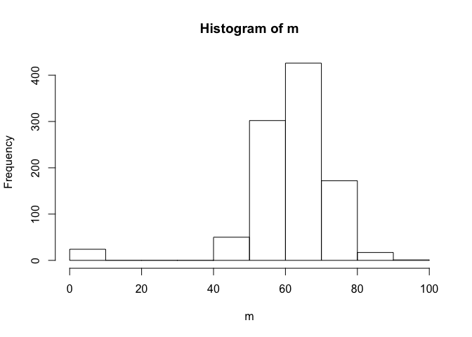
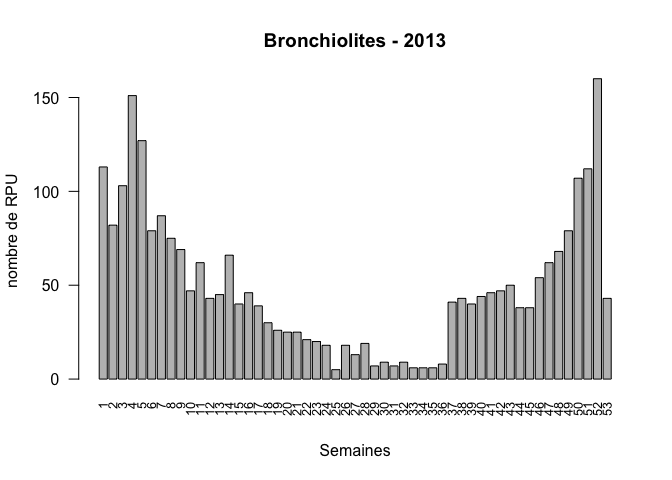
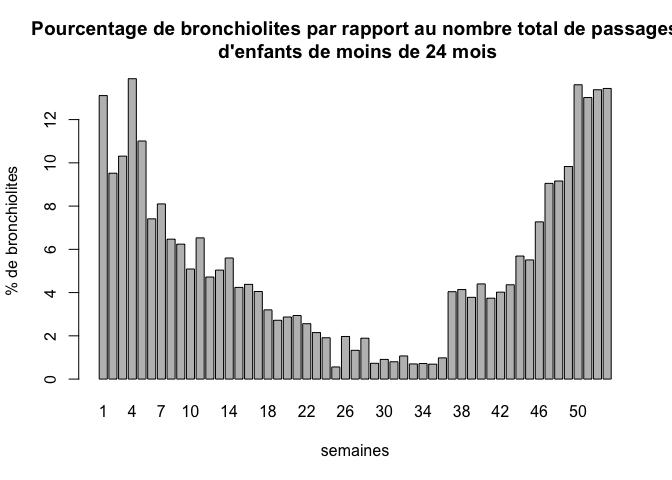
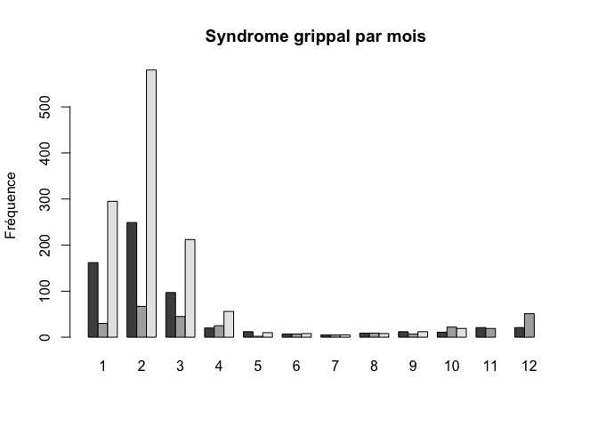
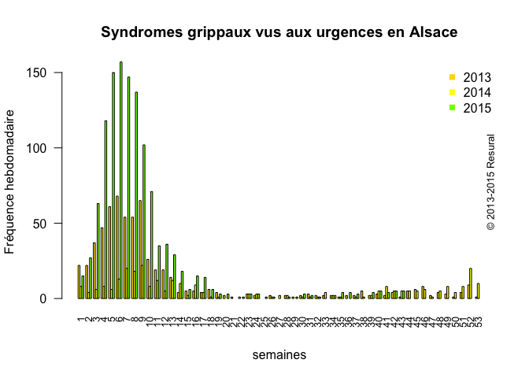
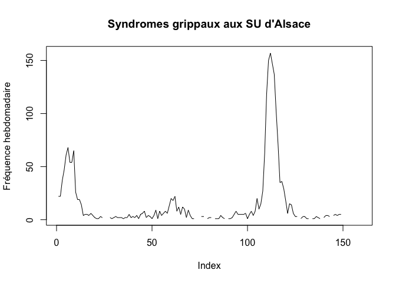
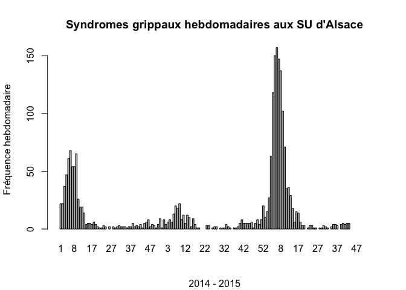
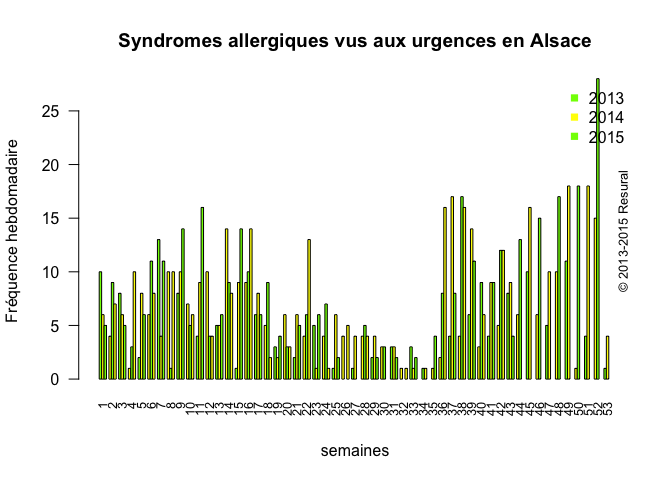

# DP
JcB  
01/10/2014  

Analyse des diagnostics principaux
=================================

Pour l'analyse, le fichier doit s'appeler dx. Ainsi pour 2014 on mettra dans le préambule dx <- d14.


```
## Loading required package: foreign
## Loading required package: survival
## Loading required package: MASS
## Loading required package: nnet
## 
## Attaching package: 'epitools'
## 
## The following object is masked from 'package:survival':
## 
##     ratetable
## 
## Loading required package: zoo
## 
## Attaching package: 'zoo'
## 
## The following objects are masked from 'package:base':
## 
##     as.Date, as.Date.numeric
```


Combien de sorte de DP sont crées par jour ?
============================================

ex. avec Sélestat: on crée un objet de type liste formé d'autant de listes qu'il y a de jours (1 liste par jour). Chaque liste est formée par les codes CIM10 du jour, lesquels ont regroupés par type grace à la méthode table. Au final on obtient pour chaque jour la liste des codes CIM et pour chaque code, le nombre de dossiiers correspondants. Par la fonction _length_ on compte le nombre de diagnostics uniques. L'ensemble est résumé par la fonction _summary_.


```
[1] 68
```

```

 A083  E139  F063  F480  G458  H664  H669  I269   I64   J00  J060  J159 
    1     1     1     1     2     1     1     1     1     1     1     3 
 J180  J209   J40   J90  K522  K590  K625  K800  K819  K851  K922  L022 
    1     1     1     1     1     2     1     1     2     1     1     1 
 L024  L050 M1997 M2546 M7908   N10   N23  P282  Q188  R073  R074  R102 
    1     1     1     1     1     1     1     1     1     1     1     1 
 R104  R296   R51 R53+0 R53+1  S004  S013  S018  S060  S202 S4220 S4240 
    2     1     1     1     1     1     1     2     1     2     1     1 
 S435  S501  S520  S602  S610  S628 S7200  S800  S810  S834 S9220  S934 
    1     1     1     1     2     1     1     1     1     1     1     1 
 S936 T0230  T200  T438  T519  T754  Z027  Z538 
    1     2     1     1     1     1     1     3 
```

```
   Min. 1st Qu.  Median    Mean 3rd Qu.    Max. 
   0.00   57.00   62.00   61.05   68.00   92.00 
```

 


Bronchiolites
=============


```r
bron<-dpr[substr(dpr$DP,1,3)=="J21" & dpr$AGE < 10 ,] # on limite aux moins de 10 ans
n.bron <- nrow(bron) # nombre de bronchiolites
# age des bronchioloites en mois
age.bron <- (as.Date(bron$ENTREE) - as.Date(bron$NAISSANCE))/30

n2 <- length(age.bron[age.bron < 25]) # nb de 24 mois (2 ans)
round(n2 * 100 / n.bron, 2) # % de 2 ans et moins
```

```
## [1] 97.08
```

```r
titre <- paste0("Bronchiolites", " - ", anc)

m<-month(bron$ENTREE,label=T)
barplot(table(m),main = titre, xlab="Mois", ylab = "nombre de RPU")
```

 

```r
# nombre de bronchiolites par semaine
s<-week(bron$ENTREE)
n.bronchio.par.semaine <- table(s)
barplot(table(s),main = titre, xlab = "Semaines", ylab = "nombre de RPU", las = 2, cex.names = 0.8)
```

 

```r
# ages des enfants en mois
age.bron <- (as.Date(bron$ENTREE) - as.Date(bron$NAISSANCE))/30
s.age.bron <- summary(as.numeric(age.bron)) # résumé
ceiling(as.numeric(s.age.bron["Min."] * 30)) # age min en jours
```

```
## [1] 7
```

```r
# sexe
summary(bron$SEXE)
```

```
##    F    I    M      
##  900    1 1431    0
```

```r
# age de tous les RPU en jours
age.jours <- as.numeric(as.Date(dx$ENTREE) - as.Date(dx$NAISSANCE))

# age de tous les rpu en mois
age.en.mois <- as.numeric(as.Date(dx$ENTREE) - as.Date(dx$NAISSANCE))/30

# nb de rpu de moins de 24 mois
ped2.age <- age.en.mois[age.en.mois > 0 & age.en.mois < 24.1]
summary(ped2.age)
```

```
##     Min.  1st Qu.   Median     Mean  3rd Qu.     Max. 
##  0.03333  4.73300 10.83000 11.05000 17.00000 24.07000
```

```r
# il faut calculer le nombre de rpu de moins de 2 ans par semaine, puis voir ce que les bronchiolites représentent en %

a <- data.frame(dx$ENTREE, age.en.mois)
a <- a[a$age.en.mois > 0 & a$age.en.mois < 24.1,]
colnames(a) <- c("ENTREE", "AGE.MOIS")


# nombre de passages des moins de 2 ans par semaine
# NB: semaine 41 = nouveau flux des HUS
n.rpu.inf2ans.par.semaine <- tapply(as.Date(a$ENTREE), week(as.Date(a$ENTREE)), length)
barplot(n.rpu.inf2ans.par.semaine, main = "Passages des moins de 2 ans", ylab = "nombre de RPU", xlab = "semaines")
```

 

```r
# Pourcentage de bronchiolites par rapport au nombre total de passages d'enfants de moins de 24 mois
a <- round(n.bronchio.par.semaine * 100 / n.rpu.inf2ans.par.semaine, 2)
barplot(a, xlab = "semaines", ylab = "% de bronchiolites", main = "Pourcentage de bronchiolites par rapport au nombre total de passages\n d'enfants de moins de 24 mois")
```

 

```r
# sous forme de courbe type InVS
plot(a, type="l", xlab = "semaines", ylab = "% de bronchiolites", main = "Proportion de bronchiolites parmi le total de passages\n chez les enfants de moins de 24 mois")
```

 

Syndrome grippal
================

__ATENTION__: les gaphiques de ce paragraphe ne sont exact que __dpr__ ne concerne que 2014. La transformation en mois supprime la notion d'année => si plusieurs années, la transformation en mois entraïne la somme des valeurs du mois: par ex. mois 1 correspond à la somme janvier 2014 et janvier 2015.


nombre de cas de grippes diagnostiqués aux urgences:

- 2013: 626
- 2014: 289
- 2015: 1111

Grippes en 2014 et 2015
------------------------

```r
anc <- 2014

titre <- paste0("Syndromes grippaux", " - ", anc-1)
m2013<-month(g2013$ENTREE,label=T)
barplot(table(m2013),main = titre, xlab="Mois", ylab = "nombre de RPU", las = 2)
```

 

```r
titre <- paste0("Syndromes grippaux", " - ", anc)
m2014<-month(g2014$ENTREE,label=T)
barplot(table(m2014),main = titre, xlab="Mois", ylab = "nombre de RPU", las = 2)
```

 

```r
titre <- paste0("Syndromes grippaux", " - ", anc + 1)
m2015<-month(g2015$ENTREE,label=T)
barplot(table(m2015),main = "2015", xlab="Mois", ylab = "nombre de RPU", las = 2)
```

 


Répartition par age
--------------------
  

Gravité
-------

```
## 
##    1    2    3    4    5    D    P      
##  538 1326   85    3    1    1    0    0
```


Comparaison 2014 - 2015
-----------------------
Utilise __tapply__ avec une liste de deux factors, l'année et le mois. On obtient une matrice de 2 lignes (2014 et 2015) et 12 colonnes pour chacun des mois. On peut construire un graphe avec 2 barres par mois (beside).

      

Allergies respiratoires
=======================

- rhinite allergique: J30
- asthme: J45


```r
# par semaine
b <- tapply(as.Date(allergie$ENTREE),list(year(as.Date(allergie$ENTREE)), week(as.Date(allergie$ENTREE))), length )
cols <- c("chartreuse", "yellow")
barplot(b, beside = TRUE, main = "Syndromes allergiques vus aux urgences en Alsace", ylab = "Fréquence hebdomadaire", las = 2, cex.names = 0.8, col = cols, xlab = "semaines")
legend("topright", legend = rownames(a), col = cols, pch = 15, bty = "n")
copyright()
```

 

