# Durées de passage
JcB  
22/10/2015  

La durée de passage est définie comme la différence entre l'heure d'entrée et de sortie du patient de la structure d'urgence. C'est un indicateur composite résultant de trois composantes: le flux d'entrée, l'efficience de la prise en charge et de la fluidité de l'aval. A efficience égale c'est un indicateur de l'état de tension des urgences. Toute augmentation du temps moyen de passage, traduit une augmentation du nombre de passages et/ou une saturation des capacités d'hospitalisation. La durée de passage peut se mesurer sur l'ensemble des passages d'une journée ou ponctuellement à une heure donnée, ce qui permet d'en dériver le nombre de patients présents simultannément à une heure précise (ex. canicule). Pour cela deux indicateurs simples sont à recueillir: l'heure d'entrée et l'heure de sortie des urgences. Si l'heure d'entrée est présente dans 100% des RPU, l'heure de  sortie manque dans 11% des RPU (octobre 2015) mais avec des disparité importantes selon les établissements, allant de 0 à 70%.


- l'exhaustivité de l'heure d'entrée est de 100% pour tous les ED.
- l'exhaustivité de l'heure de sortie est variable. L'heure de sortie n'est pas calculable lors d'une sortie atypique: ORIENTATION = fugue, PSA, SCAM.
- Pour calculer une durée de passage il faut disposer pour un même RPU de la date d'entée et de sortie
- les durées de passage négatives ou supérieures à 72 heures sont rejetées.
- Le dataframe minimal doit comporter les colonnes ENTREE et SORTIE. Il peut être compléter par d'autres colonnes en fonction des besoins (notamment MODE_SORTIE)


```
## Loading required package: zoo
## 
## Attaching package: 'zoo'
## 
## The following objects are masked from 'package:base':
## 
##     as.Date, as.Date.numeric
## 
## Loading required package: xtable
## Loading required package: openintro
## Please visit openintro.org for free statistics materials
## 
## Attaching package: 'openintro'
## 
## The following object is masked from 'package:datasets':
## 
##     cars
## 
## Loading required package: plotrix
```

Fonctions utiles:

- horaire: extrait le groupe horaire d'une date

Heure des sortie
----------------


```r
# % de données manquantes
p.isna(dx$SORTIE)
```

```
[1] 0.1084811
```

```r
# % par établissement
t <- round(tapply(dx$SORTIE, dx$FINESS, p.isna) * 100, 2)
summary(t)
```

```
   Min. 1st Qu.  Median    Mean 3rd Qu.    Max.    NA's 
   0.00    2.46    9.21   12.60   15.78   70.73       1 
```

```r
sort(t)
```

```
  Dia   Ros   Ccm   Geb   HTP   Col   Wis   Sel   Ane   NHC   Hsr   Hag 
 0.00  0.00  0.00  1.14  2.02  2.90  4.36  5.51  8.01  9.21  9.60 11.74 
  Sav   Odi   Dts   Emr   Mul   3Fr   Alk 
11.86 13.81 17.75 18.00 19.33 33.48 70.73 
```

```r
# utilitaire
h <- c("CH St Louis", "CH Altkirch", "Clin.Ste Anne", "CH Colmar", "Diaconat-Fonderie", "Diaconat-Strasb.", "CH Guebwiller", "CH Haguenau", "HUS", "CH Mulhouse", "Clin.Ste Odile", "Diaconat-Roosvelt", "CH Saverne", "CH Selestat", "CH Wissembourg", "HUS-HTP", "HUS-NHC", "GHMSA-E.Muller", "GHMSA-Hasenrain", "HUS-CCOM")
hop <- cbind(h, names(t))
colnames(hop) <- c("ES", "abr")

names(h) <- names(t)
h['3Fr']
```

```
          3Fr 
"CH St Louis" 
```

```r
t <- round(tapply(dx$SORTIE, dx$FINESS, p.isna) * 100, 2)


p.na.es <- round(tapply(dx$MODE_SORTIE, dx$FINESS, p.isna) * 100, 2)
t <- round(tapply(dx$SORTIE, dx$FINESS, p.isna) * 100, 2)
tab <- cbind(names(t), p.na.es, t)

t2 <- data.frame(tab, stringsAsFactors = FALSE)
a <- c("Etablissement", "Mode_sortie_NR", "Heure_sortie_NR")
names(t2) <- a
t2$Mode_sortie_NR <- as.numeric(t2$Mode_sortie_NR)
t2$Heure_sortie_NR <- as.numeric(t2$Heure_sortie_NR)

barplot(t(as.matrix(t2[,2:3])), beside = TRUE, las = 2, ylab = "% de non réponses", main = "2015 - Heures et modes de sortie non renseignés par ES")
abline(h = 10, col = "red", lty = 2)
legend("top", legend = c("% mode de sortie non renseigné", "% heure de sortie non renseignée"), col = c("gray20", "gray80"), pch = 15, bty = "n")
```

 

```r
hop <- cbind(h, names(t))
cbind(hop[,1])
```

```
    [,1]               
3Fr "CH St Louis"      
Alk "CH Altkirch"      
Ane "Clin.Ste Anne"    
Col "CH Colmar"        
Dia "Diaconat-Fonderie"
Dts "Diaconat-Strasb." 
Geb "CH Guebwiller"    
Hag "CH Haguenau"      
Hus "HUS"              
Mul "CH Mulhouse"      
Odi "Clin.Ste Odile"   
Ros "Diaconat-Roosvelt"
Sav "CH Saverne"       
Sel "CH Selestat"      
Wis "CH Wissembourg"   
HTP "HUS-HTP"          
NHC "HUS-NHC"          
Emr "GHMSA-E.Muller"   
Hsr "GHMSA-Hasenrain"  
Ccm "HUS-CCOM"         
```


Temps de passage
------------------------


```r
pas <- dx[, c("ENTREE", "SORTIE", "MODE_SORTIE", "ORIENTATION", "AGE")]

# on ne conserve que les couples complets
pas2 <- pas[complete.cases(pas[, c("ENTREE", "SORTIE")]),]
e <- ymd_hms(pas2$ENTREE)
s <- ymd_hms(pas2$SORTIE)
pas2$duree <- as.numeric(difftime(s, e, units = "mins"))

# on ne garde que les passages dont la durées > 0 et < ou = 72 heures
pas3 <- pas2[pas2$duree > 0 & pas2$duree < 3 * 24 * 60 + 1,]

# mémorise les heures d'entrée et de sortie
pas3$he <- horaire(pas3$ENTREE)
pas3$hs <- horaire(pas3$SORTIE)

# présent à 15 heures
limite <- hms("15:00:00") # pour incrémenter d'une heure: hms("15:00:00") + as.period(dhours(1))
pas3$P15 <- pas3$he < limite & pas3$hs > limite
head(pas3)
```

```
##                ENTREE              SORTIE MODE_SORTIE ORIENTATION AGE
## 3 2015-01-01 00:03:00 2015-01-01 01:20:00    Domicile        <NA>  23
## 4 2015-01-01 00:16:00 2015-01-01 02:26:00    Domicile        <NA>  61
## 5 2015-01-01 00:34:00 2015-01-01 02:44:00    Mutation        CHIR  19
## 6 2015-01-01 00:53:00 2015-01-01 01:40:00    Domicile        <NA>  14
## 8 2015-01-01 01:04:00 2015-01-01 02:00:00    Domicile        <NA>   8
## 9 2015-01-01 01:06:00 2015-01-01 01:41:00    Domicile        <NA>  16
##   duree       he        hs   P15
## 3    77    3M 0S 1H 20M 0S FALSE
## 4   130   16M 0S 2H 26M 0S FALSE
## 5   130   34M 0S 2H 44M 0S FALSE
## 6    47   53M 0S 1H 40M 0S FALSE
## 8    56 1H 4M 0S  2H 0M 0S FALSE
## 9    35 1H 6M 0S 1H 41M 0S FALSE
```

```r
summary(pas3$P15)
```

```
##    Mode   FALSE    TRUE    NA's 
## logical  281374   66414       0
```

```r
# nombre moyen de présents à 15h tous les jours
n.p15 <- tapply(pas3$P15, yday(as.Date(pas3$ENTREE)), sum)
summary(n.p15)
```

```
##    Min. 1st Qu.  Median    Mean 3rd Qu.    Max. 
##     158     211     231     233     252     322
```

```r
sd(n.p15)
```

```
## [1] 30.96083
```

```r
m.p15 <- sum(n.p15) / length(n.p15)

# petite correction (origine ?)
pas3$MODE_SORTIE[pas3$MODE_SORTIE == 6] <- "Mutation"
pas3$MODE_SORTIE[pas3$MODE_SORTIE == 7] <- "Transfert"
pas3$MODE_SORTIE[pas3$MODE_SORTIE == 8] <- "Domicile"

# mode de sortie
n.sortie.rens <- sum(!is.na(pas3$MODE_SORTIE))
ms <- summary(as.factor(pas3$MODE_SORTIE))

n.hosp <- ms["Mutation"] + ms["Transfert"]
n.dom <- ms["Domicile"]
```
__Année 2015__ (date de point: 2015-10-12):

- nombre de RPU: 395387
- nombre de PRU où la durée de passage est calculable: 352495
- nombre de PRU où la durée de passage est conforme: 347788

- durée de passage moyenne: 180.9183181
- durée de passage médiane: 118

- nombre de sorties conformes renseignées: 267961
- nombre de retour à domicile: 205721
- nombre d'hospitalisation: 62239
- taux d'hospitalisation: 0.2322689

- nombre de patients présents à 15 heures: 233.0315789

Temps de passage de moins de 4 heures
----------------------------------------


```r
pas4 <- pas3[pas3$duree < 4 * 60 + 1,]
ms4 <- summary(as.factor(pas4$MODE_SORTIE))

n.sortie4.rens <- sum(!is.na(pas4$MODE_SORTIE))

n.hosp4 <- ms4["Mutation"] + ms4["Transfert"]
n.dom4 <- ms4["Domicile"]
```

- nombre de sorties en moins de 4 heures renseignées: 204436
- nombre de retour à domicile en moins de 4 h: 170206
- nombre d'hospitalisation en moins de 4 h: 34229
- taux d'hospitalisation en moins de 4 h: 0.1674314

Temps de passage par jour
--------------------------

### nombre de patients à 15 heures

```r
xts.p15 <- xts(n.p15, order.by = unique(as.Date(pas3$ENTREE)))
plot(xts.p15, ylab = "Nombre de patients à 15h", main = "Nombre de patients à 15 heures")
lines(rollmean(x = xts.p15, k = 7), col = "red", lwd = 2)
```

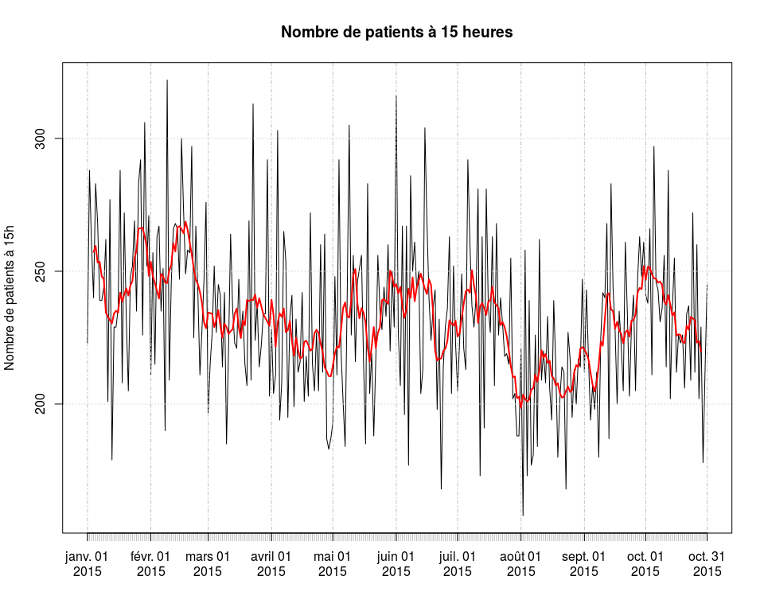 


### moyenne du temps de passage par jour

```r
my.day <- tapply(pas3$duree, yday(as.Date(pas3$ENTREE)), mean)
xts.my.day <- xts(my.day, order.by = unique(as.Date(pas3$ENTREE)))

summary(xts.my.day)
```

```
##      Index              xts.my.day   
##  Min.   :2015-01-01   Min.   :130.6  
##  1st Qu.:2015-03-13   1st Qu.:161.6  
##  Median :2015-05-23   Median :176.0  
##  Mean   :2015-05-23   Mean   :180.8  
##  3rd Qu.:2015-08-02   3rd Qu.:201.7  
##  Max.   :2015-10-12   Max.   :241.0
```

```r
plot(xts.my.day, ylab = "durée moyenne de passage (mn)", main = "Durée moyenne de passage par jour")
text(as.Date("2015-07-02"), 200, "Canicule")
```

 

### moyenne du temps de passage si age > 74 ans

On compare sur le même graphique, la durée qotidienne moyenne de passage et le nombre total de passages par jour.

- pas3.75 est le dataframe des plus de 74 ans
- my.day est la durée moyenne quotidienne de passage.


```r
pas3.75 <- pas3[pas3$AGE > 74,]
pas3.75 <- pas3.75[!is.na(as.Date(pas3.75$ENTREE)),]
my.day <- tapply(pas3.75$duree, yday(as.Date(pas3.75$ENTREE)), mean)
xts.my.day <- xts(my.day, order.by = unique(as.Date(pas3.75$ENTREE)))

summary(xts.my.day)
```

```
##      Index              xts.my.day   
##  Min.   :2015-01-01   Min.   :202.0  
##  1st Qu.:2015-03-13   1st Qu.:248.2  
##  Median :2015-05-23   Median :266.6  
##  Mean   :2015-05-23   Mean   :266.4  
##  3rd Qu.:2015-08-02   3rd Qu.:282.3  
##  Max.   :2015-10-12   Max.   :359.8
```

```r
par(mar = c(2, 4, 4, 5))
plot(xts.my.day, ylab = "durée moyenne de passage (mn)", main = "Durée moyenne de passage par jour\n pour les patients de 75 ans et plus", lty = 3)
# moyenne mobile
lines(rollmean(x = xts.my.day, k = 7), col = "red", lwd = 2)

# second graphique
par.original <- par(no.readonly=TRUE)
par(new = TRUE)
nb.pas.jour <- tapply(as.Date(pas3.75$ENTREE), yday(as.Date(pas3.75$ENTREE)), length)
min <- min(nb.pas.jour)
max <- max(nb.pas.jour)
xts.my.pas.day <- xts(nb.pas.jour, order.by = unique(as.Date(pas3.75$ENTREE)))
plot(rollmean(x = xts.my.pas.day, k = 7), axes = F, ylim = c(min, max),  col = "blue", main="", lwd = 2, auto.grid = FALSE)
axis(4,                  # axe vertical à droite
     ylim = c(min, max), # limites de l'axe
     col = "blue",       # couleur de l'axe
     col.ticks = "blue", # couleur des marques de graduation
     col.axis = "blue" ) # couleur de la légende des graduations
mtext("Nombre de passages > 74 ans/jour", side=4, line=3, col = "blue") # nom, position, couleur de lalégende de l'axe
# légende
legend("bottomleft", legend = c("durée de passage", "nombre de passages"), col = c("red", "blue"), lty = 1, lwd = 3, bty = "n")
```

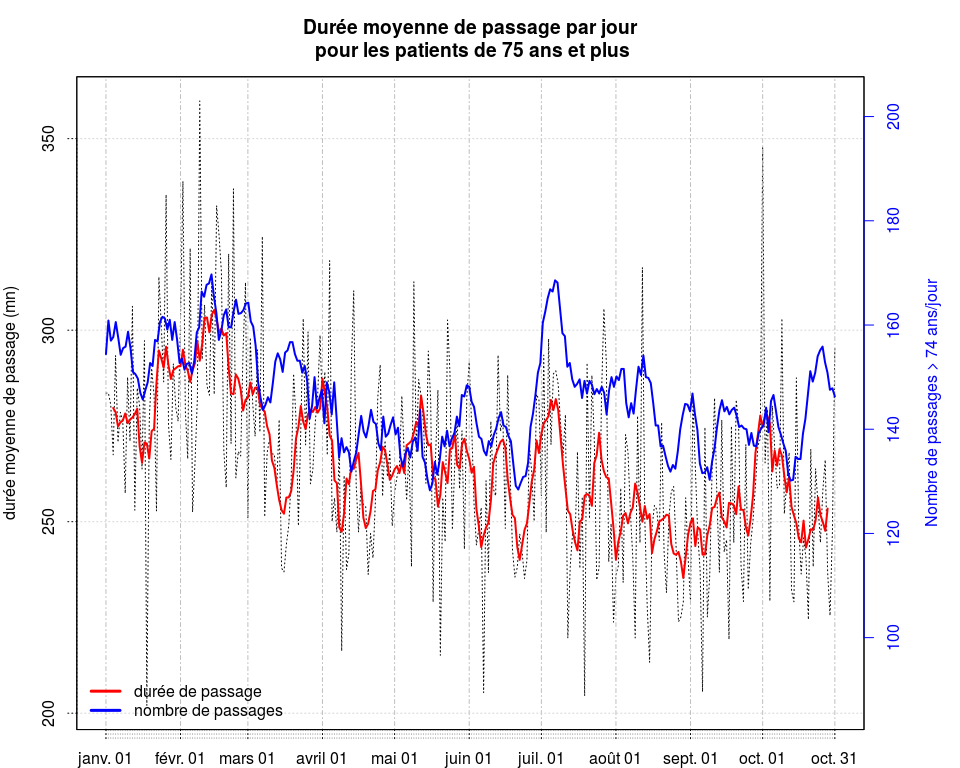 

```r
par(par.original)

# essai de corrélation
cor(my.day, nb.pas.jour)
```

```
## [1] 0.3642023
```


### médiane du temps de passage par jour

```r
md.day <- tapply(pas3$duree, yday(as.Date(pas3$ENTREE)), median)
xts.md.day <- xts(md.day, order.by = unique(as.Date(pas3$ENTREE)))
plot(xts.md.day, ylab = "durée médiane de passage (mn)", main = "Durée médiane de passage par jour")
```

 

### nombre de passages en moins de 4h par jour

On forme le rapport nb de passages de moins de 4 heures sur le nb total de passages. En peériode de tension, ce rapport diminue.

```r
n.pas4.day <- tapply(as.Date(pas4$ENTREE), yday(as.Date(pas4$ENTREE)), length)
n.pas.day <- tapply(as.Date(pas3$ENTREE), yday(as.Date(pas3$ENTREE)), length)
p.pas <- n.pas4.day / n.pas.day
xts.pas4.day <- xts(p.pas, order.by = unique(as.Date(pas3$ENTREE)))
plot(xts.pas4.day, ylab = "nombre de passages", main = "Nombre de passages de moins de 4h par jour")
```

 

### temps de passage si hospitalisation, par jour

```r
pas5 <- pas3[pas$MODE_SORTIE %in% c("Mutation", "Transfert"),]
pas5 <- pas5[!is.na(as.Date(pas5$ENTREE)),]
summary(pas5$duree)
```

```
##    Min. 1st Qu.  Median    Mean 3rd Qu.    Max. 
##       1      62     119     183     223    4320
```

```r
my5.day <- tapply(pas5$duree, yday(as.Date(pas5$ENTREE)), mean)

xts.my5.day <- xts(my5.day, order.by = unique(as.Date(pas5$ENTREE)))
plot(xts.my5.day, main = "Durée moyenne de passage aux urgences avant hosptalisation")
```

 


Heures de sorties non renseignées par ES
----------------------------------------


```r
p.na.es <- round(tapply(dx$SORTIE, dx$FINESS, p.isna) * 100, 2)
a <- sort(p.na.es)
kable(t(a))
```


 Dia   Ros   Ccm    Geb    HTP   Col    Wis    Sel    Ane    NHC   Hsr     Hag     Sav     Odi     Dts   Emr     Mul     3Fr     Alk
----  ----  ----  -----  -----  ----  -----  -----  -----  -----  ----  ------  ------  ------  ------  ----  ------  ------  ------
   0     0     0   1.14   2.02   2.9   4.36   5.51   8.01   9.21   9.6   11.74   11.86   13.81   17.75    18   19.33   33.48   70.73

Pourcentage de non réponse par jour et par FINESS
-------------------------------------------------


```r
p.na.es.day <- tapply(dx$SORTIE, list(yday(as.Date(dx$ENTREE)), dx$FINESS), p.isna)

# transformation en time serie avec xts
x <- xts(p.na.es.day, order.by = unique(as.Date(dx$ENTREE)))
x <- x[, -9] # supprime la colonne Hus qui est vide
for(i in 1:ncol(x)){
  plot(x[,i], main = paste0(names(x)[i], "- Heure de sortie des Urgences (% non réponse)"), ylab = "% de non réponses")
  s <- apply(x[,i], MARGIN = 2, summary)
  print(s)
}
```

 

```
##            3Fr
## Min.    0.0000
## 1st Qu. 0.2432
## Median  0.3409
## Mean    0.3341
## 3rd Qu. 0.4348
## Max.    0.9167
```

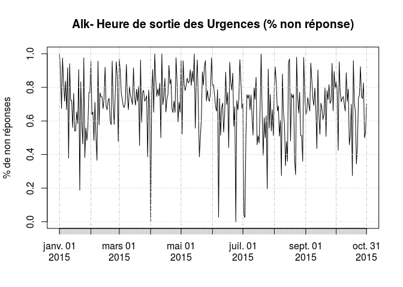 

```
##            Alk
## Min.    0.0000
## 1st Qu. 0.6346
## Median  0.7273
## Mean    0.7041
## 3rd Qu. 0.8163
## Max.    1.0000
```

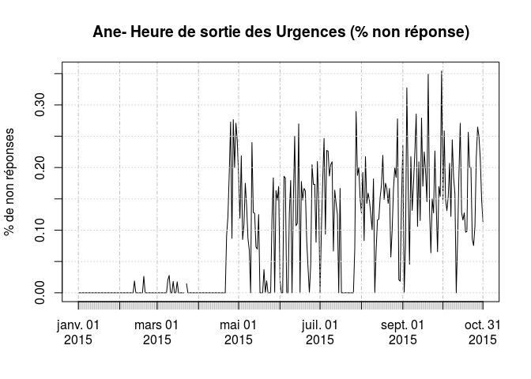 

```
##             Ane
## Min.    0.00000
## 1st Qu. 0.00000
## Median  0.02083
## Mean    0.07995
## 3rd Qu. 0.15490
## Max.    0.35420
## NA's    1.00000
```

 

```
##              Col
## Min.    0.000000
## 1st Qu. 0.000000
## Median  0.009412
## Mean    0.029500
## 3rd Qu. 0.056910
## Max.    0.171600
## NA's    1.000000
```

 

```
##         Dia
## Min.      0
## 1st Qu.   0
## Median    0
## Mean      0
## 3rd Qu.   0
## Max.      0
```

 

```
##             Dts
## Min.    0.00000
## 1st Qu. 0.08571
## Median  0.16220
## Mean    0.18110
## 3rd Qu. 0.25000
## Max.    1.00000
```

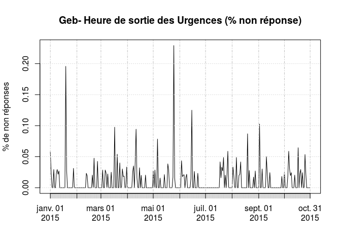 

```
##             Geb
## Min.    0.00000
## 1st Qu. 0.00000
## Median  0.00000
## Mean    0.01120
## 3rd Qu. 0.01923
## Max.    0.22920
```

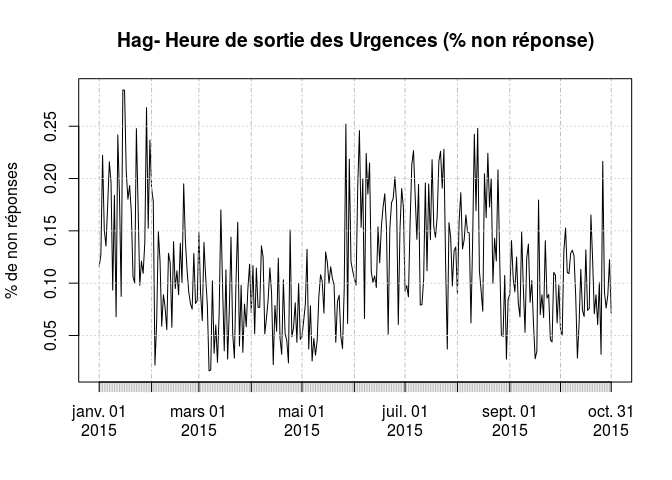 

```
##             Hag
## Min.    0.01626
## 1st Qu. 0.07519
## Median  0.10770
## Mean    0.11660
## 3rd Qu. 0.15250
## Max.    0.28470
```

 

```
##             Mul
## Min.     0.0000
## 1st Qu.  0.1358
## Median   0.1719
## Mean     0.1856
## 3rd Qu.  0.2158
## Max.     0.8828
## NA's    46.0000
```

 

```
##             Odi
## Min.    0.00000
## 1st Qu. 0.08772
## Median  0.12880
## Mean    0.13580
## 3rd Qu. 0.16930
## Max.    0.66670
## NA's    1.00000
```

 

```
##         Ros
## Min.      0
## 1st Qu.   0
## Median    0
## Mean      0
## 3rd Qu.   0
## Max.      0
```

 

```
##             Sav
## Min.    0.00000
## 1st Qu. 0.06818
## Median  0.11590
## Mean    0.11660
## 3rd Qu. 0.16470
## Max.    0.30340
```

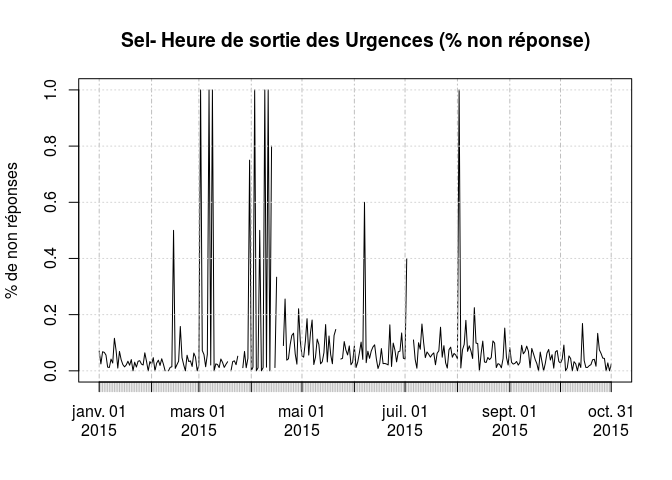 

```
##              Sel
## Min.     0.00000
## 1st Qu.  0.02319
## Median   0.04348
## Mean     0.08939
## 3rd Qu.  0.07507
## Max.     1.00000
## NA's    13.00000
```

 

```
##             Wis
## Min.    0.00000
## 1st Qu. 0.00000
## Median  0.03226
## Mean    0.04416
## 3rd Qu. 0.06522
## Max.    0.21950
```

 

```
##              HTP
## Min.    0.000000
## 1st Qu. 0.009569
## Median  0.018940
## Mean    0.020260
## 3rd Qu. 0.028690
## Max.    0.070180
```

 

```
##             NHC
## Min.    0.00000
## 1st Qu. 0.05000
## Median  0.08333
## Mean    0.09427
## 3rd Qu. 0.13160
## Max.    0.45310
```

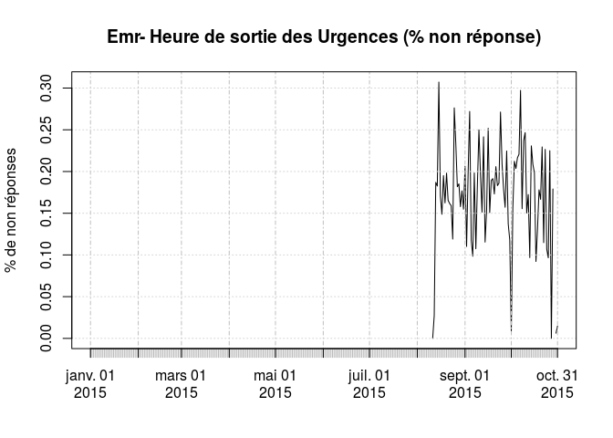 

```
##              Emr
## Min.      0.0000
## 1st Qu.   0.1543
## Median    0.1826
## Mean      0.1787
## 3rd Qu.   0.2077
## Max.      0.3072
## NA's    222.0000
```

 

```
##               Hsr
## Min.      0.00000
## 1st Qu.   0.05469
## Median    0.08990
## Mean      0.09732
## 3rd Qu.   0.12910
## Max.      0.22220
## NA's    243.00000
```

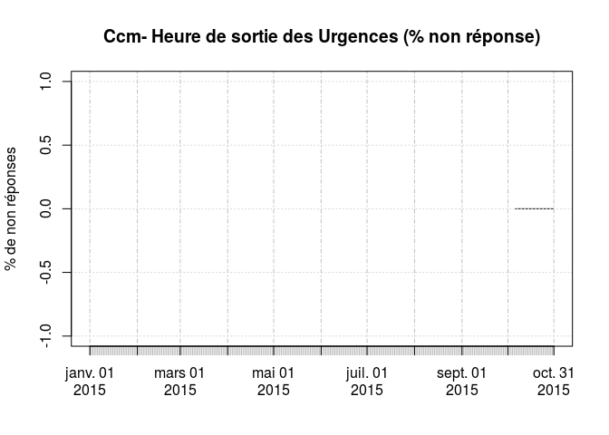 

```
##         Ccm
## Min.      0
## 1st Qu.   0
## Median    0
## Mean      0
## 3rd Qu.   0
## Max.      0
## NA's    278
```

```r
# for(i in 1:ncol(x)){
#   s <- apply(x[,i], MARGIN = 2, summary)
#   print(s)
# }
```

Utilisation des routines duree_passage.R
============================================================================================================

 Nombre de patients présents à une heure précide. Par exemple combien de patients sont présents à 15 heures?
 Ce sont tous les patients arrivés avant 15 heures et repartis après 15 heures
 On part d'un dataframe formé de deux colonnes (ENTREE et SORIE) où chaque couple est complet => il faut éliminer les couples
 incomplets.
 Nécessite lubridate, Rpu2

 usage:
 - créer un dataframe "duree de passage" avec df.duree.pas Ce dataframe est l'objet de base à partir duquel d'autres
   fonctions vont agir
 - la fonction is.present.at permet de créer un vecteur de présence d'un patient à une heure donnée, et de la le nombre de 
   patients présents à une heure donné sum(is.present.at), ou le nombre de patients présents à une heure donnée pour 
   chaque jour de l'année (tapply) puis de tracer le graphe de présence
   

```r
source('~/Documents/Resural/Stat Resural/RPU_2014/Analyse/Duree_Passage/duree_passage.R')
```

Dataframe Durée de passage
--------------------------
fabrique à partir d'un dataframe de type RPU, un dataframe de type duree_passage comportant les colonnes suivantes:
date/heure d'ebtree, date/heure de sortie, durée de passage (en minutes par défaut), l'heure d'entrée (HMS), l'heure de sortie.


```r
dp <- df.duree.pas(dx)
head(dp)
```

```
##                ENTREE              SORTIE MODE_SORTIE ORIENTATION AGE
## 3 2015-01-01 00:03:00 2015-01-01 01:20:00    Domicile        <NA>  23
## 4 2015-01-01 00:16:00 2015-01-01 02:26:00    Domicile        <NA>  61
## 5 2015-01-01 00:34:00 2015-01-01 02:44:00    Mutation        CHIR  19
## 6 2015-01-01 00:53:00 2015-01-01 01:40:00    Domicile        <NA>  14
## 8 2015-01-01 01:04:00 2015-01-01 02:00:00    Domicile        <NA>   8
## 9 2015-01-01 01:06:00 2015-01-01 01:41:00    Domicile        <NA>  16
##   duree       he        hs
## 3    77    3M 0S 1H 20M 0S
## 4   130   16M 0S 2H 26M 0S
## 5   130   34M 0S 2H 44M 0S
## 6    47   53M 0S 1H 40M 0S
## 8    56 1H 4M 0S  2H 0M 0S
## 9    35 1H 6M 0S 1H 41M 0S
```

Un patient est-il présent à une heure donnée ?
----------------------------------------------

### Nombre de présents à 15h

```r
# dp <- df.duree.pas(dx)
           dp$present.a.15h <- is.present.at(dp)
           # nombre moyen de patients présents à 15h tous les jours
           n.p15 <- tapply(dp$present.a.15h, yday(as.Date(dp$ENTREE)), sum)
           summary(n.p15)
```

```
##    Min. 1st Qu.  Median    Mean 3rd Qu.    Max. 
##     158     211     231     233     252     322
```

```r
           sd(n.p15)
```

```
## [1] 30.96083
```

```r
           # transformation en xts
           xts.p15 <- xts(n.p15, order.by = unique(as.Date(dp$ENTREE)))
           plot(xts.p15, ylab = "Nombre de patients à 15h", main = "Nombre de patients présents à 15 heures")
           lines(rollmean(x = xts.p15, k = 7), col = "red", lwd = 2)
```

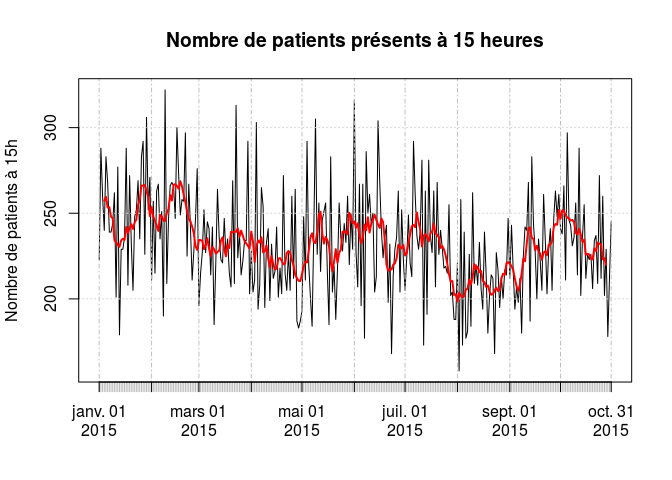 

### à 2h du matin


```r
           dp$present.a.2h <- is.present.at(dp, "02:00:00")
           n.p2 <- tapply(dp$present.a.2h, yday(as.Date(dp$ENTREE)), sum)
           summary(n.p2)
```

```
##    Min. 1st Qu.  Median    Mean 3rd Qu.    Max. 
##   15.00   25.00   30.00   31.09   36.00   63.00
```

```r
           xts.p2 <- xts(n.p2, order.by = unique(as.Date(dp$ENTREE)))
           plot(xts.p2, ylab = "Nombre de patients présents", main = "Nombre de patients présents à 2 heures du matin")
           lines(rollmean(x = xts.p2, k = 7), col = "red", lwd = 2)
```

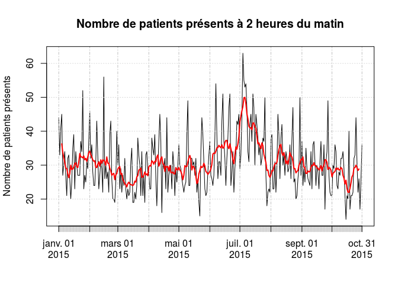 

```r
           # pour les données de 2015, noter le pic à 2 heures du matin
```

En période de canicule, le nombre de présents à 2 heures du matin est anormalement élevé.

### à 8 heures


```r
           present.a.8h <- is.present.at(dp, "08:00:00")
           n.p8 <- tapply(present.a.8h, yday(as.Date(dp$ENTREE)), sum)
           summary(n.p8)
```

```
##    Min. 1st Qu.  Median    Mean 3rd Qu.    Max. 
##   32.00   50.00   57.00   57.82   65.00   93.00
```

```r
           xts.p8 <- xts(n.p8, order.by = unique(as.Date(dp$ENTREE)))
           plot(xts.p8, ylab = "Nombre de patients présents", main = "Nombre de patients présents à 8 heures du matin")
           lines(rollmean(x = xts.p8, k = 7), col = "red", lwd = 2)
```

 

