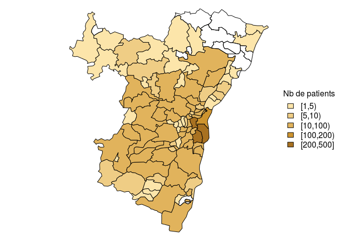
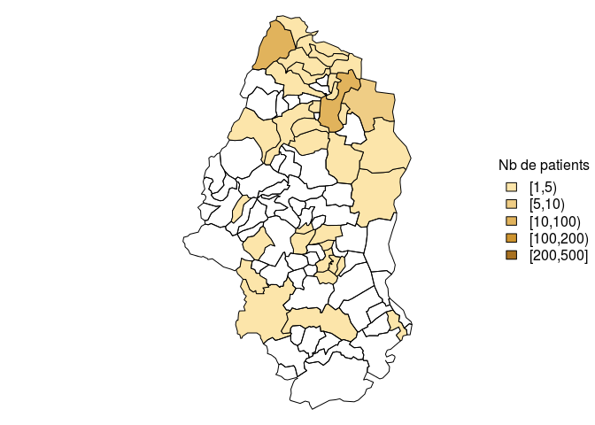

# Pathologie de la main
JcB - RESURAL  
31/12/2015  

Analyse CCOM
============

Analyse faite le 28/12/2015 pour évaluer l'introduction du DP au CCOM.


- Période analysée: 17/12/2015, 02/01/2016
- Date d'envoi du premier RPU: 06/10/2015
- Date de point: 02/01/2016
- Nombre de RPU créés: 2458
- Date de début d'envoi de RPU avec DP renseigné: 17/12/2015
- Taux de complétude moyen du DP: 68 %

Evolution du taux de completude du diagnostic principal (DP)

 

__Un taux de complétude régulièrement supérieur à 80% est nécessaire pour tirer des conclusions valides.__

Caractéristiques de la population
-------------------------------------------------------

### Age


Tous les RPU du CCOM

 


### Sexe

 

En moyenne, les femmes sont plus agées que les hommes:

- age moyen des femmes: 41.3 ans.
- age moyen des hommes: 35.9 ans.
- la différence est statistiquement significative (p = 1.6368104\times 10^{-10})

### Répartition des codes CIM 10

 

Code CIM10 mains
----------------
Les codes CIM10 sont dans le dossier FEDORU:

     CODE      Freq  LIBELLE                                                                                                           
---  -------  -----  ------------------------------------------------------------------------------------------------------------------
18   S610        38  Plaie ouverte de(s) doigt(s) (sans lésion de l'ongle)                                                             
32   S6280       33  Fracture fermée de parties autres et non précisées du poignet et de la main                                       
16   S602        17  Contusion d'autres parties du poignet et de la main                                                               
30   S6260       15  Fracture fermée d'un autre doigt                                                                                  
1    L030        14  Phlegmon des doigts et des orteils                                                                                
20   S617        14  Plaies ouvertes multiples du poignet et de la main                                                                
14   S600        13  Contusion de(s) doigt(s) sans lésion de l'ongle                                                                   
25   S6230       13  Fracture fermée d'un autre os du métacarpe                                                                        
37   S636        11  Entorse et foulure de doigt(s)                                                                                    
19   S611        10  Plaie ouverte de(s) doigt(s) avec lésion de l'ongle                                                               
40   S663         8  Lésion traumatique du muscle et du tendon extenseurs d'un autre doigt au niveau du poignet et de la main          
9    M6594        6  Synovite et ténosynovite, sans précision - Main                                                                   
10   M7954        6  Corps étranger résiduel dans un tissu mou - Main                                                                  
31   S6261        6  Fracture ouverte d'un autre doigt                                                                                 
21   S618         5  Plaie ouverte d'autres parties du poignet et de la main                                                           
47   T230         5  Brûlure du poignet et de la main, degré non précisé                                                               
48   W3998        5  Projection de feu d'artifice, lieu sans précision                                                                 
5    M1994        4  Arthrose, sans précision - Articulations de la main                                                               
23   S6210        4  Fracture fermée d'autre(s) os du carpe                                                                            
36   S635         4  Entorse et foulure du poignet                                                                                     
2    L608         3  Autres maladies des ongles                                                                                        
4    M1394        3  Arthrite, sans précision - Articulations de la main                                                               
28   S6250        3  Fracture fermée du pouce                                                                                          
33   S6281        3  Fracture ouverte de parties autres et non précisées du poignet et de la main                                      
35   S634         3  Rupture traumatique de ligaments du doigt au niveau des articulations métacarpo-phalangienne et interphalangienne 
44   S670         3  Écrasement du pouce et d'autre(s) doigt(s)                                                                        
3    L923         2  Granulome cutané et sous-cutané dû à la présence d'un corps étranger                                              
6    M2554        2  Douleur articulaire - Articulations de la main                                                                    
7    M62848       2  Autres atteintes musculaires précisées, Main                                                                      
13   Q681         2  Anomalie morphologique congénitale de la main                                                                     
22   S6200        2  Fracture fermée de l'os scaphoïde de la main                                                                      
29   S6251        2  Fracture ouverte du pouce                                                                                         
39   S662         2  Lésion traumatique du muscle et du tendon extenseurs du pouce au niveau du poignet et de la main                  
41   S665         2  Lésion traumatique de muscles et de tendons intrinsèques d'un autre doigt au niveau du poignet et de la main      
8    M6534        1  Doigt "à ressort" - Main                                                                                          
11   M7964        1  Douleur au niveau d'un membre - Main                                                                              
12   M9484        1  Autres affections précisées du cartilage - Main                                                                   
15   S601         1  Contusion de(s) doigt(s) avec lésion de l'ongle                                                                   
17   S607         1  Lésions traumatiques superficielles multiples du poignet et de la main                                            
24   S6220        1  Fracture fermée du premier métacarpien                                                                            
26   S6231        1  Fracture ouverte d'un autre os du métacarpe                                                                       
27   S6240        1  Fractures fermées multiples des métacarpiens                                                                      
34   S631         1  Luxation du doigt                                                                                                 
38   S661         1  Lésion traumatique du muscle et du tendon fléchisseurs d'un autre doigt au niveau du poignet et de la main        
42   S667         1  Lésion traumatique de multiples muscles et tendons extenseurs au niveau du poignet et de la main                  
43   S668         1  Lésion traumatique d'autres muscles et tendons au niveau du poignet et de la main                                 
45   S680         1  Amputation traumatique du pouce (complète) (partielle)                                                            
46   S681         1  Amputation traumatique d'un autre doigt (complète) (partielle)                                                    

Lesions liées aux pétards
-------------------------

Sélectionne toutes les lignes avec le code W39:


- Nombre de lésions dues aux pétards: 5

Nombre de passages par mois
---------------------------
 

Nombre de passages par semaine
-------------------------------
 

Nombre de passages par jour de semaine
--------------------------------------
 

Nombre de passages par jour
---------------------------
 


Horaires de passage
-------------------

L'histogramme des horaires de passage est assez semblable à celui des services d'urgence polyvalents. Cependant l'aspect bimodal parait plus marqué, avec une fréquentation plus forte en début de matinée et d'après-midi (messages de prévention ?).

 


Durées de passage
-----------------

L'heure de sortie n'est différente de l'heure d'entrée que dans 7% des cas. Lorsque l'heure de sortie diffère de l'heure d'entrée, la durée de passage est égale à une minute dans 75% des cas... Il y a donc un problème avec l'heure de sortie.


```
## [1] 0
```

```
##     Min.  1st Qu.   Median     Mean  3rd Qu.     Max. 
##    0.000    0.000    0.000    3.941    0.000 1260.000
```

 

Origine des patients
--------------------

### Par département

#### En nombre:

```
cp2
  17   24   27   30   33   42   49   50   56   59   66   69   81   86   36 
   1    1    1    1    1    1    1    1    1    1    1    1    1    1    2 
  44   52   54   55   75   76   45   70   83   88   92   94   90   99   57 
   2    2    2    2    2    2    3    3    3    3    3    4    5   11   53 
  68   67 
  69 2273 
```

#### En porcentage:

```
cp2
    17     24     27     30     33     42     49     50     56     59 
 0.041  0.041  0.041  0.041  0.041  0.041  0.041  0.041  0.041  0.041 
    66     69     81     86     36     44     52     54     55     75 
 0.041  0.041  0.041  0.041  0.081  0.081  0.081  0.081  0.081  0.081 
    76     45     70     83     88     92     94     90     99     57 
 0.081  0.122  0.122  0.122  0.122  0.122  0.163  0.203  0.448  2.156 
    68     67 
 2.807 92.474 
```


Cartographie

```
OGR data source with driver: ESRI Shapefile 
Source: "/home/jcb/Documents/CartographieR/IGN_GEOFLA_2015/Fichier_SHP/DEPARTEMENT", layer: "DEPARTEMENT"
with 96 features
It has 11 fields
```

 


### en Alsace

  

