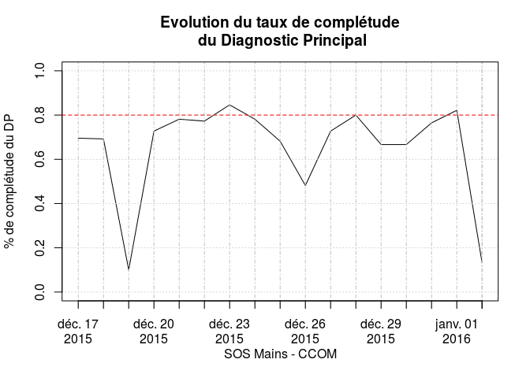
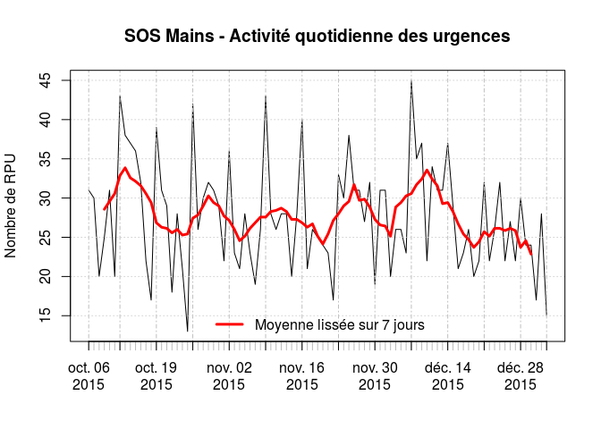

# Pathologie de la main
JcB  
31/12/2015  

Analyse CCOM
============

Analyse faite le 28/12/2015 pour évaluer l'introduction du DP au CCOM.


- Période analysée: 17/12/2015, 28/12/2015
- Date d'envoi du premier RPU: 06/10/2015
- Date de point: 28/12/2015
- Nombre de RPU créés: 2350
- Date de début d'envoi de RPU avec DP renseigné: 17/12/2015
- Taux de complétude moyen du DP: 69 %

Evolution du taux de completude du diagnostic principal (DP)

 

__Un taux de complétude régulièrement supérieur à 80% est nécessaire pour tirer des conclusions valides.__

Caractéristiques de la population
-------------------------------------------------------

### Age

 

Tous les RPU du CCOM

 


### Sexe

 

En moyenne, les femmes sont plus agées que les hommes:

- age moyen des femmes: 41.1 ans.
- age moyen des hommes: 36 ans.
- la différence est statistiquement significative (p = 5.8934813\times 10^{-9})

### Répartition des codes CIM 10

 

Code CIM10 mains
----------------
Les codes CIM10 sont dans le dossier FEDORU:

     CODE      Freq  LIBELLE                                                                                                           
---  -------  -----  ------------------------------------------------------------------------------------------------------------------
15   S610        32  Plaie ouverte de(s) doigt(s) (sans lésion de l'ongle)                                                             
26   S6280       25  Fracture fermée de parties autres et non précisées du poignet et de la main                                       
14   S602        15  Contusion d'autres parties du poignet et de la main                                                               
1    L030        13  Phlegmon des doigts et des orteils                                                                                
12   S600        12  Contusion de(s) doigt(s) sans lésion de l'ongle                                                                   
17   S617        11  Plaies ouvertes multiples du poignet et de la main                                                                
24   S6260       11  Fracture fermée d'un autre doigt                                                                                  
16   S611        10  Plaie ouverte de(s) doigt(s) avec lésion de l'ongle                                                               
30   S636         8  Entorse et foulure de doigt(s)                                                                                    
20   S6230        7  Fracture fermée d'un autre os du métacarpe                                                                        
25   S6261        6  Fracture ouverte d'un autre doigt                                                                                 
18   S618         5  Plaie ouverte d'autres parties du poignet et de la main                                                           
7    M6594        4  Synovite et ténosynovite, sans précision - Main                                                                   
29   S635         4  Entorse et foulure du poignet                                                                                     
33   S663         4  Lésion traumatique du muscle et du tendon extenseurs d'un autre doigt au niveau du poignet et de la main          
2    L608         3  Autres maladies des ongles                                                                                        
3    M1394        3  Arthrite, sans précision - Articulations de la main                                                               
4    M1994        3  Arthrose, sans précision - Articulations de la main                                                               
8    M7954        3  Corps étranger résiduel dans un tissu mou - Main                                                                  
22   S6250        3  Fracture fermée du pouce                                                                                          
28   S634         3  Rupture traumatique de ligaments du doigt au niveau des articulations métacarpo-phalangienne et interphalangienne 
19   S6210        2  Fracture fermée d'autre(s) os du carpe                                                                            
23   S6251        2  Fracture ouverte du pouce                                                                                         
27   S6281        2  Fracture ouverte de parties autres et non précisées du poignet et de la main                                      
40   T230         2  Brûlure du poignet et de la main, degré non précisé                                                               
5    M2554        1  Douleur articulaire - Articulations de la main                                                                    
6    M62848       1  Autres atteintes musculaires précisées, Main                                                                      
9    M7964        1  Douleur au niveau d'un membre - Main                                                                              
10   M9484        1  Autres affections précisées du cartilage - Main                                                                   
11   Q681         1  Anomalie morphologique congénitale de la main                                                                     
13   S601         1  Contusion de(s) doigt(s) avec lésion de l'ongle                                                                   
21   S6240        1  Fractures fermées multiples des métacarpiens                                                                      
31   S661         1  Lésion traumatique du muscle et du tendon fléchisseurs d'un autre doigt au niveau du poignet et de la main        
32   S662         1  Lésion traumatique du muscle et du tendon extenseurs du pouce au niveau du poignet et de la main                  
34   S665         1  Lésion traumatique de muscles et de tendons intrinsèques d'un autre doigt au niveau du poignet et de la main      
35   S667         1  Lésion traumatique de multiples muscles et tendons extenseurs au niveau du poignet et de la main                  
36   S668         1  Lésion traumatique d'autres muscles et tendons au niveau du poignet et de la main                                 
37   S670         1  Écrasement du pouce et d'autre(s) doigt(s)                                                                        
38   S680         1  Amputation traumatique du pouce (complète) (partielle)                                                            
39   S681         1  Amputation traumatique d'un autre doigt (complète) (partielle)                                                    
41   W3998        1  Projection de feu d'artifice, lieu sans précision                                                                 

Lesions liées aux pétards
-------------------------

Sélectionne toutes les lignes avec le code W39:


- Nombre de lésions dues aux pétards: 1

Horaires de passage
-------------------

L'histogramme des horaires de passage est assez semblable à celui des services d'urgence polyvalents. Cependant l'aspect bimodal parait plus marqué, avec une fréquentation plus forte en début de matinée et d'après-midi (messages de prévention ?).

 


Durées de passage
-----------------

L'heure de sortie n'est différente de l'heure d'entrée que dans 7% des cas. Lorsque l'heure de sortie diffère de l'heure d'entrée, la durée de passage est égale à une minute dans 75% des cas... Il y a donc un problème avec l'heure de sortie.


```r
s <- ymd_hms(as.POSIXct(ccm$SORTIE))
e <- ymd_hms(as.POSIXct(ccm$ENTREE))
d <- as.numeric(s - e)
# on ne garde que les durées < 24 h
d2 <- d[d < 24*60]
# nb de données aberrantes
outliner <- length(d) - length(d2)
# % de données manquantes
mean(is.na(d2)) * 100
```

```
## [1] 0
```

```r
summary(as.numeric(d2))
```

```
##    Min. 1st Qu.  Median    Mean 3rd Qu.    Max. 
##   0.000   0.000   0.000   3.505   0.000  60.000
```

```r
hist(as.numeric(d2), breaks = 60, col = "brown", border = "white", main = "Durées de passage", xlab = "Temps (mn)")
```

 

Origine des patients
--------------------

### Par département


```r
cp2 <- substr(ccm$CODE_POSTAL, 1, 2)
sort(table(cp2))
```

```
## cp2
##   01   24   27   30   33   42   49   50   56   59   66   81   86   36   44 
##    1    1    1    1    1    1    1    1    1    1    1    1    1    2    2 
##   52   54   55   75   76   45   70   83   88   92   90   94   99   57   68 
##    2    2    2    2    2    3    3    3    3    3    4    4    9   51   66 
##   67 
## 2174
```

```r
round(sort(table(cp2)) * 100 /nrow(ccm), 3) # en %
```

```
## cp2
##     01     24     27     30     33     42     49     50     56     59 
##  0.043  0.043  0.043  0.043  0.043  0.043  0.043  0.043  0.043  0.043 
##     66     81     86     36     44     52     54     55     75     76 
##  0.043  0.043  0.043  0.085  0.085  0.085  0.085  0.085  0.085  0.085 
##     45     70     83     88     92     90     94     99     57     68 
##  0.128  0.128  0.128  0.128  0.128  0.170  0.170  0.383  2.170  2.809 
##     67 
## 92.511
```

Cartographie

```
OGR data source with driver: ESRI Shapefile 
Source: "/home/jcb/Documents/CartographieR/IGN_GEOFLA_2015/Fichier_SHP/DEPARTEMENT", layer: "DEPARTEMENT"
with 96 features
It has 11 fields
```

 


### en Alsace

  

