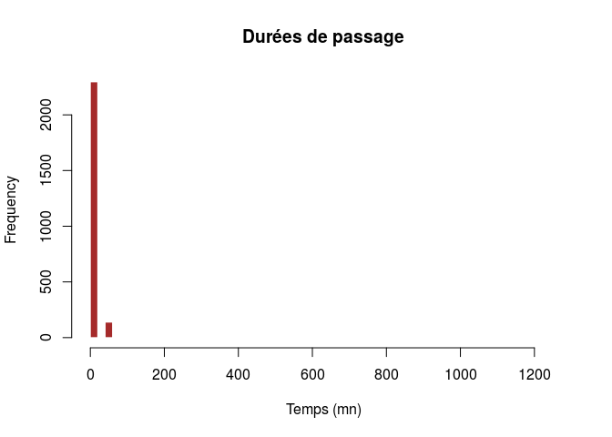

# Pathologie de la main
JcB - RESURAL  
31/12/2015  

Analyse CCOM
============

Analyse faite le 28/12/2015 pour évaluer l'introduction du DP au CCOM.


- Période analysée: 01/01/2015, 02/01/2016
- Date d'envoi du premier RPU: 01/01/2015
- Date de point: 02/01/2016
- Nombre de RPU créés: 8187
- Date de début d'envoi de RPU avec DP renseigné: 01/01/2015
- Taux de complétude moyen du DP: 6 %

Evolution du taux de completude du diagnostic principal (DP)

 

__Un taux de complétude régulièrement supérieur à 80% est nécessaire pour tirer des conclusions valides.__

Caractéristiques de la population
-------------------------------------------------------

### Age


Tous les RPU du CCOM

 


### Sexe

 

En moyenne, les femmes sont plus agées que les hommes:

- age moyen des femmes: 40.2 ans.
- age moyen des hommes: 36 ans.
- la différence est statistiquement significative (p = 3.9022282\times 10^{-17})

### Répartition des codes CIM 10

 

Code CIM10 mains
----------------
Les codes CIM10 sont dans le dossier FEDORU:

     CODE    Freq  LIBELLE                                                                 
---  -----  -----  ------------------------------------------------------------------------
2    T119     573  Lésion traumatique non précisée du membre supérieur, niveau non précisé 
1    T116       1  Amputation traumatique du membre supérieur, niveau non précisé          
3    T190       1  Corps étranger dans l'urètre                                            
4    T192       1  Corps étranger dans la vulve et le vagin                                

Lesions liées aux pétards
-------------------------

Sélectionne toutes les lignes avec le code W39:


- Nombre de lésions dues aux pétards: 0

Nombre de passages par mois
---------------------------
 

Nombre de passages par semaine
-------------------------------
 

Nombre de passages par jour de semaine
--------------------------------------
 

Nombre de passages par jour
---------------------------
 


Horaires de passage
-------------------

L'histogramme des horaires de passage est assez semblable à celui des services d'urgence polyvalents. Cependant l'aspect bimodal parait plus marqué, avec une fréquentation plus forte en début de matinée et d'après-midi (messages de prévention ?).

 


Durées de passage
-----------------

L'heure de sortie n'est différente de l'heure d'entrée que dans 7% des cas. Lorsque l'heure de sortie diffère de l'heure d'entrée, la durée de passage est égale à une minute dans 75% des cas... Il y a donc un problème avec l'heure de sortie.


```
## [1] 0
```

```
##    Min. 1st Qu.  Median    Mean 3rd Qu.    Max. 
##     0.0   900.0   900.0   971.3  1200.0  1380.0
```

 

Origine des patients
--------------------

### Par département


```
## cp2
##   00   02   08   11   14   18   23   24   26   27   28   29   35   37   39 
##    1    1    1    1    1    1    1    1    1    1    1    1    1    1    1 
##   41   43   44   51   53   63   72   76   83   91   21   32   33   42   74 
##    1    1    1    1    1    1    1    1    1    1    2    2    2    2    2 
##   78   80   84   94   95   97   34   57   66   69   71   89   13   31   60 
##    2    2    2    2    2    2    3    3    3    3    3    3    4    4    4 
##   77   79   82   92   93   62   59   54   99   75   88   67   70   25   90 
##    4    4    4    4    4    5    6    7   14   15   34   46   46  135  195 
##   68 
## 7587
```

```
## cp2
##     00     02     08     11     14     18     23     24     26     27 
##  0.012  0.012  0.012  0.012  0.012  0.012  0.012  0.012  0.012  0.012 
##     28     29     35     37     39     41     43     44     51     53 
##  0.012  0.012  0.012  0.012  0.012  0.012  0.012  0.012  0.012  0.012 
##     63     72     76     83     91     21     32     33     42     74 
##  0.012  0.012  0.012  0.012  0.012  0.024  0.024  0.024  0.024  0.024 
##     78     80     84     94     95     97     34     57     66     69 
##  0.024  0.024  0.024  0.024  0.024  0.024  0.037  0.037  0.037  0.037 
##     71     89     13     31     60     77     79     82     92     93 
##  0.037  0.037  0.049  0.049  0.049  0.049  0.049  0.049  0.049  0.049 
##     62     59     54     99     75     88     67     70     25     90 
##  0.061  0.073  0.086  0.171  0.183  0.415  0.562  0.562  1.649  2.382 
##     68 
## 92.671
```

Cartographie

```
OGR data source with driver: ESRI Shapefile 
Source: "/home/jcb/Documents/CartographieR/IGN_GEOFLA_2015/Fichier_SHP/DEPARTEMENT", layer: "DEPARTEMENT"
with 96 features
It has 11 fields
```

 


### en Alsace

  

