# Mode de sortie
JcB  
22/10/2015  

Le RPU connait quatre modes de sortie:

- mutation (hospitalisation dans le même établissement)
- transfert (hospitalisation dans un autre établissement)
- domicile (retour au domicile ou ce qui en tient lieu: EHPAD...)
- décès


```
## Loading required package: zoo
## 
## Attaching package: 'zoo'
## 
## The following objects are masked from 'package:base':
## 
##     as.Date, as.Date.numeric
```

Le mode de sortie est une information administrative qui devrait être présente dans tous les cas. Elle manque cependant dans 30% des RPU. Pourcentage de RPU où cette information est manquante, par établissement:


  Sel    Dia    Wis   Ccm    Col    Geb    Hag     Sav     Hsr    Ros     Odi     3Fr    Dts     Mul     Emr     NHC     Alk     HTP     Ane
-----  -----  -----  ----  -----  -----  -----  ------  ------  -----  ------  ------  -----  ------  ------  ------  ------  ------  ------
 0.01   0.97   3.65     5   5.18   6.77   9.96   12.05   12.31   13.8   14.06   16.77   18.2   25.72   28.05   68.97   70.91   81.54   92.05

Pourcentage de non réponse par jour et par FINESS
-------------------------------------------------


```r
p.na.es.day <- tapply(dx$MODE_SORTIE, list(yday(as.Date(dx$ENTREE)), dx$FINESS), p.isna)

# transformation en time serie avec xts
x <- xts(p.na.es.day, order.by = unique(as.Date(dx$ENTREE)))
x <- x[, -9] # supprime la colonne Hus qui est vide
for(i in 1:ncol(x)){
  plot(x[,i], main = names(x)[i], ylab = "% de non réponse")
  s <- apply(x[,i], MARGIN = 2, summary)
  print(s)
}
```

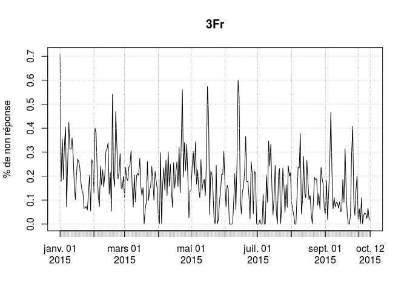 

```
##             3Fr
## Min.    0.00000
## 1st Qu. 0.07143
## Median  0.15690
## Mean    0.16810
## 3rd Qu. 0.23640
## Max.    0.70830
```

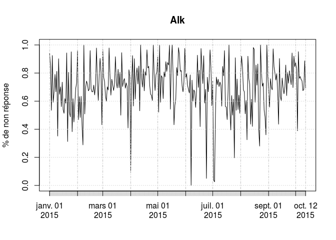 

```
##            Alk
## Min.    0.0000
## 1st Qu. 0.6154
## Median  0.7170
## Mean    0.7061
## 3rd Qu. 0.8163
## Max.    1.0000
```

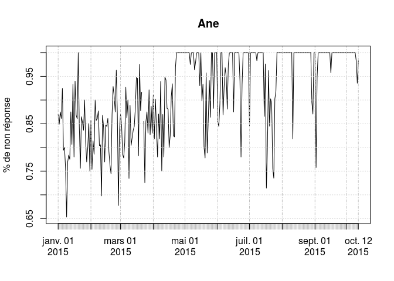 

```
##            Ane
## Min.    0.6531
## 1st Qu. 0.8539
## Median  0.9478
## Mean    0.9198
## 3rd Qu. 1.0000
## Max.    1.0000
## NA's    1.0000
```

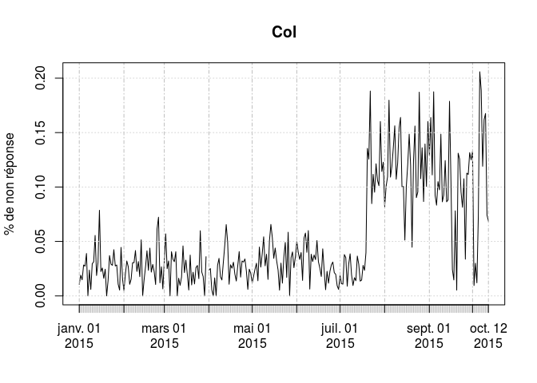 

```
##             Col
## Min.    0.00000
## 1st Qu. 0.01963
## Median  0.03209
## Mean    0.05224
## 3rd Qu. 0.08151
## Max.    0.20590
## NA's    1.00000
```

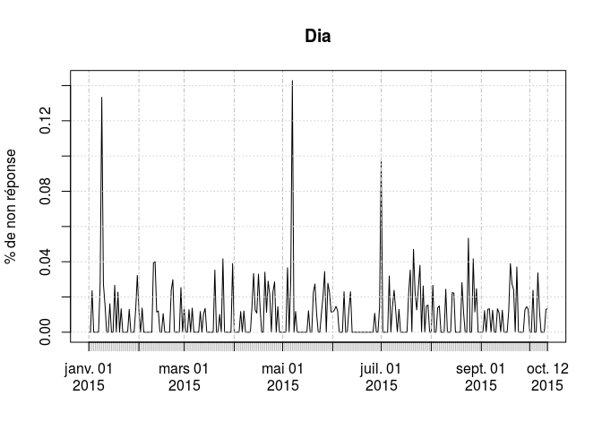 

```
##              Dia
## Min.    0.000000
## 1st Qu. 0.000000
## Median  0.000000
## Mean    0.009669
## 3rd Qu. 0.013700
## Max.    0.142900
```

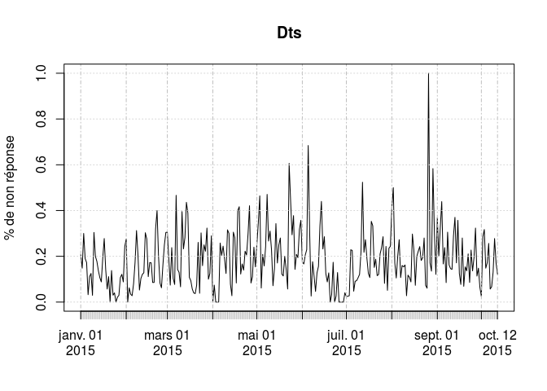 

```
##             Dts
## Min.    0.00000
## 1st Qu. 0.08824
## Median  0.16670
## Mean    0.18550
## 3rd Qu. 0.25810
## Max.    1.00000
```

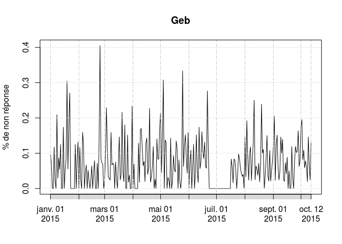 

```
##             Geb
## Min.    0.00000
## 1st Qu. 0.00000
## Median  0.05556
## Mean    0.06935
## 3rd Qu. 0.11110
## Max.    0.40480
```

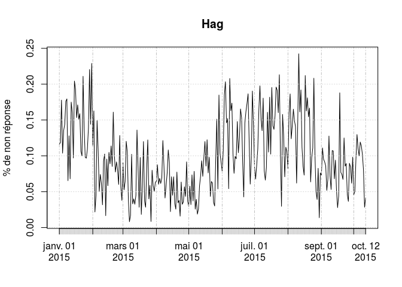 

```
##             Hag
## Min.    0.00813
## 1st Qu. 0.06034
## Median  0.09286
## Mean    0.09895
## 3rd Qu. 0.13610
## Max.    0.24240
```

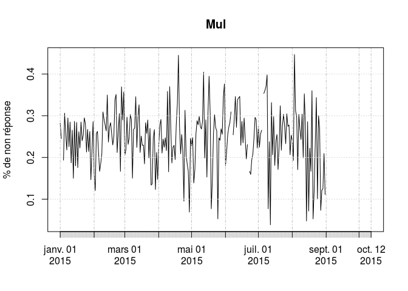 

```
##              Mul
## Min.     0.03846
## 1st Qu.  0.20860
## Median   0.25440
## Mean     0.24570
## 3rd Qu.  0.28970
## Max.     0.44680
## NA's    46.00000
```

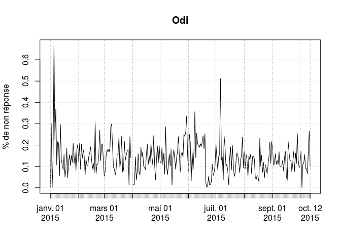 

```
##             Odi
## Min.    0.00000
## 1st Qu. 0.08929
## Median  0.12990
## Mean    0.13830
## 3rd Qu. 0.17460
## Max.    0.66670
## NA's    1.00000
```

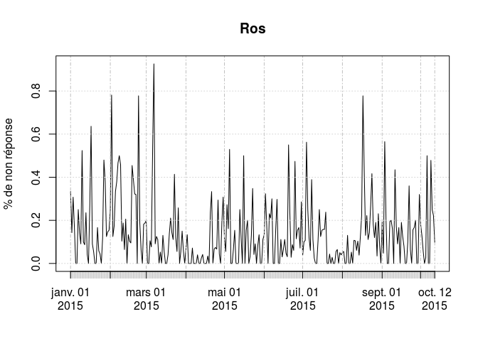 

```
##            Ros
## Min.    0.0000
## 1st Qu. 0.0000
## Median  0.1034
## Mean    0.1415
## 3rd Qu. 0.1923
## Max.    0.9259
```

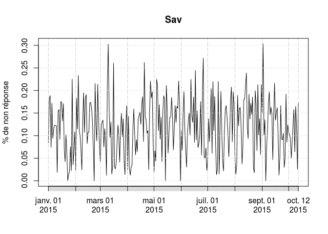 

```
##             Sav
## Min.    0.00000
## 1st Qu. 0.07229
## Median  0.11840
## Mean    0.11840
## 3rd Qu. 0.16670
## Max.    0.30340
```

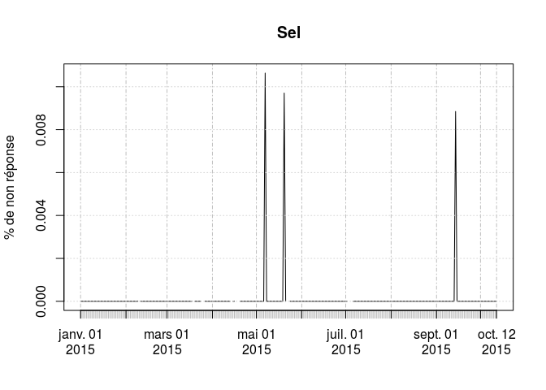 

```
##               Sel
## Min.    0.000e+00
## 1st Qu. 0.000e+00
## Median  0.000e+00
## Mean    1.073e-04
## 3rd Qu. 0.000e+00
## Max.    1.064e-02
## NA's    1.300e+01
```

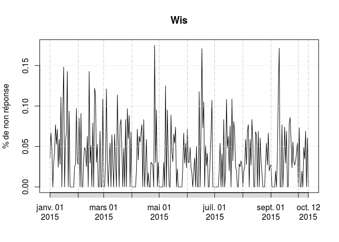 

```
##             Wis
## Min.    0.00000
## 1st Qu. 0.00000
## Median  0.02857
## Mean    0.03658
## 3rd Qu. 0.06250
## Max.    0.17500
```

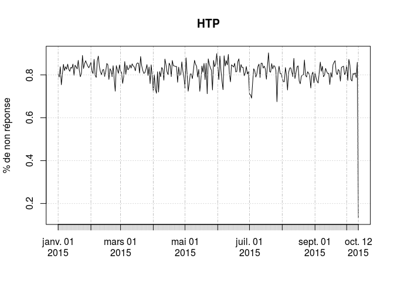 

```
##            HTP
## Min.    0.1330
## 1st Qu. 0.7974
## Median  0.8193
## Mean    0.8144
## 3rd Qu. 0.8432
## Max.    0.9030
```

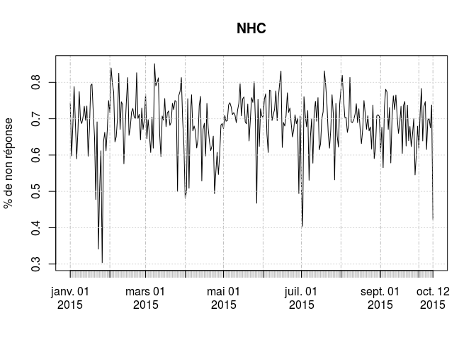 

```
##            NHC
## Min.    0.3038
## 1st Qu. 0.6528
## Median  0.6979
## Mean    0.6872
## 3rd Qu. 0.7391
## Max.    0.8515
```

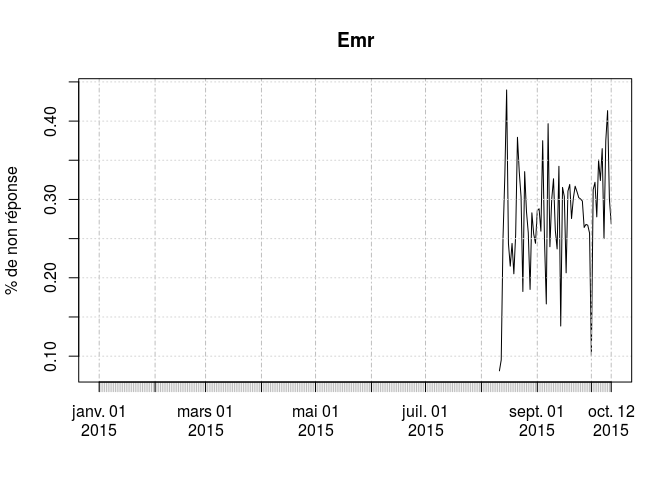 

```
##              Emr
## Min.      0.0813
## 1st Qu.   0.2492
## Median    0.2847
## Mean      0.2785
## 3rd Qu.   0.3180
## Max.      0.4398
## NA's    222.0000
```

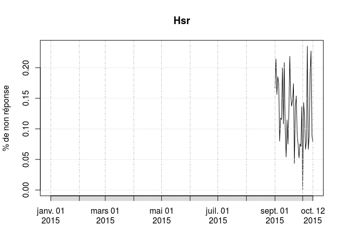 

```
##               Hsr
## Min.      0.00000
## 1st Qu.   0.07895
## Median    0.11810
## Mean      0.12500
## 3rd Qu.   0.16410
## Max.      0.23530
## NA's    243.00000
```

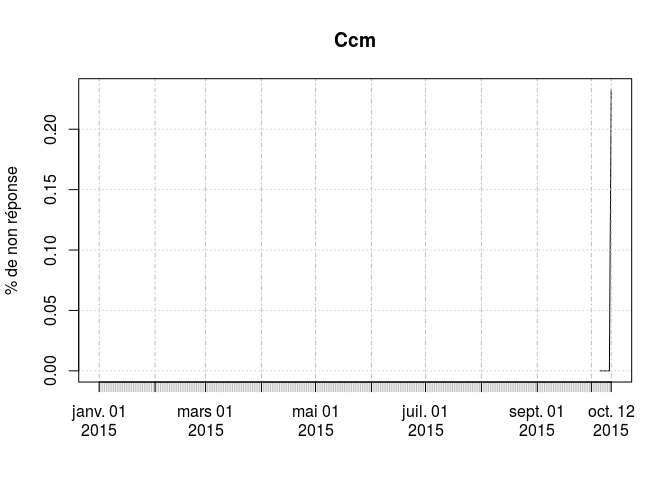 

```
##               Ccm
## Min.      0.00000
## 1st Qu.   0.00000
## Median    0.00000
## Mean      0.03322
## 3rd Qu.   0.00000
## Max.      0.23260
## NA's    278.00000
```

