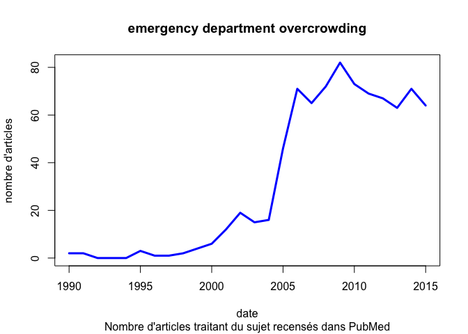

# Overcrowding
jcb  
10 avril 2015  

Surcharge des services d'urgence
================================

Etude du nombre d'articles publiés dans __PubMed__ à propos de la surcharge des services d'urgence.

Date de point: 10/04/2015. Le chiffre pour 2015 est une extrapolation à partir du nombre d'articles publiés à la date de point.

