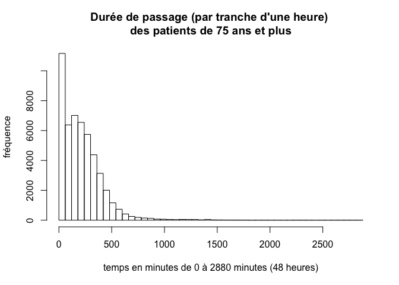

# RPU 2014 en chiffres
JcB  
31/12/2014  

Chiffres pour l'année 2014
==========================

init
----
Le fichier source s'appelle __d14__.


```
## Loading required package: zoo
## 
## Attaching package: 'zoo'
## 
## The following objects are masked from 'package:base':
## 
##     as.Date, as.Date.numeric
```

Créer un calendrier
===================

Pb: on veut créer un vecteur de 365 ou 366 jours.


```r
date1 <- "2014-01-01"
date2 <- "2014-12-31"
calendrier <- seq(from = as.Date(date1), to = as.Date(date2), by = 1)
```
Calendrier doit être transformé en dataframe pour être utilisé avec merge

a <- data.frame(calendrier) 

Compter les jours d'une semaine
===============================

Pb: on veut compter le nombre de lundi, merdi, ..., dimanche au cours d'une période de temps


```r
tapply(calendrier, wday(calendrier, label = TRUE), length)
```

```
##   Sun   Mon  Tues   Wed Thurs   Fri   Sat 
##    52    52    52    53    52    52    52
```


Total RPU
=========

Total RPU: 416733

Nombre de RPU par jour
=======================


```
## [1] 1141.734
```

```
## [1] 154.7858
```

```
## [1] 1128
```

```
##        1        2        3        4        5        6        7 
## 1190.750 1233.442 1091.385 1085.226 1090.365 1126.615 1175.442
```

```
##        1        2        3        4        5        6        7 
## 162.7372 151.3186 144.7921 126.5598 134.1742 153.1959 147.7839
```


Nombre de RPU par mois
======================

Pb: on veut connaître le nombre de RPU par mois en 2014. Utilisé par le site internet. On utilise la fonction _tapply_ pour calculer la répartition mensuelle.


```r
# en valeur absolue
t <- tapply(as.Date(d14$ENTREE), month(as.Date(d14$ENTREE)), length)
names(t) <- format(ISOdate(2000, 1:12, 1), "%B")
t
```

```
##   janvier   février      mars     avril       mai      juin   juillet 
##     29237     29799     32427     33253     33630     35295     34772 
##      août septembre   octobre  novembre  décembre 
##     32563     33937     40940     40238     40642
```

```r
# en pourcentage
round(prop.table(t)*100, 2)
```

```
##   janvier   février      mars     avril       mai      juin   juillet 
##      7.02      7.15      7.78      7.98      8.07      8.47      8.34 
##      août septembre   octobre  novembre  décembre 
##      7.81      8.14      9.82      9.66      9.75
```

```r
# en différence. Rajoute 1 pour le mois de janvier
d <- c(1 ,diff(t))
d
```

```
##             février      mars     avril       mai      juin   juillet 
##         1       562      2628       826       377      1665      -523 
##      août septembre   octobre  novembre  décembre 
##     -2209      1374      7003      -702       404
```

```r
names(d[1]) <- "janvier" # marche pas ?
barplot(d[1:12], col = ifelse(d > 0, "yellow", "green"), main = paste0("Variation du nombre de RPU en ", anc), las = 2)
```

 

Nombre de RPU par semaine
=========================

Il y a deux méthodes possibles:

- __weekday__s du package _main_:

```r
wd <- tapply(as.Date(d14$ENTREE), weekdays(as.Date(d14$ENTREE)), length)
wd
```

```
## Dimanche    Jeudi    Lundi    Mardi Mercredi   Samedi Vendredi 
##    61919    56699    64139    56752    57517    61123    58584
```
- __wday__ du package _lubridate_. Inconvénient, la semaine commence le dimanche.

```r
# jours de semaine indicés par des entiers
wd <- tapply(as.Date(d14$ENTREE), wday(as.Date(d14$ENTREE)), length)
wd
```

```
##     1     2     3     4     5     6     7 
## 61919 64139 56752 57517 56699 58584 61123
```

```r
# jours indicés par leur nom
wd <- tapply(as.Date(d14$ENTREE), wday(as.Date(d14$ENTREE), label = TRUE), length)
wd
```

```
##   Sun   Mon  Tues   Wed Thurs   Fri   Sat 
## 61919 64139 56752 57517 56699 58584 61123
```

Possibilité de correction:

```r
a <- c(wd[2:7],wd[1]) # on met le dimanche en dernier
names(a) <- SEMAINE
a
```

```
##    Lundi    Mardi Mercredi    Jeudi Vendredi   Samedi Dimanche 
##    64139    56752    57517    56699    58584    61123    61919
```

Nombre de RPU par établissements
--------------------------------

```r
tapply(as.Date(d14$ENTREE), d14$FINESS, length)
```

```
##   3Fr   Alk   Ane   Col   Dia   Dts   Geb   Hag   Hus   Mul   Odi   Ros 
## 16134 12660  7418 67378 29410  3910 16024 39938 61793 59471 24956  7210 
##   Sav   Sel   Wis 
## 29445 28828 12158
```

Nombre de RPU par territoires de santé
--------------------------------------
On crée une colonne supplémentaire pour les territoires de santé. La colonne crée est de type character.


```r
# d14$TERRITOIRE[d14$FINESS %in% c("Wis","Sav","Hag")] <- "T1"
# d14$TERRITOIRE[d14$FINESS %in% c("Hus","Odi","Ane","Dts")] <- "T2"
# d14$TERRITOIRE[d14$FINESS %in% c("Sel","Col","Geb")] <- "T3"
# d14$TERRITOIRE[d14$FINESS %in% c("Mul","3Fr","Alk","Ros","Dia","Tan")] <- "T4"

d14 <- create.col.territoire(d14)

tapply(as.Date(d14$ENTREE), d14$TERRITOIRE, length)
```

```
##     T1     T2     T3     T4 
##  81541  98077 112230 124885
```
Nombre de RPU par établissements
-------------------------------

```
  3Fr   Alk   Ane   Col   Dia   Dts   Geb   Hag   Hus   Mul   Odi   Ros 
16134 12660  7418 67378 29410  3910 16024 39938 61793 59471 24956  7210 
  Sav   Sel   Wis 
29445 28828 12158 
```

Nombre de RPU par mois et par établissement
-------------------------------------------

```
    3Fr  Alk  Ane  Col  Dia Dts  Geb  Hag  Hus  Mul  Odi Ros  Sav  Sel
1  1243  745   NA 5384 2463  NA 1129 2943 3383 5162 1001  NA 2505 2305
2  1207 1048   NA 5184 2228 102 1181 2706 3240 4879 2063 471 2426 2099
3  1368 1250   NA 5400 2507  NA 1361 3029 3745 4581 2333 690 2629 2415
4  1313 1068   NA 5602 2479  NA 1391 3004 4091 5148 2355 609 2511 2513
5  1366  907  413 5848 2538  NA 1470 3109 4030 4952 2492 675 2407 2346
6  1478 1026  956 6086 2571  NA 1521 3174 4036 4935 2444 708 2566 2632
7  1383 1325 1286 5789 2475  NA 1388 3829 3710 4604 2185 645 2354 2680
8  1324  793  576 5377 2393 411 1314 3456 3723 4780 2008 690 2168 2514
9  1268  369  906 5696 2408 849 1420 3470 3775 4785 2335 721 2379 2477
10 1448 1382  970 5854 2508 929 1334 3707 9439 5079 2369 741 2490 2242
11 1308 1321 1396 5302 2363 871 1242 3651 9141 5193 2223 652 2339 2234
12 1428 1426  915 5856 2477 748 1273 3860 9480 5373 1148 608 2671 2371
    Wis
1   974
2   965
3  1119
4  1169
5  1077
6  1162
7  1119
8  1036
9  1079
10  448
11 1002
12 1008
```


HUS
===


Activité mensuelle
------------------

```
   1    2    3    4    5    6    7    8    9   10   11   12 
3383 3240 3745 4091 4030 4036 3710 3723 3775 9439 9141 9480 
```
Activité pédiatrique mensuelle
------------------------------

```r
hus.ped <- hus[hus$AGE < 18,]

tapply(as.Date(hus.ped$ENTREE), month(as.Date(hus.ped$ENTREE)), length)
```

```
##    1    2    3    4    5    6    7    8    9   10   11   12 
##  322  423  574 1073  968  879  636  679  782 3170 3307 3501
```


Demande ARS 2015 02
===================

Date: 2014-01-07

Dans le cadre de l'évaluation des CPOM des établissements, mais également en lien avec le travail qui s'initie en interne concernant la prise en charge de la personne âgée, nous souhaiterions pouvoir disposer des données par établissement concernant:
- le nombre de primo passages, et la proportion des patients de 75 ans et plus, en incluant les données de l'année 2014 (en précisant le niveau d'exhaustivité atteint dans la base 2014 à ce jour de la requête).
- la moyenne/médiane des temps de passages pour tout âge et pour les 75 ans et plus.
 
En y incluant les Diaconesses et la clinique Roosevelt, et des totaux par territoires de santé et pour la région.
 
Ci-joint un tableau pour clarifier la demande, avec certaines données déjà remplies à partir de la dernière version du rapport 2013.
 
Avez-vous d'ores et déjà des éléments d'explication (liés au codage notamment) au regard des temps de passage très hétérogènes d'une SU à l'autre?

Elements de réponse

nombre de primo passages
------------------------
416733

proportion de 75 ans et plus
----------------------------

```r
pop_75ans <- d14[d14$AGE > 74, "AGE"]
n_75ans <- length(pop_75ans)

summary(pop_75ans)
```

```
##    Min. 1st Qu.  Median    Mean 3rd Qu.    Max.    NA's 
##   75.00   79.00   83.00   83.62   88.00  120.00       4
```
Exhaustivité pour l'âge: 1 %

proportion des 75 ans: 13.74 %.

Durée de passage chez les plus de 75 ans
----------------------------------------

```r
dp <- d14[!is.na(d14$ENTREE) & !is.na(d14$SORTIE) & d14$AGE > 74, c("SORTIE", "ENTREE", "AGE", "FINESS")]
mean(!is.na(dp$SORTIE))
```

```
## [1] 0.9999199
```

```r
mean(!is.na(dp$ENTREE))
```

```
## [1] 0.9999199
```

```r
sum(is.na(dp$ENTREE))
```

```
## [1] 4
```

```r
sum(is.na(dp$SORTIE))
```

```
## [1] 4
```

```r
dp <- dp[!is.na(dp$SORTIE) & !is.na(dp$ENTREE),]
```
Exhaustivité de 99%. Seuls 4 passages ne sont pas renseignés.


```r
# vecteur des heures d'entrées
s <- ymd_hms(dp$SORTIE)
# vecteurs des heures de sortie
e <- ymd_hms(dp$ENTREE)
# durée de présence en secondes
p <- s - e
length(p)
```

```
## [1] 49946
```

```r
summary(as.numeric(p))
```

```
##    Min. 1st Qu.  Median    Mean 3rd Qu.    Max. 
##       0    4500   11040   13000   18480  314000
```

```r
# résumé en minutes
summary(as.numeric(p)/60)
```

```
##    Min. 1st Qu.  Median    Mean 3rd Qu.    Max. 
##     0.0    75.0   184.0   216.6   308.0  5233.0
```

```r
# vecteur des durée de présence en mn
p_mn <- as.numeric(p)/60
H48 <- 60 * 48
# durée de présence comprises entre 0 et 48 heures
p48 <- p_mn[p_mn < H48 + 1]
summary(p48)
```

```
##    Min. 1st Qu.  Median    Mean 3rd Qu.    Max. 
##     0.0    75.0   184.0   215.9   308.0  2880.0
```

```r
length(p48)
```

```
## [1] 49937
```

```r
# histogramme par tranche d'une heure
hist(p48, breaks = seq(0, 60*48, 60), main = "Durée de passage (par tranche d'une heure) \ndes patients de 75 ans et plus", xlab = "temps en minutes de 0 à 2880 minutes (48 heures)", ylab = "fréquence")
```

 
La durée de passage est bornée à 48 heures (recommandation FEDORU).


Demande 3 2015-01-12
====================

Suite à notre conversation téléphonique, pouvez-vous en priorité, me communiquer cette semaine les totaux de priomopassages par établissement/et territoire de santé pour l'année 2014?
 
En cas de difficulté en termes de délais, les précisions concernant les personnes de plus de 75 ans demandées dans cette présente requête (ci-dessous), ainsi que les précisions concernant la requête précédente (dans le cadre du groupe de travail sur les chutes des personnes âgées), pourront attendre la semaine prochaine (avant le 22).

réponse le 2015-01-12 (cf supra)

Nombre d'hospitalisés
=====================

Info de Carine Pailler-Pradeau: Notre DIM nous disait jeudi en cellule de crise, qu’en janvier sur Sélestat,il y avait eu 100 hospitalisations en plus, par rapport à janvier 2014.

Question: quel est le nombre d'hospitalisation à Sélestat en janvier 2013, 2014, 2015 ?

```{ hosp_sel}
load("~/Documents/Resural/Stat Resural/RPU_2014/rpu2013-2014.Rda") # d2
load("~/Documents/Resural/Stat Resural/RPU_2014/rpu2015d0112_provisoire.Rda") # d01

sel2013 <- d2[d2$MODE_SORTIE == "Mutation" & d2$FINESS == "Sel" & as.Date(d2$ENTREE) < "2013-02-01", c("ENTREE", "FINESS", "MODE_SORTIE")]
sel2014 <- d2[d2$MODE_SORTIE == "Mutation" & d2$FINESS == "Sel" & as.Date(d2$ENTREE) > "2013-12-31" & as.Date(d2$ENTREE) < "2014-02-01", c("ENTREE", "FINESS", "MODE_SORTIE")]
sel2015 <- d01[d01$MODE_SORTIE == "Mutation" & d01$FINESS == "Sel" & as.Date(d01$ENTREE) > "2014-12-31" & as.Date(d01$ENTREE) < "2015-02-01", c("ENTREE", "FINESS", "MODE_SORTIE")]

Origine patient
---------------

```r
c57 <- d14[substr(d14$CODE_POSTAL, 1, 2) == "57",]
summary(c57$COMMUNE)
```

```
##            PHALSBOURG            SARREBOURG                  DABO 
##                  1271                   299                   233 
##           LUTZELBOURG DANNE ET QUATRE VENTS           DANNELBOURG 
##                   189                   162                   147 
##            GARREBOURG           MITTELBRONN                BITCHE 
##                   140                   134                   117 
##            HULTEHOUSE               METTING            BAERENTHAL 
##                   107                   106                    99 
##              VILSBERG              VESCHEIM              ST LOUIS 
##                    91                    87                    85 
##            HENRIDORFF                REDING         SARREGUEMINES 
##                    83                    83                    76 
##         PHILIPPSBOURG          GOETZENBRUCK             WALSCHEID 
##                    72                    70                    70 
##            HANGVILLER            HASELBOURG   ST JEAN KOURTZERODE 
##                    68                    67                    63 
##               BERLING            BROUVILLER           SCHAEFERHOF 
##                    62                    62                    61 
##          WINTERSBOURG                  METZ                SOUCHT 
##                    61                    58                    56 
##               LIXHEIM               ZILLING             SCHALBACH 
##                    55                    55                    51 
##               FORBACH               LEMBERG              SARRALBE 
##                    47                    45                    43 
##           HARTZVILLER      PLAINE DE WALSCH             ARZVILLER 
##                    42                    40                    39 
##         VECKERSVILLER            HOMMARTING            HILBESHEIM 
##                    38                    37                    35 
##        TROISFONTAINES           NIDERVILLER           GUNTZVILLER 
##                    35                    34                    33 
##             MONTBRONN         ABRESCHVILLER           WALTEMBOURG 
##                    33                    31                    31 
##          BROUDERDORFF         BUHL LORRAINE           EGUELSHARDT 
##                    30                    29                    29 
##            MEISENTHAL             FLEISHEIM              ST AVOLD 
##                    28                    27                    26 
##            ENCHENBERG             HARREBERG           BICKENHOLTZ 
##                    25                    24                    22 
##   ROHRBACH LES BITCHE            THIONVILLE         VIEUX LIXHEIM 
##                    22                    21                    21 
##            BOURSCHEID                IMLING               HELLERT 
##                    20                    20                    20 
##               RAHLING                 VOYER      PETIT REDERCHING 
##                    19                    19                    18 
##           SARRALTROFF           MOUTERHOUSE            HOTTVILLER 
##                    18                    18                    17 
##              LANGATTE           BERTHELMING                HEMING 
##                    17                    16                    16 
##    FREYMING MERLEBACH             XOUAXANGE             ROMELFING 
##                    16                    15                    15 
##        FAREBERSVILLER              BETTBORN      DANNE ET 4 VENTS 
##                    15                    14                    14 
##   ST LOUIS LES BITCHE               HOMMERT            CREUTZWALD 
##                    14                    14                    14 
##             ST QUIRIN        STIRING WENDEL                BINING 
##                    13                    13                    12 
##               HAYANGE                ETTING            GOSSELMING 
##                    12                    12                    11 
##           MITTERSHEIM           SAINT LOUIS            FENETRANGE 
##                    11                    11                    11 
##               HAMBACH         HASPELSCHIEDT           LENGELSHEIM 
##                    10                    10                    10 
##          STURZELBRONN              POSTROFF            VOLMUNSTER 
##                    10                    10                    10 
##            WILLERWALD             SIERSTHAL           WOUSTVILLER 
##                    10                    10                    10 
##               (Other) 
##                   816
```

```r
c54 <- d14[substr(d14$CODE_POSTAL, 1, 2) == "54",]
c88 <- d14[substr(d14$CODE_POSTAL, 1, 2) == "88",]
c90 <- d14[substr(d14$CODE_POSTAL, 1, 2) == "90",]
```


```
Résultats:

- 2013: 556
- 2014: 515
- 2015: 406 au 22 janvier soit 572 au 31/1 par extrapolation

# tableau mensuel provisoire = jours consolidés + 6 derniers jours
sel <- d01.p[d01.p$FINESS == "Sel",]
sel <- sel[as.Date(sel$ENTREE) < "2015-02-01",] # on se limite à janvier

# période équivalente en 2014
sel14 <- d14[d14$FINESS == "Sel" & month(as.Date(d14$ENTREE)) == 1,]
# on isole les hospitalisations de sélestat
t.sel15 <- tapply(sel[sel$MODE_SORTIE=="Mutation", "MODE_SORTIE"], as.Date(sel$ENTREE[sel$MODE_SORTIE=="Mutation"]), length)
t.sel14 <- tapply(sel14[sel14$MODE_SORTIE=="Mutation", "MODE_SORTIE"], as.Date(sel14$ENTREE[sel14$MODE_SORTIE=="Mutation"]), length)
bilan <- cbind(t.sel15, t.sel14, t.sel15 - t.sel14)
barplot(bilan[,3], las=2, main = "Hospitalisation Sélestat 2015-2014", ifelse(bilan[,3] > 0, col="green", col="blue"))
# somme des 3 colonnes
apply(bilan, 2, sum)

voir la fonction _mutation_ dans new_fonction.R

Demande du 5/2/2015
===================

Dans la continuité de notre échange ce matin, pouvez-vous nous adresser :
- le nombre de passages pour chaque établissement, avec le total pour chaque territoire de santé, et le total régional
- pour chaque jour
- du 1er au 31 janvier 2013
- du 1er au 31 janvier 2014
- du 1er au 31 janvier 2015
 
Sous format Excel s'il vous plait.
 
Selon la charge que cela représente, un retour pour le vendredi 13 février est-il envisageable?
 
Si vous avez par ailleurs d'autres éléments que vous jugez utiles ou pertinents, n'hésitez pas à me les communiquer. Je reste disponible pour en discuter. 


```r
# load("../RPU_2013/rpu2013d0112.Rda") # d1
# load("rpu2014d0112_c.Rda") # d14
# load("d01_provisoire.Rda") # d01.p

load(paste0(path,"../RPU_2013/rpu2013d0112.Rda")) # d1
# load("rpu2014d0112_c.Rda") # d14
load(paste0(path, "d01_provisoire.Rda")) # d01.p

j2013 <-d1[as.Date(d1$ENTREE) < "2013-02-01",]
j2014 <-d14[as.Date(d14$ENTREE) < "2014-02-01",]
j2015 <- d01.p[as.Date(d01.p$ENTREE) < "2015-02-01",]
# ajout d'une colonne TERRITOIRE
j2013 <- create.col.territoire(j2013)
j2014 <- create.col.territoire(j2014)
j2015 <- create.col.territoire(j2015)

# total par territoire et par an
tot2013 <- tapply(as.Date(j2013$ENTREE), j2013$TERRITOIRE, length)
tot2014 <- tapply(as.Date(j2014$ENTREE), j2014$TERRITOIRE, length)
tot2015 <- tapply(as.Date(j2015$ENTREE), j2015$TERRITOIRE, length)
tot <- rbind(tot2013, tot2014, tot2015)
tot <- cbind(tot, apply(tot, 1, sum)) # ajout col total ligne
colnames(tot)[5] <- "Total"
nb_SU <- rbind(length(levels(j2013$FINESS)), length(levels(factor(j2014$FINESS))), length(levels(factor(j2015$FINESS))))
tot <- cbind(tot, nb_SU)
colnames(tot)[6] <- "Nb de SU"
tot
```

```
##           T1    T2   T3    T4 Total Nb de SU
## tot2013 3983  5514 9146  8215 26858       12
## tot2014 6422  4384 8818  9613 29237       12
## tot2015 7384 12781 9498 10842 40505       15
```

```r
# sauvegarde
write.csv(tot, file = "../../Analyse/ARS/total_par_territoires.csv")


# passages par jour et par établissement
f2013 <- tapply(as.Date(j2013$ENTREE), list(as.Date(j2013$ENTREE), j2013$FINESS), length)
f2014 <- tapply(as.Date(j2014$ENTREE), list(as.Date(j2014$ENTREE), factor(j2014$FINESS)), length)
f2015 <- tapply(as.Date(j2015$ENTREE), list(as.Date(j2015$ENTREE), factor(j2015$FINESS)), length)


# enregistrement au format csv
write.csv(f2013, file = "../../Analyse/ARS/RPU_janvier_2013.xls")
write.csv(f2014, file = "../../Analyse/ARS/RPU_janvier_2014.xls")
write.csv(f2015, file = "../../Analyse/ARS/RPU_janvier_2015.xls")
```
Extension au tracé de courbes
-------------------------------

On crée un dataframe à 4 colonnes:

- V1: date calendaire
- V2: nombre de RPU
- V3: date sous forme de n° du jour de l'année
- V4: moyenne mobile sur 7 jours


```r
library(lubridate)
library(xts)

# janvier 2013
t <- tapply(as.Date(j2013$ENTREE), as.Date(j2013$ENTREE), length)
t2013 <- as.data.frame(cbind(names(t), as.numeric(t)), stringsAsFactors = FALSE)
t2013$V1 <- as.Date(t2013$V1) # col. date
t2013$V2 <- as.numeric(t2013$V2) # nb de RPU
t2013$V3 <- yday(t2013$V1) # date du jour en n° du jour dans l'année
t2013$V4 <- rollmean(t2013$V2, 7, fill = NA) # moyenne mobile

plot(t2013$V2, type="l")
lines(t2013$V3, t2013$V4) # moyenne mobile
```

 

