# Recommandations RPU
jcb  
14 août 2015  


```
## Loading required package: zoo
## 
## Attaching package: 'zoo'
## 
## The following objects are masked from 'package:base':
## 
##     as.Date, as.Date.numeric
```


Jours manquants
===============

On appelle _jours manquants_, les jours où le nombre de RPU est inférieur à un seuil _S_. En supposant que la distribution des RPU est normale, le seuil peut être fixé à 2 ou 3 écart-type (sd) en dessous de la moyenne du nombre de RPU quotidien.

Par exemple pour le CH Sélestat on obtient:

- $\mu = 79.22$
- $\sigma = 31.4549267$

et graphiquement (moyenne en trait plein, écart-type en pointillés):

 

Cependant ces résultats sont faussés par les jours manquants qui "tirent" vers le bas la moyenne et augmentent l'écart-type. On refait le même calcul mais en supprimant les jours où le nombre de RPU est inférieur à la moyenne moins 2 sd:


- $\mu = 90.02$
- $\sigma = 13.0710975$

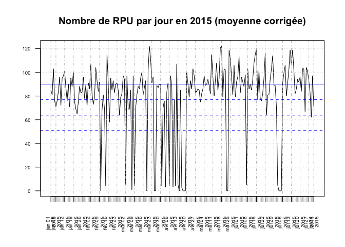 

A partir des données corrigées on peut fixer le seuil à partir ququel le nombre de RPU peut être considéré comme suspect à :

$S = \mu - 3\sigma$

$S = 51$


soit: 26 jours.

Tableau des seuils par établissement
------------------------------------

La routine _seuil_ établit la liste des seuils par établissement (la routine modifie légèrement l'algoritme précédent pour étiter des seuils négatifs lorsque les effectifs sont faibles ou les valeurs manquantes trop nombreuses):

Un nombre quotidien de RPU inférieur à ce seuil est considéré comme anormal jusqu'à preuve du contraire:

```
[1] "Wis = 15"
[1] "Hag = 84"
[1] "Sav = 51"
[1] "Hus = 228"
[1] "HTP = 151"
[1] "NHC = 51"
[1] "Odi = 41"
[1] "Ane = 18"
[1] "Dts = 10"
[1] "Sel = 51"
[1] "Col = 128"
[1] "Geb = 19"
[1] "Mul = 112"
[1] "3Fr = 26"
[1] "Dia = 54"
[1] "Ros = 7"
```


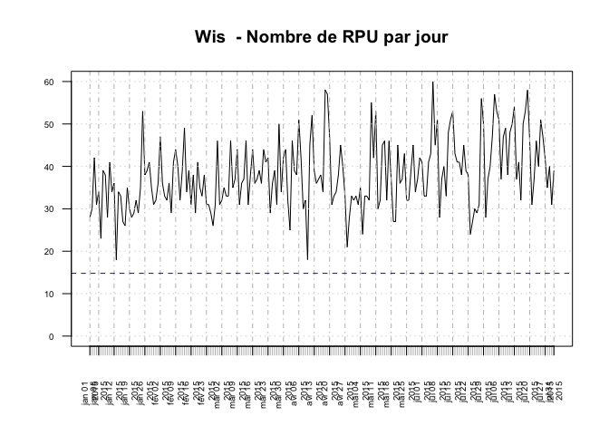 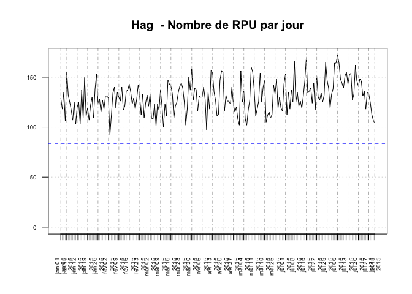 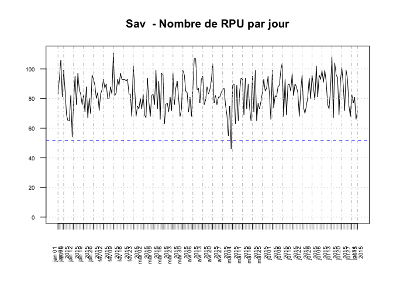 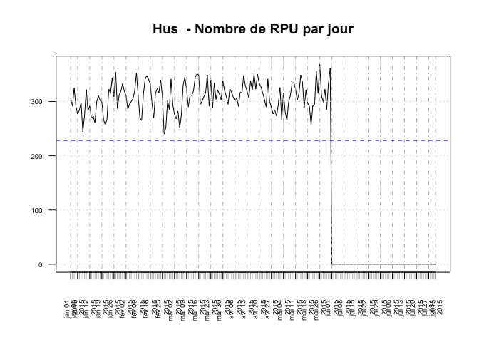 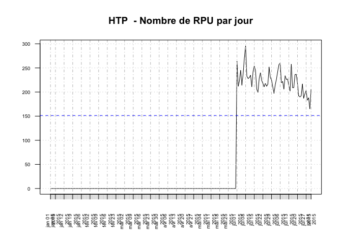 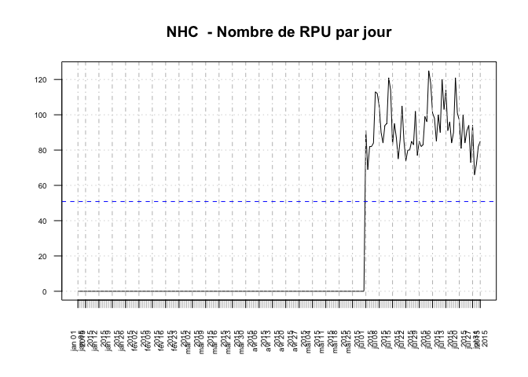 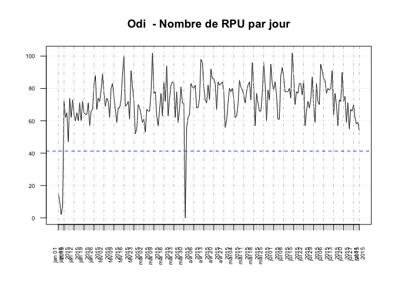 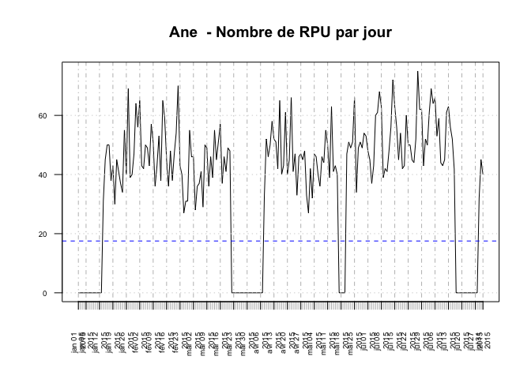 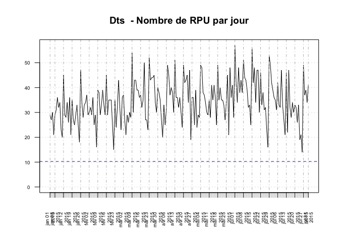  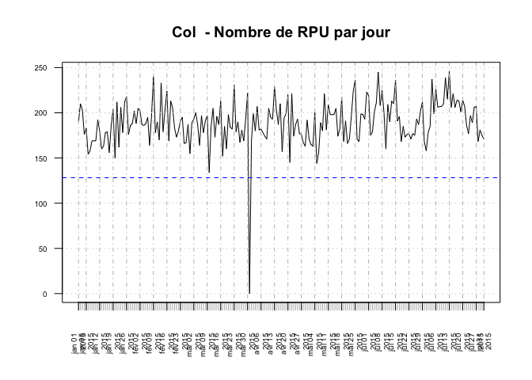 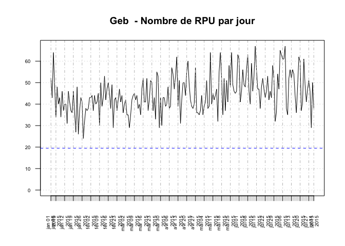 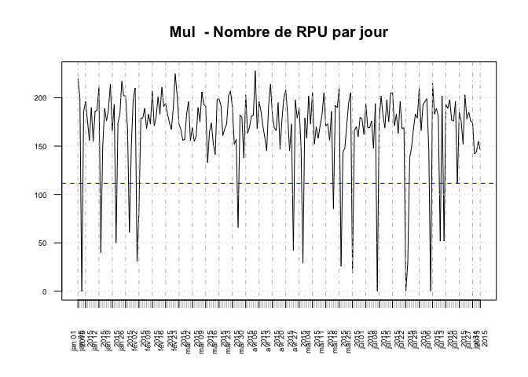 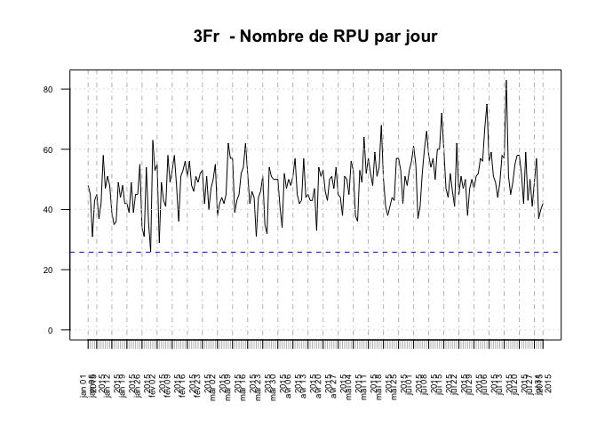 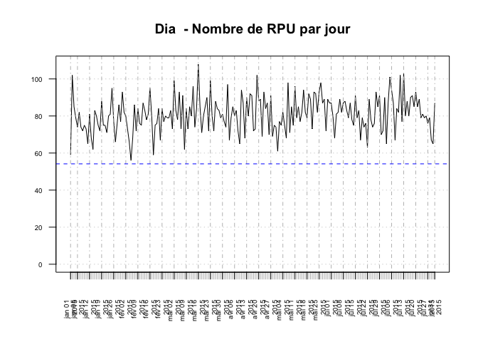 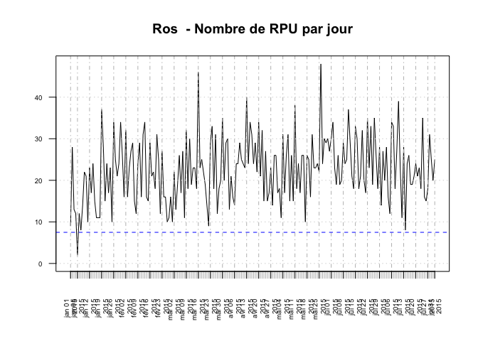 

Variabilité du codage (en cours)
=====================

On forme le rapport quotidien du nombre de RPU codés sur le nombre total de RPU transmis.

Variabilité acceptable: différence interquartile ?


```
##       rpru             dp           dp.code      
##  Min.   :18.00   Min.   :14.00   Min.   :0.2692  
##  1st Qu.:32.00   1st Qu.:28.00   1st Qu.:0.8404  
##  Median :37.00   Median :32.00   Median :0.9060  
##  Mean   :37.94   Mean   :33.15   Mean   :0.8777  
##  3rd Qu.:43.00   3rd Qu.:37.00   3rd Qu.:0.9565  
##  Max.   :60.00   Max.   :60.00   Max.   :1.0000
```

```
## [1] 0.1125736
```

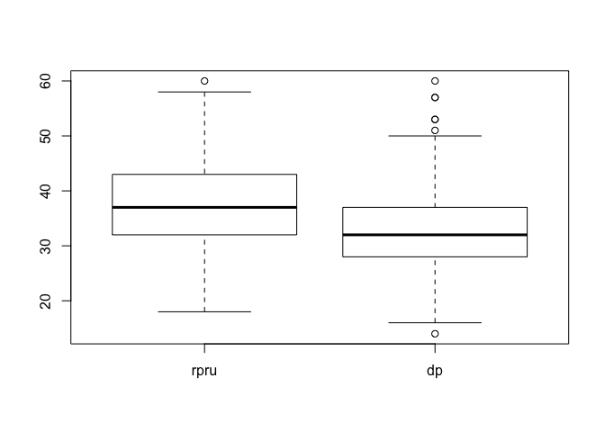 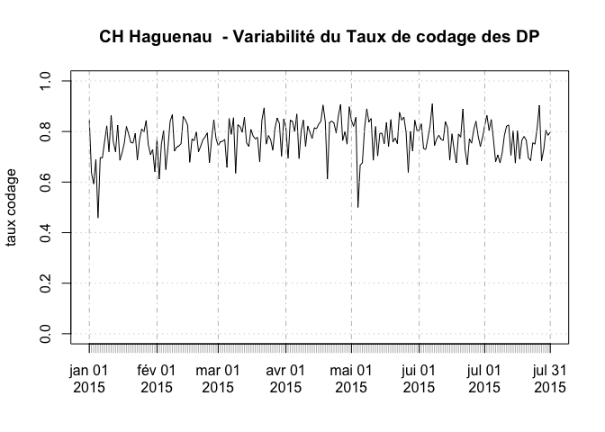 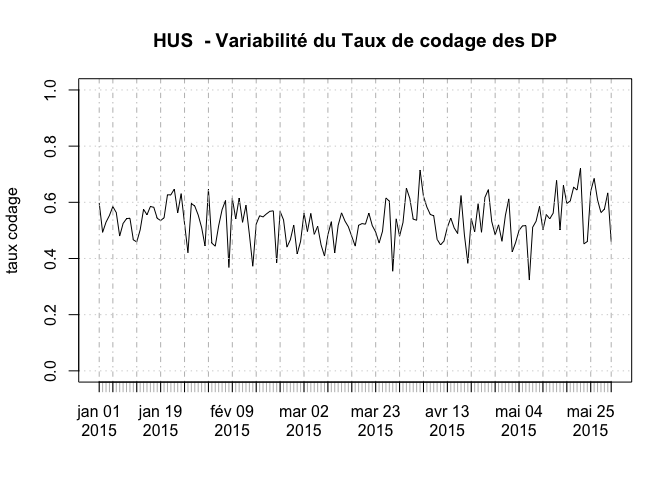 

