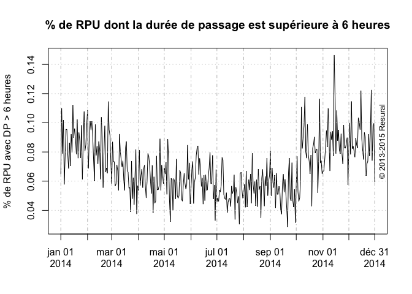

# Temps de passage
JcB  
11/02/2015  

Temps de passage est la durée entre l'heure d'entrée et l'heure de sortie.


```
## Warning: package 'zoo' was built under R version 3.1.3
```

```
## [1] "2014-01-01"
```

```
## [1] "2014-12-31"
```

Données générales
-----------------

```r
# e <- ymd_hms(d14$ENTREE) # vecteur des entrées
# s <- ymd_hms(d14$SORTIE) # vecteur des sorties
# d <- as.numeric((s-e)/60) # vecteur des durées de passage en minutes
# alternative: d <- difftime(s, e, unit = "mins") voir ?difftime pour plus de détails.

sdp <- summary(d)
sdp
```

```
##    Min. 1st Qu.  Median    Mean 3rd Qu.    Max.    NA's 
## -3959.0    55.0   108.0   155.2   200.0 87930.0   42384
```

```r
inf <- d[d < 0 & !is.na(d)] # dp négatives
zero <- d[d == 0 & !is.na(d)] # dp nulles
na <- d[is.na(d)] # les NA

sup1 <- d[d > 1*24*60 & !is.na(d)] # dp > 1 jour
sup2 <- d[d > 2*24*60 & !is.na(d)] 
sup3 <- d[d > 3*24*60 & !is.na(d)]
sup4 <- d[d > 4*24*60 & !is.na(d)]
sup5 <- d[d > 5*24*60 & !is.na(d)]
sup6 <- d[d > 6*24*60 & !is.na(d)] # dp > 6 jour
sup6/(24*60) # 3 dossiers > 6 jours
```

```
## [1]  6.309722 61.057639 61.060417 30.745139
```

```r
# nb de durée de passage incomplète par établisement
dp.na <- d14$FINESS[is.na(d14$DPAS)]
sdp.na <- summary(na)
nfiness <- summary(d14$FINESS) # nb de rpu par établissement
round(sdp.na * 100 / nfiness, 2) # % de durée de passage in complète
```

```
## Warning in sdp.na * 100/nfiness: la taille d'un objet plus long n'est pas
## multiple de la taille d'un objet plus court
```

```
##    3Fr    Alk    Ane    Col    Dia    Dts    Geb    Hag    Hus    Mul 
##     NA     NA     NA    NaN     NA     NA 264.50     NA     NA     NA 
##    Odi    Ros    Sav    Sel    Wis 
##    NaN     NA     NA 147.02     NA
```

```r
# présentation en tableau
t <- rbind(sdp.na, nfiness, round(sdp.na * 100 / nfiness, 2))
```

```
## Warning in sdp.na * 100/nfiness: la taille d'un objet plus long n'est pas
## multiple de la taille d'un objet plus court
```

```
## Warning in rbind(sdp.na, nfiness, round(sdp.na * 100/nfiness, 2)): number
## of columns of result is not a multiple of vector length (arg 1)
```

```r
rownames(t) <- c("RPUa", "RPUt", "%")
t
```

```
##        3Fr   Alk  Ane   Col   Dia  Dts     Geb   Hag   Hus   Mul   Odi
## RPUa    NA    NA   NA   NaN    NA   NA 42384.0    NA    NA    NA   NaN
## RPUt 16134 12660 7418 67378 29410 3910 16024.0 39938 61793 59471 24956
## %       NA    NA   NA   NaN    NA   NA   264.5    NA    NA    NA   NaN
##       Ros   Sav      Sel   Wis
## RPUa   NA    NA 42384.00    NA
## RPUt 7210 29445 28828.00 12158
## %      NA    NA   147.02    NA
```

Choix de l'établissement
------------------------


RPU utilisés (reco FEDORU)
--------------------------

On ne garde que les RPU avec une durée de passage exploitable et qui soit positive et inférieure ou égale à 48 heures.


- nombre de RPU exploitable: 48 294
- nombre de RPU totaux: 59 471

Durée moyenne de passage
-------------------------

  
- moyenne durée de passage: 189.1939578 minutes
- médiane durée de passage: 153 minutes


Analyse des durées de passage > 6 heures
----------------------------------------

- p6h: liste des RPU dont la durée de passage est supérieure à 6 heures
- p6h.jour: total journalier des RPU dont la durée de passage est supérieure à 6 heures (vecteur de 365 jpours). Il peut y avoir des jours vides, soit parce que le jour n'a pas été renseigné, soit parce qu'aucun passage n'a dépassé 6 heures.


```r
# RPU avec durée de passage > 6h. 
p6h <- p14[p14$DPAS > 6*60, c("ENTREE", "FINESS")]
p6h.jour <- tapply(as.Date(p6h$ENTREE), as.Date(p6h$ENTREE), length) # RPU de plus de 6 heures par jour

# PB: ILPEUT Y AVOIR DES JOURS SANS PASSAGE  > 6 HEURES (EX. SELESTAT) => FAIRE UN MERGING AVEC UN CALENDRIER.
# OK: AJUSTER LE CALENDRIER 0 LA TAILLE DE D14

p6h.jour <- aligne.sur.calendrier(min(d14$ENTREE), max(d14$ENTREE), p6h.jour)

summary(p6h.jour) # résumé passage de plus de 6 heures"
```

```
##    calendrier              rpu       
##  Min.   :2014-01-01   Min.   : 1.00  
##  1st Qu.:2014-04-02   1st Qu.:10.75  
##  Median :2014-07-02   Median :15.00  
##  Mean   :2014-07-02   Mean   :15.21  
##  3rd Qu.:2014-10-01   3rd Qu.:20.00  
##  Max.   :2014-12-31   Max.   :38.00  
##                       NA's   :5
```

```r
sum(is.na(p6h.jour)) # nb de jours sur la période sans passage > 6 heures
```

```
## [1] 5
```

```r
mean(is.na(p6h.jour)) # idem en %
```

```
## [1] 0.006849315
```

Aspect graphique
----------------

      

Passages des plus de 75 ans
===========================

Patients agés de 75 ans ou plus.

```r
pop75 <- p14[p14$AGE > 74,]

summary(pop75$DPAS)
```

```
##    Min. 1st Qu.  Median    Mean 3rd Qu.    Max. 
##     1.0   173.0   274.0   290.5   379.2  1440.0
```

```r
pop75.jour <- tapply(as.Date(pop75$ENTREE), as.Date(pop75$ENTREE), length)
pop75.jour <- aligne.sur.calendrier(min(as.Date(pop75$ENTREE),na.rm=TRUE), max(as.Date(pop75$ENTREE),na.rm=TRUE), pop75.jour)

# plot(xts(pop75.jour, order.by = as.Date(rownames(pop75.jour))), minor.ticks = FALSE, ylab = "Nombre de passage (mn)", main = "Evolution du nombre de passage par jour pour les 75 ans et plus")

plot(xts(pop75.jour$rpu, order.by = as.Date(pop75.jour$calendrier)), minor.ticks = FALSE, ylab = "Nombre de passage (mn)", main = "Evolution du nombre de passage par jour pour les 75 ans et plus")

lines(rollmean(xts(pop75.jour$rpu, order.by = as.Date(pop75.jour$calendrier)), k = 7), col = "red", lwd = 2)
copyright()
```

 
Proportion des 75 ans par rapport à tous les RPU
--------------------------------------------------


```r
pop.tot <- tapply(as.Date(p14$ENTREE), as.Date(p14$ENTREE), length)
pop.tot <- aligne.sur.calendrier(min(as.Date(pop75$ENTREE),na.rm=TRUE), max(as.Date(pop75$ENTREE),na.rm=TRUE), pop.tot)
r <- pop75.jour$rpu * 100 / pop.tot$rpu
summary(r)
```

```
##    Min. 1st Qu.  Median    Mean 3rd Qu.    Max.    NA's 
##   1.818   8.333  10.400  10.560  12.700  24.040      19
```

```r
plot(xts(r, order.by = as.Date(rownames(r))), minor.ticks = FALSE, ylab = "% de 75 ans", main = "Proportion de 75 ans et plus parmis des RPU")
lines(rollmean(xts(r, order.by = as.Date(rownames(r))), k = 7), col = "blue", lwd = 2)
```

 

Taux hospitalisation
====================

Pour les plus de 75 ans
-----------------------


```r
source(paste0(path, "new_functions.R")) # f0nctopn mode.sotie()
ms <- mode.sortie(pop75) # plantage car les tableaux sont de taille inégale => rajouter aligne.sur.calendrier
head(ms)
```

```
##         date passages.jour.rpu hospit.jour mutations.jour.rpu
## 1 2014-01-02                14           4                  4
## 2 2014-01-03                19           8                  8
## 3 2014-01-04                13           3                  3
## 4 2014-01-05                16           7                  7
## 5 2014-01-06                17          10                 10
## 6 2014-01-07                15          10                  9
##   transfert.jour.rpu taux.hosp
## 1                  0     28.57
## 2                  0     42.11
## 3                  0     23.08
## 4                  0     43.75
## 5                  0     58.82
## 6                  1     66.67
```

```r
hosp.xts <- xts(ms, order.by = as.Date(ms$date))
plot(hosp.xts$taux.hosp, minor.ticks = FALSE, ylab = "Taux d'hospitalisaton pour les 75 ans", main = "Taux d'hospitalisation")
```

 

Question complémentaire (Schiber)
=================================


```r
# on ajoute une colonne pour les territoires
d14 <- add.territoire(d14)

# RPU > 74 ans
d14.pop75 <- d14[d14$AGE > 74,]

# nb de RPU > 74 ans par finess
rpu.finess.75ans <- tapply(as.Date(d14.pop75$ENTREE), d14.pop75$FINESS, length)
#  nb de RPU > 74 ans par territoire
rpu.territoire.75 <- tapply(as.Date(d14.pop75$ENTREE), d14.pop75$TERRITOIRE, length)
# nb de RPU par territoires
rpu.territoire <- tapply(as.Date(d14$ENTREE), d14$TERRITOIRE, length)
# nb de RPU par Finess
rpu.finess <- tapply(as.Date(d14$ENTREE), d14$FINESS, length)
# % de Rpu > 74 ans par finess
round(rpu.finess.75ans * 100/ rpu.finess, 2)
```

```
##   3Fr   Alk   Ane   Col   Dia   Dts   Geb   Hag   Hus   Mul   Odi   Ros 
##    NA    NA    NA    NA    NA    NA    NA    NA    NA 12.58    NA    NA 
##   Sav   Sel   Wis 
##    NA    NA    NA
```

```r
# % de Rpu > 74 ans par territoire
round(rpu.territoire.75 * 100/ rpu.territoire, 2)
```

```
##    T4 
## 12.58
```

Durée de passage en fonction de l'heure d'arrivée
-------------------------------------------------
L'heure d'arrivée a t'elle une influence sur la durée de passage ? Les sommes cumulées des durée de passage sont elles un indicateur, notamment les périodes de tension ?

On forme un dataframe avec:

- date
- heure d'entrée
- durée de passage
- motif
- DP
- Age


```
##         0         1         2         3         4         5         6 
## 216.32838 214.90406 207.18956 231.85476 230.68996 242.21190 234.48692 
##         7         8         9        10        11        12        13 
## 226.02890 195.75825 194.81626 205.26765 223.11990 223.85709 219.75291 
##        14        15        16        17        18        19        20 
## 197.11014 194.92653 183.04241 173.30851 156.00000 136.75801 118.19686 
##        21        22        23 
##  95.05004  67.48742  41.04605
```

  

Etude du cumul des temps de passage
-----------------------------------
On étudie la somme cumulée des durées de passage par heure d'entrée.

 
Le temps cumulé le plus long s'observe à 10 heures du matin. On isole le groupe 10 heures du matin pour voir comment il évolue au cours de l'année.


```
## [1] 355
```

 

CUSUM des sommes
----------------
Remarque: ne pas confondre CUSUM et cumsum = somme cumulative des éléments d'un vecteur.

On utilise __x.sum__ qui est un vecteur constitué par la somme quotidienne des durées de passage des patients arrivés entre 10h et 10h59. Pour 2014, n = 365 jours.

A partir de ce vecteur on calcule la moyenne mobile et l'écart-type mobile sur 7 jours (pas = 7).

```
## [1] 355
```
Avec ces éléments, on peut calculer le vecteur centré et réduit des temps de passage cumulés

```r
# ec7 <- (x.sum[7:365] - rmean) /sd7
ec7 <- x.sum
max(as.Date(h10$ENTREE))
```

```
## [1] "2014-12-31"
```

```r
min(as.Date(h10$ENTREE))
```

```
## [1] "2014-01-01"
```

```r
length(x.sum)
```

```
## [1] 355
```

```r
length(sd7)
```

```
## [1] 349
```

```r
length(rmean)
```

```
## [1] 349
```

```r
# plot(ec7, type="l", main = "Courbe centrée-réduite des temps d'attente cumulés")
# 
# # source: passages.R
# c2 <- cusum.c2(ec7)
# 
# barplot(c2, ylab = "CUSUM - C2", xlab = "Jours", main = "")
# abline(h = 2, lty = 2, col = "red")
```
Le vecteur __ec7__ ne commence que le 7 janvier et ne comporte que 358 jours au lieu de 365. On note également que les fluctuations se font entre 2SD, ce qui en fait un indicateur peu sensible.

Référence sur le CUSUM:

- [Détection malformations congénitales et application avec R](http://math.univ-bpclermont.fr/biblio/rapport/sante/2010/M2_Beye_10.pdf)
- [Surveillance sanitaire à partir de donnees des services d'urgence :  modélisation de séries temporelles et analyse automatique](http://dumas.ccsd.cnrs.fr/dumas-00516268/document) + programmes R.
- [aussi](http://jess2014.emse.fr/pdf/W4-1-Sarazin-Sentinelles.pdf)


On forme la somme cumulée (CUSUM) en sommant les valeurs successives du vecteur ec7:

Variation durées de passage par mois
====================================
 

```
## Call:
##    aov(formula = DPAS ~ mois, data = dpas.heure)
## 
## Terms:
##                      mois Residuals
## Sum of Squares     278948 964935740
## Deg. of Freedom         1     48292
## 
## Residual standard error: 141.3551
## Estimated effects may be unbalanced
```

```
##                Df    Sum Sq Mean Sq F value   Pr(>F)    
## mois            1    278948  278948   13.96 0.000187 ***
## Residuals   48292 964935740   19981                     
## ---
## Signif. codes:  0 '***' 0.001 '**' 0.01 '*' 0.05 '.' 0.1 ' ' 1
```

```
## 
## Call:
## lm(formula = DPAS ~ mois, data = dpas.heure)
## 
## Coefficients:
## (Intercept)         mois  
##    184.7148       0.6896
```

```
## 
## Call:
## lm(formula = DPAS ~ mois, data = dpas.heure)
## 
## Residuals:
##     Min      1Q  Median      3Q     Max 
## -191.99 -102.23  -36.40   67.77 1253.91 
## 
## Coefficients:
##             Estimate Std. Error t value Pr(>|t|)    
## (Intercept) 184.7148     1.3605 135.773  < 2e-16 ***
## mois          0.6896     0.1846   3.736 0.000187 ***
## ---
## Signif. codes:  0 '***' 0.001 '**' 0.01 '*' 0.05 '.' 0.1 ' ' 1
## 
## Residual standard error: 141.4 on 48292 degrees of freedom
## Multiple R-squared:  0.000289,	Adjusted R-squared:  0.0002683 
## F-statistic: 13.96 on 1 and 48292 DF,  p-value: 0.0001869
```

```
## Analysis of Variance Table
## 
## Response: DPAS
##              Df    Sum Sq Mean Sq F value    Pr(>F)    
## mois          1    278948  278948   13.96 0.0001869 ***
## Residuals 48292 964935740   19981                      
## ---
## Signif. codes:  0 '***' 0.001 '**' 0.01 '*' 0.05 '.' 0.1 ' ' 1
```

