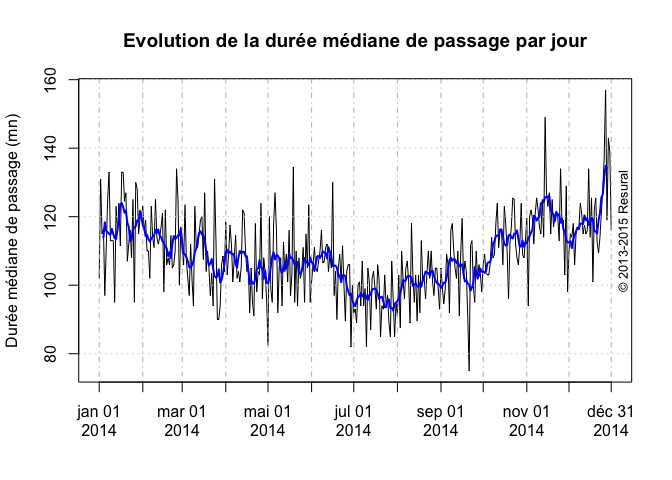
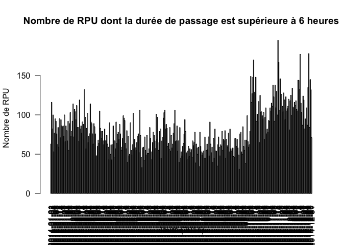
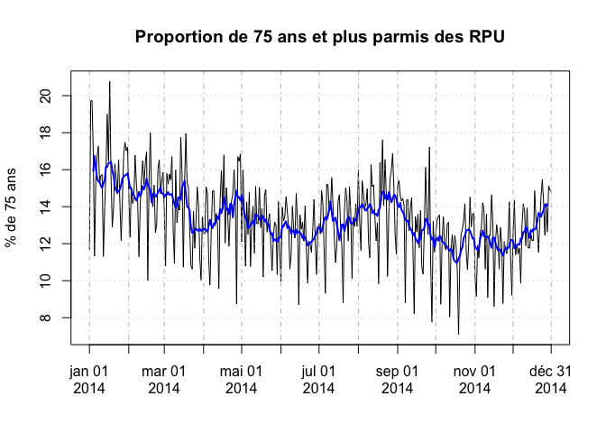
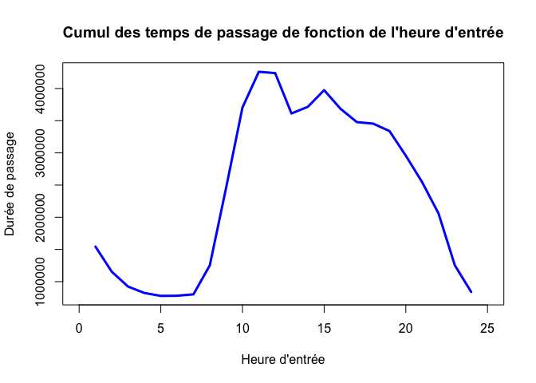

# Temps de passage
JcB  
11/02/2015  

Temps de passage est la durée entre l'heure d'entrée et l'heure de sortie.


```
## Warning: package 'zoo' was built under R version 3.1.3
```

Données générales
-----------------

```r
# e <- ymd_hms(d14$ENTREE) # vecteur des entrées
# s <- ymd_hms(d14$SORTIE) # vecteur des sorties
# d <- as.numeric((s-e)/60) # vecteur des durées de passage en minutes
# alternative: d <- difftime(s, e, unit = "mins") voir ?difftime pour plus de détails.

sdp <- summary(d)
sdp
```

```
##    Min. 1st Qu.  Median    Mean 3rd Qu.    Max.    NA's 
## -6963.0    56.0   111.0   164.7   208.0 87930.0   55161
```

```r
inf <- d[d < 0 & !is.na(d)] # dp négatives
zero <- d[d == 0 & !is.na(d)] # dp nulles
na <- d[is.na(d)] # les NA

sup1 <- d[d > 1*24*60 & !is.na(d)] # dp > 1 jour
sup2 <- d[d > 2*24*60 & !is.na(d)] 
sup3 <- d[d > 3*24*60 & !is.na(d)]
sup4 <- d[d > 4*24*60 & !is.na(d)]
sup5 <- d[d > 5*24*60 & !is.na(d)]
sup6 <- d[d > 6*24*60 & !is.na(d)] # dp > 6 jour
sup6/(24*60) # 3 dossiers > 6 jours
```

```
## [1]  6.309722 61.057639 61.060417 30.745139
```

```r
# nb de durée de passage incomplète par établisement
dp.na <- d14$FINESS[is.na(d14$DPAS)]
sdp.na <- summary(na)
nfiness <- summary(d14$FINESS) # nb de rpu par établissement
round(sdp.na * 100 / nfiness, 2) # % de durée de passage in complète
```

```
## Warning in sdp.na * 100/nfiness: la taille d'un objet plus long n'est pas
## multiple de la taille d'un objet plus court
```

```
##    3Fr    Alk    Ane    Col    Dia    Dts    Geb    Hag    Hus    Mul 
##     NA     NA     NA    NaN     NA     NA 279.68     NA     NA     NA 
##    Odi    Ros    Sav    Sel    Wis 
##    NaN     NA     NA 153.86     NA
```

```r
# présentation en tableau
t <- rbind(sdp.na, nfiness, round(sdp.na * 100 / nfiness, 2))
```

```
## Warning in sdp.na * 100/nfiness: la taille d'un objet plus long n'est pas
## multiple de la taille d'un objet plus court
```

```
## Warning in rbind(sdp.na, nfiness, round(sdp.na * 100/nfiness, 2)): number
## of columns of result is not a multiple of vector length (arg 1)
```

```r
rownames(t) <- c("RPUa", "RPUt", "%")
t
```

```
##        3Fr   Alk   Ane   Col   Dia  Dts      Geb   Hag   Hus   Mul   Odi
## RPUa    NA    NA    NA   NaN    NA   NA 55161.00    NA    NA    NA   NaN
## RPUt 20304 16673 10443 83942 36538 6839 19723.00 51247 89231 74854 31001
## %       NA    NA    NA   NaN    NA   NA   279.68    NA    NA    NA   NaN
##       Ros   Sav      Sel   Wis
## RPUa   NA    NA 55161.00    NA
## RPUt 9062 36905 35851.00 15362
## %      NA    NA   153.86    NA
```

Choix de l'établissement
------------------------


RPU utilisés (reco FEDORU)
--------------------------

On ne garde que les RPU avec une durée de passage exploitable et qui soit positive et inférieure ou égale à 48 heures.


- nombre de RPU exploitable: 60 859
- nombre de RPU totaux: 74 854

Durée moyenne de passage
-------------------------

  
- moyenne durée de passage: 191.2590085 minutes
- médiane durée de passage: 154 minutes


Analyse des durées de passage > 6 heures
----------------------------------------

- p6h: liste des RPU dont la durée de passage est supérieure à 6 heures
- p6h.jour: total journalier des RPU dont la durée de passage est supérieure à 6 heures (vecteur de 365 jpours). Il peut y avoir des jours vides, soit parce que le jour n'a pas été renseigné, soit parce qu'aucun passage n'a dépassé 6 heures.


```r
# RPU avec durée de passage > 6h. 
p6h <- p14[p14$DPAS > 6*60, c("ENTREE", "FINESS")]
p6h.jour <- tapply(as.Date(p6h$ENTREE), as.Date(p6h$ENTREE), length) # RPU de plus de 6 heures par jour

# PB: ILPEUT Y AVOIR DES JOURS SANS PASSAGE  > 6 HEURES (EX. SELESTAT) => FAIRE UN MERGING AVEC UN CALENDRIER.
# OK: AJUSTER LE CALENDRIER 0 LA TAILLE DE D14

p6h.jour <- aligne.sur.calendrier(min(d14$ENTREE), max(d14$ENTREE), p6h.jour)

summary(p6h.jour) # résumé passage de plus de 6 heures"
```

```
##    calendrier              rpu       
##  Min.   :2014-01-01   Min.   : 1.00  
##  1st Qu.:2014-04-24   1st Qu.:11.00  
##  Median :2014-08-16   Median :15.00  
##  Mean   :2014-08-16   Mean   :16.01  
##  3rd Qu.:2014-12-07   3rd Qu.:21.00  
##  Max.   :2015-03-31   Max.   :43.00  
##                       NA's   :7
```

```r
sum(is.na(p6h.jour)) # nb de jours sur la période sans passage > 6 heures
```

```
## [1] 7
```

```r
mean(is.na(p6h.jour)) # idem en %
```

```
## [1] 0.007692308
```

Aspect graphique
----------------

      

Passages des plus de 75 ans
===========================

Patients agés de 75 ans ou plus.

```r
pop75 <- p14[p14$AGE > 74,]

summary(pop75$DPAS)
```

```
##    Min. 1st Qu.  Median    Mean 3rd Qu.    Max. 
##     1.0   177.0   277.0   294.9   387.0  1440.0
```

```r
pop75.jour <- tapply(as.Date(pop75$ENTREE), as.Date(pop75$ENTREE), length)
pop75.jour <- aligne.sur.calendrier(min(as.Date(pop75$ENTREE),na.rm=TRUE), max(as.Date(pop75$ENTREE),na.rm=TRUE), pop75.jour)

# plot(xts(pop75.jour, order.by = as.Date(rownames(pop75.jour))), minor.ticks = FALSE, ylab = "Nombre de passage (mn)", main = "Evolution du nombre de passage par jour pour les 75 ans et plus")

plot(xts(pop75.jour$rpu, order.by = as.Date(pop75.jour$calendrier)), minor.ticks = FALSE, ylab = "Nombre de passage (mn)", main = "Evolution du nombre de passage par jour pour les 75 ans et plus")

lines(rollmean(xts(pop75.jour$rpu, order.by = as.Date(pop75.jour$calendrier)), k = 7), col = "red", lwd = 2)
copyright()
```

 
Proportion des 75 ans par rapport à tous les RPU
--------------------------------------------------


```r
pop.tot <- tapply(as.Date(p14$ENTREE), as.Date(p14$ENTREE), length)
pop.tot <- aligne.sur.calendrier(min(as.Date(pop75$ENTREE),na.rm=TRUE), max(as.Date(pop75$ENTREE),na.rm=TRUE), pop.tot)
r <- pop75.jour$rpu * 100 / pop.tot$rpu
summary(r)
```

```
##    Min. 1st Qu.  Median    Mean 3rd Qu.    Max.    NA's 
##   1.818   8.722  10.640  10.810  12.950  24.040      22
```

```r
plot(xts(r, order.by = as.Date(rownames(r))), minor.ticks = FALSE, ylab = "% de 75 ans", main = "Proportion de 75 ans et plus parmis des RPU")
lines(rollmean(xts(r, order.by = as.Date(rownames(r))), k = 7), col = "blue", lwd = 2)
```

 

Taux hospitalisation
====================

Pour les plus de 75 ans
-----------------------


```r
source(paste0(path, "new_functions.R")) # f0nctopn mode.sotie()
ms <- mode.sortie(pop75) # plantage car les tableaux sont de taille inégale => rajouter aligne.sur.calendrier
head(ms)
```

```
##         date passages.jour.rpu hospit.jour mutations.jour.rpu
## 1 2014-01-02                14           4                  4
## 2 2014-01-03                19           8                  8
## 3 2014-01-04                13           3                  3
## 4 2014-01-05                16           7                  7
## 5 2014-01-06                17          10                 10
## 6 2014-01-07                15          10                  9
##   transfert.jour.rpu taux.hosp
## 1                  0     28.57
## 2                  0     42.11
## 3                  0     23.08
## 4                  0     43.75
## 5                  0     58.82
## 6                  1     66.67
```

```r
hosp.xts <- xts(ms, order.by = as.Date(ms$date))
plot(hosp.xts$taux.hosp, minor.ticks = FALSE, ylab = "Taux d'hospitalisaton pour les 75 ans", main = "Taux d'hospitalisation")
```

 

Question complémentaire (Schiber)
=================================


```r
# on ajoute une colonne pour les territoires
d14 <- add.territoire(d14)

# RPU > 74 ans
d14.pop75 <- d14[d14$AGE > 74,]

# nb de RPU > 74 ans par finess
rpu.finess.75ans <- tapply(as.Date(d14.pop75$ENTREE), d14.pop75$FINESS, length)
#  nb de RPU > 74 ans par territoire
rpu.territoire.75 <- tapply(as.Date(d14.pop75$ENTREE), d14.pop75$TERRITOIRE, length)
# nb de RPU par territoires
rpu.territoire <- tapply(as.Date(d14$ENTREE), d14$TERRITOIRE, length)
# nb de RPU par Finess
rpu.finess <- tapply(as.Date(d14$ENTREE), d14$FINESS, length)
# % de Rpu > 74 ans par finess
round(rpu.finess.75ans * 100/ rpu.finess, 2)
```

```
##   3Fr   Alk   Ane   Col   Dia   Dts   Geb   Hag   Hus   Mul   Odi   Ros 
##    NA    NA    NA    NA    NA    NA    NA    NA    NA 12.85    NA    NA 
##   Sav   Sel   Wis 
##    NA    NA    NA
```

```r
# % de Rpu > 74 ans par territoire
round(rpu.territoire.75 * 100/ rpu.territoire, 2)
```

```
##    T4 
## 12.85
```

Durée de passage en fonction de l'heure d'arrivée
-------------------------------------------------
L'heure d'arrivée a t'elle une influence sur la durée de passage ? Les sommes cumulées des durée de passage sont elles un indicateur, notamment les périodes de tension ?

On forme un dataframe avec:

- date
- heure d'entrée
- durée de passage
- motif
- DP
- Age


```
##         0         1         2         3         4         5         6 
## 217.51661 212.46912 216.30695 230.81653 226.09584 241.80254 234.43628 
##         7         8         9        10        11        12        13 
## 226.03201 196.87396 196.69281 208.85529 226.40693 230.13591 220.90992 
##        14        15        16        17        18        19        20 
## 199.37705 197.59063 185.09717 173.46459 155.65285 136.77308 117.50467 
##        21        22        23 
##  93.64780  66.56237  39.18378
```

  

Etude du cumul des temps de passage
-----------------------------------
On étudie la somme cumulée des durées de passage par heure d'entrée.

 

