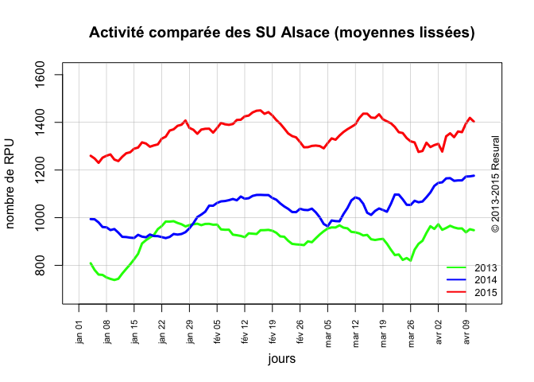
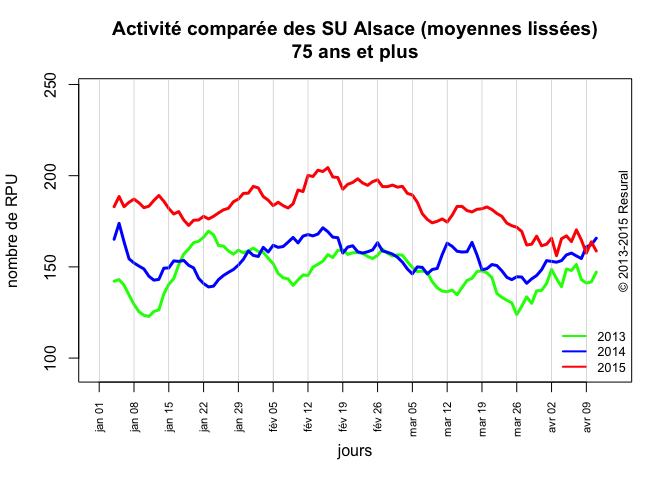
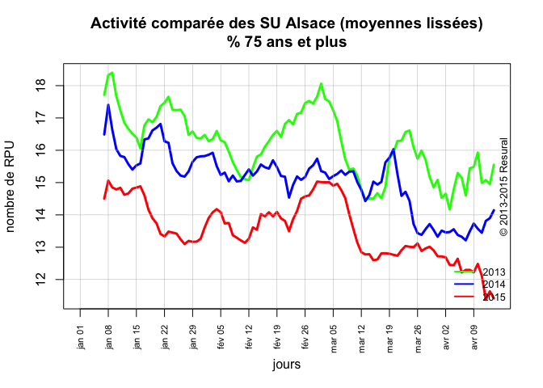

# Activité 2013-2014
jcb  
24 avril 2015  

Problème: comparer l'activité des SU pendant la période de tension au cours des années 2013 à 2015.

ref: http://stackoverflow.com/questions/4843969/plotting-time-series-with-date-labels-on-x-axis

pour les graduations de l'axe des x: http://earlh.com/blog/2009/07/07/plotting-with-custom-x-axis-labels-in-r-part-5-in-a-series/


```r
library(lubridate)
library(xts)
```

```
## Loading required package: zoo
## 
## Attaching package: 'zoo'
## 
## The following objects are masked from 'package:base':
## 
##     as.Date, as.Date.numeric
```

```r
source("../Temps_passage/passage.R")
source("activite_tension.R") # graphique

# récupérer les 3 années
load("~/Documents/Stat Resural/RPU_2014/rpu2014d0112_c2.Rda")
load("~/Documents/Stat Resural/RPU_2014/rpu2015d0112_provisoire.Rda")
load("~/Documents/Stat Resural/RPU_2013/rpu2013d0112.Rda")
dx <- rbind(d1, d14, d15)

# on se limite aux 4 premier mois de l'année (pas de données pour décembre 2012)
dxt1 <- dx[as.Date(dx$ENTREE) >= "2013-01-01" & as.Date(dx$ENTREE) < "2013-04-15",]
dxt2 <- dx[as.Date(dx$ENTREE) >= "2014-01-01" & as.Date(dx$ENTREE) < "2014-04-15",]
dxt3 <- dx[as.Date(dx$ENTREE) >= "2015-01-01" & as.Date(dx$ENTREE) < "2015-04-15",]

# on forme un grand dataframe
# dt = RPU des 4 premiers mois des années 2013 à 2015
dt <- rbind(dxt1,dxt2,dxt3)

head(dt)
```

```
##                                 id CODE_POSTAL   COMMUNE DESTINATION   DP
## 1 2c9d83843bf5e01d013bf5e985d20225       67600  SELESTAT        <NA> R104
## 2 2c9d83843bf5e01d013bf5e986950226       67600  SELESTAT        <NA> J038
## 3 2c9d83843bf5e01d013bf5e987620227       67600  SELESTAT        <NA> S617
## 4 2c9d83843bf5e01d013bf5e988060228       67600  SELESTAT        <NA> M485
## 5 2c9d83843bf5e01d013bf5e9889c0229       67600 EBERSHEIM        <NA> T261
## 6 2c9d83843bf5e01d013bf5e98958022a       67560   ROSHEIM        <NA> S018
##                ENTREE             EXTRACT FINESS GRAVITE MODE_ENTREE
## 1 2013-01-01 00:04:00 2013-01-01 05:37:00    Sel       2    Domicile
## 2 2013-01-01 00:16:00 2013-01-01 05:37:00    Sel       2    Domicile
## 3 2013-01-01 00:26:00 2013-01-01 05:37:00    Sel       3    Domicile
## 4 2013-01-01 00:32:00 2013-01-01 05:37:00    Sel       2    Domicile
## 5 2013-01-01 00:41:00 2013-01-01 05:37:00    Sel       2    Domicile
## 6 2013-01-01 01:00:00 2013-01-01 05:37:00    Sel       1    Domicile
##   MODE_SORTIE      MOTIF           NAISSANCE ORIENTATION PROVENANCE SEXE
## 1    Domicile   GASTRO04 1960-04-08 00:00:00        <NA>        PEA    M
## 2    Domicile   DIVERS23 1986-03-05 00:00:00        <NA>        PEA    M
## 3    Domicile TRAUMATO10 1971-12-22 00:00:00        <NA>        PEA    M
## 4    Domicile TRAUMATO02 1927-04-27 00:00:00        <NA>        PEA    F
## 5    Domicile OPHTALMO04 1973-07-30 00:00:00        <NA>        PEA    M
## 6    Domicile TRAUMATO09 2003-05-13 00:00:00        <NA>        PEA    M
##                SORTIE TRANSPORT TRANSPORT_PEC AGE
## 1 2013-01-01 02:38:00     PERSO         AUCUN  52
## 2 2013-01-01 00:38:00     PERSO         AUCUN  26
## 3 2013-01-01 02:07:00     PERSO         AUCUN  41
## 4 2013-01-01 01:52:00      AMBU       PARAMED  85
## 5 2013-01-01 01:24:00     PERSO         AUCUN  39
## 6 2013-01-01 01:34:00     PERSO         AUCUN   9
```

```r
# pour chaque jour de la période (jours transformés en n° du jour de l'année), on calcule le nombre de RPU. On obtient une matrice de 3 lignes (1 par année) et 98 jours.
rpu.jour <- tapply(as.Date(dt$ENTREE), list(yday(as.Date(dt$ENTREE)), year(as.Date(dt$ENTREE))), length)

# La matrice est transformée en dataframe
rpu.jour <- data.frame(rpu.jour)

# auquel on ajoute une colonne de dates.On choisit arbitrairement 2015 pour les dates
x <- seq(as.Date("2015-01-01"), as.Date("2015-04-14"), 1)
rpu.jour$date <- x

head(rpu.jour)
```

```
##   X2013 X2014 X2015       date
## 1   931   972  1304 2015-01-01
## 2   849  1055  1332 2015-01-02
## 3   722  1038  1182 2015-01-03
## 4   749   982  1197 2015-01-04
## 5   760   918  1325 2015-01-05
## 6   741  1000  1241 2015-01-06
```

```r
# graphique
graphe.activite(rpu.jour)
```

 

Même chose pour les 75 ans et plus:

```r
dx75 <- dx[dx$AGE > 74,]
rpu.jour.75 <- create.dxt(dx75)
graphe.activite(rpu.jour.75, "75 ans et plus")
```

 

Proportion des 75 ans et plus au sein de l'ensemble des passages. On calcule la proportion rpu.jour.75 sur rpu.jour.

```r
prop <- rpu.jour.75[1:3] * 100 / rpu.jour[1:3]
prop$date <- rpu.jour$date
graphe.activite2(prop, "% 75 ans et plus")
```

 

