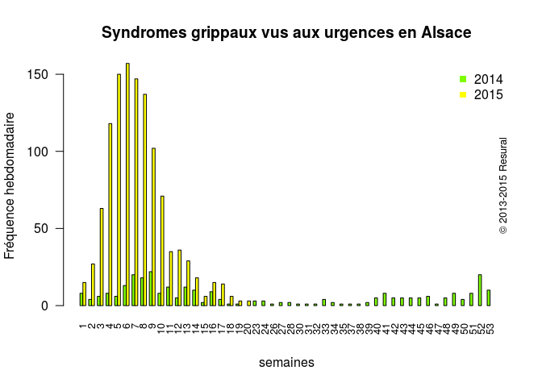

Historique
==========
Les épisodes de surcharges hospitalières (overcrowding) et notamment des services d'urgences (Emergency departement overcrowding) ont fait leur apparition dans les années 9O conjointement avec les politiques de diminution des lits hospitaliers, d'abord aux USA puis en Europe.


Le phénomène a pris de l'ampleur dans les années 2000-2005 en même temps qu'il était montré que les situations sont concomitantes d'une réduction de la qualité des soins voire d'une perte de chance pour les patients.

Depuis une dizaine d'années 60 à 80 articles dans la presse spécialisée sont consacrés à l'étude de ce phénomène qui touche tous les pays sur tous les continents (voir graphique).

Le constat
===========
C'est un phénomène saisonnier, variable selon les régions,  qui culmine en Alsace entre décembre et mai. C'est une crise longue (3-4 mois) avec des acutisations (épisode de grippe, de GE) qui semble s'aggraver d'années en années (réduction du nombre de place, augmentation mécanique de la population et son vieillissement).

Des éléments de gestion de ces crises ont été publiés dès 2006 par la DHOS dans le document

Des expériences pilotes ont été menés dans différentes régions,notamment en PACA à l'initiative de l'ORUPACA. De ces différentes expériences, il ressort les éléments suivants, concernant 4 acteurs principaux:
- les services d'urgence, lanceurs d'alerte, exposé en première ligne à l'engorgement des services et l'agressivité qui accompagne tout phénomène de surpopulation. Ils éprouvent souvent un sentiment d'impuissance et d'abandon, leurs appels paraissant sans écho.
- les directions hospitalières confrontées parmi de multiple difficultés au désarroi de leur personnel, entraînant parfois des politiques d'évitement en espérant que demain sera meilleur... en oubliant des méthodes simples et utiles comme le dialogues social.
- les ARS qui reçoivent les signaux de détresse as qui ont du mal à savoir par quel bot prendre le problème faute d'indicateurs de pilotage de crise. L'identification et la mise en place de ces indicateurs nécessite une véritable étude scientifique du problème que peu ont réellement entrepris. Qui peut dire à quelle date et où ont commencé les tensions de l'année, quand elles ont pris fin, et comment les a t'on mesurées? Sait-on seulement combien d'hôpitaux ont une cellule de veille réellement active ?
- Les SAMU sur lesquels de grands espoirs semblent reposer mais qui ne contrôlent directement que 11% du flux des patients vers les urgences (enquête DREES 2014) et qui eux-mêmes connaissent des épisodes de tensions mal documentés.

- au final il en résulte une gestion de crise faite au petit bonheur qui laisse l'ensemble des acteurs frustrés avec l'impression de travailler constamment dans l'urgence, sans rien réglé, alors que investissement humain de tous les acteurs est très important. 

Les propositions de la FEDORU
=============================
La FEDORU anime un groupe de travail __Hôpital en tension__ qui a produit un premier document de synthèse qui a été publié récemment (voir [Recommandation 2015 de la FEDORU](http://resural.fr/publications/hopital-en-tension#fedoru_het). Ce document est destiné aux SU, directions hospitalières, ARS, SAMU afin de les aider à mette en place un plan régional d'hôpital en tension.

Deux propositions font l'unanimité parmi les urgentistes:

- mettre en place un outil régional permettant aux SU de lancer des alertes de tension. Cet outil doit pouvoir être partagé par l'ensemble des acteurs:SU, directions hospitalières, ARS, SAMU. L'outil doit permettre de savoir qui lance l'alerte, pourquoi, quelles sont les actions mises en place par l'établissement selon un plan d'action cohérent et hiérarchisé comme le propose la FEDORU dans son document. Un tel outil a été mis en place en PACA. Le nombre d'alerte a augmenté de façon importante (plus de 150 alertes en janvier 2015) alors que le nombre de déclenchement de plans HET à diminué. La diffusion et le partage de l'information entraîne de facto des actions correctrices à la fois de l'établissement concerné mais aussi des établissements environnant aboutissent à une résolution de la crise avant qu'elle ne nécessite le déclenchement d'un plan HET par une direction hospitalière.
- identifier les indicateurs de tension fiables et pertinent de façon à pouvoir caractériser un phénomène et quantifier l'efficacité des mesures correctrices. Une cinquantaine d'indicateurs ont été identifiés (voir doc. FEDORU) mais aucun n'a été étudié de manière rigoureuse. La FEDORU a confié à l'ORUPACA la mise en place d'une étude multicentrique pour isoler un groupe d'indicateurs qui pourront faire l'objet d'une étude approfondie (RESURAL est partie prenante de cette étude qui recrute jusqu'au 30 avril 2015 des "experts" médicaux, paramédicaux, administratif pour émettre un jugement sur ces indicateurs en utilisant la méthode DELPHI [VOIR](http://resural.fr/publications/het-quels-indicateurs)).

Proposition de RESURAL
======================

- afin d'éviter tout malentendu il est rappelé en préambule que seul le chef d'établissement peut déclencher ou interrompre un plan hôpital en tension. Le rôle des SU se borne à celui de lanceur d'alerte. 
- chaque établissement MCO doté d'une structure d'urgence met en place une cellule de veille composée à minima du chef d'établissement ou de son représentant, du chef de service des urgences ou de son représentant, du directeur des soins infirmiers ou de son représentant. La cellule de veille se rencontre au moins une fois par jour et publie un bulletin de tension avec une note qui situe l'établissement sur une échelle de tension.
- RESURAL travaille sur un outil capable de recueillir cet indicateur et de la diffuser en temps réel aux établissement, à l'ARS Alsace aux 2 SAMU. Le site du réseau pourrait accueillir cet outil.
- l'outil doit permettre aux SU de lancer une alerte de tension. Cette alerte est diffusée au chef d'établissement et à l'ARS.
- dans un second temps, l'outil s'enrichira de la possibilité de lister les causes de tensions et les mesures prises par l'établissement(rôle exclusif du chef d'établissement), éventuellement les autres établissements et l'ARS (notamment pour les actions entreprises en direction des des établissements de deuxième et troisième ligne, la médecine libérale et les transporteurs sanitaires)
- l'outil pourrait également s'enrichir de la remontée d'indicateurs permettant à l'ARS de piloter efficacement la période de tension.
- en terme de calendrier, l'outil devra être opérationnel avant le mois de décembre 2015.


Etude de la période de tension 2014-2015 en Alsace
==================================================

Voir les cartes de tensions sur le site de [RESURAL](http://resural.fr/publications/cartes-des-tensions-en-alsace-2015)

Pour cela on forme un dataframe allant du 1er décembre 2014 au 15 avril 2015 auquel on ajoute une colonne durée de passage (DPAS) formée par la différence (en minutes) entre l'heure d'entrée et de sortie des urgences. Ne sont retenus que les temps de passages répondant aux critères de la FEDORU (supérieurs à 0 et inférieurs à 48 heures).

Les résultats de cette période sont comparés à la moyenne des résultats de 2014.

#### intégration du Finess Juridique pour la clinique Ste Odile. Erreur signalée par Mr Nold: certains RPU de Ste Odile contiennent le Finess juridique au lieu du géographique
```
d14$FINESS <- as.character(d14$FINESS)
d14$FINESS[d14$FINESS=="670780204"]<-"Odi"
d14$FINESS <-  factor(d14$FINESS) # élimine les facteurs vides

Correction faite et enregistrée sous le nom de __rpu2014d0112_c2.Rda__ (15/04/2015)
```

```{}
source("../Temps_passage/passage.R") # Analyse/Temps_passage/passage.R
path <- "../../"
load(paste0(path, "rpu2014d0112_c2.Rda")) # d14
load(paste0(path, "rpu2015d0112_provisoire.Rda")) # d15
e <- rbind(d14,d15)
d <- e[as.Date(e$ENTREE) >= "2014-12-01" & as.Date(e$ENTREE) < "2015-04-16",]
save(d, file  = "tensions2015.Rda")

```

Pour comparer on crée un fichier avec les durées de passage < 48h pour 2014
```
d14$DPAS <- as.numeric(duree.passage(d14$ENTREE, d14$SORTIE)) # on crée une colonne sup
# finalement on ne garde que les RPU avec une durée de passage exploitable et qui soit positive et inférieure ou égale à 48 heures.
d14.48 <- d14[!is.na(d14$DPAS) & d14$DPAS > 0 & d14$DPAS <= 2*24*60, ]
save(d14.48, file  = "d14_48.Rda")
```

Fichiers
--------

- d toute la base entre décembre et avril 2015
- d2 idem mais dont les durées de passage sont < 48H
- d14.48 idem d2 mais pour tout 2014

Utilisation du fichier
```{r init, echo=FALSE, warning=FALSE}
library(lubridate)
library(xts)
source("../Temps_passage/passage.R") # Analyse/Temps_passage/passage.R

load("tensions2015.Rda") # d
load("d14_48.Rda") # d14.48 durée de passage < 48h en 2014. Sert de base de comparaison

# ajout d'une colonne passages
d$DPAS <- as.numeric(duree.passage(d$ENTREE, d$SORTIE)) # on crée une colonne sup
# finalement on ne garde que les RPU avec une durée de passage exploitable et qui soit positive et inférieure ou égale à 48 heures.
d2 <- d[!is.na(d$DPAS) & d$DPAS > 0 & d$DPAS <= 2*24*60, ]
```

Durée moyenne de passage
------------------------
```{r, echo=FALSE}
mean.duree <- tapply(d2$DPAS, as.Date(d2$ENTREE), mean)

plot(xts(mean.duree, order.by = as.Date(rownames(mean.duree))), minor.ticks = FALSE, ylab = "Durée moyenne de passage (mn)", main = "Evolution de la durée moyenne de passage par jour")
lines(rollmean(xts(mean.duree, order.by = as.Date(rownames(mean.duree))), k = 7), col = "red", lwd = 2)
copyright()

median.duree <- tapply(d2$DPAS, as.Date(d2$ENTREE), median)
plot(xts(median.duree, order.by = as.Date(rownames(median.duree))), minor.ticks = FALSE, ylab = "Durée médiane de passage (mn)", main = "Evolution de la durée médiane de passage par jour")
lines(rollmean(xts(median.duree, order.by = as.Date(rownames(median.duree))), k = 7), col = "blue", lwd = 2)
copyright()

summary(d2$DPAS)

hist(d2$DPAS, breaks = 48, main = "Hisrogramme des durées de passage", xlab = "temps (minutes", ylab = "Fréquence")
abline(v = summary(d2$DPAS)["Mean"], lty = 2, col = "red")
text(summary(d2$DPAS)["Mean"]+20,30000, paste("moyenne =", summary(d2$DPAS)["Mean"], "minutes",")"), pos = 4, cex = 0.8 )

```

- moyenne durée de passage: `r mean(round(d2$DPAS, 0))` minutes
- médiane durée de passage: `r median(d2$DPAS)` minutes

Analyse des durées de passage > 6 heures
----------------------------------------
- p6h: liste des RPU dont la durée de passage est supérieure à 6 heures
- p6h.jour: total journalier des RPU dont la durée de passage est supérieure à 6 heures (vecteur de 365 jours). Il peut y avoir des jours vides, soit parce que le jour n'a pas été renseigné, soit parce qu'aucun passage n'a dépassé 6 heures.

```{r, echo=FALSE}
# RPU avec durée de passage > 6h. 
p6h <- d2[d2$DPAS > 6*60, c("ENTREE", "FINESS")]
p6h.jour <- tapply(as.Date(p6h$ENTREE), as.Date(p6h$ENTREE), length) # RPU de plus de 6 heures par jour

# PB: ILPEUT Y AVOIR DES JOURS SANS PASSAGE  > 6 HEURES (EX. SELESTAT) => FAIRE UN MERGING AVEC UN CALENDRIER.
# OK: AJUSTER LE CALENDRIER 0 LA TAILLE DE D14

p6h.jour.a <- aligne.sur.calendrier(min(d2$ENTREE), max(d2$ENTREE), p6h.jour)

summary(p6h.jour.a) # résumé passage de plus de 6 heures"
sum(is.na(p6h.jour.a)) # nb de jours sur la période sans passage > 6 heures
mean(is.na(p6h.jour.a)) # idem en %

# % de passages de plus de 6 heures pendant la période
print("% de passages de plus de 6 heures pendant la période de tension")
a <- rbind(table(p6h$FINESS), table(d2$FINESS), round(table(p6h$FINESS)*100/table(d2$FINESS),2))
rownames(a) <- c("passages > 6h", "passages totaux", "% > 6h")
a

# passage de plus de 6 heures en 2014
print("% de passages de plus de 6 heures en 2014")
p14.6h <- d14.48[d14.48$DPAS > 6*60, c("ENTREE", "FINESS")]
b <- rbind(table(p14.6h$FINESS), table(d14.48$FINESS), round(table(p14.6h$FINESS)*100/table(d14.48$FINESS),2))
rownames(b) <- c("passages > 6h", "passages totaux", "% > 6h")
b

# comparaison des 2 périodes par hopitaux
print("comparaison des 2 périodes par hopitaux")
c <- rbind(a[3,], b[3,], a[3,]-b[3,])
rownames(c) <- c("Tension","2014", "différence")
c

barplot(c[1:2,],beside = TRUE, las = 2, main = "Nombre de passages > 6h\ Période de tension vs. 2014", ylab = "% de plus de 6h")

```

Le nombre des passages augmente différemment selon la taille de l'établissement et son statut juridique.


Proportion des 75 ans et plus par jour
--------------------------------------
Quelle est la part des personnes âgées dans les épisodes de tension ?

### Chiffres 2014 pour toute la population
```{r p2014, echo=FALSE}
# pop 2014 dont la durée de passage est < 48h: d14.48

# Idem mais dont l'age est sup ou égal à 18 ans
pop.2014.adulte <- d14.48[d14.48$AGE > 17,]
# nb de passages par jour en 2014 pour les adultes
n.adultes.jour.2014 <- tapply(as.Date(pop.2014.adulte$ENTREE), as.Date(pop.2014.adulte$ENTREE), length)
# nb MOYEN de passages par jour en 2014 pour les adultes
m.adultes.jour.2014 <- mean(n.adultes.jour.2014)

# nb de passages par jour en 2014
n.jour.2014 <- tapply(as.Date(d14.48$ENTREE), as.Date(d14.48$ENTREE), length)

# moyenne de passages par jour
m.rpu.jour.2014 <- mean(n.jour.2014)
```

- nombre moyen de passages par jour en 2014: `r m.rpu.jour.2014`

###  Chiffres 2014 pour la population de 75 ans
```{r p75.2014, echo=FALSE}
# population des 75 ans en 2014
p75.2014 <- d14.48[d14.48$AGE > 74,]
# nb de 75 ans par jour en 2014
n.75.jour.2014 <- tapply(as.Date(p75.2014$ENTREE), as.Date(p75.2014$ENTREE), length)
 # nb moyen de 75 ans / jour en 2014
m.75.jour.2014 <- mean(n.75.jour.2014)
# taux moyen de 75 ans par rapport à la population
tx.moyen.2014 <- m.75.jour.2014 / m.rpu.jour.2014
```

### Période de tension: toute la population
```{r p_tension, echo=FALSE}
# nombre de passages par jour pendant la tension
n.jour <- tapply(as.Date(d2$ENTREE), as.Date(d2$ENTREE), length)
# moyenne par jour
m.n.jour.tension <- mean(n.jour)
```

- nombre moyen de passages par jour en période de tension: `r round(m.n.jour.tension,0)`

#### comparaison nombre de RPU par jour en 2014 et en période de tension:
```{r comp_nb_passages, echo=FALSE}
# utilise la librairie schoRsch pour formater le résultat du test t. Cette librairie permet également de formater le CHI2, anova, cor. A explorer
t <- t.test(n.jour, n.jour.2014)
# install.packages("schoRsch")
library(schoRsch)
library(xtable)
t_out(t) # fonction spécifique de schoRsch

# pour latex avec schoRsch
#xtable(t_out(t))

# boxplot
boxplot(n.jour, n.jour.2014, names = c("Tensions","2014"), main = "Nombre de passges aux urgences")

```
Le nombre de passage en période de tension est statistiquement plus important que le reste de l'année.

### Période de tension: population des 75 ans
```{r p75, echo=FALSE}
# population des 75 ans pendant la tension
p75 <- d2[d2$AGE > 74,] # population de 75 ans et plus pendant la tension
# nb de 75 ans par jour pendant la tension
n.75.jour <- tapply(as.Date(p75$ENTREE), as.Date(p75$ENTREE), length)

# taux = nb de 75 ans par jour / nb de RPU par jour
tx <- round(n.75.jour * 100 / n.jour, 2)
# graphe
plot(xts(tx, order.by = as.Date(names(tx))), minor.ticks = FALSE, ylab = "% de 75 ans et plus", main = "% de patients de 75 ans et plus")
lines(rollmean(xts(tx, order.by = as.Date(names(tx))), k = 7), col = "blue", lwd = 2)
abline(h = tx.moyen.2014 * 100, lty = 2, col = "red")
```

La moyenne des passages des patients de 75 ans et plus est représentée par la ligne pointillée rouge. Par rapport à cette ligne on note 2 pics d'augmentation:

- la période des fêtes
- fin février-début mars

### si on ne garde que la population adulte (plus de 18 ans) pendant la tension
```{r p18, echo=FALSE}
# pop > 18 ans pendant la tension
p18 <- d2[d2$AGE > 17,]
# nb de 18 ans par jour
n.18.jour <- tapply(as.Date(p18$ENTREE), as.Date(p18$ENTREE), length)
# taux = nb de 75 ans par jour / nb de RPU par jour dans la pop. adulte
tx <- round(n.75.jour * 100 / n.18.jour, 2)
summary(tx)
sd(tx)
# taux moyen 2014
tx.moyen.adulte.2014 <- m.75.jour.2014 / m.adultes.jour.2014
tx.moyen.adulte.2014

# graphe
plot(xts(tx, order.by = as.Date(names(tx))), minor.ticks = FALSE, ylab = "% de 75 ans et plus", main = "% de patients de 75 ans et plus\n dans la population adulte")
lines(rollmean(xts(tx, order.by = as.Date(names(tx))), k = 7), col = "blue", lwd = 2)

abline(h = tx.moyen.adulte.2014 * 100, lty = 2, col = "red")
```


### Durée moyenne de passage
```{r p75_dmp, echo=FALSE}
p75 <- d2[d2$AGE > 74,]
m.dpas.75 <- tapply(p75$DPAS, as.Date(p75$ENTREE), mean)
plot(xts(m.dpas.75, order.by = as.Date(names(m.dpas.75))), minor.ticks = FALSE, ylab = "Durée moyenne de passage (mn)", main = "Evolution de la durée moyenne de passage par jour\n patients de 75 ans et plus")
lines(rollmean(xts(m.dpas.75, order.by = as.Date(names(m.dpas.75))), k = 7), col = "blue", lwd = 2)

```

- Le nombre de passage est plus important en période de tension
- le nombre de personnes âgées est plus important
- durée de passage sont augmentées

rôle de la grippe
--------------------


- mode de transport indicateurs

- tableaux actions: Christine mail du 18/12/2014

