# Completude
jcb  
30 mars 2015  
Complétude des données
======================

Score de completude = somme des complétudes de chaque item.

Ce chapitre utilise le fichier source("../../RESURAL/Trame_commune/rapport_2014.R") qui possède deux fonctions pour calculer la complétude et dessiner le diagramme en radar correspondant.

MAJ
---

- 12/4/2014: enrgistrement des graphiques, impression du tableau de completude

TODO
----

Données
-------

connexion MAC:
```{}
path <- "../"
source(paste0(path, "../../RESURAL/Trame_commune/rapport_2014.R"))
load(paste0(path, "rpu2015d0112.Rda")) # 2015
```
Connexion XPS
```{}
#source(paste0(path, "../../FEDORU/Trame_commune/rapport_2014.R"))
source("/home/jcb/Documents/Resural/FEDORU/Trame_Commune/rapport_2014.R")

```


Motif de passage
----------------
Les motifs de passage ou de recours doivent être codés en CIM10. Certains établissements ne le font pas (Colmar), ce qui entraîne une fausse complétude car le champ n'est pas vide mais inexploitable. La fonction détecte les codes non CIM10 sur la base suivante: a minima un code CIM10 commence par une lettre majuscule suivie de deux chiffres ("^[A-Z][0-9][0-9]").


```
##    Hop Motifs CIM10 Completude
## 1  Sav   2529  1216      48.08
## 2  Sel   2608  2558      98.08
## 3  Mul   5195  4180      80.46
## 4  Dts    936   915      97.76
## 5  Dia   2401  2361      98.33
## 6  Hag   3828   774      20.22
## 7  3Fr   1346    25       1.86
## 8  Alk   1321   273      20.67
## 9  Hus   9190  5058      55.04
## 10 Wis   1029  1019      99.03
## 11 Ros    581   529      91.05
## 12 Geb   1233  1226      99.43
## 13 Col   5657     0          0
## 14 Odi   1857  1614      86.91
## 15 Ane    798     0          0
```

Complétude régionale
--------------------
C'est la complétude calculée pour tous les RPU quelque soit l'établissement producteur.


```r
completude_region <- completude(dx)
radar.completude(completude_region)
```

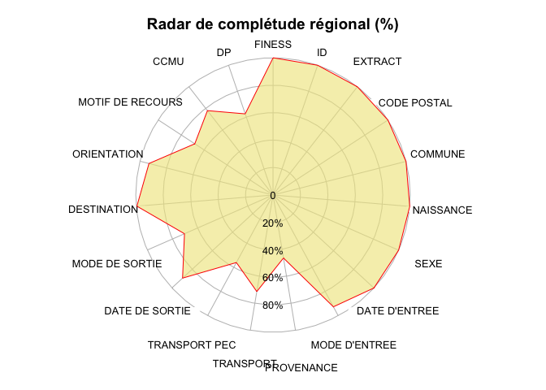 

```r
n.items <- length(completude_region) # nb d'items pris en compte N = 19

completude_region
```

```
          FINESS               ID          EXTRACT      CODE POSTAL 
          100.00           100.00           100.00           100.00 
         COMMUNE        NAISSANCE             SEXE    DATE D'ENTREE 
           99.95           100.00           100.00           100.00 
   MODE D'ENTREE       PROVENANCE        TRANSPORT    TRANSPORT PEC 
           92.60            46.55            71.34            55.98 
  DATE DE SORTIE   MODE DE SORTIE      DESTINATION      ORIENTATION 
           89.51            70.42            99.52            93.26 
MOTIF DE RECOURS             CCMU               DP 
           68.13            77.87            62.51 
```

```r
score.region <- sum(completude_region) / n.items
```

Score de complétude régional: 85.67 sur 100.

Completude par établissement
----------------------------

#### Score de completude 
score = somme des completude de chaque item divisé par le nombre d'items. Varie de 0 à 100. 

TOdo: 

- calculer un sous score par chapitre selon découpage Fedoru
- comparer le score en foction du logiciel utilisé et sa version.


```r
for(i in 1:length(finess)){
  # données de l'établissement
  d <- dx[dx$FINESS == finess[i],]
  
  # completude de l'établissement
  d.completude <- completude(d)
  d.completude["MOTIF DE RECOURS"] <- as.numeric(m[i,4])
  
  radar.completude(d.completude, finess[i])
  # completude régionale
  radial.plot(completude_region, rp.type="p",radial.lim=c(0,100),start = 1.57,clockwise = TRUE, line.col = "blue", add = TRUE)
  
  # tableau de complétude
  print(d.completude)
  
  # note globale sur 100
  score.local <- sum(d.completude) / n.items
  cat(paste0("Score local: ", round(score.local, 2)), " sur 100")
}
```

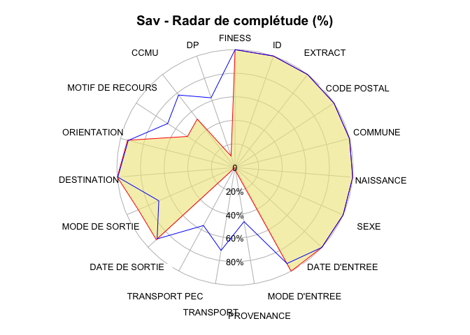 

```
          FINESS               ID          EXTRACT      CODE POSTAL 
          100.00           100.00           100.00           100.00 
         COMMUNE        NAISSANCE             SEXE    DATE D'ENTREE 
          100.00           100.00           100.00           100.00 
   MODE D'ENTREE       PROVENANCE        TRANSPORT    TRANSPORT PEC 
          100.00             2.93             0.00             0.00 
  DATE DE SORTIE   MODE DE SORTIE      DESTINATION      ORIENTATION 
           90.51            89.36           100.00            93.90 
MOTIF DE RECOURS             CCMU               DP 
           48.08            52.08            10.28 
Score local: 73.01  sur 100
```

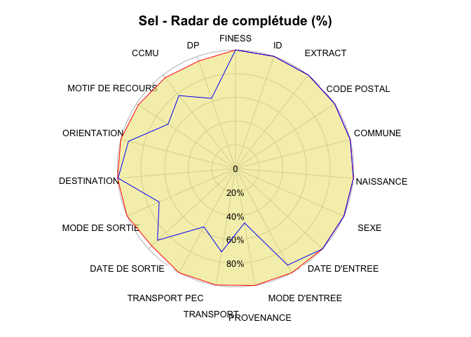 

```
          FINESS               ID          EXTRACT      CODE POSTAL 
          100.00           100.00           100.00           100.00 
         COMMUNE        NAISSANCE             SEXE    DATE D'ENTREE 
          100.00           100.00           100.00           100.00 
   MODE D'ENTREE       PROVENANCE        TRANSPORT    TRANSPORT PEC 
          100.00           100.00            99.62           100.00 
  DATE DE SORTIE   MODE DE SORTIE      DESTINATION      ORIENTATION 
           96.28           100.00           100.00           100.00 
MOTIF DE RECOURS             CCMU               DP 
           98.08            96.93            95.82 
Score local: 99.3  sur 100
```

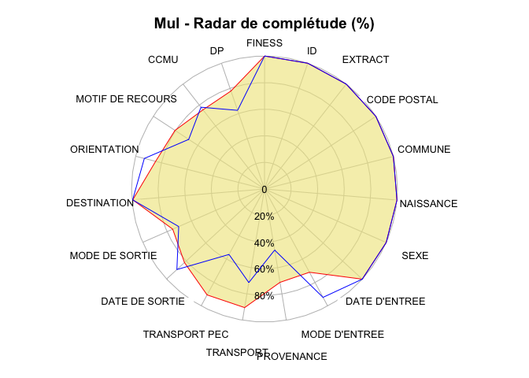 

```
          FINESS               ID          EXTRACT      CODE POSTAL 
          100.00           100.00           100.00           100.00 
         COMMUNE        NAISSANCE             SEXE    DATE D'ENTREE 
           99.96           100.00           100.00           100.00 
   MODE D'ENTREE       PROVENANCE        TRANSPORT    TRANSPORT PEC 
           71.16            71.16            90.41            90.59 
  DATE DE SORTIE   MODE DE SORTIE      DESTINATION      ORIENTATION 
           81.75            75.36            99.44            84.49 
MOTIF DE RECOURS             CCMU               DP 
           80.46            75.40            77.88 
Score local: 89.37  sur 100
```

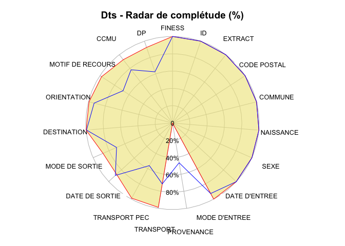 

```
          FINESS               ID          EXTRACT      CODE POSTAL 
          100.00           100.00           100.00           100.00 
         COMMUNE        NAISSANCE             SEXE    DATE D'ENTREE 
          100.00           100.00           100.00           100.00 
   MODE D'ENTREE       PROVENANCE        TRANSPORT    TRANSPORT PEC 
          100.00             0.11            98.82            98.82 
  DATE DE SORTIE   MODE DE SORTIE      DESTINATION      ORIENTATION 
           87.61            87.50           100.00            99.32 
MOTIF DE RECOURS             CCMU               DP 
           97.76            92.63            92.31 
Score local: 92.36  sur 100
```

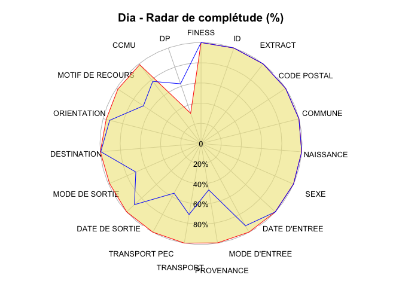 

```
          FINESS               ID          EXTRACT      CODE POSTAL 
          100.00           100.00           100.00           100.00 
         COMMUNE        NAISSANCE             SEXE    DATE D'ENTREE 
          100.00           100.00           100.00           100.00 
   MODE D'ENTREE       PROVENANCE        TRANSPORT    TRANSPORT PEC 
           99.79            99.79           100.00            99.92 
  DATE DE SORTIE   MODE DE SORTIE      DESTINATION      ORIENTATION 
          100.00            98.83           100.00            96.83 
MOTIF DE RECOURS             CCMU               DP 
           98.33            98.88            31.61 
Score local: 96  sur 100
```

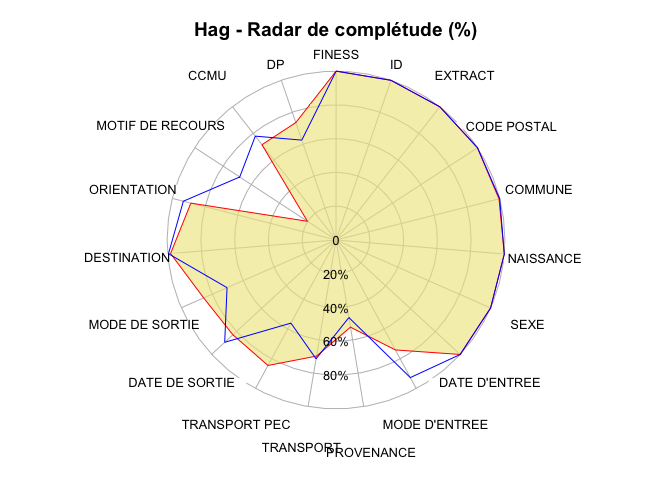 

```
          FINESS               ID          EXTRACT      CODE POSTAL 
          100.00           100.00           100.00           100.00 
         COMMUNE        NAISSANCE             SEXE    DATE D'ENTREE 
           99.53           100.00           100.00           100.00 
   MODE D'ENTREE       PROVENANCE        TRANSPORT    TRANSPORT PEC 
           73.98            52.32            69.70            84.51 
  DATE DE SORTIE   MODE DE SORTIE      DESTINATION      ORIENTATION 
           82.94            85.53            98.29            88.67 
MOTIF DE RECOURS             CCMU               DP 
           20.22            71.45            73.48 
Score local: 84.24  sur 100
```

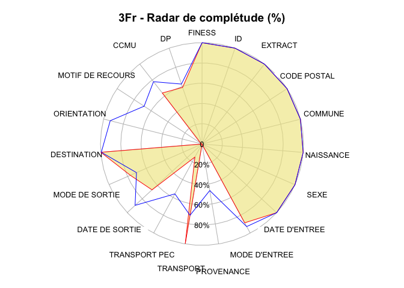 

```
          FINESS               ID          EXTRACT      CODE POSTAL 
          100.00           100.00           100.00           100.00 
         COMMUNE        NAISSANCE             SEXE    DATE D'ENTREE 
          100.00           100.00           100.00           100.00 
   MODE D'ENTREE       PROVENANCE        TRANSPORT    TRANSPORT PEC 
           88.41             0.30            99.70            14.64 
  DATE DE SORTIE   MODE DE SORTIE      DESTINATION      ORIENTATION 
           66.86            77.04           100.00             0.00 
MOTIF DE RECOURS             CCMU               DP 
            1.86            63.74            59.06 
Score local: 72.19  sur 100
```

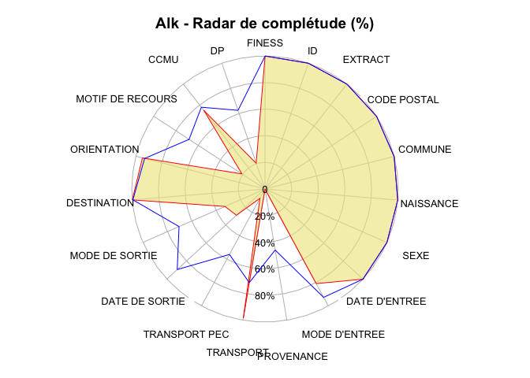 

```
          FINESS               ID          EXTRACT      CODE POSTAL 
          100.00           100.00           100.00           100.00 
         COMMUNE        NAISSANCE             SEXE    DATE D'ENTREE 
          100.00           100.00           100.00           100.00 
   MODE D'ENTREE       PROVENANCE        TRANSPORT    TRANSPORT PEC 
           80.85             0.08            98.49             7.95 
  DATE DE SORTIE   MODE DE SORTIE      DESTINATION      ORIENTATION 
           29.14            32.78           100.00            94.94 
MOTIF DE RECOURS             CCMU               DP 
           20.67            74.94            20.44 
Score local: 71.59  sur 100
```

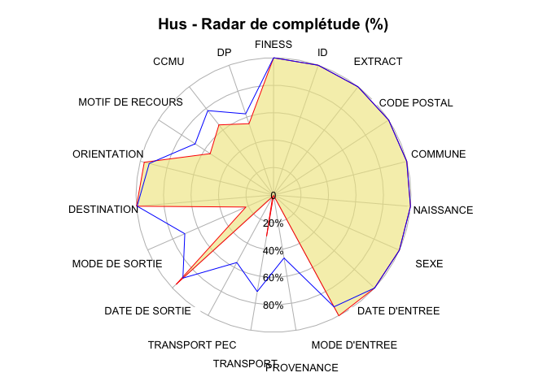 

```
          FINESS               ID          EXTRACT      CODE POSTAL 
          100.00           100.00           100.00           100.00 
         COMMUNE        NAISSANCE             SEXE    DATE D'ENTREE 
          100.00           100.00           100.00           100.00 
   MODE D'ENTREE       PROVENANCE        TRANSPORT    TRANSPORT PEC 
          100.00             0.28            30.42             1.34 
  DATE DE SORTIE   MODE DE SORTIE      DESTINATION      ORIENTATION 
           96.00            21.93           100.00            96.99 
MOTIF DE RECOURS             CCMU               DP 
           55.04            64.70            54.94 
Score local: 74.82  sur 100
```

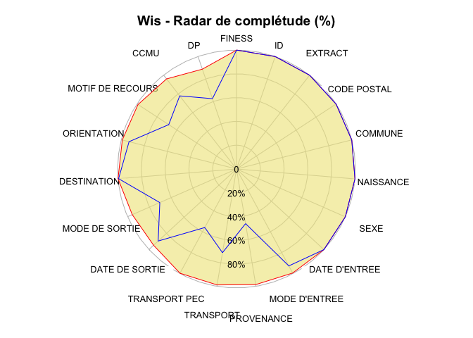 

```
          FINESS               ID          EXTRACT      CODE POSTAL 
          100.00           100.00           100.00           100.00 
         COMMUNE        NAISSANCE             SEXE    DATE D'ENTREE 
          100.00           100.00           100.00           100.00 
   MODE D'ENTREE       PROVENANCE        TRANSPORT    TRANSPORT PEC 
           99.42            98.54            98.83            99.71 
  DATE DE SORTIE   MODE DE SORTIE      DESTINATION      ORIENTATION 
           94.75            95.72           100.00            99.13 
MOTIF DE RECOURS             CCMU               DP 
           99.03            95.92            88.73 
Score local: 98.41  sur 100
```

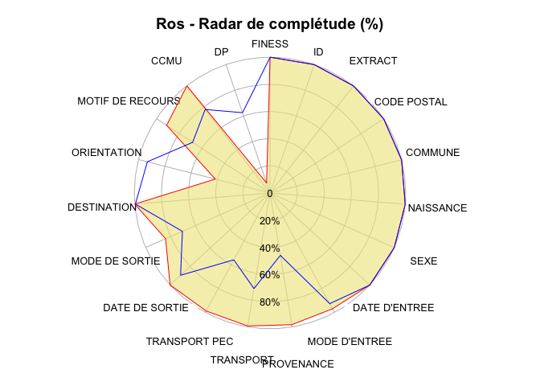 

```
          FINESS               ID          EXTRACT      CODE POSTAL 
          100.00           100.00           100.00           100.00 
         COMMUNE        NAISSANCE             SEXE    DATE D'ENTREE 
          100.00           100.00           100.00           100.00 
   MODE D'ENTREE       PROVENANCE        TRANSPORT    TRANSPORT PEC 
           96.90            98.28            99.31            98.80 
  DATE DE SORTIE   MODE DE SORTIE      DESTINATION      ORIENTATION 
          100.00            83.99           100.00            41.58 
MOTIF DE RECOURS             CCMU               DP 
           91.05            99.83             7.75 
Score local: 90.39  sur 100
```

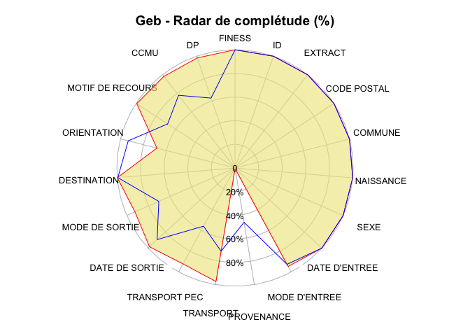 

```
          FINESS               ID          EXTRACT      CODE POSTAL 
          100.00           100.00           100.00           100.00 
         COMMUNE        NAISSANCE             SEXE    DATE D'ENTREE 
          100.00           100.00           100.00           100.00 
   MODE D'ENTREE       PROVENANCE        TRANSPORT    TRANSPORT PEC 
           94.65             0.65            97.40            92.30 
  DATE DE SORTIE   MODE DE SORTIE      DESTINATION      ORIENTATION 
           98.38            92.46           100.00            68.25 
MOTIF DE RECOURS             CCMU               DP 
           99.43            98.13            98.46 
Score local: 91.58  sur 100
```

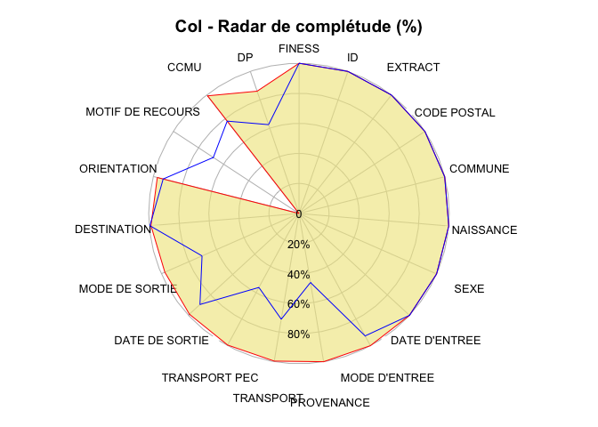 

```
          FINESS               ID          EXTRACT      CODE POSTAL 
          100.00           100.00           100.00           100.00 
         COMMUNE        NAISSANCE             SEXE    DATE D'ENTREE 
          100.00           100.00           100.00           100.00 
   MODE D'ENTREE       PROVENANCE        TRANSPORT    TRANSPORT PEC 
          100.00           100.00            99.61            99.61 
  DATE DE SORTIE   MODE DE SORTIE      DESTINATION      ORIENTATION 
           99.05            97.45            98.84            97.28 
MOTIF DE RECOURS             CCMU               DP 
            0.00            99.19            86.04 
Score local: 93.53  sur 100
```

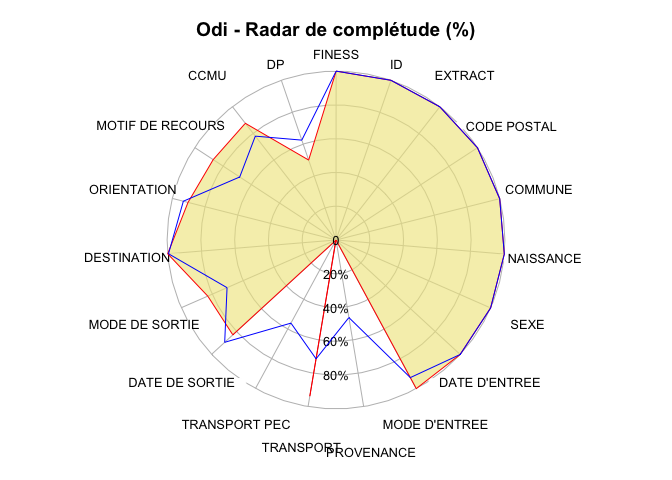 

```
          FINESS               ID          EXTRACT      CODE POSTAL 
          100.00           100.00           100.00           100.00 
         COMMUNE        NAISSANCE             SEXE    DATE D'ENTREE 
           99.95           100.00           100.00           100.00 
   MODE D'ENTREE       PROVENANCE        TRANSPORT    TRANSPORT PEC 
          100.00             0.00            93.75             0.27 
  DATE DE SORTIE   MODE DE SORTIE      DESTINATION      ORIENTATION 
           82.98            82.88           100.00            90.40 
MOTIF DE RECOURS             CCMU               DP 
           86.91            87.51            50.03 
Score local: 82.88  sur 100
```

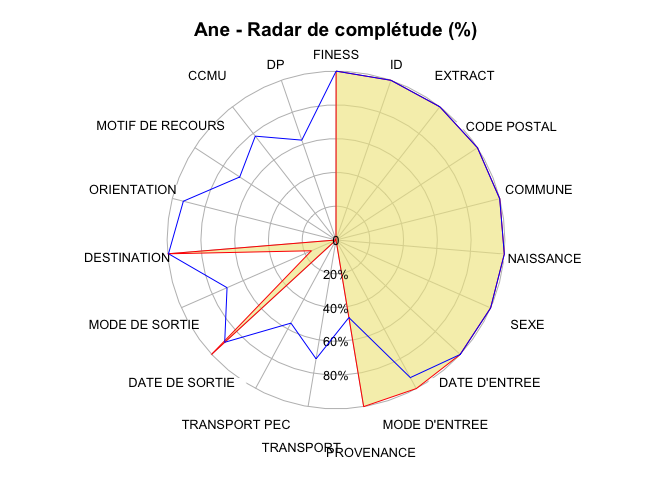 

```
          FINESS               ID          EXTRACT      CODE POSTAL 
          100.00           100.00           100.00           100.00 
         COMMUNE        NAISSANCE             SEXE    DATE D'ENTREE 
          100.00           100.00           100.00           100.00 
   MODE D'ENTREE       PROVENANCE        TRANSPORT    TRANSPORT PEC 
          100.00           100.00             0.00             0.00 
  DATE DE SORTIE   MODE DE SORTIE      DESTINATION      ORIENTATION 
          100.00            15.91           100.00             0.00 
MOTIF DE RECOURS             CCMU               DP 
            0.00             0.00             0.00 
Score local: 64  sur 100
```

