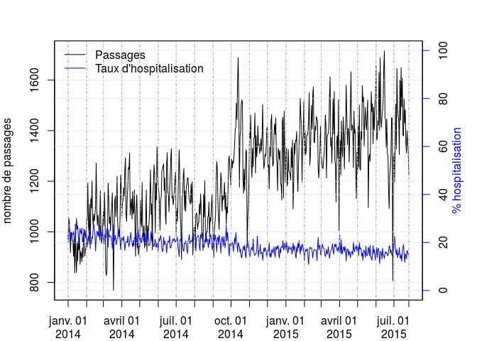

# Digraph
JcB  
18/12/2014  

Préparation des fichiers pour Dygraph
=====================================

__Dygraph__ (DG) est une bibliothèque Javascript permettant d'afficher des courbes dynamiques. DG affiche des données de séries temporelles à partir d'une matrice dont la première colonne est obligatoirement une colonne __date__ au format ISO. Chaque colonne qui suit sera affichée individuellement.  

 Deux tables sont préparées pour _Resural_:
 
 - __hop_2014.csv__ nombre de passages par jour pour l'ensemble des SU d'Alsace et nombre d'hospitalisations.
 
 - __SU_2014.csv__ nombre de passages par jour et par SU + total, moyenne et nb hospitalisation => fichier complet pour __Dygraph__.
 
 L'application test se trouve dans le dossier DyGraph.

Passages et taux d'hospitalisation
----------------------------------

Fabrique et affichage d'un dataframe de 6 colonnes:

- date du jour
- nombre total de passages = mutation + transferts
- nombre d'hospitalisation 
- nombre de mutation
- nombre de transferts
- taux d'hospitalisation = hospitalisation / passages

todo: tester le dataframe avec dygraph

Le dataframe s'appelle __devenir__ et il s'enregistre dans _devenir.csv_ [read.csv("devenir.csv")]

Expérimentation d'un graphe avec 2 courbes ayant des échelles différentes. Référence [Multiple Y-axis in a R plot](http://www.r-bloggers.com/multiple-y-axis-in-a-r-plot/)


```r
path <- "../../"
load(paste0(path, "rpu2014d0112_c.Rda")) # d14
# load(paste0(path, "rpu2015d0112_provisoire.Rda")) # d01
load(paste0(path, "d15_p.Rda")) # d15.p
source(paste0(path, "new_functions.R")) # fonction mode.sotie()
library(xts)
```

```
## Loading required package: zoo
## 
## Attaching package: 'zoo'
## 
## The following objects are masked from 'package:base':
## 
##     as.Date, as.Date.numeric
```

```r
library(dygraphs)

# création d'une table date, passages, hospitalisation, mutation, transfert
# hospitalisation = mutation + transfert
# remplacé par la fonction mode.sortie:
# passages.jour <- tapply(as.Date(d14$ENTREE), as.Date(d14$ENTREE), length)
# mut <- d14[d14$MODE_SORTIE == "Mutation", "ENTREE"]
# mutations.jour <- tapply(as.Date(mut),  as.Date(mut), length)
# trans <- d14[d14$MODE_SORTIE == "Transfert", "ENTREE"]
# transfert.jour <- tapply(as.Date(trans),  as.Date(trans), length)
# hospit.jour <- mutations.jour + transfert.jour
# date <- unique(sort(as.Date(d14$ENTREE)))
# devenir <- data.frame(date, passages.jour, hospit.jour, mutations.jour, transfert.jour)

ms2014 <- mode.sortie(d14)
ms2015 <- mode.sortie(d15.p)
devenir <- rbind(ms2014, ms2015) # on lie les 2 années

# paramètres dérivés
resume <- rbind(
apply(devenir[2:5], 2, mean, na.rm = TRUE),
apply(devenir[2:5], 2, median, na.rm = TRUE),
apply(devenir[2:5], 2, sd, na.rm = TRUE),
apply(devenir[2:5], 2, min, na.rm = TRUE),
apply(devenir[2:5], 2, max, na.rm = TRUE))
rownames(resume) <- c("Moyenne","Médiane","SD","Min","Max")
resume
```

```
##         passages.jour.rpu hospit.jour mutations.jour.rpu
## Moyenne         1185.9165   227.47109          211.57816
## Médiane         1179.0000   226.00000          211.00000
## SD               168.2307    27.35627           26.00371
## Min              768.0000   155.00000          142.00000
## Max             1689.0000   341.00000          321.00000
##         transfert.jour.rpu
## Moyenne          15.892934
## Médiane          16.000000
## SD                4.882008
## Min               5.000000
## Max              49.000000
```

```r
# taux hospitalisation (par jour)
taux.hosp <- round(devenir$hospit.jour * 100 / devenir$passages.jour, 2)
summary(taux.hosp)
```

```
##    Min. 1st Qu.  Median    Mean 3rd Qu.    Max. 
##   10.79   17.13   19.43   19.50   21.76   30.12
```

```r
sd(taux.hosp)
```

```
## [1] 3.155813
```

```r
# création d'un ojet xts
d.xts <- xts(devenir, order.by = devenir$date)
anim <- dygraph(d.xts[,2:6], main = "SU 2014", ylab = "Affaires")
anim
```

<!--html_preserve--><div id="htmlwidget-4793" style="width:672px;height:480px;" class="dygraphs"></div>
<script type="application/json" data-for="htmlwidget-4793">{ "x": {
 "attrs": {
 "title": "SU 2014",
"ylabel": "Affaires",
"labels": [ "day", "passages.jour.rpu", "hospit.jour", "mutations.jour.rpu", "transfert.jour.rpu", "taux.hosp" ],
"legend": "auto",
"axes": {
 "x": {
 "pixelsPerLabel":                50 
} 
} 
},
"scale": "daily",
"annotations": [],
"shadings": [],
"events": [],
"data": [
 [ "2014-01-01T00:00:00Z", "2014-01-02T00:00:00Z", "2014-01-03T00:00:00Z", "2014-01-04T00:00:00Z", "2014-01-05T00:00:00Z", "2014-01-06T00:00:00Z", "2014-01-07T00:00:00Z", "2014-01-08T00:00:00Z", "2014-01-09T00:00:00Z", "2014-01-10T00:00:00Z", "2014-01-11T00:00:00Z", "2014-01-12T00:00:00Z", "2014-01-13T00:00:00Z", "2014-01-14T00:00:00Z", "2014-01-15T00:00:00Z", "2014-01-16T00:00:00Z", "2014-01-17T00:00:00Z", "2014-01-18T00:00:00Z", "2014-01-19T00:00:00Z", "2014-01-20T00:00:00Z", "2014-01-21T00:00:00Z", "2014-01-22T00:00:00Z", "2014-01-23T00:00:00Z", "2014-01-24T00:00:00Z", "2014-01-25T00:00:00Z", "2014-01-26T00:00:00Z", "2014-01-27T00:00:00Z", "2014-01-28T00:00:00Z", "2014-01-29T00:00:00Z", "2014-01-30T00:00:00Z", "2014-01-31T00:00:00Z", "2014-02-01T00:00:00Z", "2014-02-02T00:00:00Z", "2014-02-03T00:00:00Z", "2014-02-04T00:00:00Z", "2014-02-05T00:00:00Z", "2014-02-06T00:00:00Z", "2014-02-07T00:00:00Z", "2014-02-08T00:00:00Z", "2014-02-09T00:00:00Z", "2014-02-10T00:00:00Z", "2014-02-11T00:00:00Z", "2014-02-12T00:00:00Z", "2014-02-13T00:00:00Z", "2014-02-14T00:00:00Z", "2014-02-15T00:00:00Z", "2014-02-16T00:00:00Z", "2014-02-17T00:00:00Z", "2014-02-18T00:00:00Z", "2014-02-19T00:00:00Z", "2014-02-20T00:00:00Z", "2014-02-21T00:00:00Z", "2014-02-22T00:00:00Z", "2014-02-23T00:00:00Z", "2014-02-24T00:00:00Z", "2014-02-25T00:00:00Z", "2014-02-26T00:00:00Z", "2014-02-27T00:00:00Z", "2014-02-28T00:00:00Z", "2014-03-01T00:00:00Z", "2014-03-02T00:00:00Z", "2014-03-03T00:00:00Z", "2014-03-04T00:00:00Z", "2014-03-05T00:00:00Z", "2014-03-06T00:00:00Z", "2014-03-07T00:00:00Z", "2014-03-08T00:00:00Z", "2014-03-09T00:00:00Z", "2014-03-10T00:00:00Z", "2014-03-11T00:00:00Z", "2014-03-12T00:00:00Z", "2014-03-13T00:00:00Z", "2014-03-14T00:00:00Z", "2014-03-15T00:00:00Z", "2014-03-16T00:00:00Z", "2014-03-17T00:00:00Z", "2014-03-18T00:00:00Z", "2014-03-19T00:00:00Z", "2014-03-20T00:00:00Z", "2014-03-21T00:00:00Z", "2014-03-22T00:00:00Z", "2014-03-23T00:00:00Z", "2014-03-24T00:00:00Z", "2014-03-25T00:00:00Z", "2014-03-26T00:00:00Z", "2014-03-27T00:00:00Z", "2014-03-28T00:00:00Z", "2014-03-29T00:00:00Z", "2014-03-30T00:00:00Z", "2014-03-31T00:00:00Z", "2014-04-01T00:00:00Z", "2014-04-02T00:00:00Z", "2014-04-03T00:00:00Z", "2014-04-04T00:00:00Z", "2014-04-05T00:00:00Z", "2014-04-06T00:00:00Z", "2014-04-07T00:00:00Z", "2014-04-08T00:00:00Z", "2014-04-09T00:00:00Z", "2014-04-10T00:00:00Z", "2014-04-11T00:00:00Z", "2014-04-12T00:00:00Z", "2014-04-13T00:00:00Z", "2014-04-14T00:00:00Z", "2014-04-15T00:00:00Z", "2014-04-16T00:00:00Z", "2014-04-17T00:00:00Z", "2014-04-18T00:00:00Z", "2014-04-19T00:00:00Z", "2014-04-20T00:00:00Z", "2014-04-21T00:00:00Z", "2014-04-22T00:00:00Z", "2014-04-23T00:00:00Z", "2014-04-24T00:00:00Z", "2014-04-25T00:00:00Z", "2014-04-26T00:00:00Z", "2014-04-27T00:00:00Z", "2014-04-28T00:00:00Z", "2014-04-29T00:00:00Z", "2014-04-30T00:00:00Z", "2014-05-01T00:00:00Z", "2014-05-02T00:00:00Z", "2014-05-03T00:00:00Z", "2014-05-04T00:00:00Z", "2014-05-05T00:00:00Z", "2014-05-06T00:00:00Z", "2014-05-07T00:00:00Z", "2014-05-08T00:00:00Z", "2014-05-09T00:00:00Z", "2014-05-10T00:00:00Z", "2014-05-11T00:00:00Z", "2014-05-12T00:00:00Z", "2014-05-13T00:00:00Z", "2014-05-14T00:00:00Z", "2014-05-15T00:00:00Z", "2014-05-16T00:00:00Z", "2014-05-17T00:00:00Z", "2014-05-18T00:00:00Z", "2014-05-19T00:00:00Z", "2014-05-20T00:00:00Z", "2014-05-21T00:00:00Z", "2014-05-22T00:00:00Z", "2014-05-23T00:00:00Z", "2014-05-24T00:00:00Z", "2014-05-25T00:00:00Z", "2014-05-26T00:00:00Z", "2014-05-27T00:00:00Z", "2014-05-28T00:00:00Z", "2014-05-29T00:00:00Z", "2014-05-30T00:00:00Z", "2014-05-31T00:00:00Z", "2014-06-01T00:00:00Z", "2014-06-02T00:00:00Z", "2014-06-03T00:00:00Z", "2014-06-04T00:00:00Z", "2014-06-05T00:00:00Z", "2014-06-06T00:00:00Z", "2014-06-07T00:00:00Z", "2014-06-08T00:00:00Z", "2014-06-09T00:00:00Z", "2014-06-10T00:00:00Z", "2014-06-11T00:00:00Z", "2014-06-12T00:00:00Z", "2014-06-13T00:00:00Z", "2014-06-14T00:00:00Z", "2014-06-15T00:00:00Z", "2014-06-16T00:00:00Z", "2014-06-17T00:00:00Z", "2014-06-18T00:00:00Z", "2014-06-19T00:00:00Z", "2014-06-20T00:00:00Z", "2014-06-21T00:00:00Z", "2014-06-22T00:00:00Z", "2014-06-23T00:00:00Z", "2014-06-24T00:00:00Z", "2014-06-25T00:00:00Z", "2014-06-26T00:00:00Z", "2014-06-27T00:00:00Z", "2014-06-28T00:00:00Z", "2014-06-29T00:00:00Z", "2014-06-30T00:00:00Z", "2014-07-01T00:00:00Z", "2014-07-02T00:00:00Z", "2014-07-03T00:00:00Z", "2014-07-04T00:00:00Z", "2014-07-05T00:00:00Z", "2014-07-06T00:00:00Z", "2014-07-07T00:00:00Z", "2014-07-08T00:00:00Z", "2014-07-09T00:00:00Z", "2014-07-10T00:00:00Z", "2014-07-11T00:00:00Z", "2014-07-12T00:00:00Z", "2014-07-13T00:00:00Z", "2014-07-14T00:00:00Z", "2014-07-15T00:00:00Z", "2014-07-16T00:00:00Z", "2014-07-17T00:00:00Z", "2014-07-18T00:00:00Z", "2014-07-19T00:00:00Z", "2014-07-20T00:00:00Z", "2014-07-21T00:00:00Z", "2014-07-22T00:00:00Z", "2014-07-23T00:00:00Z", "2014-07-24T00:00:00Z", "2014-07-25T00:00:00Z", "2014-07-26T00:00:00Z", "2014-07-27T00:00:00Z", "2014-07-28T00:00:00Z", "2014-07-29T00:00:00Z", "2014-07-30T00:00:00Z", "2014-07-31T00:00:00Z", "2014-08-01T00:00:00Z", "2014-08-02T00:00:00Z", "2014-08-03T00:00:00Z", "2014-08-04T00:00:00Z", "2014-08-05T00:00:00Z", "2014-08-06T00:00:00Z", "2014-08-07T00:00:00Z", "2014-08-08T00:00:00Z", "2014-08-09T00:00:00Z", "2014-08-10T00:00:00Z", "2014-08-11T00:00:00Z", "2014-08-12T00:00:00Z", "2014-08-13T00:00:00Z", "2014-08-14T00:00:00Z", "2014-08-15T00:00:00Z", "2014-08-16T00:00:00Z", "2014-08-17T00:00:00Z", "2014-08-18T00:00:00Z", "2014-08-19T00:00:00Z", "2014-08-20T00:00:00Z", "2014-08-21T00:00:00Z", "2014-08-22T00:00:00Z", "2014-08-23T00:00:00Z", "2014-08-24T00:00:00Z", "2014-08-25T00:00:00Z", "2014-08-26T00:00:00Z", "2014-08-27T00:00:00Z", "2014-08-28T00:00:00Z", "2014-08-29T00:00:00Z", "2014-08-30T00:00:00Z", "2014-08-31T00:00:00Z", "2014-09-01T00:00:00Z", "2014-09-02T00:00:00Z", "2014-09-03T00:00:00Z", "2014-09-04T00:00:00Z", "2014-09-05T00:00:00Z", "2014-09-06T00:00:00Z", "2014-09-07T00:00:00Z", "2014-09-08T00:00:00Z", "2014-09-09T00:00:00Z", "2014-09-10T00:00:00Z", "2014-09-11T00:00:00Z", "2014-09-12T00:00:00Z", "2014-09-13T00:00:00Z", "2014-09-14T00:00:00Z", "2014-09-15T00:00:00Z", "2014-09-16T00:00:00Z", "2014-09-17T00:00:00Z", "2014-09-18T00:00:00Z", "2014-09-19T00:00:00Z", "2014-09-20T00:00:00Z", "2014-09-21T00:00:00Z", "2014-09-22T00:00:00Z", "2014-09-23T00:00:00Z", "2014-09-24T00:00:00Z", "2014-09-25T00:00:00Z", "2014-09-26T00:00:00Z", "2014-09-27T00:00:00Z", "2014-09-28T00:00:00Z", "2014-09-29T00:00:00Z", "2014-09-30T00:00:00Z", "2014-10-01T00:00:00Z", "2014-10-02T00:00:00Z", "2014-10-03T00:00:00Z", "2014-10-04T00:00:00Z", "2014-10-05T00:00:00Z", "2014-10-06T00:00:00Z", "2014-10-07T00:00:00Z", "2014-10-08T00:00:00Z", "2014-10-09T00:00:00Z", "2014-10-10T00:00:00Z", "2014-10-11T00:00:00Z", "2014-10-12T00:00:00Z", "2014-10-13T00:00:00Z", "2014-10-14T00:00:00Z", "2014-10-15T00:00:00Z", "2014-10-16T00:00:00Z", "2014-10-17T00:00:00Z", "2014-10-18T00:00:00Z", "2014-10-19T00:00:00Z", "2014-10-20T00:00:00Z", "2014-10-21T00:00:00Z", "2014-10-22T00:00:00Z", "2014-10-23T00:00:00Z", "2014-10-24T00:00:00Z", "2014-10-25T00:00:00Z", "2014-10-26T00:00:00Z", "2014-10-27T00:00:00Z", "2014-10-28T00:00:00Z", "2014-10-29T00:00:00Z", "2014-10-30T00:00:00Z", "2014-10-31T00:00:00Z", "2014-11-01T00:00:00Z", "2014-11-02T00:00:00Z", "2014-11-03T00:00:00Z", "2014-11-04T00:00:00Z", "2014-11-05T00:00:00Z", "2014-11-06T00:00:00Z", "2014-11-07T00:00:00Z", "2014-11-08T00:00:00Z", "2014-11-09T00:00:00Z", "2014-11-10T00:00:00Z", "2014-11-11T00:00:00Z", "2014-11-12T00:00:00Z", "2014-11-13T00:00:00Z", "2014-11-14T00:00:00Z", "2014-11-15T00:00:00Z", "2014-11-16T00:00:00Z", "2014-11-17T00:00:00Z", "2014-11-18T00:00:00Z", "2014-11-19T00:00:00Z", "2014-11-20T00:00:00Z", "2014-11-21T00:00:00Z", "2014-11-22T00:00:00Z", "2014-11-23T00:00:00Z", "2014-11-24T00:00:00Z", "2014-11-25T00:00:00Z", "2014-11-26T00:00:00Z", "2014-11-27T00:00:00Z", "2014-11-28T00:00:00Z", "2014-11-29T00:00:00Z", "2014-11-30T00:00:00Z", "2014-12-01T00:00:00Z", "2014-12-02T00:00:00Z", "2014-12-03T00:00:00Z", "2014-12-04T00:00:00Z", "2014-12-05T00:00:00Z", "2014-12-06T00:00:00Z", "2014-12-07T00:00:00Z", "2014-12-08T00:00:00Z", "2014-12-09T00:00:00Z", "2014-12-10T00:00:00Z", "2014-12-11T00:00:00Z", "2014-12-12T00:00:00Z", "2014-12-13T00:00:00Z", "2014-12-14T00:00:00Z", "2014-12-15T00:00:00Z", "2014-12-16T00:00:00Z", "2014-12-17T00:00:00Z", "2014-12-18T00:00:00Z", "2014-12-19T00:00:00Z", "2014-12-20T00:00:00Z", "2014-12-21T00:00:00Z", "2014-12-22T00:00:00Z", "2014-12-23T00:00:00Z", "2014-12-24T00:00:00Z", "2014-12-25T00:00:00Z", "2014-12-26T00:00:00Z", "2014-12-27T00:00:00Z", "2014-12-28T00:00:00Z", "2014-12-29T00:00:00Z", "2014-12-30T00:00:00Z", "2014-12-31T00:00:00Z", "2015-01-01T00:00:00Z", "2015-01-02T00:00:00Z", "2015-01-03T00:00:00Z", "2015-01-04T00:00:00Z", "2015-01-05T00:00:00Z", "2015-01-06T00:00:00Z", "2015-01-07T00:00:00Z", "2015-01-08T00:00:00Z", "2015-01-09T00:00:00Z", "2015-01-10T00:00:00Z", "2015-01-11T00:00:00Z", "2015-01-12T00:00:00Z", "2015-01-13T00:00:00Z", "2015-01-14T00:00:00Z", "2015-01-15T00:00:00Z", "2015-01-16T00:00:00Z", "2015-01-17T00:00:00Z", "2015-01-18T00:00:00Z", "2015-01-19T00:00:00Z", "2015-01-20T00:00:00Z", "2015-01-21T00:00:00Z", "2015-01-22T00:00:00Z", "2015-01-23T00:00:00Z", "2015-01-24T00:00:00Z", "2015-01-25T00:00:00Z", "2015-01-26T00:00:00Z", "2015-01-27T00:00:00Z", "2015-01-28T00:00:00Z", "2015-01-29T00:00:00Z", "2015-01-30T00:00:00Z", "2015-01-31T00:00:00Z", "2015-02-01T00:00:00Z", "2015-02-02T00:00:00Z", "2015-02-03T00:00:00Z", "2015-02-04T00:00:00Z", "2015-02-05T00:00:00Z", "2015-02-06T00:00:00Z", "2015-02-07T00:00:00Z", "2015-02-08T00:00:00Z", "2015-02-09T00:00:00Z", "2015-02-10T00:00:00Z", "2015-02-11T00:00:00Z", "2015-02-12T00:00:00Z", "2015-02-13T00:00:00Z", "2015-02-14T00:00:00Z", "2015-02-15T00:00:00Z", "2015-02-16T00:00:00Z", "2015-02-17T00:00:00Z", "2015-02-18T00:00:00Z", "2015-02-19T00:00:00Z", "2015-02-20T00:00:00Z", "2015-02-21T00:00:00Z", "2015-02-22T00:00:00Z", "2015-02-23T00:00:00Z", "2015-02-24T00:00:00Z", "2015-02-25T00:00:00Z", "2015-02-26T00:00:00Z", "2015-02-27T00:00:00Z", "2015-02-28T00:00:00Z", "2015-03-01T00:00:00Z", "2015-03-02T00:00:00Z", "2015-03-03T00:00:00Z", "2015-03-04T00:00:00Z", "2015-03-05T00:00:00Z", "2015-03-06T00:00:00Z", "2015-03-07T00:00:00Z", "2015-03-08T00:00:00Z", "2015-03-09T00:00:00Z", "2015-03-10T00:00:00Z", "2015-03-11T00:00:00Z", "2015-03-12T00:00:00Z", "2015-03-13T00:00:00Z", "2015-03-14T00:00:00Z", "2015-03-15T00:00:00Z", "2015-03-16T00:00:00Z", "2015-03-17T00:00:00Z", "2015-03-18T00:00:00Z", "2015-03-19T00:00:00Z", "2015-03-20T00:00:00Z", "2015-03-21T00:00:00Z", "2015-03-22T00:00:00Z", "2015-03-23T00:00:00Z", "2015-03-24T00:00:00Z", "2015-03-25T00:00:00Z", "2015-03-26T00:00:00Z", "2015-03-27T00:00:00Z", "2015-03-28T00:00:00Z", "2015-03-29T00:00:00Z", "2015-03-30T00:00:00Z", "2015-03-31T00:00:00Z", "2015-04-01T00:00:00Z", "2015-04-02T00:00:00Z", "2015-04-03T00:00:00Z", "2015-04-04T00:00:00Z", "2015-04-05T00:00:00Z", "2015-04-06T00:00:00Z", "2015-04-07T00:00:00Z", "2015-04-08T00:00:00Z", "2015-04-09T00:00:00Z", "2015-04-10T00:00:00Z", "2015-04-11T00:00:00Z", "2015-04-12T00:00:00Z" ],
[ " 972", "1055", "1038", " 982", " 918", "1000", " 994", " 965", " 964", " 903", " 973", " 837", "1030", " 890", " 840", " 958", " 885", " 964", " 929", " 977", " 871", " 922", " 913", " 882", " 936", " 899", "1012", " 957", " 904", " 931", " 936", "1049", "1048", "1193", "1030", " 989", "1109", " 933", "1131", "1094", "1203", "1055", "1024", "1071", "1043", "1067", "1108", "1272", "1083", "1026", "1066", "1042", " 982", "1056", "1163", " 995", " 955", " 974", "1038", "1080", "1024", "1156", "1038", " 846", " 827", " 843", "1014", "1193", "1138", "1033", "1058", "1003", "1069", "1103", "1154", " 990", " 768", " 995", "1119", "1141", "1059", "1103", "1220", "1042", " 993", " 981", " 981", "1054", "1225", "1177", "1064", "1119", "1121", "1174", "1142", "1242", "1292", "1071", "1041", "1133", "1175", "1254", "1248", "1311", "1066", "1104", "1130", "1050", "1159", "1070", "1079", "1165", "1018", " 903", "1091", "1146", "1061", " 972", " 908", " 944", " 940", "1125", "1043", "1020", "1195", " 984", " 982", "1024", " 937", " 964", "1049", "1166", " 922", "1023", " 985", "1014", "1055", "1143", "1245", "1068", "1111", " 928", "1134", "1196", "1265", "1226", " 995", "1192", "1126", "1337", "1236", "1179", "1159", "1116", "1007", "1126", "1138", "1240", "1246", "1259", "1269", "1164", "1213", "1063", "1030", "1264", "1313", "1156", "1151", "1079", "1164", "1218", "1290", "1329", "1133", "1142", "1107", "1128", "1168", "1208", "1236", " 985", "1092", "1041", "1114", "1216", "1324", "1233", "1059", "1020", " 890", "1136", "1152", "1224", "1250", "1086", "1162", "1080", "1183", "1185", "1213", "1213", "1155", "1128", "1119", "1109", "1190", "1116", "1198", " 908", " 978", "1013", "1021", " 936", "1068", "1075", "1063", "1011", "1033", "1038", "1110", "1069", "1150", "1091", "1006", " 988", " 926", "1149", "1058", "1203", " 996", " 957", "1003", " 999", "1058", "1064", "1118", " 982", "1057", "1042", "1098", "1146", "1048", " 990", " 899", " 999", "1036", "1062", "1202", "1278", "1253", "1117", "1055", "1010", "1097", "1167", "1234", "1202", "1081", "1143", "1126", "1138", "1195", "1088", "1154", "1030", "1098", "1075", "1170", "1285", "1300", "1250", "1203", "1183", "1287", "1253", "1280", "1271", "1300", "1345", "1407", "1413", "1509", "1444", "1608", "1689", "1495", "1176", "1373", "1401", "1503", "1521", "1514", "1212", "1152", "1248", "1164", "1256", "1324", "1317", " 937", "1049", "1109", "1200", "1395", "1369", "1462", "1260", "1215", "1330", "1257", "1370", "1373", "1470", "1233", "1381", "1296", "1332", "1419", "1342", "1347", "1310", "1325", "1367", "1319", "1385", "1503", "1309", "1250", "1268", "1307", "1298", "1336", "1410", "1416", "1255", "1264", "1169", "1337", "1298", "1436", "1464", "1316", "1259", "1270", "1392", "1427", "1384", "1450", "1292", "1267", "1162", "1329", "1321", "1287", "1321", "1193", "1183", "1126", "1438", "1453", "1134", "1478", "1326", "1195", "1304", "1332", "1182", "1197", "1325", "1241", "1237", "1224", "1205", "1333", "1254", "1364", "1090", "1193", "1351", "1307", "1363", "1359", "1397", "1242", "1159", "1257", "1346", "1393", "1527", "1456", "1421", "1196", "1359", "1379", "1516", "1310", "1401", "1304", "1319", "1382", "1382", "1400", "1446", "1550", "1264", "1303", "1407", "1500", "1407", "1545", "1573", "1357", "1352", "1417", "1400", "1456", "1447", "1438", "1249", "1213", "1271", "1323", "1418", "1310", "1284", "1252", "1250", "1281", "1308", "1352", "1463", "1423", "1213", "1373", "1385", "1389", "1421", "1535", "1613", "1339", "1372", "1272", "1378", "1528", "1387", "1554", "1284", "1262", "1118", "1353", "1380", "1291", "1523", "1005", "1289", "1361", "1225", "1438", "1328", "1296", "1454", "1339", "1193", "1339", "1364", "1223" ],
[ "194", "265", "264", "237", "184", "242", "231", "228", "225", "222", "199", "162", "215", "220", "253", "244", "238", "228", "182", "217", "225", "224", "216", "229", "189", "192", "227", "218", "227", "204", "232", "220", "191", "255", "235", "193", "271", "223", "225", "213", "269", "228", "273", "294", "262", "244", "183", "274", "266", "253", "241", "254", "229", "220", "312", "227", "218", "225", "261", "235", "199", "268", "240", "185", "187", "217", "227", "216", "288", "230", "241", "229", "239", "228", "201", "220", "210", "203", "241", "262", "205", "211", "264", "226", "254", "229", "252", "214", "209", "256", "237", "236", "234", "265", "229", "207", "255", "219", "211", "225", "267", "247", "227", "268", "234", "267", "230", "206", "211", "222", "200", "256", "225", "211", "259", "234", "187", "246", "208", "210", "193", "249", "209", "204", "268", "228", "209", "207", "221", "202", "196", "263", "222", "216", "235", "189", "200", "216", "265", "263", "229", "226", "256", "218", "233", "248", "212", "217", "204", "268", "229", "192", "251", "229", "218", "258", "241", "221", "202", "206", "281", "221", "250", "212", "201", "197", "250", "237", "236", "214", "265", "216", "230", "249", "225", "244", "235", "234", "254", "244", "253", "208", "227", "233", "200", "205", "187", "260", "222", "212", "219", "236", "215", "201", "206", "217", "227", "224", "224", "197", "187", "250", "246", "263", "218", "225", "247", "226", "257", "214", "228", "238", "237", "191", "176", "234", "237", "228", "238", "229", "200", "177", "268", "238", "245", "225", "167", "213", "190", "255", "197", "230", "206", "214", "211", "190", "239", "191", "241", "243", "231", "201", "177", "231", "211", "207", "226", "245", "237", "206", "270", "249", "202", "233", "238", "226", "192", "241", "242", "240", "209", "256", "240", "193", "244", "280", "227", "260", "254", "220", "187", "244", "227", "219", "250", "252", "245", "205", "249", "293", "269", "341", "310", "283", "258", "339", "284", "217", "218", "242", "209", "208", "240", "212", "213", "209", "219", "187", "180", "237", "180", "216", "214", "207", "201", "194", "251", "218", "219", "219", "270", "235", "201", "216", "188", "211", "222", "303", "259", "187", "223", "214", "254", "207", "209", "219", "189", "199", "220", "207", "234", "219", "214", "199", "230", "208", "208", "232", "188", "201", "198", "243", "226", "197", "209", "253", "220", "192", "263", "220", "232", "203", "250", "197", "174", "230", "187", "214", "206", "257", "302", "193", "255", "261", "222", "218", "271", "210", "186", "216", "229", "215", "211", "210", "241", "190", "223", "216", "198", "251", "233", "198", "183", "253", "200", "227", "224", "280", "238", "232", "272", "236", "231", "257", "242", "238", "164", "224", "223", "215", "234", "241", "190", "156", "243", "228", "228", "249", "268", "228", "210", "253", "226", "227", "241", "238", "236", "180", "257", "276", "206", "236", "248", "218", "191", "225", "243", "224", "228", "228", "207", "206", "218", "208", "207", "220", "253", "218", "206", "244", "221", "235", "226", "267", "247", "210", "285", "247", "230", "217", "240", "226", "224", "274", "161", "300", "248", "188", "303", "200", "209", "263", "246", "201", "254", "230", "155" ],
[ "179", "243", "241", "221", "171", "227", "212", "211", "204", "205", "182", "155", "205", "205", "236", "231", "231", "209", "174", "209", "207", "212", "208", "214", "180", "178", "215", "203", "222", "191", "225", "201", "179", "236", "211", "182", "244", "215", "213", "207", "245", "207", "255", "263", "235", "230", "168", "258", "249", "234", "224", "236", "217", "201", "263", "213", "206", "205", "243", "217", "184", "249", "219", "170", "180", "194", "211", "201", "269", "214", "228", "213", "215", "212", "183", "198", "190", "187", "228", "236", "191", "200", "245", "213", "236", "210", "231", "192", "194", "230", "218", "215", "220", "244", "211", "191", "242", "200", "193", "206", "240", "226", "211", "246", "222", "246", "215", "191", "198", "207", "187", "244", "213", "193", "240", "217", "174", "233", "190", "189", "173", "225", "195", "186", "254", "220", "193", "190", "197", "186", "183", "248", "204", "194", "220", "167", "188", "204", "250", "243", "220", "194", "242", "203", "217", "235", "194", "206", "188", "252", "212", "174", "226", "212", "203", "242", "214", "199", "189", "197", "259", "204", "232", "188", "187", "179", "230", "221", "213", "200", "246", "199", "214", "231", "205", "221", "217", "216", "238", "221", "235", "191", "209", "219", "185", "192", "164", "243", "208", "195", "202", "224", "197", "184", "191", "206", "211", "210", "208", "188", "174", "233", "232", "251", "206", "213", "222", "209", "241", "207", "214", "219", "224", "177", "162", "215", "215", "210", "220", "207", "180", "163", "258", "214", "227", "207", "161", "199", "172", "236", "182", "218", "193", "199", "194", "169", "213", "177", "225", "222", "209", "186", "159", "220", "198", "197", "215", "227", "215", "199", "257", "236", "189", "219", "227", "199", "181", "223", "228", "221", "199", "241", "226", "181", "230", "256", "211", "246", "237", "203", "176", "227", "213", "206", "226", "234", "223", "197", "238", "277", "256", "321", "289", "262", "242", "318", "268", "191", "206", "222", "199", "185", "225", "199", "199", "192", "207", "177", "166", "227", "158", "198", "200", "190", "180", "181", "232", "202", "201", "208", "247", "215", "176", "198", "177", "199", "206", "285", "239", "174", "206", "202", "234", "199", "186", "194", "174", "179", "198", "196", "210", "201", "192", "185", "213", "189", "188", "216", "173", "183", "184", "233", "209", "174", "191", "238", "199", "178", "247", "199", "216", "193", "226", "179", "164", "221", "178", "199", "190", "242", "285", "184", "238", "240", "215", "195", "251", "200", "170", "205", "218", "207", "198", "196", "232", "180", "207", "195", "190", "237", "220", "185", "170", "240", "181", "210", "206", "269", "225", "211", "259", "226", "219", "248", "232", "208", "158", "212", "211", "206", "221", "232", "177", "149", "229", "217", "216", "234", "250", "213", "196", "240", "214", "210", "225", "221", "222", "165", "242", "262", "194", "218", "230", "200", "182", "213", "224", "211", "212", "219", "192", "195", "207", "198", "201", "208", "247", "205", "197", "224", "207", "222", "211", "247", "232", "196", "267", "228", "220", "207", "223", "213", "212", "249", "148", "281", "234", "177", "291", "192", "199", "246", "230", "189", "235", "221", "142" ],
[ "15", "22", "23", "16", "13", "15", "19", "17", "21", "17", "17", " 7", "10", "15", "17", "13", " 7", "19", " 8", " 8", "18", "12", " 8", "15", " 9", "14", "12", "15", " 5", "13", " 7", "19", "12", "19", "24", "11", "27", " 8", "12", " 6", "24", "21", "18", "31", "27", "14", "15", "16", "17", "19", "17", "18", "12", "19", "49", "14", "12", "20", "18", "18", "15", "19", "21", "15", " 7", "23", "16", "15", "19", "16", "13", "16", "24", "16", "18", "22", "20", "16", "13", "26", "14", "11", "19", "13", "18", "19", "21", "22", "15", "26", "19", "21", "14", "21", "18", "16", "13", "19", "18", "19", "27", "21", "16", "22", "12", "21", "15", "15", "13", "15", "13", "12", "12", "18", "19", "17", "13", "13", "18", "21", "20", "24", "14", "18", "14", " 8", "16", "17", "24", "16", "13", "15", "18", "22", "15", "22", "12", "12", "15", "20", " 9", "32", "14", "15", "16", "13", "18", "11", "16", "16", "17", "18", "25", "17", "15", "16", "27", "22", "13", " 9", "22", "17", "18", "24", "14", "18", "20", "16", "23", "14", "19", "17", "16", "18", "20", "23", "18", "18", "16", "23", "18", "17", "18", "14", "15", "13", "23", "17", "14", "17", "17", "12", "18", "17", "15", "11", "16", "14", "16", " 9", "13", "17", "14", "12", "12", "12", "25", "17", "16", " 7", "14", "19", "13", "14", "14", "19", "22", "18", "18", "22", "20", "14", "10", "24", "18", "18", " 6", "14", "18", "19", "15", "12", "13", "15", "17", "21", "26", "14", "16", "21", "22", "15", "18", "11", "13", "10", "11", "18", "22", " 7", "13", "13", "13", "14", "11", "27", "11", "18", "14", "19", "10", "15", "14", "12", "14", "24", "16", "14", "17", "17", "11", "17", "14", "13", "24", "18", "22", " 8", "11", "16", "13", "20", "21", "21", "16", "21", "16", "26", "12", "20", "10", "23", "15", "13", "14", "17", "12", "10", "14", "10", "22", "18", "14", "17", "21", "13", "19", "16", "18", "11", "23", "20", "25", "18", "11", "12", "16", "18", "20", "13", "17", "12", "20", " 8", "23", "25", "15", "20", "22", "11", "24", "18", "22", "14", "17", "19", "20", "16", "15", "18", "14", "10", "17", "23", "18", "15", "21", "14", "16", "21", "16", "10", "24", "18", "10", " 9", " 9", "15", "16", "15", "17", " 9", "17", "21", " 7", "23", "20", "10", "16", "11", "11", " 8", "13", "14", " 9", "10", "16", "21", " 8", "14", "13", "13", "13", "13", "19", "17", "18", "11", "13", "21", "13", "10", "12", " 9", "10", "30", " 6", "12", "12", " 9", "13", " 9", "13", " 7", "14", "11", "12", "15", "18", "15", "14", "13", "12", "17", "16", "17", "14", "15", "15", "14", "12", "18", "18", "18", " 9", "12", "19", "13", "16", " 9", "15", "11", "11", "10", " 6", "12", " 6", "13", " 9", "20", "14", "13", "15", "20", "15", "14", "18", "19", "10", "10", "17", "13", "12", "25", "13", "19", "14", "11", "12", " 8", "10", "17", "16", "12", "19", " 9", "13" ],
[ "19.96", "25.12", "25.43", "24.13", "20.04", "24.20", "23.24", "23.63", "23.34", "24.58", "20.45", "19.35", "20.87", "24.72", "30.12", "25.47", "26.89", "23.65", "19.59", "22.21", "25.83", "24.30", "23.66", "25.96", "20.19", "21.36", "22.43", "22.78", "25.11", "21.91", "24.79", "20.97", "18.23", "21.37", "22.82", "19.51", "24.44", "23.90", "19.89", "19.47", "22.36", "21.61", "26.66", "27.45", "25.12", "22.87", "16.52", "21.54", "24.56", "24.66", "22.61", "24.38", "23.32", "20.83", "26.83", "22.81", "22.83", "23.10", "25.14", "21.76", "19.43", "23.18", "23.12", "21.87", "22.61", "25.74", "22.39", "18.11", "25.31", "22.27", "22.78", "22.83", "22.36", "20.67", "17.42", "22.22", "27.34", "20.40", "21.54", "22.96", "19.36", "19.13", "21.64", "21.69", "25.58", "23.34", "25.69", "20.30", "17.06", "21.75", "22.27", "21.09", "20.87", "22.57", "20.05", "16.67", "19.74", "20.45", "20.27", "19.86", "22.72", "19.70", "18.19", "20.44", "21.95", "24.18", "20.35", "19.62", "18.21", "20.75", "18.54", "21.97", "22.10", "23.37", "23.74", "20.42", "17.62", "25.31", "22.91", "22.25", "20.53", "22.13", "20.04", "20.00", "22.43", "23.17", "21.28", "20.21", "23.59", "20.95", "18.68", "22.56", "24.08", "21.11", "23.86", "18.64", "18.96", "18.90", "21.29", "24.63", "20.61", "24.35", "22.57", "18.23", "18.42", "20.23", "21.31", "18.20", "18.12", "20.04", "18.53", "16.28", "21.66", "20.52", "21.65", "22.91", "21.18", "17.82", "16.21", "16.36", "22.14", "18.99", "20.61", "19.94", "19.51", "15.59", "19.04", "20.50", "20.50", "19.83", "22.77", "17.73", "17.83", "18.74", "19.86", "21.37", "21.23", "20.74", "21.75", "20.20", "20.47", "21.12", "20.79", "22.38", "17.95", "16.86", "14.12", "21.09", "20.96", "20.78", "24.61", "20.77", "18.66", "16.42", "16.48", "19.98", "19.54", "20.74", "18.93", "16.62", "15.42", "20.61", "21.30", "23.32", "19.48", "20.29", "20.76", "20.25", "21.45", "23.57", "23.31", "23.49", "23.21", "20.41", "16.48", "21.77", "22.30", "22.55", "23.04", "22.06", "18.02", "16.56", "23.30", "21.81", "24.35", "22.77", "18.03", "18.54", "17.96", "21.20", "19.78", "24.03", "20.54", "21.42", "19.94", "17.86", "21.38", "19.45", "22.80", "23.32", "21.04", "17.54", "16.89", "23.33", "23.47", "20.72", "21.81", "23.07", "19.72", "16.12", "21.55", "22.29", "19.15", "23.07", "21.70", "19.37", "15.56", "20.05", "22.39", "21.00", "18.56", "22.50", "20.08", "17.74", "21.14", "27.18", "20.67", "24.19", "21.71", "17.12", "14.38", "19.52", "18.87", "18.51", "19.43", "20.11", "19.14", "16.13", "19.15", "21.78", "19.12", "24.13", "20.54", "19.60", "16.04", "20.07", "19.00", "18.45", "15.88", "17.27", "13.91", "13.68", "15.85", "17.49", "18.49", "16.75", "18.81", "14.89", "13.60", "18.00", "19.21", "20.59", "19.30", "17.25", "14.41", "14.17", "17.17", "17.30", "18.02", "16.47", "21.48", "17.15", "14.64", "14.69", "15.25", "15.28", "17.13", "22.75", "18.25", "13.93", "16.56", "16.34", "19.17", "15.14", "15.85", "15.81", "12.57", "15.20", "17.60", "16.32", "17.90", "16.87", "16.02", "14.11", "16.24", "16.57", "16.46", "19.85", "14.06", "15.49", "13.79", "16.60", "17.17", "15.65", "16.46", "18.18", "15.42", "13.87", "18.14", "17.03", "18.31", "17.47", "18.81", "14.91", "13.52", "17.41", "15.67", "18.09", "18.29", "17.87", "20.78", "17.02", "17.25", "19.68", "18.58", "16.72", "20.35", "17.77", "15.54", "16.30", "18.45", "17.38", "17.24", "17.43", "18.08", "15.15", "16.35", "19.82", "16.60", "18.58", "17.83", "14.53", "13.47", "18.11", "16.10", "19.59", "17.82", "20.80", "17.09", "15.19", "18.68", "16.61", "19.31", "18.91", "17.55", "15.70", "12.52", "15.99", "17.10", "16.30", "16.93", "17.44", "13.57", "10.79", "15.68", "18.04", "17.50", "17.70", "17.87", "16.20", "13.59", "16.08", "16.65", "16.79", "17.01", "17.00", "16.21", "12.44", "17.87", "22.10", "16.98", "18.57", "18.75", "15.37", "14.58", "17.52", "19.41", "17.92", "17.80", "17.43", "15.31", "14.08", "15.32", "17.15", "15.08", "15.88", "18.21", "15.34", "13.42", "15.13", "16.50", "17.13", "17.77", "19.38", "16.16", "15.14", "18.34", "19.24", "18.23", "19.41", "17.74", "16.38", "17.35", "17.99", "16.02", "23.27", "18.22", "15.35", "21.07", "15.06", "16.13", "18.09", "18.37", "16.85", "18.97", "16.86", "12.67" ] 
] 
},"evals": [  ] }</script><!--/html_preserve-->

```r
# graphe avec 2 axes y pour les passages et le taux d'hospitalisation. 
par(mar=c(3,4,3,4))
plot(d.xts$passages, minor.ticks = FALSE, main = "", ylab = "nombre de passages")
par(new = T) # permet de dessiner un second graphique avec ses propres paramètres
plot(d.xts$taux, axes = F, ylim = c(0, 100),  col = "blue", main="")
axis(4, ylim = c(0, 100),  col = "blue", col.ticks = "blue" ) # utilise l'axe de droite. Prévoir plus de marge
mtext("% hospitalisation",side=4,line=2,col=4) # légende axe 4
legend("topleft", legend = c("Passages","Taux d'hospitalisation"), col = c("black", "blue"), lty = 1, bty = "n")
```

 

```r
# enregistrement du dataframe en csv:
write.csv(devenir, file = "devenir.csv", row.names = FALSE)
```


Circuit rapide
--------------

NB: write.csv insère "" comme nom de la première colonne qui correspond aux dates.


```r
dx <- d14

# autr chose
k <- table(as.Date(dx$ENTREE), factor(dx$FINESS))
total <- apply(k,1,sum)
hop <- cbind(k, total)
mean <- apply(k,1,mean)
hop <- cbind(hop, mean)
# hospitalisations:
a <- dx[dx$MODE_SORTIE == "Mutation" | dx$MODE_SORTIE == "Transfert", 'ENTREE']
a <- as.Date(a)
# hosp <- tapply(a, as.factor(yday(a)), length)
hosp <- tapply(a, a, length)
hop <- cbind(hop, hosp)
write.csv(hop, file="SU_2014.csv")

date <- rownames(k)
hop2 <- cbind(date, total, hop[,"hosp"])
colnames(hop2) <- c("Date", "Passages", "Hospitalisations")
write.csv(hop2, file="hop_2014.csv", row.names=F)
```

 
Création du fichier _hop_2014.csv_
-----------------------------------

1. on décupère le fichier général de l'ensemble des RPU provisoires (__dx__) ou consolidés (__d1__). Les dates utilisées sont dans la colonne __dx$ENTREE__. La transformation as.Date(dx$ENTREE) permet de ne conserver que la date du jour et d'éliminer la partie horaire.  

2. on crée la _table _ __k__ en croisant les colonnes __dx$ENTREE__ et __dx$FINESS__ 
```{}
k <- table(as.Date(dx$ENTREE), dx$FINESS)

           3Fr Alk Col Dia Geb Hag Hus Mul Odi Sav Sel Wis   Dts Ros
  2014-01-01  46   0 177  76  44  99  90 130  73  97 101  39 0   0   0
  2014-01-02  34  31 181  77  33 101 134 189  71  83  84  37 0   0   0
  2014-01-03  36  38 199  82  34  86 117 187  61  93  75  30 0   0   0
  2014-01-04  38  17 169  92  31  89  95 177  71  84  87  32 0   0   0
  2014-01-05  42   1 164  75  38  85  79 183  76  64  76  35 0   0   0
  2014-01-06  40  11 160  90  51  87 128 179  77  78  76  23 0   0   0
```
3. on fait la somme de chaque ligne dans le vecteur __total__ avec la méthode _apply_: total <- apply(k,1,sum). Puis on "colle" ce vecteur à la table _k_ sous forme d'une colonne supplémentaire:
```{}
total <- apply(k,1,sum)
hop <- cbind(k, total)
head(hop)

           3Fr Alk Col Dia Geb Hag Hus Mul Odi Sav Sel Wis   Dts Ros total
2014-01-01  46   0 177  76  44  99  90 130  73  97 101  39 0   0   0   972
2014-01-02  34  31 181  77  33 101 134 189  71  83  84  37 0   0   0  1055
2014-01-03  36  38 199  82  34  86 117 187  61  93  75  30 0   0   0  1038
2014-01-04  38  17 169  92  31  89  95 177  71  84  87  32 0   0   0   982
2014-01-05  42   1 164  75  38  85  79 183  76  64  76  35 0   0   0   918
2014-01-06  40  11 160  90  51  87 128 179  77  78  76  23 0   0   0  1000
```
4. De la même manière on calcule la __moyenne__ (_mean_) et l'écart-type (_sd_):

```{}
mean <- apply(k,1,mean)
sd <- apply(k,1,sd)
hop.moy <- cbind(hop, mean, sd)
head(hop.moy)

           3Fr Alk Col Dia Geb Hag Hus Mul Odi Sav Sel Wis   Dts Ros total     mean       sd
2014-01-01  46   0 177  76  44  99  90 130  73  97 101  39 0   0   0   972 64.80000 53.07165
2014-01-02  34  31 181  77  33 101 134 189  71  83  84  37 0   0   0  1055 70.33333 60.90234
2014-01-03  36  38 199  82  34  86 117 187  61  93  75  30 0   0   0  1038 69.20000 61.72543
2014-01-04  38  17 169  92  31  89  95 177  71  84  87  32 0   0   0   982 65.46667 56.31273
2014-01-05  42   1 164  75  38  85  79 183  76  64  76  35 0   0   0   918 61.20000 55.66250
2014-01-06  40  11 160  90  51  87 128 179  77  78  76  23 0   0   0  1000 66.66667 57.11350
```
5. transformation en objet de type __xts__

Many xts-sepcific methods have been written to better handle the unique aspects of xts. These include, ‘"["’, merge, cbind, rbind, c, Ops, lag, diff, coredata, head and tail. Additionally there are xts specific methods for converting amongst R's different time-series classes.

Subsetting via "[" methods offers the ability to specify dates by range, if they are enclosed in quotes. The style borrows from python by creating ranges with a double colon “"::"” or “"/"” operator. Each side of the operator may be left blank, which would then default to the beginning and end of the data, respectively. To specify a subset of times, it is only required that the time specified be in standard ISO format, with some form of separation between the elements. The time must be ‘left-filled’, that is to specify a full year one needs only to provide the year, a month would require the full year and the integer of the month requested - e.g. '1999-01'. This format would extend all the way down to seconds - e.g. '1999-01-01 08:35:23'. Leading zeros are not necessary. See the examples for more detail.
```{}
library("xts")
xts <- as.xts(hop.moy, descr ="Fréquentation des SU")
head(xts)

Un jour donné: xts["2014-01-01"]  
une plage: xts["2014-01-01/2014-01-03"] ou xts["2014-01-01::2014-01-03"]  
toutes les données: xts["/"]  
toutes les données depuis mars: xts['2014-03/']  
Toutes les données entre mars et juin: xts['2014-03/2014-06']  
toutes les données depuis mars jusqu'à la fin de l'année: xts['2014-03/2014'] 
toutes les données jusque 2014 inclu: xts['/2014'] 
```

#### Plotting

L'objet _xts_ ne peut dessiner que des séries temporelles univariées, en pratique une seule colonne à la fois. Si on passe toute la matrice à la fonction __plot__ seule la dernière colonne est prise en compte et un message d'avis est affiché (In plot.xts(xts) : only the univariate series will be plotted).

```{}
plot(xts[,'mean'], main="Fréquentation moyenne des SU", ylab="Nombre de passages", minor.ticks = FALSE, col="gray")

avec moyenne mobile:

moy.mobile <- rollmean(xts$mean,7)
lines(moy.mobile, col="blue", lwd=3)

```

On fabrique l'objet __cus__ de type xps, qui ne conserve que les colonnes _total_, _mean_ et _sd_:
```{}
cus <- xts[,c('total','mean','sd')]
head(cus)
           total     mean       sd
2014-01-01   972 64.80000 53.07165
2014-01-02  1055 70.33333 60.90234
2014-01-03  1038 69.20000 61.72543
2014-01-04   982 65.46667 56.31273
2014-01-05   918 61.20000 55.66250
2014-01-06  1000 66.66667 57.11350

La classe _xts_ hérite de la classe _zoo_. A ce titre, elle possède plusieurs fonctions mobiles:

moy.mobile <- rollmean(cus$total,7)
colnames(moy.mobile) <- "moy.mob"
sd.mobile <- rollapply(cus$total, 7, sd)
colnames(sd.mobile) <- "sd.mob"
cus <- cbind(cus, moy.mobile, sd.mobile)

source("")
plot(cus$total, minor.ticks = FALSE, main="Fréquentation moyenne des SU d'Alsace", ylab="Nombre de RPU", col="gray")
lines(moy.mobile, col="blue", lty=2)
lines(moy.mobile+sd.mobile, col="blue")
lines(moy.mobile-sd.mobile, col="blue")
legend("topleft", legend=c("moyenne mobile","écart-type"), col=c("blue","blue"), lty=c(2,1))
```
On refait la même manip mais en ajoutant les hospitalisations = somme mutation + transferts:

```r
d <- read.table("../../data2.csv", header=TRUE, sep=",")
library("lubridate")

load("../../rpu2013-2014.Rda") # charge d2
dx <- d2
rm(d2)
hosp <- dx[dx$MODE_SORTIE == "Mutation" | dx$MODE_SORTIE == "Transfert", 6] # 6 est la colonne ENTREE
hospitalisation <- tapply(hosp, as.Date(hosp), length) # nb hospit par jour

hop <- data.frame(cbind(hop, hospitalisation))
```

```
## Warning in cbind(hop, hospitalisation): number of rows of result is not a
## multiple of vector length (arg 2)
```

```r
head(hop)
```

```
##            X3Fr Alk Col Dia Geb Hag Hus Mul Odi Sav Sel Wis Dts Ros Ane
## 2014-01-01   46   0 177  76  44  99  90 130  73  97 101  39   0   0   0
## 2014-01-02   34  31 181  77  33 101 134 189  71  83  84  37   0   0   0
## 2014-01-03   36  38 199  82  34  86 117 187  61  93  75  30   0   0   0
## 2014-01-04   38  17 169  92  31  89  95 177  71  84  87  32   0   0   0
## 2014-01-05   42   1 164  75  38  85  79 183  76  64  76  35   0   0   0
## 2014-01-06   40  11 160  90  51  87 128 179  77  78  76  23   0   0   0
##            X670780204 total    mean hosp hospitalisation
## 2014-01-01          0   972 60.7500  194             222
## 2014-01-02          0  1055 65.9375  265             204
## 2014-01-03          0  1038 64.8750  264             184
## 2014-01-04          0   982 61.3750  237             194
## 2014-01-05          0   918 57.3750  184             167
## 2014-01-06          0  1000 62.5000  242             143
```

```r
t <- data.frame(rownames(hop), hop$total, hop$hospitalisation)
colnames(t)<-c("date","passages","hospitalisations")
write.csv(t, file="data2.csv", row.names = FALSE)
```
